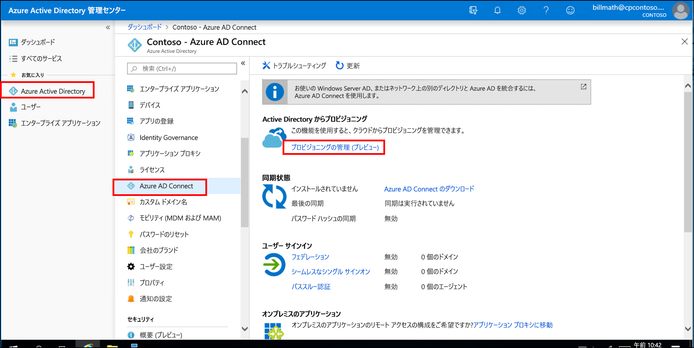
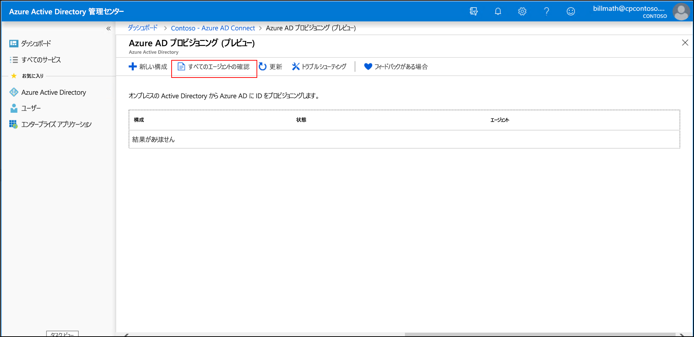
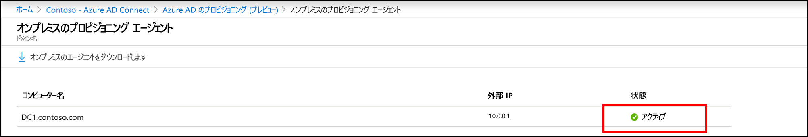
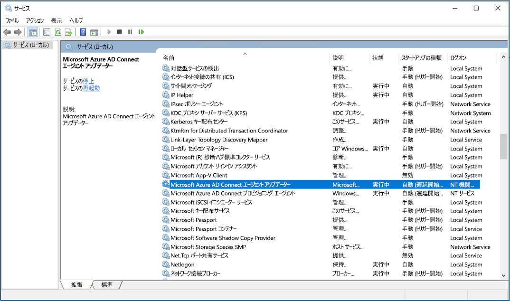

# Azure AD Connect プロビジョニング エージェントのインストール
このドキュメントでは、Azure AD Connect プロビジョニング エージェントのインストール プロセスと、それを Azure portal で最初に構成する方法について説明します。

>[!IMPORTANT]
>次のインストール手順は、[前提条件](how-to-prerequisites.md)がすべて満たされていることを前提としています。

Azure AD Connect プロビジョニングのインストールと構成は、次の手順で行います。
    
- [エージェントをインストールする](#install-the-agent)
- [エージェントのインストールを検証する](#verify-agent-installation)

## エージェントをインストールする

1. 使用するサーバーにエンタープライズ管理者のアクセス許可でサインインします。
2. Azure portal に移動し、[Azure Active Directory] を選択します。
3. **[プロビジョニングの管理 (プレビュー)]** をクリックし、 **[すべてのエージェントの確認]** を選択します。
3. Azure portal から Azure AD Connect プロビジョニング エージェントをダウンロードします。
![[ようこそ] 画面](media/how-to-install/install9.png) 
3. Azure AD Connect のプロビジョニング (AADConnectProvisioningAgent.Installer) を実行します。
3. スプラッシュ スクリーンでライセンス条項に**同意**し、 **[インストール]** をクリックします。 
![[ようこそ] 画面](media/how-to-install/install1.png) 

4. この操作が完了すると、構成ウィザードが起動します。  Azure AD 全体管理者アカウントでサインインします。
5. **[Connect Active Directory]\(Active Directory の接続\)** 画面で **[ディレクトリの追加]** をクリックし、Active Directory 管理者アカウントを使用してサインインします。  この操作によってオンプレミス ディレクトリが追加されます。  **[次へ]** をクリックします。 
![[ようこそ] 画面](media/how-to-install/install3.png) 

6. **[構成が完了しました]** 画面で、 **[Confirm]\(確認\)** をクリックします。  この操作によって、エージェントが登録されて再起動されます。 
![[ようこそ] 画面](media/how-to-install/install4.png) 

7. この操作が完了すると、"**Your agent configuration was successfully verified. (エージェントの構成が正常に検証されました。)** " という通知が表示されます。  **[終了]** をクリックします。 
![[ようこそ] 画面](media/how-to-install/install5.png) 
8. まだ最初のスプラッシュ スクリーンが表示されている場合は、 **[閉じる]** をクリックします。

## エージェントのインストールを検証する
エージェントの検証は、Azure portal および、エージェントが実行されているローカル サーバーで行います。

### Azure portal でのエージェントの検証
エージェントが Azure によって認識されていることを確認するには、次の手順を実行します。

1. Azure ポータルにサインインします。
2. 左側の **[Azure Active Directory]** を選択して **[Azure AD Connect]** をクリックし、中央の **[プロビジョニングの管理 (プレビュー)]** を選択します。 
 

3.  **[Azure AD のプロビジョニング (プレビュー)]** 画面で **[すべてのエージェントの確認]** をクリックします。
 
 
4. **[On-premises provisioning agents]\(オンプレミス プロビジョニング エージェント\)** 画面に、インストールしたエージェントが表示されます。  該当するエージェントが存在すること、また **[有効]** としてマークされていることを確認します。
 

### ポートを確認する
Azure がポート 443 でリッスンしていて、エージェントがそれと通信できることを確認するには、次のようにします。

https://aadap-portcheck.connectorporttest.msappproxy.net/ 

このテストでは、エージェントがポート 443 を介して Azure と通信できることを確認します。  ブラウザーを開き、エージェントがインストールされているサーバーから上記の URL に移動します。

### ローカル サーバー上
エージェントが実行されていることを確認するには、次の手順に従います。

1.  管理者アカウントでサーバーにログオンします。
2.  **[サービス]** を開きます。[サービス] に直接移動するか、スタート ボタンをクリックし、[ファイル名を指定して実行] で「Services.msc」と入力してください。
3.  **[サービス]** に **[Microsoft Azure AD Connect Agent Updater]** と **[Microsoft Azure AD Connect Provisioning Agent]** が存在し、その状態が **[実行中]** になっていることを確認します。

>[!IMPORTANT]
>エージェントはインストールされていますが、それはユーザーの同期を開始する前に構成され、有効になっている必要があります。  新しいエージェントを構成するには、「[Azure AD Connect プロビジョニングの新しいエージェントの構成](how-to-configure.md)」を参照してください。

## 次の手順 

- [プロビジョニングとは](what-is-provisioning.md)
- [Azure AD Connect クラウド プロビジョニングとは](what-is-cloud-provisioning.md)
 
