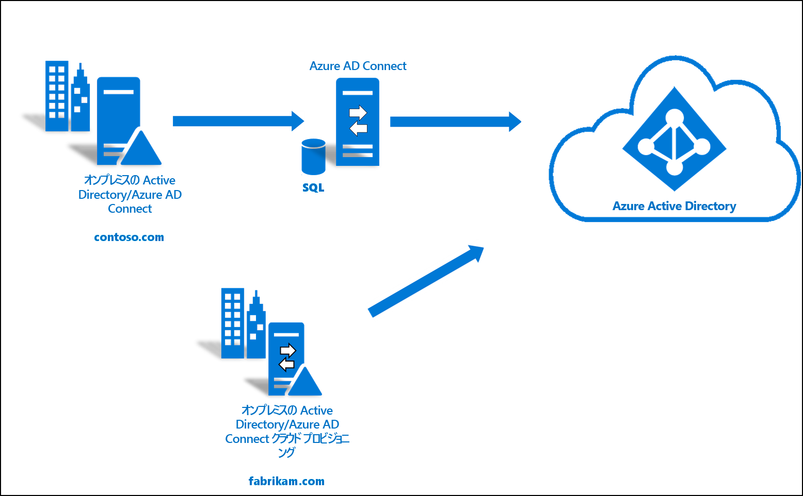
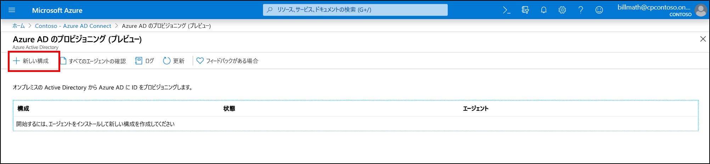
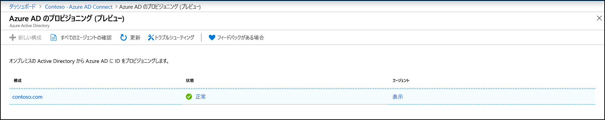
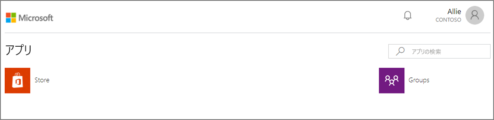

# 既存のフォレストと新しいフォレストを単一の Azure AD テナントに統合する

このチュートリアルでは、既存のハイブリッド ID 環境にクラウド プロビジョニングを追加する手順について説明します。 

このチュートリアルで作成した環境は、テスト目的や、ハイブリッド ID のしくみについて理解を深める目的で使用できます。 

このシナリオでは、Azure AD Connect 同期を使用して Azure AD テナントとで同期された既存のフォレストがあります。 さらに、同じ Azure AD テナントと同期したい新しいフォレストがあります。 この新しいフォレストのためのクラウド プロビジョニングを設定します。 

## 前提条件
### Azure Active Directory 管理センター

1. Azure AD テナントで、クラウド専用のグローバル管理者アカウントを作成します。 その方法を採用すると、オンプレミス サービスが利用できなくなったとき、テナントの構成を管理できます。 クラウド専用のグローバル管理者アカウントを追加する手順については、[こちら](../active-directory-users-create-azure-portal.md)をご覧ください。 テナントからロックアウトされないようにするには、この手順を必ず完了する必要があります。
2. 1 つ以上の[カスタム ドメイン名](../active-directory-domains-add-azure-portal.md)を Azure AD テナントに追加します。 ユーザーは、このドメイン名のいずれかを使用してサインインできます。

### オンプレミスの環境の場合

1. 4 GB 以上の RAM と .NET 4.7.1 以降のランタイムを搭載した、Windows Server 2012 R2 以降が実行されているドメイン参加済みホスト サーバーを特定します。 

2. サーバーと Azure AD の間にファイアウォールがある場合は、次の項目を構成します。
   - エージェントが次のポートを介して Azure AD に "*送信*" 要求を発行できるようにします。

     | ポート番号 | 用途 |
     | --- | --- |
     | **80** | SSL 証明書を検証する際に証明書失効リスト (CRL) をダウンロードする |
     | **443** | サービスを使用したすべての送信方向の通信を処理する |
     | **8080** (省略可能) | ポート 443 が使用できない場合、エージェントは、ポート 8080 経由で 10 分おきにその状態をレポートします。 この状態は Azure AD ポータルに表示されます。 |
     
     ご利用のファイアウォールが送信元ユーザーに応じて規則を適用している場合は、ネットワーク サービスとして実行されている Windows サービスを送信元とするトラフィックに対してこれらのポートを開放します。
   - ファイアウォールまたはプロキシで安全なサフィックスの指定が許可されている場合は、 **\*.msappproxy.net** および **\*.servicebus.windows.net** への接続を追加します。 そうでない場合は、毎週更新される [Azure データセンターの IP 範囲](https://www.microsoft.com/download/details.aspx?id=41653)へのアクセスを許可します。
   - エージェントは、初期登録のために **login.windows.net** と **login.microsoftonline.com** にアクセスする必要があります。 これらの URL にもファイアウォールを開きます。
   - 証明書の検証のために、URL **mscrl.microsoft.com:80**、**crl.microsoft.com:80**、**ocsp.msocsp.com:80**、**www\.microsoft.com:80** のブロックを解除します。 他の Microsoft 製品でもこれらの URL を証明書の検証に使用しているので、URL のブロックを既に解除している可能性もあります。

## Azure AD Connect プロビジョニング エージェントをインストールする
1. ドメイン参加済みサーバーにサインインします。  [AD と Azure の基本的な環境](tutorial-basic-ad-azure.md)に関するチュートリアルを使用している場合、これは DC1 になります。
2. クラウド専用の全体管理者資格情報を使用して Azure portal にサインインします。
3. 左側の **[Azure Active Directory]** を選択して **[Azure AD Connect]** をクリックし、中央の **[プロビジョニングの管理 (プレビュー)]** を選択します。 
 
4. [エージェントのダウンロード] をクリックします
5. Azure AD Connect プロビジョニング エージェントを実行します
6. スプラッシュ スクリーンでライセンス条項に**同意**し、 **[インストール]** をクリックします。 
![[ようこそ] 画面](media/how-to-install/install1.png) 

7. この操作が完了すると、構成ウィザードが起動します。  Azure AD 全体管理者アカウントでサインインします。  IE セキュリティ強化を有効にしている場合はサインインがブロックされることに注意してください。  その場合はインストールを終了して、サーバー マネージャーで IE セキュリティ強化を無効にし、 **[AAD Connect Provisioning Agent Wizard]\(AAD Connect プロビジョニング エージェント ウィザード\)** をクリックしてインストールを再開します。
8. **[Connect Active Directory]\(Active Directory の接続\)** 画面で **[ディレクトリの追加]** をクリックし、Active Directory ドメイン管理者アカウントを使用してサインインします。  注:ドメイン管理者アカウントに、パスワード変更要件は設定しないでください。 パスワードが期限切れになった場合や変更された場合は、新しい資格情報でエージェントを再構成する必要があります。 この操作によってオンプレミス ディレクトリが追加されます。  **[次へ]** をクリックします。 
![[ようこそ] 画面](media/how-to-install/install3.png) 

9. **[構成が完了しました]** 画面で、 **[Confirm]\(確認\)** をクリックします。  この操作によって、エージェントが登録されて再起動されます。 
![[ようこそ] 画面](media/how-to-install/install4.png) 

10. この操作が完了すると、次の通知が表示されます。 **"Your agent configuration was successfully verified. (エージェントの構成が正常に検証されました。)"**  **[終了]** をクリックします。 
![[ようこそ] 画面](media/how-to-install/install5.png) 
11. まだ最初のスプラッシュ スクリーンが表示されている場合は、 **[閉じる]** をクリックします。

## エエージェントのインストールを確認する
エージェントの確認は、Azure portal のほか、エージェントが実行されているローカル サーバーで行います。

### Azure portal でのエージェントの確認
エージェントが Azure で表示されていることを確認するには、次の手順を実行します。

1. Azure portal にサインインします。
2. 左側の **[Azure Active Directory]** を選択して **[Azure AD Connect]** をクリックし、中央の **[プロビジョニングの管理 (プレビュー)]** を選択します。 
 

3.  **[Azure AD のプロビジョニング (プレビュー)]** 画面で **[すべてのエージェントの確認]** をクリックします。
 
 
4. **[On-premises provisioning agents]\(オンプレミス プロビジョニング エージェント\)** 画面に、インストールしたエージェントが表示されます。  該当するエージェントが存在し、 **[アクティブ]** としてマークされていることを確認します。
 

### ローカル サーバーの場合
エージェントが実行されていることを確認するには、次の手順に従います。

1.  管理者アカウントでサーバーにログオンします。
2.  **[サービス]** を開きます。これには、そこに直接移動するか、スタート ボタンをクリックし、[ファイル名を指定して実行] で「Services.msc」と入力します。
3.  **[サービス]** に **[Microsoft Azure AD Connect Agent Updater]** と **[Microsoft Azure AD Connect Provisioning Agent]** が存在し、その状態が **[実行中]** になっていることを確認します。

## Azure AD Connect クラウド プロビジョニングを構成する
 プロビジョニングを構成するには、次の手順に従います。

1.  Azure AD ポータルにサインインします。
2.  **[Azure Active Directory]** をクリックします。
3.  **[Azure AD Connect]** をクリックします。
4.  **[プロビジョニングの管理 (プレビュー)]** を選択します。

5.  **[新しい構成]** をクリックします。

7.  構成画面で、**通知用メール アドレス**を入力し、セレクターを **[有効]** に移動して、 **[保存]** をクリックします。

1.  構成の状態が **[正常]** になります。

## ユーザーが作成され、同期が実行されていることを確認する
オンプレミスのディレクトリに存在していたユーザーが同期され、現在は Azure AD テナントに存在することを確認します。  これが完了するまでに数時間かかる場合があることに注意してください。  ユーザーが同期されていることを確認するには、以下を実行します。

1. [Azure portal](https://portal.azure.com) に移動し、Azure サブスクリプションがあるアカウントを使ってサインインします。
2. 左側の **[Azure Active Directory]** を選択します。
3. **[管理]** にある **[ユーザー]** を選択します。
4. テナントに新しいユーザーが表示されていることを確認します。 
 

## いずれかのユーザーでサインインをテストする

1. [https://myapps.microsoft.com](https://myapps.microsoft.com) に移動します。
2. 新しいテナントで作成されたユーザー アカウントを使用してサインインします。  user@domain.onmicrosoft.com の形式を使用してサインインする必要があります。 ユーザーがオンプレミスでのサインインに使用するのと同じパスワードを使用します。 
    

これでハイブリッド ID 環境を正常に設定できました。この環境は、Azure で提供されるサービスをテストしたり理解したりするために使用できます。

## 次のステップ 

- [プロビジョニングとは](what-is-provisioning.md)
- [Azure AD Connect クラウド プロビジョニングとは](what-is-cloud-provisioning.md)
