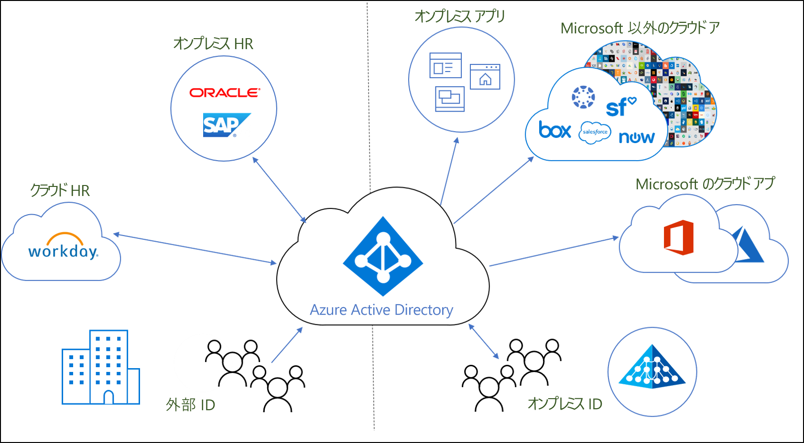
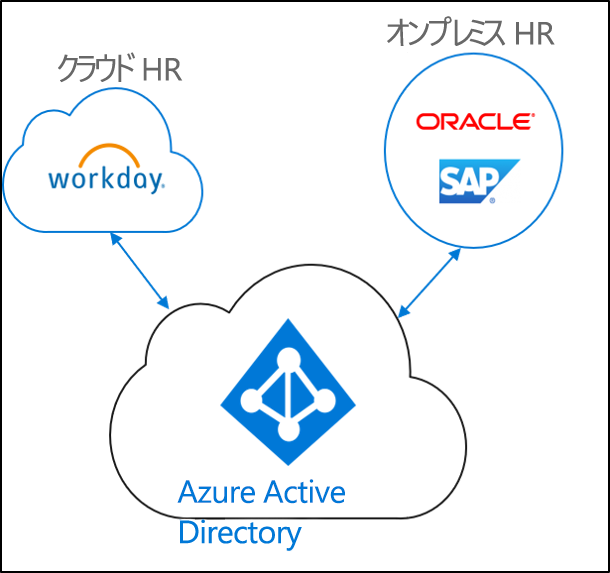
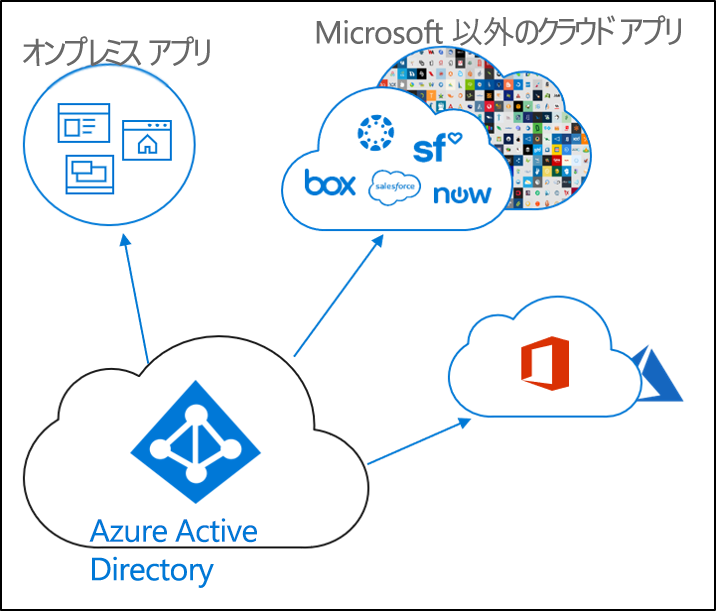
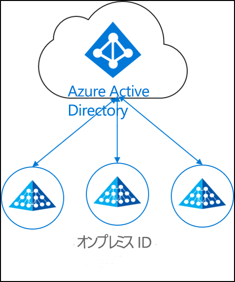

# ID プロビジョニングとは

今日、ビジネスや企業ではますます、オンプレミスのアプリケーションとクラウド アプリケーションが混在して使用されるようになっています。  ユーザーは、オンプレミスおよびクラウドの両方のアプリケーションへのアクセス権を必要とします。 そうしたさまざまな (オンプレミスとクラウドの) アプリケーションの垣根を越えた単一の ID が必要です。

プロビジョニングは、特定の条件に基づいてオブジェクトを作成し、それを最新の状態に維持すると共に、その条件を満たさなくなったら削除するプロセスです。 たとえば、新しいユーザーが組織に加わると、そのユーザーは人事システムに入力されます。  その時点で、クラウドや Active Directory、さらに、ユーザーがアクセスする必要のあるさまざまなアプリケーションには、プロビジョニングを通じて対応するユーザー アカウントを作成することができます。  そうすることで、ユーザーは出社したその日から仕事に着手し、必要なアプリケーションやシステムにアクセスすることができるのです。 

Azure Active Directory に関して言えば、プロビジョニングは大きく次のシナリオに分けることができます。  

- **[人事主導のプロビジョニング](#hr-driven-provisioning)**  
- **[アプリのプロビジョニング](#app-provisioning)**  
- **[ディレクトリのプロビジョニング](#directory-provisioning)** 

## 人事主導のプロビジョニング

人事からクラウドへのプロビジョニングには、人事システム内の情報に基づいてオブジェクト (ユーザー、ロール、グループなど) を作成することが含まれます。  

最も一般的なシナリオとして、新しく会社に加わった従業員の人事システムへの入力があります。  その後、ユーザーはクラウドにプロビジョニングされます。  このケースでは、Azure AD が該当します。  人事からのプロビジョニングで生じうるシナリオは次のとおりです。 

- **新しい従業員の雇用** - クラウド HR に新しい従業員が追加されると、Active Directory、Azure Active Directory、必要に応じて Office 365 や Azure AD によってサポートされているその他の SaaS アプリケーションでユーザー アカウントが自動的に作成され、メール アドレスがクラウド HR に書き戻されます。
- **従業員の属性とプロファイルの更新** - クラウド HR で従業員レコード (名前、職名、マネージャなど) が更新されると、Active Directory、Azure Active Directory、必要に応じて Office 365 や Azure AD によってサポートされているその他の SaaS アプリケーションでユーザー アカウントが自動的に更新されます。
- **従業員の退職** - クラウド HR で従業員が退職状態になると、Active Directory、Azure Active Directory、必要に応じて Office 365 や Azure AD によってサポートされているその他の SaaS アプリケーションでユーザー アカウントが自動的に無効になります。
- **従業員の再雇用** - クラウド HR で従業員が再雇用されると、Active Directory、Azure Active Directory、必要に応じて Office 365 や Azure AD によってサポートされているその他の SaaS アプリケーションに以前のアカウントが (設定に応じて) 自動的に再アクティブ化または再プロビジョニングされます。

## アプリのプロビジョニング

Azure Active Directory (Azure AD) での **[アプリのプロビジョニング](https://docs.microsoft.com/azure/active-directory/manage-apps/user-provisioning)** という用語は、ユーザーがアクセスする必要のあるクラウド アプリケーションにおいてユーザーの ID とロールを自動的に作成することを意味します。 自動プロビジョニングには、ユーザー ID の作成に加えて、状態または役割が変化したときのユーザー ID のメンテナンスおよび削除が含まれます。 一般的なシナリオには、[Dropbox](https://docs.microsoft.com/azure/active-directory/saas-apps/dropboxforbusiness-provisioning-tutorial)、[Salesforce](https://docs.microsoft.com/azure/active-directory/saas-apps/salesforce-provisioning-tutorial)、[ServiceNow](https://docs.microsoft.com/azure/active-directory/saas-apps/servicenow-provisioning-tutorial) などのアプリケーションへの Azure AD ユーザーのプロビジョニングが含まれます。

## ディレクトリのプロビジョニング

オンプレミス プロビジョニングには、オンプレミス ソース (Active Directory など) から Azure AD へのプロビジョニングが含まれます。  

最も一般的なシナリオは、Active Directory (AD) 内のユーザーが Azure AD にプロビジョニングされるケースです。

これは Azure AD Connect 同期と Azure AD Connect クラウド プロビジョニング、Microsoft Identity Manager によって実現されています。 
 
## 次のステップ 

- [Azure AD Connect クラウド プロビジョニングとは](what-is-cloud-provisioning.md)
- [クラウド プロビジョニングのインストール](how-to-install.md)
