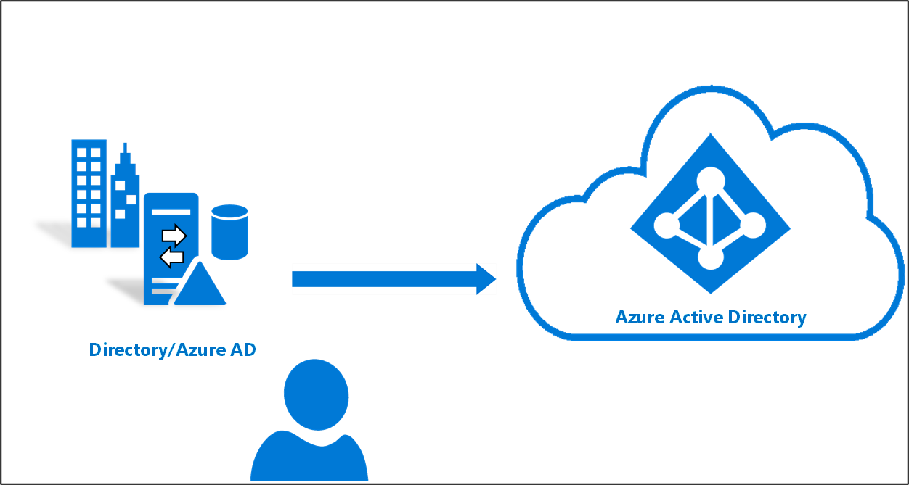

# Azure AD Connect クラウド同期とは
Azure AD Connect クラウド同期は、ユーザー、グループ、連絡先を Azure AD に同期するためのハイブリッド ID の目標を満たすために設計された Microsoft の新しいオファリングです。  Azure AD Connect アプリケーションではなく Azure AD クラウド プロビジョニング エージェントを使用してこれを実現します。  ただし、これは Azure AD Connect 同期と共に使用することができ、次のような利点があります。
    
- 複数のフォレストに接続されていない Active Directory フォレスト環境からの Azure AD テナントへの同期のサポート: 一般的なシナリオには、合併と買収があります。買収した企業の AD フォレストが親企業の AD フォレストから分離されていて、以前は複数の AD フォレストがあった企業の AD フォレストがある場合などがあります。
- 軽量プロビジョニングエージェントを使用したい簡易インストール：エージェントは AD から Azure AD へのブリッジとして機能し、すべての同期構成がクラウドで管理されます。 
- 複数のプロビジョニングエージェントを使用して高可用性の展開を簡素化することができます。特に、AD から Azure AD へのパスワードハッシュ同期に依存している組織にとって重要です。
- 最大 50,000 のメンバーを含む大規模なグループのサポート。 大規模なグループを同期するときは、OU スコープ フィルターのみを使用することをお勧めします。

## Azure AD Connect クラウド同期は、Azure AD Connect 同期とどのように違いますか。
Azure AD Connect クラウド同期では、Microsoft Online Services で AD から Azure AD へのプロビジョニングが調整されます。 組織は、オンプレミス環境または IaaS ホスト環境で、Azure AD と AD の間のブリッジとして機能する軽量のエージェントをデプロイするだけです。 プロビジョニングの構成は Azure AD に格納され、サービスの一部として管理されます。

## Azure AD Connect クラウド同期のビデオ
次の短いビデオでは、Azure AD Connect クラウド同期の概要をわかりやすく説明しています。

> [!VIDEO https://youtube.com/embed/mOT3ID02_YQ]

## Azure AD Connect とクラウド同期の比較

次の表は、Azure AD Connect と Azure AD Connect のクラウド同期の比較を示しています。

| 機能 | Azure Active Directory Connect 同期| Azure Active Directory Connect クラウド同期 |
|:--- |:---:|:---:|
|単一のオンプレミス AD フォレストへの接続|● |● |
| 複数のオンプレミス AD フォレストへの接続 |● |● |
| 切断された複数のオンプレミスADフォレストに接続する | |● |
| ライトウェイト エージェント インストール モデル | |● |
| 高可用性のための複数のアクティブなエージェント | |● |
| LDAP ディレクトリへの接続|●| | 
| ユーザーオブジェクトのサポート |● |● |
| グループオブジェクトのサポート |● |● |
| Contact オブジェクトのサポート |● |● |
| デバイスオブジェクトのサポート |● | |
| 属性フローの基本的なカスタマイズを許可する |● |● |
| Exchange Online 属性の同期 |● |● |
| 拡張属性 1 から 15 の同期 |● |● |
| ユーザー定義 AD 属性の同期 (ディレクトリ拡張機能) |● | |
| パスワード ハッシュ同期のサポート |●|●|
| パススルー認証のサポート |●||
| フェデレーションのサポート |●|●|
| シームレス シングル サインオン|● |●|
| ドメイン コントローラーへのインストールのサポート |● |● |
| Windows Server 2016 のサポート|● |● |
| ドメイン/OU/グループのフィルター処理 |● |● |
| オブジェクトの属性値でのフィルター処理 |● | |
| 最小の属性セットの同期 (MinSync) の許可 |● |● |
| AD から Azure AD に流れる属性の削除の許可 |● |● |
| 属性フローの高度なカスタマイズの許可 |● | |
| 書き戻しのサポート (パスワード、デバイス、グループ) |● | |
| Azure AD Domain Services のサポート|● | |
| [Exchange ハイブリッドの書き戻し](../hybrid/reference-connect-sync-attributes-synchronized.md#exchange-hybrid-writeback) |● | |
| AD ドメインあたり最大 150,000 オブジェクトのサポート |● |● |
| 大規模なグループ (最大 50,000 メンバー) のサポート |● |● |
| クロス ドメイン参照|● | |
| オンデマンド プロビジョニング| |● |

## 次のステップ 

- [プロビジョニングとは](what-is-provisioning.md)
- [クラウド同期のインストール](how-to-install.md)
