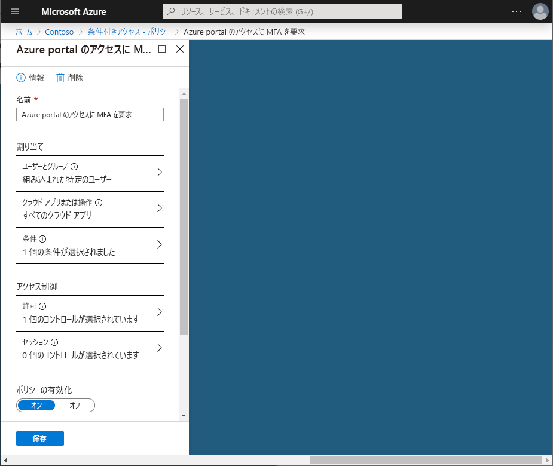
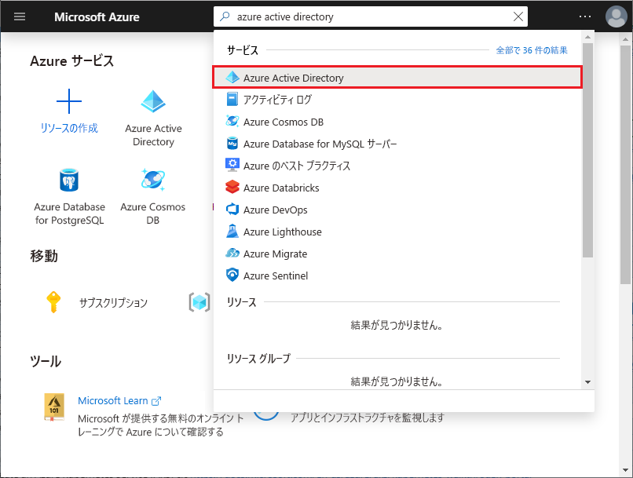

# クイック スタート - Azure Active Directory の条件付きアクセスを使用して特定のアプリケーションに対して MFA を必要にする 

ユーザーのサインイン エクスペリエンスを簡易化するために、ユーザー名とパスワードを使用してクラウド アプリにサインインできるようにすることができます。 ただし、多くの環境には、多要素認証 (MFA) など、より強力な形式のアカウント確認を必要にすることが勧められるアプリが少なくともいくつかあります。 たとえば、組織のメール システムや HR アプリにアクセスする場合などがあります。 Azure Active Directory (Azure AD) では、条件付きアクセス ポリシーを使用してこの目標を達成できます。    

このクイック スタートでは、環境内で選択したクラウド アプリに対して多要素認証を必要とする [Azure AD の条件付きアクセス ポリシー](../active-directory-conditional-access-azure-portal.md)を構成する方法について説明します。

Azure サブスクリプションをお持ちでない場合は、開始する前に [無料アカウント](https://azure.microsoft.com/free/?WT.mc_id=A261C142F) を作成してください。

## 前提条件 

このクイック スタートのシナリオを完了するための要件を次に示します。

- **Azure AD Premium エディションへのアクセス** - Azure AD の条件付きアクセスは Azure AD Premium の機能です。 

- **Isabella Simonsen というテスト アカウント** - テスト アカウントの作成方法がわからない場合は、「[クラウド ベースのユーザーを追加する](../fundamentals/add-users-azure-active-directory.md#add-cloud-based-users)」を参照してください。

## サインインをテストする

この手順の目的は、条件付きアクセス ポリシーがないサインイン エクスペリエンスの印象を確認することです。

**環境を初期化するには:**

1. Isabella Simonsen として Azure portal にサインインします。

2. サインアウトします。

## 条件付きアクセス ポリシーを作成する 

このセクションでは、必要な条件付きアクセス ポリシーを作成する方法について説明します。 このクイック スタートのシナリオでは、以下を使用します。

- MFA を必要とするクラウド アプリのプレースホルダーとしての Azure Portal 
- 条件付きアクセス ポリシーをテストするサンプル ユーザー。  

ポリシーに以下の内容を設定します。

|Setting |値|
|---     | --- |
|[概要] | Isabella Simonsen |
|クラウド アプリ | Microsoft Azure の管理 |
|アクセス権の付与 | 多要素認証が必要です |
 

 

**条件付きアクセス ポリシーを構成するには:**

1. [Azure portal](https://portal.azure.com) に全体管理者、セキュリティ管理者、または条件付きアクセス管理者としてサインインします。

2. Azure Portal の左側のナビゲーション バーで、**[Azure Active Directory]** をクリックします。 

    

3. **[Azure Active Directory]** ページの **[管理]** セクションで、**[条件付きアクセス]** をクリックします。

    
 
4. **[条件付きアクセス]** ページで、ツール バーの上部の **[追加]** をクリックします。

    

5. **[新規]** ページの **[名前]** テキストボックスに、「**Azure Portal にアクセスするには MFA が必要です**」と入力します。

    

6. **[割り当て]** セクションで **[ユーザーとグループ]** をクリックします。

    ![[概要]](./media/app-based-mfa/06.png)

7. **[ユーザーとグループ]** ページで、次の手順を実行します。

    ![[概要]](./media/app-based-mfa/24.png)

    a. **[ユーザーとグループの選択]** をクリックし、**[ユーザーとグループ]** を選択します。

    b. **[選択]** をクリックします。

    c. **[選択]** ページで **[Isabella Simonsen]** を選択し、**[選択]** をクリックします。

    d. **[ユーザーとグループ]** ページで、**[完了]** をクリックします。

8. **[クラウド アプリ]** をクリックします。

    

9. **[クラウド アプリ]** ページで、次の手順を実行します。

    

    a. **[アプリを選択]** をクリックします。

    b. **[選択]** をクリックします。

    c. **[選択]** ページで **[Microsoft Azure の管理]** を選択し、**[選択]** をクリックします。

    d. **[クラウド アプリ]** ページで、**[完了]** をクリックします。

10. **[アクセス制御]** セクションで、**[許可]** をクリックします。

    

11. **[許可]** ページで、次の手順を実行します。

    

    a. **[アクセス権の付与]** を選択します。

    a. **[多要素認証が必要です]** を選択します。

    b. **[選択]** をクリックします。

12. **[ポリシーを有効にする]** セクションで **[オン]** をクリックします。

    

13. **Create** をクリックしてください。

## シミュレートされたサインインを評価する

条件付きアクセス ポリシーを構成したら、期待どおりに動作しているかどうかを確認してみましょう。 最初の手順として、条件付きアクセスの What If ポリシー ツールを使用して、テスト ユーザーのサインインをシミュレートします。 シミュレーションでは、サインインがポリシーに与える影響を推定し、シミュレーション レポートが生成されます。  

What If ポリシー評価ツールを初期化するには、次のように設定します。

- ユーザーに「**Isabella Simonsen**」 
- クラウド アプリに「**Microsoft Azure の管理**」

 **[What If]** をクリックすると、シミュレート レポートが作成され、次のように表示されます。

- **[適用するポリシー]** の下に "**Azure Portal にアクセスするには MFA が必要です**" 
- **[制御の許可]** に "**多要素認証が必要です**"

**条件付きアクセス ポリシーを評価するには:**

1. [[条件付きアクセス - ポリシー]](https://portal.azure.com/#blade/Microsoft_AAD_IAM/ConditionalAccessBlade/Policies) ページで、上部のメニューの **[What If ]** をクリックします。  
 
    

2. **[ユーザー]** をクリックし、**[Isabella Simonsen]** を選択し、**[選択]** をクリックします。

    

2. クラウド アプリを選択するには、次の手順を実行します。

    

    a. **[クラウド アプリ]** をクリックします。

    b. **[クラウド アプリ]** ページで、**[アプリの選択]** をクリックします。

    c. **[選択]** をクリックします。

    d. **[選択]** ページで **[Microsoft Azure の管理]** を選択し、**[選択]** をクリックします。

    e. [クラウド アプリ] ページで、**[完了]** をクリックします。

3. **[What If]** をクリックします。

## 条件付きアクセス ポリシーをテストする

前のセクションでは、シミュレートされたサインインを評価する方法を学びました。 期待どおりに動作することを確認するには、シミュレーションに加え、条件付きアクセス ポリシーもテストすることをお勧めします。 

ポリシーをテストするには、**Isabella Simonsen** テスト アカウントを使用して [Azure Portal](https://portal.azure.com) にサインインしてみます。 追加のセキュリティ確認のために、アカウントを設定する必要があるというダイアログが表示されます。

## リソースのクリーンアップ

不要になったら、テスト ユーザーと条件付きアクセス ポリシーを削除します。

- Azure AD ユーザーの削除方法がわからない場合は、「[Azure AD からユーザーを削除する](../fundamentals/add-users-azure-active-directory.md#delete-users-from-azure-ad)」を参照してください。

- ポリシーを削除するには、ポリシーを選択し、クイック アクセス ツール バーの **[削除]** をクリックします。

    

## 次の手順

> [!div class="nextstepaction"]
> [使用条件への同意を要求する](require-tou.md)
> [セッションのリスクが検出されたときにアクセスをブロックする](app-sign-in-risk.md)
