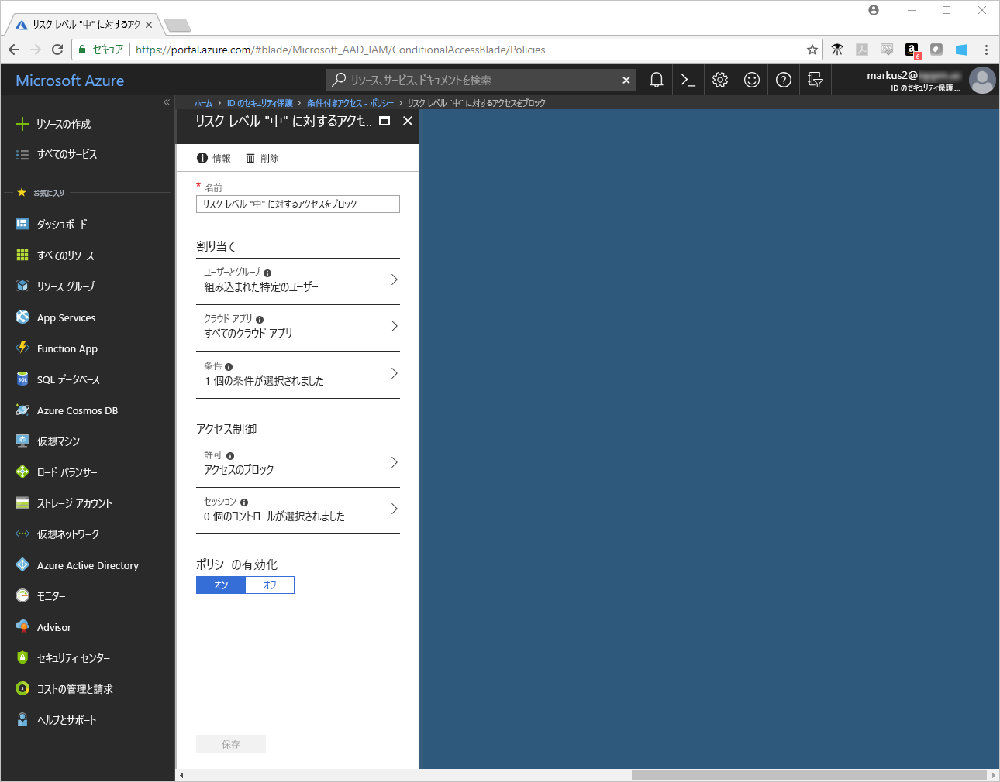
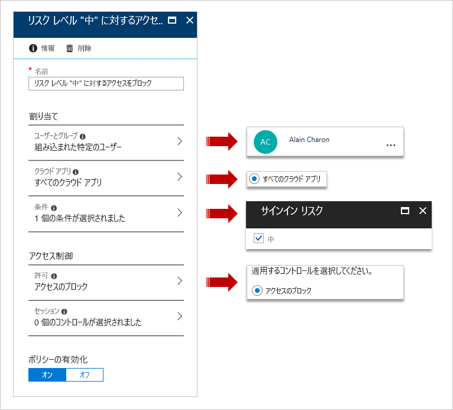
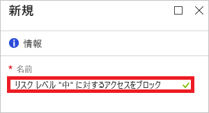
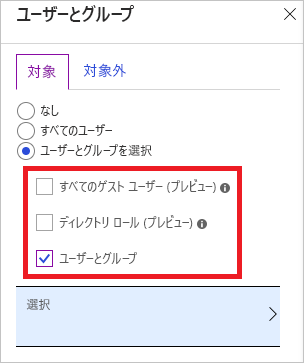
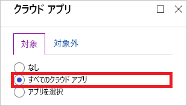
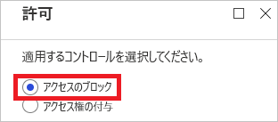
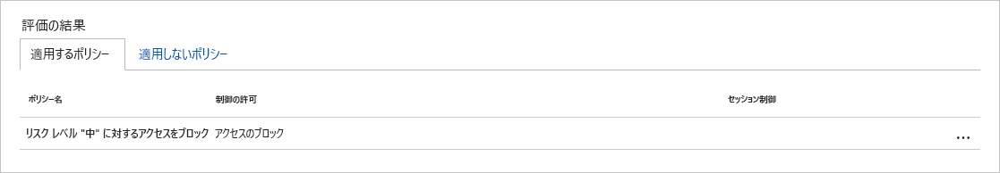
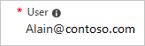
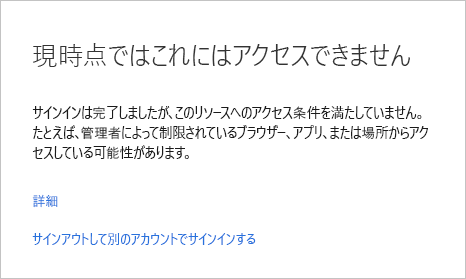

# クイック スタート:Azure Active Directory の条件付きアクセスを使用して、セッションのリスクが検出されたときにアクセスをブロックする  

環境を保護された状態で維持するために、疑わしいユーザーによるサインインをブロックすることができます。 [Azure Active Directory (Azure AD) Identity Protection](../active-directory-identityprotection.md) では、各サインインを分析して、サインイン試行がユーザー アカウントの正当な所有者によって行われなかった可能性を算出します。 可能性 (低、中、高) は、[サインイン リスク レベル](conditions.md#sign-in-risk)と呼ばれる計算値の形で示されます。 サインイン リスクの条件を設定することで、特定のサインイン リスク レベルに応じた条件付きアクセス ポリシーを構成できます。

このクイック スタートでは、構成されたサインイン リスク レベルが検出されたときにサインインをブロックする[条件付きアクセス ポリシー](../active-directory-conditional-access-azure-portal.md)を構成する方法を説明します。

Azure サブスクリプションをお持ちでない場合は、開始する前に [無料アカウント](https://azure.microsoft.com/free/?WT.mc_id=A261C142F) を作成してください。

## 前提条件

このチュートリアルのシナリオを完了するための要件を次に示します。

- **Azure AD Premium P2 エディションへのアクセス** - Azure AD Premium P1 の条件付きアクセス機能を使用する場合、P2 エディションが必要になります。これは、このクイック スタートのシナリオでは Identity Protection が必要になるためです。
- **Identity Protection** - このクイック スタートのシナリオでは Identity Protection を有効にする必要があります。 Identity Protection を有効にする方法がわからない場合は、「[Azure Active Directory Identity Protection の有効化](../identity-protection/overview-identity-protection.md)」を参照してください。
- **Tor Browser** - [Tor Browser](https://www.torproject.org/projects/torbrowser.html.en) は、オンラインでの自身のプライバシー保護に役立つことを目的としています。 Identity Protection は、Tor Browser からのサインインを、中程度のリスク レベルのある匿名 IP アドレスからのサインインとして検出します。 詳細については、「[Azure Active Directory リスク検出](../reports-monitoring/concept-risk-events.md)」を参照してください。  
- **Alain Charon というテスト アカウント** - テスト アカウントの作成方法がわからない場合は、「[クラウドベースのユーザーを追加する](../fundamentals/add-users-azure-active-directory.md#add-a-new-user)」を参照してください。

## サインインをテストする

この手順の目的は、Tor Browser を使用してテスト アカウントでテナントにアクセスできることを確認することです。

**サインインをテストするには:**

1. [Azure portal](https://portal.azure.com) に **Alain Charon** としてサインインします。
1. サインアウトします。

## 条件付きアクセス ポリシーを作成する

このクイックスタートのシナリオでは、Tor Browser からのサインインを使用して、検出された**匿名 IP アドレスからのサインイン**というリスク検出を生成します。 このリスク検出のリスク レベルは中です。 このリスク検出に応答するには、サインイン リスクの条件を [中] に設定します。 運用環境では、サインイン リスクの条件を高、または中および高に設定してください。

このセクションでは、必要な条件付きアクセス ポリシーを作成する方法について説明します。 ポリシーに以下の内容を設定します。

| Setting | 値 |
| --- | --- |
| ユーザーとグループ | Alain Charon  |
| クラウド アプリ | すべてのクラウド アプリ |
| サインイン リスク | Medium |
| 許可 | アクセスのブロック |

**条件付きアクセス ポリシーを構成するには:**

1. [Azure portal](https://portal.azure.com) に全体管理者、セキュリティ管理者、または条件付きアクセス管理者としてサインインします。
1. Azure Portal の左側のナビゲーション バーで、 **[Azure Active Directory]** をクリックします。

   

1. **[Azure Active Directory]** ページの **[セキュリティ]** セクションで、 **[条件付きアクセス]** をクリックします。

   

1. **[条件付きアクセス]** ページで、ツール バーの上部の **[追加]** をクリックします。

   

1. **[新規]** ページの **[名前]** ボックスに、「**中程度のリスク レベルのアクセスをブロックします**」と入力します。

   

1. **[割り当て]** セクションで **[ユーザーとグループ]** をクリックします。

   

1. **[ユーザーとグループ]** ページで、次の手順に従います。

   

   1. **[ユーザーとグループの選択]** をクリックし、 **[ユーザーとグループ]** を選択します。
   1. **[選択]** をクリックします。
   1. **[選択]** ページで **[Alain Charon]** を選択し、 **[選択]** をクリックします。
   1. **[ユーザーとグループ]** ページで、 **[完了]** をクリックします。
1. **[クラウド アプリ]** をクリックします。

   

1. **[クラウド アプリ]** ページで、次の手順に従います。

   

   1. **［すべてのクラウド アプリ］** をクリックします。
   1. **[Done]** をクリックします。
1. **[条件]** をクリックします。

   

1. **[条件]** ページで次の手順を行います。

   

   1. **[サインイン リスク]** をクリックします。
   1. **[構成]** で、 **[はい]** をクリックします。
   1. [サインイン リスク レベル] で **[中]** を選択します。
   1. **[選択]** をクリックします。
   1. **[条件]** ページで、 **[完了]** をクリックします。
1. **[アクセス制御]** セクションで、 **[許可]** をクリックします。

   

1. **[許可]** ページで、次の手順に従います。

   

   1. **[アクセスのブロック]** を選択します。
   1. **[選択]** をクリックします。
1. **[ポリシーを有効にする]** セクションで **[オン]** をクリックします。

   

1. **Create** をクリックしてください。

## シミュレートされたサインインを評価する

条件付きアクセス ポリシーを構成したら、期待どおりに動作しているかどうかを確認してみましょう。 最初の手順として、条件付きアクセスの **What-If ポリシー ツール**を使用して、テスト ユーザーのサインインをシミュレートします。 シミュレーションでは、サインインがポリシーに与える影響を推定し、シミュレーション レポートが生成されます。  

このシナリオに対して **What If ポリシー ツール**を実行すると、"**中程度のリスク レベルのアクセスをブロックします**" が **[適用するポリシー]** の下に一覧表示されます。

**条件付きアクセス ポリシーを評価するには:**

1. [[条件付きアクセス - ポリシー]](https://portal.azure.com/#blade/Microsoft_AAD_IAM/ConditionalAccessBlade/Policies) ページで、上部のメニューの **[What If]** をクリックします。  

   

1. **[ユーザー]** をクリックし、 **[ユーザー]** ページで **[Alan Charon]** を選択して、 **[選択]** をクリックします。

   

1. **[サインイン リスク]** で **[中]** を選択します。

   

1. **[What If]** をクリックします。

## 条件付きアクセス ポリシーをテストする

前のセクションでは、シミュレートされたサインインを評価する方法を学びました。 期待どおりに動作することを確認するには、シミュレーションに加え、条件付きアクセス ポリシーもテストすることをお勧めします。

ポリシーをテストするには、Tor Browser を使用して、**Alan Charon** として [Azure portal](https://portal.azure.com) にサインインしてみます。 そのサインイン試行は、条件付きアクセス ポリシーによってブロックされる必要があります。

## リソースのクリーンアップ

不要になったら、テスト ユーザー、Tor Browser、条件付きアクセス ポリシーを削除します。

- Azure AD ユーザーの削除方法がわからない場合は、「[Azure AD からユーザーを削除する](../fundamentals/add-users-azure-active-directory.md#delete-a-user)」を参照してください。
- ポリシーを削除するには、ポリシーを選択し、クイック アクセス ツール バーの **[削除]** をクリックします。

   

- Tor Browser を削除する手順については、「[Uninstalling (アンインストール)](https://tb-manual.torproject.org/uninstalling/)」を参照してください。

## 次の手順

> [!div class="nextstepaction"]
> [使用条件への同意を要求する](require-tou.md)
> [特定のアプリケーションに対して MFA を必要にする](app-based-mfa.md)
