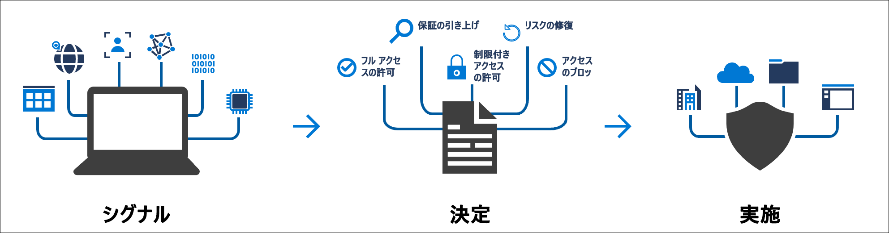
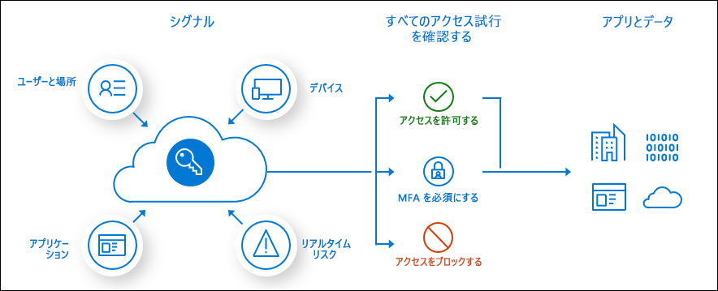

# 条件付きアクセスとは

現在のセキュリティ境界は組織のネットワークの外にまで広がり、ユーザーとデバイスの ID が境界の中に含まれるようになっています。 組織では、アクセス制御に関する決定を行う過程で、これらの ID シグナルを利用できます。 

条件付きアクセスは、Azure Active Directory で使用されるツールです。このツールによって、シグナルをまとめて、決定を行い、組織のポリシーを適用することができます。 条件付きアクセスは、新しい ID ドリブン コントロール プレーンの中心になるものです。

条件付きアクセス ポリシーは、簡単に言えば、ユーザーがリソースにアクセスする場合、ユーザーはアクションを完了する必要があるという if-then ステートメントです。 例:給与管理者は、給与処理アプリケーションにアクセスする必要があります。アクセスには多要素認証を実行することが要求されます。

管理者が直面している 2 つの主な目標は次のとおりです。

- 場所や時間を問わず、常にユーザーの生産性を高められるようにすること
- 組織の資産を保護すること

条件付きアクセス ポリシーを使用すると、必要な場合は適切なアクセス制御を適用して組織のセキュリティを維持し、必要でない場合はユーザーの邪魔にならないようにすることができます。

条件付きアクセス ポリシーは、第 1 段階認証が完了した後で適用されます。 条件付きアクセスはサービス拒否 (DoS) 攻撃などのシナリオに対する組織の防御の最前線を意図したものではありませんが、これらのイベントからのシグナルを使用してアクセス権を判定できます。

## 一般的なシグナル

ポリシーに基づく決定を行うときに、条件付きアクセスで考慮することができる一般的なシグナルには、次のようなシグナルがあります。

- ユーザーまたはグループ メンバーシップ
   - 特定のユーザーとグループをポリシーの対象にすることができるため、管理者はアクセスをきめ細かく制御できます。
- IP の場所に関する情報
   - 組織では、ポリシーに基づく決定を行うときに使用できる、信頼された IP アドレス範囲を作成できます。 
   - 管理者は、国/地域全体の IP 範囲を指定して、その範囲からのトラフィックをブロックまたは許可することができます。
- Device
   - 条件付きアクセス ポリシーを適用するとき、特定のプラットフォームのデバイスまたは特定の状態であるとマークされたデバイスを使用しているユーザーを使用できます。
- Application
   - 特定のアプリケーションにアクセスしようとするユーザーは、さまざまな条件付きアクセス ポリシーをトリガーできます。 
- リアルタイムでの計算されたリスクの検出
   - シグナルと Azure AD Identity Protection の統合により、条件付きアクセス ポリシーで危険なサインイン動作を特定できます。 その上で、ポリシーでユーザーにパスワード変更や多要素認証の実行を強制してリスク レベルを下げることや、管理者が手動で対処するまでユーザーのアクセスをブロックすることができます。
- Microsoft Cloud App Security (MCAS)
   - ユーザーのアプリケーションへのアクセスとセッションをリアルタイムで監視および制御できるようにします。クラウド環境へのアクセスと、クラウド環境で実行されるアクティビティの可視性を高めて制御を強化できます。

## 一般的な決定

- アクセスのブロック
   - 最も制限の厳しい決定
- アクセス権の付与
   - 最も制限が弱い決定でも、次のオプションのうち 1 つ以上を要求することができます。
      - 多要素認証が必要です
      - デバイスは準拠としてマーク済みである必要がある
      - ハイブリッド Azure AD 参加済みのデバイスを必要とする
      - 承認済みクライアント アプリを必須にする
      - アプリの保護ポリシーが必要 (プレビュー)

## 一般的に適用されるポリシー

多くの組織には、次のような[一般的なアクセスの問題があり、それらに対して条件付きアクセス ポリシーが役に立ちます](concept-conditional-access-policy-common.md)。

- 管理者の役割を持つユーザーに多要素認証を要求する
- Azure 管理タスクに対して多要素認証を要求する
- レガシ認証プロトコルを使用しようとしているユーザーのサインインをブロックする
- Azure Multi-Factor Authentication の登録に信頼できる場所を要求する
- 特定の場所からのアクセスをブロックまたは許可する
- リスクの高いサインイン動作をブロックする
- 特定のアプリケーションに対して、組織のマネージド デバイスを必要とする

## お客様導入事例

Azure AD の条件付きアクセスを使用して、自動化されたアクセス制御の決定を定義および実装するために他の組織がどのようにしているかを紹介します。 以下の特集記事は、これらの顧客ニーズがどのようにして満たされるかを示しています。

* [Wipro は Microsoft のクラウド セキュリティ ツールによってモバイルの生産性を高め、顧客との関係を強化します。](https://customers.microsoft.com/story/wipro-professional-services-enterprise-mobility-security) 同社では、Azure AD の条件付きアクセス ポリシーによって、独自の企業データに対する統制は維持したまま、(各自の資格情報を使用できる) 信頼された外部エンティティとの間でドキュメント、リソース、およびアプリケーションを共有することが可能になりました。
* [グローバル物流輸送企業の Aramex delivery limited は、ID とアクセスの管理ソリューションを用いて、クラウドで結び付いたオフィスを構築します](https://customers.microsoft.com/story/aramex-azure-active-directory-travel-transportation-united-arab-emirates-en)。 Aramex の遠隔地の従業員にとって、安全なアクセスを確保することは特に困難でした。 同社では現在、条件付きアクセスを応用して、こうした遠隔地の従業員がネットワークの外から同社の SaaS アプリケーションにアクセスできるようにしています。 条件付きアクセスのルールによって多要素認証の強制の有無を決定し、適切な従業員のみに適切なアクセスが付与されるようにしています。

## ライセンスの要件

[!INCLUDE [Active Directory P1 license](../../../includes/active-directory-p1-license.md)]

[Microsoft 365 Business ライセンス](/office365/servicedescriptions/microsoft-365-service-descriptions/microsoft-365-business-service-description)をお持ちのお客様も、条件付きアクセス機能にアクセスできます。 

## 次のステップ

- [条件付きアクセス ポリシーを 1 つずつ作成する](concept-conditional-access-policies.md)
- [条件付きアクセスのデプロイを計画する](plan-conditional-access.md)
- [Identity Protection について学ぶ](../identity-protection/overview-v2.md)
- [Microsoft Cloud App Security について学ぶ](/cloud-app-security/what-is-cloud-app-security)
- [Microsoft Intune について学ぶ](/intune/index)
