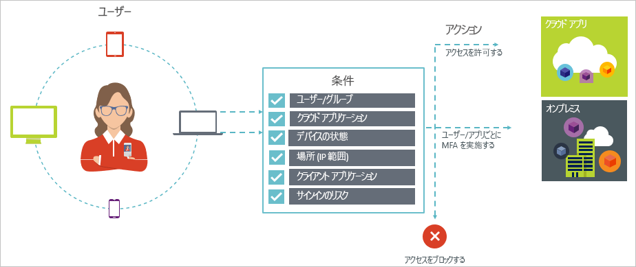

# Azure Active Directory の条件付きアクセスとは

セキュリティは、クラウドを使用する組織の最大の懸念事項です。 クラウド セキュリティの重要な側面は、クラウド リソースを管理する際の ID とアクセスです。 モバイルを重視したクラウド中心の世界では、ユーザーはさまざまなデバイスやアプリを使用してどこからでも組織のリソースにアクセスできます。 このため、だれがリソースにアクセスできるかに重点を置くだけでは十分ではなくなっています。 セキュリティと生産性のバランスをうまく取るためには、リソースへのアクセス方法も考慮してアクセスの制御を決定する必要があります。 Azure AD の条件付きアクセスで、この要件に対処することができます。 条件付きアクセスは、Azure Active Directory の機能です。 条件付きアクセスを使用すると、クラウド アプリへのアクセスを許可するかどうかの判断を各種の条件に基づいて自動的に行うアクセスの制御を実装できます。 

この記事では、Azure AD の条件付きアクセスの概念的な概要について説明します。

## 一般的なシナリオ

モバイル ファースト、クラウド ファーストの世界で、Azure Active Directory を使用してデバイス、アプリ、およびサービスにどこからでもサインオンできます。 デバイス (BYOD を含みます) や企業ネットワーク外での作業、サードパーティが提供する SaaS アプリの急増によって、皆さんは次の 2 つの対立する目標を達成することを迫られています。

- 場所や時間を問わず、常にユーザーの生産性を高められるようにすること
- 企業の資産を常に保護すること

条件付きアクセス ポリシーを使用すると、必要な条件下で適切なアクセスの制御を適用できます。 Azure AD の条件付きアクセスでは、必要なときにセキュリティを強化し、必要でない場合にはユーザーの自由に任せることができます。 

条件付きアクセスが役立ついくつかの一般的なアクセスの問題を次に示します。

- **[サインイン リスク](conditions.md#sign-in-risk)**: Azure AD Identity Protection は、サインイン リスクを検出します。 検出されたサインイン リスクが悪意のあるユーザーを示している場合、どのようにアクセスを制限しますか。 正当なユーザーによってサインインが実行されたことを示す、より強力な証拠が必要になったとしたら、どうすればよいのでしょうか。 特定のユーザーをアプリにアクセスできないようブロックして差し支えないほどのきわめて不審な点がある場合は、どうしますか。  

- **[ネットワークの場所](location-condition.md)**: Azure AD はどこからでもアクセスできます。 IT 部門の管理下にないネットワークの場所からアクセスが試行された場合はどうしますか。 ユーザー名とパスワードの組み合わせの使用は、企業ネットワークからリソースへのアクセスを試行するための十分な身元証明になることがあります。 他の予期しない国または地域から開始されたアクセス試行に対してより強力な身元証明が必要な場合はどうしますか。 特定の場所からのアクセス試行をブロックする必要がある場合はどうしますか。  

- **[デバイス管理](conditions.md#device-platforms)**: Azure AD では、ユーザーはモバイル デバイスと個人デバイスを含むさまざまなデバイスからクラウド アプリにアクセスできます。 IT 部門によって管理されているデバイスによってのみアクセスを試行できるようにする必要がある場合はどうしますか。 環境内のクラウド アプリで特定の種類のデバイスによるアクセスをブロックする必要がある場合はどうしますか。 

- **[クライアント アプリケーション](conditions.md#client-apps)**: 現在、Web ベースのアプリ、モバイル アプリ、デスクトップ アプリなどのさまざまな種類のアプリを使用して多くのクラウド アプリにアクセスできます。 既知の問題の原因となるクライアント アプリの種類を使用してアクセス試行が実行された場合はどうしますか。 特定の種類のアプリについて IT 部門が管理するデバイスが必要な場合はどうしますか。 

これらの質問と関連する回答は、Azure AD の条件付きアクセスの一般的なアクセス シナリオを表します。 条件付きアクセスは、ポリシー ベースのアプローチを使用してアクセス シナリオを処理できるようにする Azure Active Directory の機能です。

## 条件付きアクセス ポリシー

条件付きアクセス ポリシーは、次のパターンを使用したアクセス シナリオの定義です。

**Then do this** (これを実行する) はポリシーの応答を定義します。 条件付きアクセス ポリシーの目的は、クラウド アプリへのアクセスを許可することではないという点に注意する必要があります。 Azure AD では、クラウド アプリへのアクセスの許可はユーザー割り当てのサブジェクトです。 条件付きアクセス ポリシーでは、承認されたユーザー (クラウド アプリへのアクセスを許可されているユーザー) が特定の条件下でクラウド アプリにアクセスできる方法を制御します。 応答では、多要素認証やマネージド デバイスなどの追加の要件を適用します。 Azure AD の条件付きアクセスのコンテキストでは、ポリシーで適用される要件をアクセスの制御と呼びます。 最も制限の厳しい形式で、ポリシーはアクセスをブロックできます。 詳しくは、「[Azure Active Directory の条件付きアクセスのコントロール](controls.md)」をご覧ください。
     

**When this happens** (これが発生した場合は) では、ポリシーをトリガーする理由を定義します。 この理由は、満たされている条件のグループによって特徴付けられます。 Azure AD の条件付きアクセスでは、2 つの割り当て条件が特別な役割を果たします。

- **[ユーザー](conditions.md#users-and-groups)**: アクセスを試行するユーザー (**Who (だれが)**)。 

- **[クラウド アプリ](conditions.md#cloud-apps)**: アクセス試行のターゲット (**What (何を)**)。    

この 2 つの条件は、条件付きアクセス ポリシーでは必須です。 2 つの必須条件に加えて、アクセス試行の実行方法を説明する追加の条件を含めることもできます。 一般的な例として、モバイル デバイスの使用や、企業ネットワーク外の場所があります。 詳しくは、「[Conditions in Azure Active Directory conditional access](conditions.md)」(Azure Active Directory の条件付きアクセスの条件) をご覧ください。   

条件とアクセスの制御の組み合わせによって、条件付きアクセス ポリシーを表現します。 

Azure AD の条件付きアクセスを使うと、承認されたユーザーがクラウド アプリにどのようにアクセスするかを制御できます。 条件付きアクセス ポリシーの目的は、クラウド アプリへのアクセス試行に対して、アクセス試行が実行される方法によって主導される追加のアクセスの制御を適用することです。

ポリシー ベースのアプローチを使用してクラウド アプリへのアクセスを保護する利点の 1 つは、技術的な実装について心配することなく、この記事で概説している構造を使用して環境のポリシー要件の下書き作成を開始できることです。 

## 条件付きアクセスを使用するためのライセンス要件

条件付きアクセスを使用するには、Azure AD Premium ライセンスが必要です。 要件に対する適切なライセンスを確認するには、「[Free、Basic、および Premium エディションの一般公開されている機能の比較](https://azure.microsoft.com/pricing/details/active-directory/)」をご覧ください。

## 次の手順

- 詳細を知りたい場合:
    - 条件については、「[Conditions in Azure Active Directory conditional access](conditions.md)」(Azure Active Directory の条件付きアクセスの条件) をご覧ください。

    - アクセスの制御については、「[Azure Active Directory の条件付きアクセスのコントロール](controls.md)」をご覧ください。

- 条件付きアクセス ポリシーの構成を体験するには、「[Azure Active Directory の条件付きアクセスを使用して特定のアプリケーションに対して MFA を必要にする](app-based-mfa.md)」を参照してください。

- 環境に適用する条件付きアクセス ポリシーを構成する準備ができたら、「[Azure Active Directory の条件付きアクセスのベスト プラクティス](best-practices.md)」を参照してください。 

- 推奨されるポリシーを使った段階的なデプロイメント計画を策定する場合は、[条件付きアクセスの展開計画](http://aka.ms/conditionalaccessdeploymentplan)に関する記事を参照してください。
