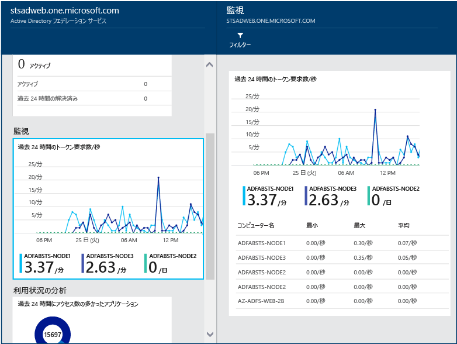

# Azure AD Connect Health を使用した AD FS の 監視
次のドキュメントは、Azure AD Connect Health を使用した AD FS インフラストラクチャの監視に固有のドキュメントです。 Azure AD Connect Health での Azure AD Connect (同期) の監視については、「 [Azure AD Connect Health for Sync の使用](active-directory-aadconnect-health-sync.md)」を参照してください。また、Azure AD Connect Health での Active Directory Domain Services の監視については、「[AD DS での Azure AD Connect Health の使用](active-directory-aadconnect-health-adds.md)」を参照してください。

## AD FS のアラート
Azure AD Connect Health アラート セクションには、アクティブなアラートの一覧が表示されます。 各アラートには、関連情報、解決の手順、関連ドキュメントのリンクが含まれます。

アクティブまたは解決済みのアラートをダブルクリックすると、新しいブレードが開かれ、追加情報、アラートを解決するための手順、関連ドキュメントへのリンクなどが表示されます。 過去に解決されたアラートの履歴データも表示できます。

## AD FS の利用状況分析
Azure AD Connect Health 利用状況分析では、フェデレーション サーバーの認証トラフィックを分析できます。 [利用状況分析] ボックスをダブルクリックすると、[利用状況分析] ブレードが開き、いくつかのメトリックとグループ分けが表示されます。

> [!NOTE]
> AD FS で利用状況分析を使用するには、AD FS 監査が有効になっている必要があります。 詳細については、「 [AD FS の監査の有効化](active-directory-aadconnect-health-agent-install.md#enable-auditing-for-ad-fs)」を参照してください。
>
>

追加のメトリックの選択、時間範囲の指定、グループ分けの変更を行うには、利用状況の分析グラフを右クリックし、[グラフの編集] を選択します。 これで、時間範囲の指定、別のメトリックの選択、グループ分けの変更を行うことができます。 さまざまな "メトリック" に基づいて認証トラフィックの分布を確認し、次のセクションに示す "グループ化" という関連パラメーターを使用して各メトリックをグループ化できます。

**メトリック: 合計要求数** - AD FS サーバーによって処理された要求の合計数。

|グループ化 | グループ化の意味と役立つ理由 |
| --- | --- |
| すべて | すべての AD FS サーバーによって処理された要求の合計数を示します。|
| アプリケーション | 対象となる証明書利用者に基づいて、要求の合計をグループ化します。 このグループ化は、どのアプリケーションがトラフィック全体のどの程度の割合を受信しているかを把握するのに役立ちます。 |
|  サーバー |要求を処理したサーバーに基づいて、要求の合計をグループ化します。 このグループ化は、トラフィック全体の負荷分散を把握するのに役立ちます。
| 社内参加 |社内参加している (既知の) デバイスから要求が行われたかどうかに基づいて、要求の合計をグループ化します。 このグループ化は、ID インフラストラクチャに対して未知のデバイスを使用してリソースがアクセスされているかどうかを把握するのに役立ちます。 |
|  認証方法 | 認証に使用された認証方法に基づいて、要求の合計をグループ化します。 このグループ化は、認証に使用される共通の認証方法を把握するのに役立ちます。 次の認証方法が考えられます。 <ol> <li>Windows 統合認証 (Windows)</li> <li>フォーム ベース認証 (フォーム)</li> <li>SSO (シングル サインオン)</li> <li>X509 証明書認証 (証明書)</li>  フェデレーション サーバーが SSO Cookie で要求を受け取る場合、その要求は SSO (シングル サインオン) と見なされます。 このような場合、Cookie が有効であれば、ユーザーは資格情報の提供を要求されずに、シームレスにアプリケーションにアクセスできます。 この動作は、フェデレーション サーバーによって保護される証明書利用者が複数ある場合でも共通です。 |
| ネットワークの場所 | ユーザーのネットワークの場所に基づいて、要求の合計をグループ化します。 イントラネットまたはエクストラネットを指定できます。 このグループ化は、イントラネットからのトラフィックとエクストラネットからのトラフィックの割合を把握するのに役立ちます。 |

**メトリック: 失敗した要求の合計数** - フェデレーション サービスによって処理され、失敗した要求の合計数。 (このメトリックは、Windows Server 2012 R2 の AD FS でのみ使用できます)

|グループ化 | グループ化の意味と役立つ理由 |
| --- | --- |
| エラーの種類 | あらかじめ定義されたエラーの種類に基づいて、エラーの数を表示します。 このグループ化は、一般的なエラーの種類を把握するのに役立ちます。 <ul><li>"ユーザー名またはパスワードが正しくない": 正しくないユーザー名またはパスワードによるエラー。</li> <li>"エクストラネット ロックアウト": エクストラネットからロックアウトされたユーザーから受信した要求によるエラー。 </li><li> "パスワードの有効期限が切れている": ユーザーが期限切れのパスワードを使用してログインしたことによるエラー。</li><li>"無効なアカウント": ユーザーが無効なアカウントを使用してログインしたことによるエラー。</li><li>"デバイス認証": ユーザーがデバイス認証を使用した認証に失敗したことによるエラー。</li><li>"ユーザー証明書の認証": ユーザーが無効な証明書が原因で認証に失敗したことによるエラー。</li><li>"MFA": ユーザーが Multi-Factor Authentication を使用した認証に失敗したことによるエラー。</li><li>"その他の資格情報": "発行承認": 承認の失敗によるエラー。</li><li>"発行委任": 発行委任エラーによるエラー。</li><li>"トークンの承認": サード パーティの ID プロバイダーからのトークンを ADFS が拒否したことによるエラー。</li><li>"プロトコル": プロトコル エラーによるエラー。</li><li>"不明": あらゆるものに対応します。 定義済みのカテゴリに分類されない、その他すべてのエラー。</li> |
| サーバー | サーバーに基づいて、エラーをグループ化します。 このグループ分けは、サーバー間でのエラー分布を把握するのに役立ちます。 分布が均等でない場合は、サーバーが障害のある状態であることを示す可能性があります。 |
| ネットワークの場所 | 要求のネットワークの場所 (イントラネットまたはエクストラネット) に基づいて、エラーをグループ化します。 このグループ分けは、エラーになる要求の種類を把握するのに役立ちます。 |
|  アプリケーション | ターゲット アプリケーション (証明書利用者) に基づいて、エラーをグループ化します。 このグループ分けは、エラーの数が最も多いターゲット アプリケーションを把握するのに役立ちます。 |

**メトリック: ユーザー数** - AD FS を使用して活発に認証を受けている一意のユーザーの平均数

|グループ化 | グループ化の意味と役立つ理由 |
| --- | --- |
|すべて |このメトリックは、選択したタイム スライスにフェデレーション サービスを使用するユーザー数の平均を示します。 ユーザーはグループ化されません。  平均は、選択したタイム スライスによって異なります。 |
| アプリケーション |ターゲット アプリケーション (証明書利用者) に基づいて、ユーザー数の平均をグループ化します。 このグループ分けは、どのアプリケーションを何人のユーザーが使用しているかを把握するのに役立ちます。 |

## AD FS のパフォーマンスの監視
Azure AD Connect Health のパフォーマンスの監視は、メトリックに関する監視情報を提供します。 [監視] ボックスを選択すると、新しいブレードが開かれ、メトリックに関する詳細情報が表示されます。

ブレードの上部にある [フィルター] を選択すると、サーバーごとにフィルター処理して個々のサーバーのメトリックを表示することができます。 メトリックを変更するには、監視ブレードの監視グラフを右クリックし、[グラフの編集] を選択します (または [グラフの編集] ボタンを選択します)。 開いた新しいブレードのドロップダウンから追加のメトリックを選択し、パフォーマンス データを表示する時間の範囲を指定します。

## ユーザー名とパスワードを使用したログインに失敗したユーザー上位 50 名
AD FS サーバーで認証要求が失敗する一般的な理由の 1 つは、無効な資格情報、つまり、間違ったユーザー名かパスワードが要求に使用されていることです。 通常は、パスワードが複雑である場合、パスワードを忘れた場合、または入力ミスがあった場合に発生します。

しかし、AD FS サーバーによって処理される要求の数が想定以上に増える原因は、他にもあります。たとえば、アプリケーションでキャッシュされているユーザー資格情報の有効期限が切れた、悪意のあるユーザーが一連のよく知られたパスワードでアカウントにサインインしようとした、などです。 これらの 2 つの例は、要求の増加につながる可能性が高い理由です。

Azure AD Connect Health for AD FS では、無効なユーザー名またはパスワードでログインが失敗した上位 50 名のユーザーに関するレポートを表示できます。 このレポートは、ファーム内のすべての AD FS サーバーによって生成される監査イベントに基づいて作成されます。

このレポートから、次の情報を簡単に確認することができます。

* 過去 30 日間に間違ったユーザー名/パスワードが原因で失敗した要求の合計数
* 無効なユーザー名/パスワードでログインに失敗したユーザーの日単位の平均数

この部分をクリックすると、詳細な情報が記載されたメイン レポート ブレードが表示されます。 このブレードにはグラフがあり、ユーザー名またはパスワードが間違っている要求に関する基準を確立するために役立つトレンド情報が示されます。 さらに、上位 50 人のユーザーと過去 1 週間の失敗した試行回数の一覧が表示されます。 過去 1 週間の上位 50 人のユーザーを調べると、間違ったパスワードの試行の急増を特定するのに役立つ可能性があります。  

このグラフには、次の情報が表示されます。

* 無効なユーザー名/パスワードが原因で失敗したログインの日単位の合計数
* ログインが失敗した一意のユーザーの日単位の合計数
* 前回の要求のクライアント IP アドレス

このレポートには、次の情報が表示されます。

| レポート アイテム | 説明 |
| --- | --- |
| ユーザー ID |使用されたユーザー ID を示しています。 この値はユーザーが入力した内容です。ときどき、間違ったユーザー ID が使用されていることがあります。 |
| 失敗した試行の回数 |そのユーザー ID で試行が失敗した回数の合計を示しています。 この表は、失敗した試行の回数が多いものから降順に並べ替えられています。 |
| 最後の失敗 |最後に失敗したときのタイム スタンプを示しています。 |
| 最後のエラー IP |直近の無効な要求のクライアント IP アドレスを示します。 この値に複数の IP アドレスが表示されている場合は、転送クライアント IP アドレスとユーザーが最後に試行した要求 IP アドレスが含まれている可能性があります。  |

> [!NOTE]
> このレポートは 12 時間ごとに自動的に更新され、その間に収集された新しい情報が反映されます。 そのため、直近の 12 時間に行われたログインの試行は、レポートに反映されていない可能性があります。
>
>

## 危険な IP レポート (パブリック プレビュー)
AD FS のお客様は、エンド ユーザーが Office 365 などの SaaS アプリケーションにアクセスするための認証サービスを提供する目的で、パスワード認証エンドポイントをインターネットに公開する場合があります。 この場合、悪意のあるアクターが AD FS システムへのログインを試みて、エンド ユーザーのパスワードを推測し、アプリケーションのリソースにアクセスする可能性があります。 Windows Server 2012 R2 の AD FS 以降、これらの種類の攻撃を防止するためのエクストラネット アカウント ロックアウト機能が用意されています。 これよりも古いバージョンを使用している場合は、AD FS システムを Windows Server 2016 にアップグレードすることを強くお勧めします。  
さらに、単一の IP アドレスから複数のユーザーに対してログイン試行が複数回実行される可能性もあります。 このような場合、ユーザーあたりの試行回数が AD FS のアカウント ロックアウト保護のしきい値に達しない可能性があります。 Azure AD Connect Health では、この状態を検出し、その発生時に管理者に通知する "危険な IP のレポート" が提供されるようになりました。 このレポートの主要な利点を次に示します。 
- 失敗したパスワードベースのログインのしきい値を超える IP アドレスの検出
- パスワードの間違いまたはエクストラネットのロックアウト状態が原因で失敗したログインのサポート
- この状態の発生時にすぐに管理者に電子メールで通知する機能。電子メール設定をカスタマイズ可能
- 組織のセキュリティ ポリシーに適合するカスタマイズ可能なしきい値設定
- オフライン分析用にダウンロード可能なレポートと、他のシステムとの自動での統合

> [!NOTE]
> このレポートを使用するには、AD FS 監査が有効になっている必要があります。 詳細については、「 [AD FS の監査の有効化](active-directory-aadconnect-health-agent-install.md#enable-auditing-for-ad-fs)」を参照してください。  
> プレビューにアクセスするには、全体管理者または[セキュリティ閲覧者](https://docs.microsoft.com/azure/role-based-access-control/built-in-roles#security-reader)のアクセス許可が必要です。  
> 

### レポートの内容
危険な IP のレポートの各項目は、指定されたしきい値を超える、失敗した AD FS サインイン アクティビティに関する集計情報を示します。 次の情報が提供されます。

| レポート アイテム | 説明 |
| ------- | ----------- |
| タイム スタンプ | Azure Portal の現地時間に基づく、検出時間枠の開始時のタイム スタンプを表示します。  日単位のイベントは、すべて UTC の午前 0 時に生成されます。  時間単位のイベントのタイムスタンプは、毎時 0 分の値に丸められます。 エクスポートされたファイルの "firstAuditTimestamp" から、最初のアクティビティの開始時刻を見つけることができます。 |
| トリガーの種類 | 検出時間枠の種類を示します。 集計トリガーの種類は、"1 時間あたり" または "1 日あたり" です。 これは、高頻度のブルート フォース攻撃と、試行回数が 1 日の中で分散している低速の攻撃を検出するのに役立ちます。 |
| IP アドレス | 間違ったパスワードまたはエクストラネット ロックアウト サインイン アクティビティが発生した単一の危険な IP アドレス。 これは、IPv4 アドレスまたは IPv6 アドレスです。 |
| 間違ったパスワードのエラー回数 | 検出時間枠の間に特定の IP アドレスで発生した、間違ったパスワード エラーの数。 間違ったパスワード エラーは、特定のユーザーで複数回発生する可能性があります。 これには期限切れのパスワードが原因で失敗した試行は含まれないことに注意してください。 |
| エクストラネットのロックアウトのエラー回数 | 検出時間枠の間に特定の IP アドレスで発生したエクストラネットのロックアウト エラーの数。 エクストラネットのロックアウト エラーは、特定のユーザーで複数回発生する可能性があります。 これは、エクストラネットのロックアウトが AD FS (バージョン 2012R2 以降) で構成されている場合にのみ表示されます。 <b>注</b> パスワードを使用したエクストラネット ログインを許可する場合は、この機能を有効にすることを強くお勧めします。 |
| 試行した一意のユーザー | 検出時間枠の間に特定の IP アドレスでログインを試行した、一意のユーザー アカウントの数。 これにより、単一ユーザーの攻撃パターンと複数ユーザーの攻撃パターンを区別するメカニズムが提供されます。  |

たとえば、次のレポート アイテムは、2018 年 2 月 28 日の午後 6 時から午後 7 時までの時間枠において、IP アドレス <i>104.2XX.2XX.9</i> で、間違ったパスワード エラーが発生していない一方、エクストラネットのロックアウト エラーが 284 回発生したことを示しています。 この条件内で影響を受けた一意のユーザーは 14 人でした。 このアクティビティ イベントは、指定されたレポートの時間単位のしきい値を超えています。 

> [!NOTE]
> - 指定されたしきい値を超えるアクティビティのみがレポートの一覧に表示されます。 
> - このレポートは、最大で 30 日前まで追跡できます。
> - このアラート レポートには、Exchange IP アドレスまたはプライベート IP アドレスは表示されません。 ただし、エクスポートした一覧にはこれらのアドレスが含まれます。 
>

### 一覧のロード バランサーの IP アドレス
ロード バランサーが失敗したサインイン アクティビティを集計し、アラートのしきい値に達しました。 ロード バランサーの IP アドレスが表示されている場合は、外部ロード バランサーが要求を Web アプリケーション プロキシ サーバーに渡すときにクライアント IP アドレスを送信していない可能性が高くなっています。 転送クライアント IP アドレスを渡すようにロード バランサーを適切に構成してください。 

### 危険な IP のレポートのダウンロード 
**ダウンロード**機能を使用すると、過去 30 日間の危険な IP アドレスの一覧全体を Connect Health Portal からエクスポートできます。エクスポート結果には各検出時間枠の間に失敗したすべての AD FS サインイン アクティビティが含まれるため、エクスポート後にフィルター処理をカスタマイズすることができます。 エクスポート結果には、ポータルの強調表示された集計のほかに、失敗したサインイン アクティビティの詳細が IP アドレスごとに示されます。

|  レポート アイテム  |  説明  | 
| ------- | ----------- | 
| firstAuditTimestamp | 検出時間枠中に失敗したアクティビティがいつ開始されたかを示す、最初のタイムスタンプを表示します。  | 
| lastAuditTimestamp | 検出時間枠中に失敗したアクティビティがいつ終了したかを示す、最初のタイムスタンプを表示します。  | 
| attemptCountThresholdIsExceeded | 現在のアクティビティがアラートしきい値を超えているかどうかを示すフラグ。  | 
| isWhitelistedIpAddress | IP アドレスがアラートおよびレポート用にフィルター処理されているかどうかを示すフラグ。 プライベート IP アドレス (<i>10.x.x.x、172.x.x.x、192.168.x.x</i>) と Exchange IP アドレスはフィルター処理され、True とマークされます。 プライベート IP アドレス範囲が表示されている場合は、外部ロード バランサーが要求を Web アプリケーション プロキシ サーバーに渡すときにクライアント IP アドレスを送信していない可能性が高くなっています。  | 

### 通知設定の構成
レポートの管理者連絡先は、**[通知設定]** で更新できます。 既定では、危険な IP アラートの電子メール通知はオフの状態になっています。 通知を有効にするには、[アクティビティ失敗のしきい値を超えている IP アドレスのレポートの通知を電子メールで受け取ります] の下にあるボタンを切り替えます。Connect Health の一般的なアラート通知設定と同様に、危険な IP のレポートに関する指定の通知受信者の一覧をここからカスタマイズできます。 変更を加えると同時に、すべての全体管理者に通知することもできます。 

### しきい値設定の構成
アラートのしきい値は、[しきい値の設定] で更新できます。 まず、システムには既定でしきい値が設定されています。 危険な IP のレポートのしきい値設定には、4 つのカテゴリがあります。

| しきい値の項目 | 説明 |
| --- | --- |
| (不良 U/P + エクストラネットのロックアウト) / 日  | "間違ったパスワードの試行回数 + エクストラネットのロックアウトの回数" が **1 日**のしきい値を超えたときに、アクティビティをレポートしてアラート通知をトリガーするためのしきい値設定。 |
| (不良 U/P + エクストラネットのロックアウト) / 時間 | "間違ったパスワードの試行回数 + エクストラネットのロックアウトの回数" が **1 時間**のしきい値を超えたときに、アクティビティをレポートしてアラート通知をトリガーするためのしきい値設定。 |
| エクストラネットのロックアウト / 日 | エクストラネットのロックアウトの回数が **1 日**のしきい値を超えたときに、アクティビティをレポートしてアラート通知をトリガーするためのしきい値設定。 |
| エクストラネットのロックアウト / 時間| エクストラネットのロックアウトの回数が **1 時間**のしきい値を超えたときに、アクティビティをレポートしてアラート通知をトリガーするためのしきい値設定。 |

> [!NOTE]
> - レポートのしきい値の変更は、設定が変更された 1 時間後に適用されます。 
> - 既にレポートされている項目は、しきい値の変更の影響を受けません。 
> - ご自分の環境内で見られるイベントの数を分析したうえで、しきい値を適切に調整することをお勧めします。 
>
>

### FAQ
1. レポートにプライベート IP アドレス範囲が表示されるのはなぜですか?   
プライベート IP アドレス (<i>10.x.x.x、172.x.x.x、192.168.x.x</i>) と Exchange IP アドレスはフィルター処理され、IP ホワイトリスト内で True とマークされます。 プライベート IP アドレス範囲が表示されている場合は、外部ロード バランサーが要求を Web アプリケーション プロキシ サーバーに渡すときにクライアント IP アドレスを送信していない可能性が高くなっています。

2. レポートにロード バランサーの IP アドレスが表示されるのはなぜですか?   
ロード バランサーの IP アドレスが表示されている場合は、外部ロード バランサーが要求を Web アプリケーション プロキシ サーバーに渡すときにクライアント IP アドレスを送信していない可能性が高くなっています。 転送クライアント IP アドレスを渡すようにロード バランサーを適切に構成してください。 

3. IP アドレスをブロックするにはどうすればよいですか?   
特定した悪意のある IP アドレスをファイアウォールまたは Exchange のブロックに追加する必要があります。    

4. このレポートに項目が何も表示されないのはなぜですか?  
   - 失敗したサインイン アクティビティがしきい値の設定を超えていません。 
   - AD FS サーバー リストで "Health Service が最新ではありません" アラートがアクティブになっていないことを確認します。  [このアラートのトラブルシューティングを行う方法](active-directory-aadconnect-health-data-freshness.md)を確認してください。
   - AD FS ファームで監査が有効になっていません。
 
5. レポートにアクセスできないのはなぜですか?   
全体管理者または[セキュリティ閲覧者](https://docs.microsoft.com/azure/role-based-access-control/built-in-roles#security-reader)のアクセス許可が必要です。 アクセスするには、全体管理者に連絡してください。

## 関連リンク
* [Azure AD Connect Health](active-directory-aadconnect-health.md)
* [Azure AD Connect Health エージェントのインストール](active-directory-aadconnect-health-agent-install.md)
* [Azure AD Connect Health の操作](active-directory-aadconnect-health-operations.md)
* [Azure AD Connect Health for Sync の使用](active-directory-aadconnect-health-sync.md)
* [AD DS での Azure AD Connect Health の使用](active-directory-aadconnect-health-adds.md)
* [Azure AD Connect Health の FAQ](active-directory-aadconnect-health-faq.md)
* [Azure AD Connect Health のバージョンの履歴](active-directory-aadconnect-health-version-history.md)
