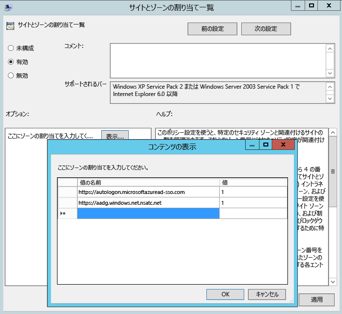

# Azure AD Connect のカスタム インストール
Azure AD Connect **カスタム設定** は、より多くのインストール オプションが必要な場合に使用します。 この設定を使用するのは、複数のフォレストがある場合や、高速インストールの対象でないオプション機能を構成する必要がある場合です。 [**高速インストール**](active-directory-aadconnect-get-started-express.md) オプションで対象のデプロイまたはトポロジに対応できない場合は、常にこの設定を使用します。

Azure AD Connect のインストールを始める前に、必ず [Azure AD Connect をダウンロード](http://go.microsoft.com/fwlink/?LinkId=615771)し、[Azure AD Connect のハードウェアと前提条件](active-directory-aadconnect-prerequisites.md)に関するページに記載されている前提条件の手順を完了してください。 また、「 [Azure AD Connect: アカウントとアクセス許可](active-directory-aadconnect-accounts-permissions.md)」で説明されているとおりに必要なアカウントが利用できることを確認してください。

カスタマイズした設定が対象のトポロジに適さない場合は (DirSync をアップグレードする場合など)、「 [関連ドキュメント](#related-documentation) 」でその他のシナリオを確認してください。

## Azure AD Connect のカスタム設定を使用したインストール
### 簡単設定
このページで **[カスタマイズ]** をクリックして、カスタム設定を使用したインストールを開始します。

### 必須コンポーネントのインストール
同期サービスをインストールするとき、オプションの構成セクションをオフのままにすると、Azure AD Connect によってすべてが自動的に設定されます。 これにより、SQL Server 2012 Express LocalDB インスタンスの設定、適切なグループの作成、アクセス許可の割り当てが行われます。 既定値を変更する場合は、次の表を利用すると、任意で使用できる構成オプションについて把握することができます。

| オプションの構成 | 説明 |
| --- | --- |
| 既存の SQL Server を使用する |SQL Server 名とインスタンス名を指定することができます。 使用するデータベース サーバーが既にある場合は、このオプションを選択します。 SQL Server で参照が有効になっていない場合は、 **[インスタンス名]** に、インスタンス名、コンマ、ポート番号の順に入力してください。 |
| 既存のサービス アカウントを使用する |既定では、同期サービスで使用する仮想サービス アカウントが Azure AD Connect によって使用されます。 リモート SQL サーバーを使用する場合、または認証が必要なプロキシを使用する場合は、**管理されたサービス アカウント**か、ドメイン内のサービス アカウントとパスワードが必要です。 このような場合は、使用するアカウントを入力します。 サービス アカウントのログインを作成するには、SQL の SA がインストールを実行してください。  「[Azure AD Connect: アカウントとアクセス許可](active-directory-aadconnect-accounts-permissions.md#adsync-service-account)」を参照してください。   最新のビルドでは、SQL 管理者が帯域外でデータベースのプロビジョニングを実行し、データベース所有者権限を持つ Azure AD Connect 管理者がインストールできます。  詳細については、「[Install Azure AD Connect using SQL delegated administrator permissions (SQL によって委任された管理者の権限を使用した Azure AD Connect のインストール)](active-directory-aadconnect-sql-delegation.md)」を参照してください。|
| カスタム同期グループを指定する |既定では、同期サービスのインストール時に、Azure AD Connect によってサーバーに対してローカルな 4 つのグループが作成されます。 これらのグループは。管理者グループ、オペレーター グループ、参照グループ、およびパスワード再設定グループです。 ここでは独自のグループを指定できます。 グループは、サーバー上にローカルに存在する必要があり、ドメイン内に置くことはできません。 |

### ユーザーのサインイン
必要なコンポーネントがインストールされると、ユーザーによるシングル サインオンの方法を選択するように求められます。 次の表に、指定できるオプションの簡単な説明を示します。 サインイン方法の詳細については、[ユーザーのサインイン](active-directory-aadconnect-user-signin.md)に関するページを参照してください。

| シングル サインオン オプション | 説明 |
| --- | --- |
| パスワード ハッシュの同期 |ユーザーは、オンプレミス ネットワークで使用しているものと同じパスワードで、Office 365 などの Microsoft クラウド サービスにサインインできます。 ユーザーのパスワードはパスワード ハッシュとして Azure AD に同期され、クラウドで認証が行われます。 詳細については、[パスワード ハッシュの同期](active-directory-aadconnectsync-implement-password-hash-synchronization.md)に関するページを参照してください。 |
|パススルー認証|ユーザーは、オンプレミス ネットワークで使用しているものと同じパスワードで、Office 365 などの Microsoft クラウド サービスにサインインできます。  ユーザー パスワードはオンプレミスの Active Directory ドメイン コントローラーにパススルーされて検証されます。
| AD FS とのフェデレーション |ユーザーは、オンプレミス ネットワークで使用しているものと同じパスワードで、Office 365 などの Microsoft クラウド サービスにサインインできます。  ユーザーはサインインのためにオンプレミスの AD FS インスタンスにリダイレクトされ、認証はオンプレミスで行われます。 |
| PingFederate によるフェデレーション|ユーザーは、オンプレミス ネットワークで使用しているものと同じパスワードで、Office 365 などの Microsoft クラウド サービスにサインインできます。  ユーザーはサインインのためにオンプレミスの PingFederate インスタンスにリダイレクトされ、認証はオンプレミスで行われます。 |
| 構成しない |ユーザー サインイン機能はインストールおよび構成されません。 サード パーティのフェデレーション サーバーまたは別の既存のソリューションが既に設置されている場合は、このオプションを選択します。 |
|シングル サインオンを有効にする|これはパスワード同期とパススルー認証の両方で使用できるオプションであり、企業ネットワーク上のデスクトップ ユーザーのシングル サインオン機能を有効にします。 詳細については、[シングル サインオン](active-directory-aadconnect-sso.md)に関するページをご覧ください。  AD FS ユーザーはこのオプションを使用できません。AD FS によって同レベルのシングル サインオンが既に提供されているためです。 

### Azure への接続
[Azure AD に接続] 画面で、グローバル管理者のアカウントとパスワードを入力します。 前のページで **[AD FS とのフェデレーション]** を選択した場合、フェデレーション用に有効にする予定があるドメイン内のアカウントでサインインしないようにしてください。 Azure AD ディレクトリに付属する既定の **onmicrosoft.com** ドメイン内のアカウントを使用することをお勧めします。

このアカウントは、Azure AD のサービス アカウントを作成するためにのみ使用され、ウィザードが完了した後は使用されません。  

グローバル管理者アカウントで MFA が有効にされている場合は、サインイン ポップアップに再度パスワードを入力し、MFA チャレンジを完了する必要があります。 チャレンジは確認コードの入力か音声通話によって行うことができます。  

グローバル管理者アカウントは [Privileged Identity Management](../privileged-identity-management/pim-getting-started.md) も有効になっている可能性があります。

接続に問題があり、エラーが発生する場合は、[接続の問題に対するトラブルシューティング](active-directory-aadconnect-troubleshoot-connectivity.md)についてのページを参照してください。

## [同期] セクションのページ

### ディレクトリの接続
Azure AD Connect では、Active Directory ドメイン サービスに接続するには、十分なアクセス許可を持つアカウントのフォレスト名と資格情報が必要です。

フォレスト名を入力し、**[ディレクトリの追加]** をクリックすると、ポップアップ ダイアログが表示され、次のオプションの指定が求められます。

| オプション | 説明 |
| --- | --- |
| 新しいアカウントを作成します | ディレクトリ同期中に Azure AD Connect が AD フォレストに接続するために必要な AD DS アカウントを Azure AD Connect ウィザードで作成する場合は、このオプションを選択します。 このオプションを選択した場合は、エンタープライズ管理者アカウントのユーザー名とパスワードを入力します。 指定したエンタープライズ管理者アカウントは、Azure AD Connect ウィザードで、必要な AD DS アカウントを作成するために使用されます。 ドメインの部分は NetBios または FQDN の形式で入力できます (FABRIKAM\administrator または fabrikam.com\administrator)。 |
| 既存のアカウントを使用します | ディレクトリ同期中に Azure AD Connect が Azure AD Connect に接続する際に使用される既存の AD DS アカウントを指定する場合は、このオプションを選択します。 ドメインの部分は NetBios または FQDN の形式で入力できます (FABRIKAM\syncuser または fabrikam.com\syncuser)。 このアカウントには既定の読み取りアクセス許可が必要なだけなので、通常のユーザー アカウントを指定できます。 ただし、シナリオによっては、アクセス許可がさらに必要になることがあります。 詳細については、[Azure AD Connect アカウントとアクセス許可](active-directory-aadconnect-accounts-permissions.md##create-the-ad-ds-connector-account)に関するページを参照してください。 |

### Azure AD サインインの構成
このページでは、オンプレミスの AD DS に存在し、Azure AD で検証された UPN ドメインを確認できます。 また、userPrincipalName に使用する属性を構成できます。

  
**[Not Added (追加されていません)]** と **[Not Verified (検証されていません)]** のマークが付いたドメインをすべて確認します。 使用するドメインを Azure AD で検証済みにしてください。 対象のドメインを検証済みにしたら、更新シンボルをクリックします。 詳細については、[ドメインの追加と検証](../active-directory-domains-add-azure-portal.md)に関するページを参照してください。

**UserPrincipalName** - userPrincipalName 属性は、ユーザーが Azure AD と Office 365 にサインインするときに使用する属性です。 使用するドメイン (UPN サフィックス) は、ユーザーを同期する前に、Azure AD で検証する必要があります。 既定の userPrincipalName 属性のままにしておくことをお勧めします。 この属性がルーティング不可能で検証できない場合は、別の属性を選択することができます。 たとえば、サインイン ID を保持する属性として電子メールを選択することができます。 userPrincipalName 以外の属性を使用する方法は、 **代替 ID**と呼ばれます。 代替 ID の属性値は、RFC822 標準に従う必要があります。 代替 ID は、パスワード同期とフェデレーションの両方で使用できます。 Active Directory では、値が 1 つのみであってもこの属性を複数値として定義できません。

>[!NOTE]
> パススルー認証を有効にする場合、ウィザードを続行するために少なくとも 1 つの検証済みドメインが必要になります。

> [!WARNING]
> 代替 ID の使用は、すべての Office 365 ワークロードと互換性があるわけではありません。 詳細については、「 [Configuring Alternate Login ID (代替ログイン ID の構成)](https://docs.microsoft.com/windows-server/identity/ad-fs/operations/configuring-alternate-login-id)」を参照してください。
>
>

### ドメインと OU のフィルター処理
既定では、すべてのドメインと OU が同期されます。 Azure AD に同期させたくないドメインまたは OU がある場合は、これらのドメインと OU を選択解除できます。  
  
ウィザード内のこのページでは、ドメイン ベースおよび OU ベースのフィルター処理を構成します。 変更を予定している場合は、変更を行う前に、[ドメイン ベースのフィルター処理](active-directory-aadconnectsync-configure-filtering.md#domain-based-filtering)に関するトピックと [OU ベースのフィルター処理](active-directory-aadconnectsync-configure-filtering.md#organizational-unitbased-filtering)に関するトピックを参照してください。 一部の OU はこの機能に不可欠であるため、選択解除しないでください。

1.1.524.0 より前のバージョンの Azure AD Connect で OU ベースのフィルター処理を使用している場合、後で追加された新しい OU は、既定で同期されます。 新しい OU が同期されないようにする場合は、ウィザードの完了後に [OU ベースのフィルター処理](active-directory-aadconnectsync-configure-filtering.md#organizational-unitbased-filtering)で構成できます。 Azure AD Connect バージョン 1.1.524.0 以降では、新しい OU を同期するかどうかを指定できます。

[グループベースのフィルター処理](#sync-filtering-based-on-groups)を使用する予定の場合は、そのグループが属する OU が含まれており、OU ベースのフィルター処理によって除外されないようにしてください。 OU ベースのフィルター処理は、グループベースのフィルター処理の前に評価されます。

さらに、一部のドメインは、ファイアウォールの制限のために到達できないこともあります。 このようなドメインは既定で選択が解除されており、警告が表示されます。  
  
この警告が表示される場合は、これらのドメインが実際に到達不能であり、警告の表示が予想されるものであることを確認してください。

### ユーザーを一意に識別

#### オンプレミスのディレクトリでのユーザーの識別方法を選択する
[フォレスト全体で一致] 機能を使用すると、AD DS フォレストのユーザーを Azure AD でどう表すかを定義することができます。 ユーザーは、すべてのフォレストで 1 回だけ表すか、有効アカウントと無効アカウントを組み合わせることができます。 一部のフォレストでは、ユーザーを連絡先として表すこともできます。

| Setting | 説明 |
| --- | --- |
| [ユーザーはフォレスト全体で 1 回だけ表されます](active-directory-aadconnect-topologies.md#multiple-forests-single-azure-ad-tenant) |すべてのユーザーは、Azure AD の個々のオブジェクトとして作成されます。 オブジェクトは、メタバースに結合されません。 |
| [メール属性](active-directory-aadconnect-topologies.md#multiple-forests-single-azure-ad-tenant) |このオプションは、異なるフォレスト間でメール属性が同じ値である場合に、ユーザーと連絡先を結合します。 連絡先が GALSync を使用して作成されている場合に、このオプションを使用してください。 このオプションを選択した場合、メール属性が設定されていないユーザー オブジェクトは、Azure AD との間で同期されません。 |
| [ObjectSID と msExchangeMasterAccountSID/msRTCSIP-OriginatorSid](active-directory-aadconnect-topologies.md#multiple-forests-single-azure-ad-tenant) |このオプションでは、アカウント フォレスト内の有効なユーザーと、リソース フォレスト内の無効なユーザーが結合されます。 Exchange では、この構成はリンクされたメールボックスと呼ばれています。 このオプションは、Lync のみを使用し、Exchange がリソース フォレスト内にない場合にも使用できます。 |
| sAMAccountName および MailNickName |このオプションは、ユーザーのサインイン ID を見つけるために必要な属性同士を結合します。 |
| 特有の属性 |このオプションでは、独自の属性を選択することができます。 このオプションを選択した場合、(選択した) 属性が設定されていないユーザー オブジェクトは、Azure AD との間で同期されません。 **制限:** 必ずメタバース内に既に存在する属性を選択するようにしてください。 カスタム属性 (メタバースにない属性) を選択すると、ウィザードが完了できません。 |

#### Azure AD でのユーザーの識別方法を選択する - ソース アンカー
sourceAnchor 属性は、ユーザー オブジェクトの有効期間中に変更できない属性です。 オンプレミスのユーザーと Azure AD のユーザーをリンクするプライマリ キーです。

| Setting | 説明 |
| --- | --- |
| ソース アンカーの管理を Azure に任せる | Azure AD に属性を選択させる場合は、このオプションを選択します。 このオプションを選択すると、Azure AD Connect ウィザードが sourceAnchor 属性選択ロジックを適用します。このロジックについては、「[Azure AD Connect: 設計概念](active-directory-aadconnect-design-concepts.md#using-msds-consistencyguid-as-sourceanchor)」の「Using msDS-ConsistencyGuid as sourceAnchor (sourceAnchor としての msDS-ConsistencyGuid の使用)」セクションで説明されています。 どの属性がソース アンカー属性として選択されたかは、カスタム インストールの完了後、ウィザードに表示されます。 |
| 特有の属性 | sourceAnchor 属性として既存の AD 属性を指定する場合は、このオプションを選択します。 |

この属性は変更できないため、適切な属性を使用するように計画する必要があります。 適切な属性として考えられるのは objectGUID です。 この属性は、ユーザー アカウントをフォレスト/ドメイン間で移動しなければ、変更されません。 フォレスト間でアカウントを移動するマルチ フォレスト環境では、employeeID を持つ属性など、別の属性を使用する必要があります。 ユーザーが結婚したり割り当てが変更されたりした場合に変化する可能性のある属性は、使用しないようにしてください。 @-sign が含まれる属性は使用できないので、電子メールや userPrincipalName は使用できません。 属性では大文字と小文字も区別されるため、フォレスト間でオブジェクトを移動する場合は、大文字と小文字をそのままの状態に維持するようにしてください。 バイナリ属性は base64 でエンコードされますが、他の種類の属性はエンコードされない状態のままになります。 フェデレーション シナリオと一部の Azure AD インターフェイスでは、この属性は immutableID とも呼ばれます。 ソース アンカーの詳細については、[設計概念](active-directory-aadconnect-design-concepts.md#sourceanchor)に関するページを参照してください。

### グループに基づく同期フィルタリング
グループに基づくフィルタリング機能では、パイロット用にごく一部のオブジェクトのみを同期することができます。 この機能を使用するには、対象とするグループをオンプレミスの Active Directory に作成します。 次に、直接のメンバーとして Azure AD に同期するユーザーとグループを追加します。 このグループには後でユーザーを追加したりユーザーを削除したりして、Azure AD に表示するオブジェクトの一覧を管理することができます。 同期するオブジェクトはすべて、グループの直接のメンバーである必要があります。 ユーザー、グループ、連絡先、およびコンピューター/デバイスは、すべて直接のメンバーにする必要があります。 入れ子になったグループのメンバーシップは解決されません。 グループをメンバーとして追加すると、グループ自体は追加されますが、そのグループのメンバーは追加されません。

> [!WARNING]
> この機能は、パイロット デプロイのサポートのみを目的としています。 本格的な運用環境のデプロイでは使用しないでください。
>
>

本格的な運用環境のデプロイでは、単一のグループを維持しながらすべてのオブジェクトを同期することは困難になります。 代わりに、[フィルター処理の構成](active-directory-aadconnectsync-configure-filtering.md)に関するページで説明されている手法のいずれかを使用してください。

### オプション機能
この画面では、特定のシナリオのためにオプション機能を選択することができます。

> [!WARNING]
> 現時点で DirSync または Azure AD Sync がアクティブになっている場合は、Azure AD Connect の書き戻し機能をアクティブにしないでください。
>
>

| オプション機能 | 説明 |
| --- | --- |
| Exchange ハイブリッドのデプロイ |Exchange ハイブリッド展開機能を利用すると、オンプレミスと Office 365 で Exchange メールボックスが共存できるようになります。 Azure AD Connect により、Azure AD の特定の[属性](active-directory-aadconnectsync-attributes-synchronized.md#exchange-hybrid-writeback)セットがオンプレミスのディレクトリに同期されます。 |
| Exchange メールのパブリック フォルダー | Exchange メールのパブリック フォルダー機能を使用すると、メール対応のパブリック フォルダー オブジェクトをオンプレミスの Active Directory から Azure AD に同期することができます。 |
| Azure AD アプリと属性フィルター |Azure AD アプリと属性フィルターを有効にすると、同期される属性セットをカスタマイズできます。 このオプションにより、2 つの構成ページがウィザードに追加されます。 詳細については、「 [Azure AD アプリと属性フィルター](#azure-ad-app-and-attribute-filtering)」を参照してください。 |
| パスワード ハッシュの同期 |サインイン ソリューションとしてフェデレーションを選択した場合は、このオプションを有効にすることができます。 バックアップ オプションとして、パスワード ハッシュ同期を使用できます。 詳細については、[パスワード ハッシュの同期](active-directory-aadconnectsync-implement-password-hash-synchronization.md)に関するページを参照してください。   パススルー認証を選択した場合、レガシ クライアントをサポートするために、このオプションをバックアップ オプションとして有効にすることもできます。 詳細については、[パスワード ハッシュの同期](active-directory-aadconnectsync-implement-password-hash-synchronization.md)に関するページを参照してください。|
| パスワードの書き戻し |パスワード ライトバックを有効にすると、Azure AD で行われたパスワードの変更が、オンプレミスのディレクトリに書き戻されます。 詳細については、「[パスワード管理の概要](../authentication/quickstart-sspr.md)」を参照してください。 |
| グループの書き戻し |**Office 365 グループ** 機能を使用すると、そのグループをオンプレミスの Active Directory 内に表示することができます。 このオプションが使用できるのは、オンプレミスの Active Directory 内に Exchange が置かれている場合に限られます。 詳細については、「[グループの書き戻し](active-directory-aadconnect-feature-preview.md#group-writeback)」を参照してください。 |
| デバイスの書き戻し |条件付きアクセスのシナリオの場合は、Azure AD 内のデバイス オブジェクトをオンプレミスの Active Directory に書き戻すことができます。 詳細については、[Azure AD Connect でのデバイスの書き戻しの有効化](active-directory-aadconnect-feature-device-writeback.md)に関するページを参照してください。 |
| ディレクトリ拡張属性の同期 |ディレクトリ拡張機能の属性の同期を有効にすると、指定した属性が Azure AD に同期されます。 詳細については、 [ディレクトリ拡張機能](active-directory-aadconnectsync-feature-directory-extensions.md)に関するページを参照してください。 |

### Azure AD アプリと属性フィルター
Azure AD に同期する属性を制限する場合、まずは使用しているサービスを選択します。 このページの構成に変更を加える場合は、インストール ウィザードを再度実行して新しいサービスを明示的に選択する必要があります。

前の手順で選択したサービスに基づいて、次のページに、同期対象となるすべての属性が表示されます。 この一覧は、同期されるすべてのオブジェクトの種類の組み合わせです。 特定の属性を同期しないように設定する必要がある場合は、該当する属性の選択を解除します。

> [!WARNING]
> 属性の選択を解除すると、機能に影響が生じる場合があります。 ベスト プラクティスと推奨事項については、[同期する属性](active-directory-aadconnectsync-attributes-synchronized.md#attributes-to-synchronize)に関するページを参照してください。
>
>

### ディレクトリ拡張属性の同期
Azure AD のスキーマは、組織によって追加されたカスタム属性や Active Directory 内のその他の属性を使用して拡張することができます。 この機能を使用するには、**[オプション機能]** ページの **[Directory Extension attribute sync (ディレクトリ拡張機能の属性の同期)]** を選択します。 このページで、同期する属性をさらに選択できます。

詳細については、[ディレクトリ拡張機能](active-directory-aadconnectsync-feature-directory-extensions.md)に関するページを参照してください。

### シングル サインオン (SSO) の有効化
パスワード同期またはパススルー認証で使用するシングル サインオンを構成するのは簡単です。Azure AD に同期されているフォレストごとに一度プロセスを完了するだけでかまいません。 構成には次の 2 つの手順が含まれます。

1.  オンプレミスの Active Directory での必要なコンピューター アカウントの作成。
2.  シングル サインオンをサポートするクライアント コンピューターのイントラネット ゾーンの構成。

#### Active Directory でのコンピューター アカウントの作成
Azure AD Connect で追加されたフォレストごとに、ドメイン管理者の資格情報を入力する必要があります。そうすることで、フォレストごとにコンピューター アカウントを作成できます。 資格情報はアカウントの作成にのみ使用され、他の操作のために保存されたり使用されたりすることはありません。 次に示す Azure AD Connect ウィザードの **[シングル サインオンを有効にする]** ページで、資格情報を入力します。

![[シングル サインオンを有効にする]](./media/active-directory-aadconnect-get-started-custom/enablesso.png)

>[!NOTE]
>シングル サインオンを使用しない特定のフォレストについては、スキップすることができます。

#### クライアント コンピューターのイントラネット ゾーンの構成
クライアントがイントラネット ゾーンに自動的にサインインするように、2 つの URL はイントラネット ゾーンに含まれるものにする必要があります。 これを行うことで、ドメインに参加しているコンピューターが、企業ネットワークに接続された際に Kerberos チケットを Azure AD に自動的に送信するようになります。
グループ ポリシー管理ツールがあるコンピューターで次の手順を実行します。

1.  グループ ポリシー管理ツールを開きます。
2.  すべてのユーザーに適用されるグループ ポリシーを編集します。 既定のドメイン ポリシーなどです。
3.  **[ユーザーの構成]、[管理用テンプレート]、[Windows コンポーネント]、[Internet Explorer]、[インターネット コントロール パネル]、[セキュリティ]** の順に移動して、下の図のように **[サイトとゾーンの割り当て一覧]** を選択します。
4.  ポリシーを有効にし、ダイアログ ボックスに次の項目を入力します。

        Value: `https://autologon.microsoftazuread-sso.com`  
        Data: 1  
    

5.  次のようになります。  

6.  **[OK]** を 2 回クリックします。

## AD FS とのフェデレーションの構成
Azure AD Connect との AD FS の構成は簡単であり、必要なのは数回のクリックのみです。 構成の前に、以下のものを用意する必要があります。

* フェデレーション サーバー用の Windows Server 2012 R2 以降のサーバー (リモート管理を有効に設定)
* Web アプリケーション プロキシ サーバー用の Windows Server 2012 R2 以降のサーバー (リモート管理を有効に設定)
* 使用する予定のフェデレーション サービス名の SSL 証明書 (sts.contoso.com など)

>[!NOTE]
>フェデレーション信頼の管理に Azure AD Connect を使っていない場合でも、AD FS ファームの SSL 証明書は、Azure AD Connect を使って更新することができます。

### AD FS の構成の前提条件
Azure AD Connect を使用して AD FS ファームを構成するには、リモート サーバー上で WinRM が有効になっている必要があります。 [フェデレーションの前提条件](active-directory-aadconnect-prerequisites.md#prerequisites-for-federation-installation-and-configuration)の他のタスクを完了したことを確認します。 加えて、「[表 3 - Azure AD Connect とフェデレーション サーバー/WAP](active-directory-aadconnect-ports.md#table-3---azure-ad-connect-and-ad-fs-federation-serverswap)」に記載されているポート要件も確認してください。

### 新しい AD FS ファームの作成または既存の AD FS ファームの使用
既存の AD FS ファームを使用することも、新しい AD FS ファームを作成することもできます。 新しく作成する場合は、SSL 証明書を提供する必要があります。 SSL 証明書がパスワードで保護されている場合は、パスワードを入力するように求められます。

既存の AD FS ファームを使用する場合は、AD FS と Azure AD の間の信頼関係を構成する画面に直接移動します。

>[!NOTE]
>Azure AD Connect を使って管理できる AD FS ファームは 1 つだけです。 選択した AD FS ファーム上に構成されている Azure AD との間に既存のフェデレーション信頼がある場合、その信頼が Azure AD Connect によって最初から再作成されます。

### AD FS サーバーの指定
AD FS をインストールするサーバーを入力します。 容量計画のニーズに基づいて 1 つまたは複数のサーバーを追加することができます。 この構成を実行する前に、すべての AD FS サーバー (WAP サーバーの場合は不要) を Active Directory に参加させてください。 テスト デプロイとパイロット デプロイ用に単一の AD FS サーバーをインストールすることをお勧めします。 初期構成の後に Azure AD Connect を再度実行し、容量拡大のニーズを満たすようにサーバーをさらに追加してデプロイします。

> [!NOTE]
> この構成を実行する前に、すべてのサーバーが 1 つの AD ドメインに参加していることを確認してください。
>
>

### Web アプリケーション プロキシ サーバーの指定
Web アプリケーション プロキシ サーバーとするサーバーを入力します。 Web アプリケーション プロキシ サーバーは DMZ (エクストラネット接続) にデプロイされ、エクストラネットからの認証要求をサポートします。 容量計画のニーズに基づいて 1 つまたは複数のサーバーを追加することができます。 テスト デプロイとパイロット デプロイ用に単一の Web アプリケーション プロキシ サーバーをインストールすることをお勧めします。 初期構成の後に Azure AD Connect を再度実行し、容量拡大のニーズを満たすようにサーバーをさらに追加してデプロイします。 イントラネットからの認証を処理するために同数のプロキシ サーバーを設定することをお勧めします。

> [!NOTE]
> <li> 使用しているアカウントが WAP サーバーのローカル管理者ではない場合、管理者の資格情報を入力するように求められます。</li>
> <li> この手順を実行する前に、Azure AD Connect サーバーと Web アプリケーション プロキシ サーバーの間に HTTP/HTTPS 接続が確立されていることを確認してください。</li>
> <li> 認証要求の通信ができるように、Web アプリケーション サーバーと AD FS サーバーの間に HTTP/HTTPS 接続が確立されていることを確認してください。</li>
>

Web アプリケーション サーバーが AD FS サーバーとの間にセキュリティで保護された接続を確立できるように、資格情報を入力するよう求められます。 これらの資格情報は、AD FS サーバーのローカル管理者である必要があります。

### AD FS サービスのサービス アカウントを指定します。
AD FS サービスには、ユーザーを認証し Active Directory のユーザー情報を参照するドメイン サービス アカウントが必要です。 次の 2 種類のサービス アカウントがサポートされます。

* 
  **グループ管理サービス アカウント** - Windows Server 2012 と共に Active Directory Domain Services に導入されました。 この種類のアカウントは、AD FS のようなサービスに、パスワードを定期的に更新する必要のない単一のアカウントを提供します。 AD FS サーバーが所属するドメインに Windows Server 2012 ドメイン コントローラーが既にある場合は、このオプションを使用してください。
* **ドメイン ユーザー アカウント** - この種類のアカウントではパスワードの入力が求められ、パスワードの変更や期限切れの際に、定期的に更新する必要があります。 このオプションは、AD FS サーバーが所属するドメインに Windows Server 2012 ドメイン コントローラーがない場合にのみ使用してください。

グループ管理サービス アカウントを選択した場合、Active Directory でこの機能を使用したことがないと、エンタープライズ管理者の資格情報の入力を求められます。 入力した資格情報は、キー ストアを開始し、Active Directory でこの機能を有効にするために使用されます。

> [!NOTE]
> Azure AD Connect は、AD FS サービスが SPN としてドメインに登録済みであるかどうかを検出するためのチェックを実行します。  AD DS では、重複する SPN を同時に登録することはできません。  重複する SPN が見つかった場合、その SPN を削除するまで、先に進むことができなくなります。

### フェデレーションする Azure AD ドメインの選択
この構成を使用して、AD FS と Azure AD のフェデレーション関係をセットアップします。 Azure AD にセキュリティ トークンを発行するように AD FS を構成し、この特定の AD FS インスタンスからのトークンを信頼するように Azure AD を構成します。 初期インストールでは、このページで 1 つのドメインしか構成できません。 後で Azure AD Connect をもう一度実行すると、追加のドメインを構成できます。

### フェデレーション用に選択された Azure AD ドメインの検証
フェデレーション対象のドメインを選択すると、Azure AD Connect によって、検証されていないドメインを検証するために必要な情報が提供されます。 この情報を使用する方法については、[ドメインの追加と検証](../active-directory-domains-add-azure-portal.md)に関するページを参照してください。

> [!NOTE]
> AD Connect では、構成段階でドメインの検証を試みます。 必要な DNS レコードを追加せずに構成を続行すると、ウィザードで構成を完了することができません。
>
>

## PingFederate とのフェデレーションの構成
Azure AD Connect との PingFederate の構成は簡単であり、必要なのは数回のクリックのみです。 ただし、以下の前提条件を満たす必要があります。
- PingFederate 8.4 以降。  詳細については、「[PingFederate Integration with Azure Active Directory and Office 365 (Azure Active Directory および Office 365 と PingFederate の統合)](https://docs.pingidentity.com/bundle/O365IG20_sm_integrationGuide/page/O365IG_c_integrationGuide.html)」を参照してください。
- 使用する予定のフェデレーション サービス名の SSL 証明書 (sts.contoso.com など)

### ドメインの検証
PingFederate でフェデレーションを選択すると、フェデレーションするドメインを検証するように求められます。  ドロップダウン ボックスでドメインを選択します。

### PingFederate 設定のエクスポート

PingFederate は、各フェデレーション Azure ドメインのフェデレーション サーバーとして構成する必要があります。  [設定のエクスポート] ボタンをクリックし、この情報を PingFederate 管理者と共有します。  フェデレーション サーバーの管理者は、構成を更新し、PingFederate サーバーの URL とポート番号を指定して、Azure AD Connect がメタデータ設定を検証できるようにします。  

検証の問題を解決するには、PingFederate 管理者に問い合わせてください。  次の例は、Azure との有効な信頼関係がない PingFederate サーバーを示しています。

![[Trust (信頼)]](./media/active-directory-aadconnect-get-started-custom/ping5.png)

### フェデレーションの接続性の検証
Azure AD Connect は、前の手順で PingFederate メタデータから取得した認証エンドポイントの検証を試みます。  まず、Azure AD Connect は、ローカル DNS サーバーを使用してエンドポイントを解決しようとします。  次に、外部 DNS プロバイダーを使用してエンドポイントを解決しようとします。  検証の問題を解決するには、PingFederate 管理者に問い合わせてください。  

### フェデレーション ログインの検証
最後に、フェデレーション ドメインにサインインして、新しく構成されたフェデレーション ログイン フローを検証できます。 これが成功した場合、PingFederate とのフェデレーションは正常に構成されています。

## ページの構成および確認
構成は次のページで行われます。

> [!NOTE]
> フェデレーションを構成している場合は、インストールを続行する前に、[フェデレーション サーバーの名前解決](active-directory-aadconnect-prerequisites.md#name-resolution-for-federation-servers)を構成済みであることを確認してください。
>
>

### ステージング モード
ステージング モードと並行して新しい同期サーバーをセットアップすることができます。 クラウド内で 1 つのディレクトリにエクスポートする 1 台の同期サーバーの設置のみがサポートされます。 ただし、別のサーバー (DirSync を実行するサーバーなど) から移動する場合は、ステージング モードで Azure AD Connect を有効にすることができます。 有効にすると、同期エンジンは通常どおりにデータをインポートおよび同期しますが、Azure AD または AD には何もエクスポートしません。 ステージング モード中は、パスワード同期機能とパスワード ライトバック機能が無効になります。

ステージング モード中は、同期エンジンに必要な変更を加え、エクスポートされる内容を確認することができます。 構成が適切な状態になったら、インストール ウィザードをもう一度実行し、ステージング モードを無効にします。 これで、データはこのサーバーから Azure AD にエクスポートされます。 1 つのサーバーのみをアクティブにしてエクスポートするために、このとき他のサーバーは無効にしてください。

詳細については、「[ステージング モード](active-directory-aadconnectsync-operations.md#staging-mode)」を参照してください。

### フェデレーション構成の確認
[検証] をクリックすると、Azure AD Connect によって DNS 設定が検証されます。

**イントラネット接続の確認**

* フェデレーション FQDN の解決: 接続を確保するために、DNS でフェデレーション FQDN を解決できるかどうかが Azure AD Connect によって確認されます。 Azure AD Connect が FQDN を解決できない場合、検証は失敗します。 検証を正常に完了するために、フェデレーション サービス FQDN の DNS レコードを設定してください。
* DNS A レコード: フェデレーション サービスに A レコードがあるかどうかが Azure AD Connect によって確認されます。 A レコードがない場合、検証は失敗します。 検証を正常に完了するために、フェデレーション FQDN の A レコードを作成してください (CNAME レコードではありません)。

**エクストラネット接続の確認**

* フェデレーション FQDN の解決: 接続を確保するために、DNS でフェデレーション FQDN を解決できるかどうかが Azure AD Connect によって確認されます。

エンド ツー エンド認証の成功を検証するには、以下の 1 つ以上のテストを手動で実行する必要があります。

* 同期が完了したら、Azure AD Connect で [フェデレーション ログインの検証] 追加タスクを使用して、任意のオンプレミス ユーザー アカウントの認証を検証します。
* イントラネット上のドメイン参加済みマシンのブラウザーからサインインできることを検証する: https://myapps.microsoft.com に接続し、ログインしたアカウントでサインインを検証します。 組み込みの AD DS 管理者アカウントは同期されないため、検証には使用できません。
* エクストラネット上のデバイスからサインインできることを検証する。 自宅にあるマシンまたはモバイル デバイスで https://myapps.microsoft.com に接続し、資格情報を入力します。
* リッチ クライアントのサインインを検証する。 https://testconnectivity.microsoft.com に接続し、**[Office 365]** タブ、**[Office 365 シングル サインオン テスト]** の順に選択します。

## トラブルシューティング
次のセクションには、Azure AD Connect のインストール時に問題が発生した場合に使用できるトラブルシューティングと情報が含まれています。

### "The ADSync database already contains data and cannot be overwritten (ADSync データベースに既にデータが含まれており、上書きできません)" 
Azure AD Connect をカスタム インストールし、**[必須コンポーネントのインストール]** ページで **[既存の SQL サーバーを使用する]** オプションを選択すると、**"The ADSync database already contains data and cannot be overwritten. (ADSync データベースに既にデータが含まれており、上書きできません。) Please remove the existing database and try again. (既存のデータベースを削除してからやり直してください。)"** と表示されるエラーが発生することがあります。

これは、上のテキスト ボックスで指定した SQL サーバーの SQL インスタンスに、**ADSync** という名前のデータベースが既に存在するためです。

これは通常、Azure AD Connect をアンインストールした後で発生します。  アンインストールしても、データベースは SQL Server から削除されません。

この問題を解決するには、まず、アンインストール前に Azure AD Connect によって使用されていた **ADSync** データベースが既に使用されていないことを確認します。

削除する前に、データベースをバックアップすることをお勧めします。 

データベースは手作業で削除する必要があります。  そのためには、**Microsoft SQL Server Management Studio** を使用して、SQL インスタンスに接続します。 **ADSync** データベースを探して右クリックし、コンテキスト メニューの **[削除]** を選択します。  **[OK]** をクリックして削除します。

**ADSync** データベースの削除後、**インストール** ボタンをクリックして、インストールを再試行します。

## 次の手順
インストールが完了した後、 Synchronization Service Manager または同期規則エディターを使用する前に、サインアウトし、もう一度 Windows にサインインします。

Azure AD Connect がインストールされたので、[インストールを確認し、ライセンスを割り当てる](active-directory-aadconnect-whats-next.md)ことができます。

インストールの結果有効になった機能については、[誤った削除操作を防止する機能](active-directory-aadconnectsync-feature-prevent-accidental-deletes.md)と [Azure AD Connect Health](../connect-health/active-directory-aadconnect-health-sync.md) に関する各ページを参照してください。

一般的なトピックについては、[スケジューラの使用と同期のトリガー方法](active-directory-aadconnectsync-feature-scheduler.md)に関するページを参照してください。

「 [オンプレミス ID と Azure Active Directory の統合](active-directory-aadconnect.md)」をご覧ください。
