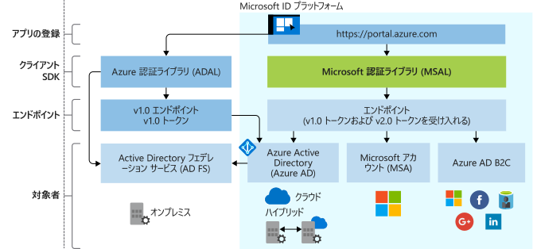

# Microsoft ID プラットフォームの進化

Microsoft ID プラットフォームは、Azure Active Directory (Azure AD) 開発者プラットフォームの進化版です。 これにより、ユーザーをサインインし、Microsoft API (Microsoft Graph) や開発者が構築した API を呼び出すためのトークンを取得するアプリケーションを開発者がビルドできます。 これは、認証サービス、オープン ソース ライブラリ、(開発者ポータルとアプリケーション API による) アプリケーションの登録と構成、完全な開発者向けドキュメント、クイックスタート サンプル、コード サンプル、チュートリアル、ハウツー ガイド、その他の開発者向けコンテンツによって構成されています。 Microsoft ID プラットフォームでは、OAuth 2.0 や OpenID Connect など業界標準のプロトコルがサポートされています。

これまで、ほとんどの開発者は Azure AD v1.0 プラットフォームを使用して (Azure AD によりプロビジョニングされる) 職場や学校のアカウントを認証してきました。これは、Azure AD Authentication Library (ADAL)、アプリケーションの登録と構成用の Azure portal、プログラムによるアプリケーション構成用の Azure AD Graph API を使用して、Azure AD v1.0 エンドポイントからトークンを要求することによって行われていました。

Microsoft ID プラットフォーム (v2.0) を使用すれば、次のような種類のユーザーにも利用してもらうことができます。

- 職場または学校のアカウント (Azure AD によりプロビジョニングされるアカウント)
- 個人アカウント (Outlook.com や Hotmail.com など)
- Azure AD B2C サービスから自分のメールやソーシャル ID (LinkedIn、Facebook、Google など) を持ち込むカスタマー

統合 Microsoft ID プラットフォームを使用すると、コードを一回記述すれば、自分のアプリケーションで Microsoft のあらゆる ID を認証できます。 一部のプラットフォーム向けに、Microsoft Authentication Library (MSAL) という、完全にサポートされているオープンソースのライブラリがあります。 MSAL は簡単に使えて、ユーザーに優れたシングル サインオン (SSO) 機能を提供します。開発者は Microsoft Secure Development Lifecycle (SDL) を使用して開発し、高い信頼性とパフォーマンスを実現できます。 API を呼び出すとき、増分同意を活用するようにアプリケーションを構成できます。これにより、実行時にアプリケーションの使用がこれを保証するまで、同意要求をより侵略的な範囲で遅延させることができます。

Azure portal を使用してアプリケーションを登録し、構成したり、プログラミングによるアプリケーションの構成に Microsoft Graph API を使用したりできます。

自分のペースでアプリケーションを更新します。 ADAL ライブラリでビルドされたアプリケーションは引き続きサポートされます。 ADAL ライブラリでビルドされたアプリケーションと MSAL ライブラリでビルドされたアプリケーションから構成される混在アプリケーション ポートフォリオもサポートされます。 つまり、最新の ADAL と最新の MSAL を利用するアプリケーションは、これらのライブラリ間で共有トークン キャッシュにより、ポートフォリオをまたいで SSO を提供します。 ADAL から MSAL に更新されたアプリケーションは、アップグレード時、ユーザーのサインイン状態を維持します。

## Microsoft ID プラットフォーム エクスペリエンス

次の図は、アプリ登録エクスペリエンス、SDK、エンドポイント、サポートされている ID など、高レベルでの Microsoft ID エクスペリエンスを示しています。

### アプリの登録エクスペリエンス

Azure portal **[アプリの登録](https://go.microsoft.com/fwlink/?linkid=2083908)** エクスペリエンスでは、Microsoft ID プラットフォームと統合したすべてのアプリケーションを 1 つのポータルで管理します。 アプリケーション登録ポータルを使用した場合、代わりに Azure portal アプリの登録エクスペリエンスを最初に使用して開始します。

(ソーシャルまたはローカル ID を認証するとき) Azure AD B2C との統合の場合、B2C テナントにアプリケーションを登録する必要があります。 このエクスペリエンスも Azure portal の一部です。

**Microsoft Graph のアプリケーション API** は現在、プレビュー段階です。 この API を使用し、Microsoft のあらゆる ID を認証するよう、Microsoft ID プラットフォームと統合されたアプリケーションをプログラミングで構成します。 ただし、この API の一般利用が始まるまで、Azure AD Graph 1.6 API とアプリケーション マニフェストを使用する必要があります。

### MSAL ライブラリ

MSAL ライブラリを使用し、すべての Microsoft ID を認証するアプリケーションをビルドできます。 .NET と JavaScript の MSAL ライブラリは一般提供されています。 iOS と Android の MSAL ライブラリはプレビュー段階であり、運用環境での使用に適しています。 プレビュー段階の MSAL ライブラリには一般公開されているバージョンの MSAL と ADAL と同じ運用レベルのサポートを提供しています。

MSAL ライブラリを利用し、アプリケーションを Azure AD B2C と統合することもできます。

Web アプリと Web API を構築するための次のサーバー側ライブラリが一般公開されています。[ASP.NET](https://docs.microsoft.com/aspnet/overview) と [ASP.NET Core](https://docs.microsoft.com/aspnet/core/?view=aspnetcore-2.2)

### Microsoft ID プラットフォーム エンドポイント

Microsoft ID プラットフォーム (v2.0) エンドポイントが OIDC 認定になりました。 Microsoft Authentication Libraries (MSAL) またはその他の標準準拠ライブラリと連動します。 業界標準に準拠し、人間が読めるスコープを実装します。

## 次の手順

v1.0 および v2.0 に関する詳細。

* [Microsoft ID プラットフォーム (v2.0) の概要](v2-overview.md)
* [開発者向け Azure Active Directory (v1.0) の概要](v1-overview.md)
