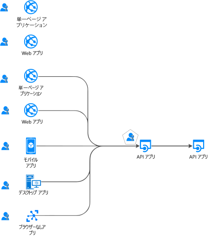
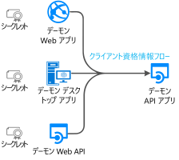

# 認証フローとアプリケーションのシナリオ

Microsoft ID プラットフォーム (v2.0) エンドポイントでは、さまざまな最新アプリ アーキテクチャ向けの認証がサポートされています。そのいずれも、業界標準のプロトコルである [OAuth 2.0 または OpenID Connect](active-directory-v2-protocols.md) に基づいています。  アプリケーションでは、[認証ライブラリ](reference-v2-libraries.md)を使用して、ID が認証され、保護された API にアクセスするためのトークンが取得されます。 この記事では、使用されるさまざまな認証フローとアプリケーションのシナリオについて説明します。  また、この記事では、[アプリケーションのシナリオとサポートされている認証フロー](#scenarios-and-supported-authentication-flows)と[アプリケーションのシナリオと、サポートされているプラットフォームと言語](#scenarios-and-supported-platforms-and-languages)についても説明します。

## アプリケーションのカテゴリ

トークンは、さまざまな種類のアプリケーションから取得できます。ブラウザー (または iOT) がないデバイス上で実行されている Web アプリケーション、モバイル アプリケーション、デスクトップ アプリケーション、Web API、アプリケーション。 アプリケーションは、次のように分類できます。

- [保護されたリソースとクライアント アプリケーション](#protected-resources-vs-client-applications)。 リソース (Web アプリまたは Web API) の保護に関するシナリオと、保護された Web API を呼び出すセキュリティ トークンの取得に関するその他のシナリオがあります。
- [ユーザーありまたはユーザーなし](#with-users-or-without-users)。 サインインしているユーザーが関与するシナリオと、ユーザーが関与しないシナリオ (デーモン シナリオ) があります。
- [シングル ページ アプリケーション、パブリック クライアント アプリケーション、および機密クライアント アプリケーション](#single-page-applications-public-client-applications-and-confidential-client-applications)。 アプリケーションの種類は、これらの 3 つの大きなカテゴリに分類されます。 それらを操作するために使用されるライブラリとオブジェクトは異なります。
- [サインイン対象ユーザー](v2-supported-account-types.md#certain-authentication-flows-dont-support-all-the-account-types) 一部の認証フローは、特定のサインイン対象ユーザーに使用できません。 一部のフローは職場または学校アカウントでのみ使用できます。また、一部のフローは職場または学校アカウントと個人用 Microsoft アカウントの両方で使用できます。 許可される対象ユーザーは、認証フローによって異なります。
- [サポートされている OAuth 2.0 フロー](#scenarios-and-supported-authentication-flows)。  認証フローは、トークンを要求するアプリケーションのシナリオを実装するために使用されます。  アプリケーションのシナリオと認証フローの間に 1 対 1 のマッピングはありません。
- [サポートされているプラットフォーム](#scenarios-and-supported-platforms-and-languages)。 すべてのプラットフォームですべてのアプリケーションのシナリオを使用できるわけではありません。

### 保護されたリソースとクライアント アプリケーション

認証シナリオには、次の 2 つのアクティビティが含まれます。

- 保護された Web API の**セキュリティ トークンの取得**。 Microsoft では、[認証ライブラリ](reference-v2-libraries.md#microsoft-supported-client-libraries)、特に Microsoft 認証ライブラリ ファミリ (MSAL) を使用してトークンを取得することをお勧めします。
- **Web API (または Web アプリ) の保護**。 リソース (Web アプリまたは Web API) の保護に関する課題の 1 つとして、セキュリティ トークンの検証があります。 Microsoft では、一部のプラットフォームで、[ミドルウェア ライブラリ](reference-v2-libraries.md#microsoft-supported-server-middleware-libraries)を提供しています。

### ユーザーありまたはユーザーなし

ほとんどの認証シナリオでは、(サインインした) **ユーザー**の代わりにトークンを取得します。

ただし、(ユーザーなしで) アプリケーションで自身の代わりにトークンを取得するシナリオ (デーモン アプリ) もあります。

### シングル ページ アプリケーション、パブリック クライアント アプリケーション、および機密クライアント アプリケーション。

セキュリティ トークンは、さまざまな種類のアプリケーションから取得できます。 アプリケーションは、次の 3 つのカテゴリに分類される傾向があります。

- **シングル ページ アプリケーション** (SPA) は、ブラウザーで実行されているアプリ (JavaScript または Typescript で記述) からトークンを取得する Web アプリケーションの一種です。 最新アプリの多くには、主に JavaScript で記述されたシングル ページ アプリのフロントエンドがあります。 多くの場合、アプリは Angular、React、Vue などのフレームワークを使用して記述されています。 MSAL.js は、シングル ページ アプリケーションをサポートする唯一の Microsoft 認証ライブラリです。

- **パブリック クライアント アプリケーション**では、ユーザーは常にサインインします。 これらのアプリは次のとおりです。
  - サインインしているユーザーに代わって Web API を呼び出すデスクトップ アプリケーション。
  - モバイル アプリケーション。
  - ブラウザーがないデバイス上で実行されているアプリケーションの 3 つ目のカテゴリ (ブラウザーを使用しないアプリ、たとえば、iOT 上で実行されているもの)。

  これらは、[PublicClientApplication](msal-client-applications.md) という名前の MSAL クラスによって表されます。

- **機密クライアント アプリケーション**
  - Web API を呼び出す Web アプリケーション
  - Web API を呼び出す Web API
  - デーモン アプリケーション (Linux 上のデーモンなどのコンソール サービスや Windows サービスとして実装されている場合もあります)
 
  このような種類のアプリでは [ConfidentialClientApplication](msal-client-applications.md) が使用されます

## アプリケーションのシナリオ

Microsoft ID プラットフォーム エンドポイントは、シングルページ アプリ、Web アプリ、Web API、モバイル アプリ、ネイティブ アプリ、デーモン アプリ、サーバー側アプリなど、さまざまなアプリケーション アーキテクチャの認証をサポートしています。  アプリケーションでは、さまざまな認証フローを使用してユーザーのサインインを行い、トークンを取得して保護された API を呼び出します。

### ユーザーのサインインを行う Web アプリケーションのサインイン

(ユーザーのサインインを行う) **Web アプリを保護する**には、以下を使用します。

- .NET 環境では、ASP.NET Open ID Connect ミドルウェアを使用した ASP.NET または ASP.NET Core。 内部的には、リソースを保護するには、セキュリティ トークンを検証する必要があります。これは 、MSAL ライブラリではなく、[.NET ライブラリ用の IdentityModel 拡張機能](https://github.com/AzureAD/azure-activedirectory-identitymodel-extensions-for-dotnet/wiki)によって行われます。

- Node.js で開発する場合は、Passport.js を使用します。

詳細については、「[ユーザーをサインインさせる Web アプリ](scenario-web-app-sign-user-overview.md)」を参照してください。

### Web アプリケーションのユーザーのサインインとユーザーの代理としての Web API の呼び出し

Web アプリからユーザーに代わって **Web API を呼び出す**には、MSAL `ConfidentialClientApplication` を使用します。 承認コード フローを使用して、取得したトークンをトークン キャッシュに格納します。 次に、コントローラーでは、必要に応じてキャッシュからトークンが自動的に取得されます。 必要に応じて、MSAL によってトークンが更新されます。

詳細については、「[Web API を呼び出す Web アプリ](scenario-web-app-call-api-overview.md)」を参照してください。

### サインイン ユーザーに代わって Web API を呼び出すデスクトップ アプリケーション

ユーザーのサインインを行うデスクトップ アプリケーションから Web API を呼び出すには、MSAL の PublicClientApplication の対話型トークンの取得メソッドを使用します。 これらの対話型メソッドを使用すると、サインイン UI エクスペリエンスを制御できます。 この対話を有効にするために、MSAL では Web ブラウザーが利用されます。

Windows ドメインまたは AAD に参加しているコンピューター上で実行されている Windows ホスト アプリケーションの場合は、別の可能性があります。 [統合 Windows 認証](https://aka.ms/msal-net-iwa)を使用してトークンを自動的に取得できます。

ブラウザーがないデバイス上で実行されているアプリケーションでも、ユーザーに代わって API を呼び出すことができます。 認証するには、ユーザーは Web ブラウザーがある別のデバイス上でサインインする必要があります。 このシナリオを有効にするには、[デバイス コード フロー](https://aka.ms/msal-net-device-code-flow)を使用する必要があります。

最後に、推奨されていませんが、パブリック クライアント アプリケーションでは[ユーザー名/パスワード](https://aka.ms/msal-net-up)を使用することができます。 このフローは、一部のシナリオ (DevOps など) ではまだ必要ですが、それを使用するとアプリケーションに制約が課せされることに注意してください。 たとえば、このフローを使用するアプリでは、多要素認証 (条件付きアクセス) を実行する必要があるユーザーをサインインさせることができません。 アプリケーションでシングル サインオンを利用することもできません。 さらに、先進認証の原則に反しており、これはレガシの理由のためにのみ提供されています。

デスクトップ アプリケーションでトークン キャッシュを永続的にする場合は、[トークン キャッシュのシリアル化をカスタマイズする](https://aka.ms/msal-net-token-cache-serialization)必要があります。 また、[デュアル トークン キャッシュのシリアル化](https://aka.ms/msal-net-dual-cache-serialization)を実装することで、以前の世代の認証ライブラリ (ADAL.NET 3.x および 4.x) との後方および前方の互換性のあるトークン キャッシュを有効にすることもできます。

詳細については、「[Web API を呼び出すデスクトップ アプリ](scenario-desktop-overview.md)」を参照してください。

### 対話式でサインインしたユーザーに代わって Web API を呼び出すモバイル アプリケーション

デスクトップ アプリケーションの場合と同様に、Web API を呼び出すトークンを取得するために、モバイル アプリケーションでは MSAL の PublicClientApplication の対話型トークンの取得メソッドを使用します。 iOS と Android 上の MSAL では、既定で、システム Web ブラウザーを使用します。 ただし、埋め込みの Web ビューを使用するように指示することもできます。 モバイル プラットフォームに応じて、固有のものがあります(UWP、iOS、Android)。
デバイス ID や登録されているデバイスに関連する条件付きアクセスを含め、一部のシナリオでは、デバイス上に[ブローカー](https://github.com/AzureAD/azure-activedirectory-library-for-dotnet/wiki/leveraging-brokers-on-Android-and-iOS)をインストールする必要があります。 ブローカーの例として、Microsoft ポータル サイト (Android 上)、Microsoft Authenticator (Android と iOS) があります。 MSAL は、ブローカーと対話できるようになりました。

> [!NOTE]
> (MSAL.iOS、MSAL.Android、または MSAL.NET/Xamarin を使用している) モバイル アプリには、アプリ保護ポリシーを適用できます (たとえば、保護されているテキストをユーザーがコピーできないようにするなど)。 これは [Intune によって管理され](https://docs.microsoft.com/intune/app-sdk)、Intune でマネージド アプリとして認識されます。 [Intune SDK](https://docs.microsoft.com/intune/app-sdk-get-started) は MSAL ライブラリとは別のものであり、独自に AAD と対話します。

詳細については、「[Web API を呼び出すモバイル アプリ](scenario-mobile-overview.md)」を参照してください。

### 保護された Web API

Microsoft ID プラットフォーム エンドポイントを使用すると、アプリの RESTful Web API などの Web サービスをセキュリティで保護できます。 保護された Web API は、データをセキュリティで保護し、受信要求を認証するために、アクセス トークンを使用して呼び出されます。 Web API の呼び出し元によって、HTTP 要求の承認ヘッダーにアクセス トークンが付加されます。 ASP.NET または ASP.NET Core Web API を保護する場合は、アクセス トークンを検証する必要があります。 この場合は、ASP.NET JWT ミドルウェアを使用します。 内部的には、MSAL.NET ではなく、[.NET ライブラリ用の IdentityModel 拡張機能](https://github.com/AzureAD/azure-activedirectory-identitymodel-extensions-for-dotnet/wiki)によって検証が行われます。

詳細については、「[保護された Web API](scenario-protected-web-api-overview.md)」を参照してください。

### 呼び出されたユーザーに代わって別のダウンストリーム Web API を呼び出す Web API

さらに、ASP.NET または ASP.NET Core で保護された Web API から、ユーザーに代わって別の Web API を呼び出す場合、アプリでは、[ユーザーに代わって](https://aka.ms/msal-net-on-behalf-of)トークンを取得する ConfidentialClientApplication のメソッドを使用してダウンストリームの Web API のトークンを取得する必要があります。 これは、サービスからサービスへの呼び出しとも呼ばれます。
他の Web API を呼び出す Web API でも、カスタム キャッシュのシリアル化を提供する必要があります。

  

詳細については、「[Web API を呼び出す Web API](scenario-web-api-call-api-overview.md)」を参照してください。

### (独自の名前で) ユーザーなしで Web API を呼び出すデスクトップ/サービスまたは Web デーモン アプリケーション

長時間実行されるプロセスを含んだアプリや、ユーザーの介入なしで動作するアプリも、セキュリティで保護された Web API にアクセスする必要があります。 これらのアプリでは、ユーザーの委任された ID ではなく、アプリの ID を使用してトークンを認証および取得できます。 クライアント シークレットまたは証明書を使用して ID が証明されます。
MSAL の ConfidentialClientApplication の[クライアント資格情報](https://aka.ms/msal-net-client-credentials)の取得メソッドを使用して、アプリのトークンを取得するようなアプリ (デーモン アプリ) を作成できます。 このような場合は、アプリが以前にシークレット (アプリケーションのパスワード、証明書、またはクライアント アサーション) を Azure AD に登録していることを想定しています。その後、この呼び出しと共有されます。

## シナリオとサポートされている認証フロー

トークンの取得に関連するシナリオは、「[Microsoft ID プラットフォームのプロトコル](active-directory-v2-protocols.md)」で詳しく説明されている OAuth 2.0 認証フローにもマップされます。

|シナリオ | 詳細なシナリオのチュートリアル | OAuth 2.0 フロー/許可 | 対象ユーザー |
|--|--|--|--|
|  | [シングルページ アプリ](scenario-spa-overview.md) | [暗黙的](v2-oauth2-implicit-grant-flow.md) | 職場または学校アカウントと個人用アカウント、B2C
|  | [ユーザーをサインインさせる Web アプリ](scenario-web-app-sign-user-overview.md) | [承認コード](v2-oauth2-auth-code-flow.md) | 職場または学校アカウントと個人用アカウント、B2C |
|  | [Web API を呼び出す Web アプリ](scenario-web-app-call-api-overview.md) | [承認コード](v2-oauth2-auth-code-flow.md) | 職場または学校アカウントと個人用アカウント、B2C |
|  | [Web API を呼び出すデスクトップ アプリ](scenario-desktop-overview.md)| 対話型 (PKCE を使用した[承認コード](v2-oauth2-auth-code-flow.md)) | 職場または学校アカウントと個人用アカウント、B2C |
| | | 統合 Windows | 職場または学校アカウント |
| | | [リソース所有者のパスワード](v2-oauth-ropc.md)  | 職場または学校アカウント、B2C |
| | [Web API を呼び出すデスクトップ アプリ](scenario-desktop-overview.md) | [デバイス コード](v2-oauth2-device-code.md)  | 職場または学校アカウント* |
|  | [Web API を呼び出すモバイル アプリ](scenario-mobile-overview.md) | 対話型 (PKCE を使用した[承認コード](v2-oauth2-auth-code-flow.md))  |   職場または学校アカウントと個人用アカウント、B2C
| | | リソース所有者のパスワード  | 職場または学校アカウント、B2C |
|  | [デーモン アプリ](scenario-daemon-overview.md) | [クライアントの資格情報](v2-oauth2-client-creds-grant-flow.md)  |   AAD 組織のみでのアプリ専用アクセス許可 (ユーザーなし)
|  | [Web API を呼び出す Web API](scenario-web-api-call-api-overview.md)| [代理](v2-oauth2-on-behalf-of-flow.md) | 職場または学校アカウントと個人用アカウント |

## シナリオとサポートされているプラットフォームと言語

すべてのアプリケーションの種類をすべてのプラットフォームで使用できるわけではありません。 また、さまざまな言語を使用してアプリケーションをビルドすることもできます。 Microsoft 認証ライブラリは、さまざまな**プラットフォーム** (JavaScript、.NET Framework、.NET Core、Windows 10/UWP、Xamarin.iOS、Xamarin.Android、ネイティブ iOS、ネイティブ Android、Java、Python) をサポートしています。

|シナリオ  | Windows | Linux | Mac | iOS | Android
|--|--|--|--|--|--|--|
| [シングルページ アプリ](scenario-spa-overview.md)   |  MSAL.js |  MSAL.js |  MSAL.js |  MSAL.js |  MSAL.js
| [ユーザーをサインインさせる Web アプリ](scenario-web-app-sign-user-overview.md)   |   ASP.NET ASP.NET Core | ASP.NET Core | ASP.NET Core
| [Web API を呼び出す Web アプリ](scenario-web-app-call-api-overview.md)    |    ASP.NET + MSAL.NET   ASP.NET Core + MSAL.NET  msal4j  Flask + MSAL Python| ASP.NET Core + MSAL.NET  msal4j  Flask + MSAL Python| ASP.NET Core + MSAL.NET  msal4j  Flask + MSAL Python
| [Web API を呼び出すデスクトップ アプリ](scenario-desktop-overview.md)     |   MSAL.NET  MSAL.NET  msal4j  MSAL Python| MSAL.NET  msal4j  MSAL Python|  MSAL.NET  msal4j  MSAL Python
| [Web API を呼び出すモバイル アプリ](scenario-mobile-overview.md)    |  MSAL.NET  MSAL.NET | | |  MSAL.iOS |  MSAL.Android
| [デーモン アプリ](scenario-daemon-overview.md)    |  MSAL.NET MSAL.NET  msal4j  MSAL Python|  MSAL.NET  msal4j  MSAL Python| MSAL.NET  msal4j  MSAL Python
| [Web API を呼び出す Web API](scenario-web-api-call-api-overview.md)    |    ASP.NET + MSAL.NET    ASP.NET Core + MSAL.NET|    ASP.NET Core + MSAL.NET|   ASP.NET Core + MSAL.NET

## 次の手順
[認証の基本](authentication-scenarios.md)と[アクセス トークン](access-tokens.md)の詳細を学習します。