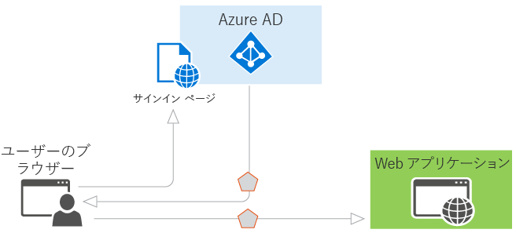

# Azure AD の認証シナリオ

Azure Active Directory (Azure AD) は、OAuth 2.0 や OpenID Connect などの業界標準プロトコルをサポートする Identity as a Service と、コーディングを手軽に開始するうえで役立つ、さまざまなプラットフォーム向けのオープン ソース ライブラリを提供することで、開発者のために認証を簡素化します。 この記事では、Azure AD がサポートするさまざまなシナリオについて説明し、開発を開始する方法を示します。 このドキュメントは次のセクションに分かれています。

* [Azure AD での認証の基本](#basics-of-authentication-in-azure-ad)
* [Azure AD のセキュリティ トークンの要求](#claims-in-azure-ad-security-tokens)
* [Azure AD でのアプリケーションの登録の基本](#basics-of-registering-an-application-in-azure-ad)
* [アプリケーションの種類とシナリオ](#application-types-and-scenarios)

  * [Web ブラウザー対 Web アプリケーション](#web-browser-to-web-application)
  * [シングル ページ アプリケーション (SPA)](#single-page-application-spa)
  * [ネイティブ アプリケーション対 Web API](#native-application-to-web-api)
  * [Web アプリケーション対 Web API](#web-application-to-web-api)
  * [デーモン またはサーバー アプリケーション対 Web API](#daemon-or-server-application-to-web-api)

## Azure AD での認証の基本

Azure AD での認証の基本概念に詳しくない場合は、このセクションをお読みください。 それ以外の場合は、「[アプリケーションの種類とシナリオ](#application-types-and-scenarios)」に進んでください。

ID が必要とされる最も基本的なシナリオについて考えてみましょう。たとえば、Web ブラウザーのユーザーがWeb アプリケーションに対して認証する必要があるとします。 このシナリオは、「[Web ブラウザー対 Web アプリケーション](#web-browser-to-web-application)」で詳しく説明していますが、Azure AD の機能を図で示し、シナリオのしくみを概念化すると、出発点として役立ちます。 このシナリオでは、次の図を考えてみましょう。

上の図を念頭に置いて、さまざまなコンポーネントについて次のことを理解しておく必要があります。

* Azure AD は、組織のディレクトリに存在するユーザーとアプリケーションの ID を確認し、それらのユーザーやアプリケーションの認証が成功したら、最終的にセキュリティ トークンを発行する役割を担う ID プロバイダーです。
* 認証を Azure AD に委託するアプリケーションは、Azure AD に登録する必要があります。Azure AD はアプリケーションをディレクトリに登録し、ディレクトリ内でそのアプリケーションを一意に識別します。
* 開発者は、オープン ソース Azure AD 認証ライブラリを使用して、プロトコルの詳細を処理することで認証を容易にすることができます。 詳細については、「[Azure Active Directory の認証ライブラリ](active-directory-authentication-libraries.md)」を参照してください。
* ユーザーが認証されたら、アプリケーションは認証が成功したことを確認するために、ユーザーのセキュリティ トークンを検証する必要があります。 さまざまな言語とフレームワークでアプリケーションが実行する必要がある処理のサンプルを [GitHub](https://github.com/Azure-Samples?q=active-directory) で公開しています。 ASP.NET で Web アプリを構築している場合は、[ASP.NET Web アプリ ガイドのサインインの追加](https://docs.microsoft.com/azure/active-directory/develop/guidedsetups/active-directory-aspnetwebapp)に関するページを参照してください。 ASP.NET で Web API リソースを構築している場合は、[Web API の概要ガイド](https://docs.microsoft.com/azure/active-directory/develop/active-directory-devquickstarts-webapi-dotnet)に関するページを参照してください。
* 認証プロセスの要求と応答のフローは、使用された認証プロトコル (OAuth 2.0、OpenID Connect、WS-Federation、SAML 2.0 など) によって決まります。 これらのプロトコルの詳細については、「[Azure Active Directory の認証プロトコル](active-directory-authentication-protocols.md)」の記事と以下のセクションを参照してください。

> [!NOTE]
> Azure AD は、ベアラー トークン (JWT で表されるベアラー トークンなど) を広く使用する OAuth 2.0 標準と OpenID Connect 標準をサポートしています。 *ベアラー トークン*は、保護されたリソースへの "ベアラー" アクセスを許可する簡易セキュリティ トークンです。 この意味で、"ベアラー" はトークンを提示できる任意の利用者を表します。 利用者がベアラー トークンを受信するには、まず Azure AD による認証が必要となりますが、転送中や保存時にトークンを保護するために必要な対策を講じていない場合、意図しない利用者によって傍受され、使用されるおそれがあります。 一部のセキュリティ トークンには、許可されていない利用者がトークンを使用できないようにするための組み込みメカニズムがありますが、ベアラー トークンにはこのメカニズムがないため、トランスポート層セキュリティ (HTTPS) などのセキュリティで保護されたチャネルで転送する必要があります。 ベアラー トークンが暗号化されずに転送された場合、悪意のある利用者が中間者攻撃によってトークンを取得し、保護されたリソースへの未承認のアクセスに使用する可能性があります。 後で使用するためにベアラー トークンを保存またはキャッシュするときにも、同じセキュリティ原則が適用されます。 アプリケーションでは、常に安全な方法でベアラー トークンを転送および保存してください。 ベアラー トークンのセキュリティに関する考慮事項の詳細については、 [RFC 6750 セクション 5](http://tools.ietf.org/html/rfc6750)をご覧ください。

基本の説明は以上です。以降のセクションでは、Azure AD でのプロビジョニングのしくみと Azure AD がサポートする一般的なシナリオについて説明します。

## Azure AD のセキュリティ トークンの要求

Azure AD によって発行されるセキュリティ トークン (アクセス トークンと ID トークン) には、要求 (認証済みのサブジェクトに関する情報のアサーション) が含まれています。 これらの要求は、アプリケーションのさまざまなタスクで使用できます。 たとえば、アプリケーションは、トークンの検証、サブジェクトのディレクトリ テナントの識別、ユーザー情報の表示、サブジェクトの承認の決定などに要求を使用できます。 セキュリティ トークンに含まれる要求は、トークンの種類、ユーザーの認証に使用する資格情報の種類、アプリケーションの構成によって異なります。 Azure AD によって生成される各種要求の簡単な説明を次の表に示します。 詳細については、[サポートされているトークンとクレームの種類](v1-id-and-access-tokens.md)に関するページを参照してください。

| 要求 | 説明 |
| --- | --- |
| アプリケーション ID | トークンを使用しているアプリケーションを識別します。 |
| 対象ユーザー | トークンの対象である受信者のリソースを識別します。 |
| アプリケーションの認証コンテキスト クラスの参照 | クライアントが認証された方法 (パブリック クライアントまたは秘密のクライアント) を示します。 |
| 認証のインスタント | 認証が行われた日時を記録します。 |
| 認証方法 | トークンのサブジェクトが認証された方法 (パスワード、証明書など) を示します。 |
| 名 | Azure AD で設定されたユーザーの名を提供します。 |
| グループ | ユーザーがメンバーとして属する Azure AD グループのオブジェクト ID が含まれます。 |
| ID プロバイダー | トークンのサブジェクトを認証した ID プロバイダーを記録します。 |
| 発行時刻 | トークンが発行された時刻を記録します。多くの場合、トークンの鮮度を表すために使用されます。 |
| 発行者 | トークンを発行した STS と Azure AD テナントを識別します。 |
| 姓 | Azure AD で設定されたユーザーの姓を提供します。 |
| Name | トークンのサブジェクトを識別する、人が判読できる値を提供します。 |
| オブジェクト ID | Azure AD 内のサブジェクトの変更できない一意の識別子が含まれます。 |
| ロール | ユーザーに付与されている Azure AD アプリケーション ロールのフレンドリ名が含まれます。 |
| Scope (スコープ) | クライアント アプリケーションに付与されるアクセス許可を示します。 |
| Subject | トークンが情報をアサートするプリンシパルを示します。 |
| テナント ID | トークンを発行したディレクトリ テナントの変更できない一意の識別子が含まれます。 |
| トークンの有効期間 | トークンが有効である期間を定義します。 |
| ユーザー プリンシパル名 | サブジェクトのユーザー プリンシパル名が含まれます。 |
| Version | トークンのバージョン番号が含まれます。 |

## Azure AD でのアプリケーションの登録の基本

Azure AD に認証を委託するすべてのアプリケーションを、ディレクトリに登録する必要があります。 この手順では、アプリケーションが配置されている URL、認証後の応答の送信先の URL、アプリケーションを識別する URI など、アプリケーションに関する情報を Azure AD に伝える必要があります。 この情報が必要となる主な理由は次のとおりです。

* Azure AD は、サインオンの処理時やトークンの交換時にアプリケーションと通信する必要があります。 Azure AD とアプリケーションの間では、次のような情報が渡されます。
  
  * **アプリケーション ID の URI** - アプリケーションの識別子です。 この値は、呼び出し元がどのアプリケーションのトークンを要求しているのかを示すために、認証時に Azure AD に送信されます。 また、この値は、意図したターゲットであったことをアプリケーションがわかるようにトークンにも含まれます。
  * **応答 URL** と**リダイレクト URI** - Web API または Web アプリケーションの場合、応答 URL は Azure AD が認証の応答 (認証が成功した場合のトークンなど) を送信する場所です。 ネイティブ アプリケーションの場合、リダイレクト URI は、Azure AD が OAuth 2.0 要求でユーザー エージェントをリダイレクトする宛先の一意の識別子です。
  * **アプリケーション ID** - アプリケーションの登録時に Azure AD によって生成されるアプリケーションの ID です。 承認コードまたはトークンを要求すると、認証時にアプリケーション ID とキーが Azure AD に送信されます。
  * **キー** - Web API を呼び出すために Azure AD に対して認証するときに、アプリケーション ID と共に送信されるキーです。
* Azure AD は、アプリケーションに、ディレクトリ データや組織の他のアプリケーションなどにアクセスするために必要な権限があることを保証する必要があります。

開発し、Azure AD と統合できるアプリケーションには 2 つのカテゴリがあることを理解しておくと、プロビジョニングが明確になります。

* **シングル テナント アプリケーション** - シングル テナント アプリケーションは、1 つの組織で使用することを目的としています。 通常、これらはエンタープライズ開発者によって作成された基幹業務 (LOB) アプリケーションです。 シングル テナント アプリケーションには、1 つのディレクトリ内のユーザーだけがアクセスできればよいため、1 つのディレクトリにプロビジョニングするだけで済みます。 一般に、これらのアプリケーションは組織の開発者が登録します。
* **マルチテナント アプリケーション** - マルチテナント アプリケーションは、1 つの組織ではなく、多数の組織で使用することを目的としています。 通常、これらは独立系ソフトウェア ベンダー (ISV) によって作成された SaaS (サービスとしてのソフトウェア) アプリケーションです。 マルチテナント アプリケーションは、アプリケーションが使用される各ディレクトリにプロビジョニングする必要があります。アプリケーションを登録するには、ユーザーまたは管理者の同意が必要です。 この同意プロセスは、アプリケーションをディレクトリに登録し、Graph API または別の Web API へのアクセス権を付与するときに開始されます。 別の組織のユーザーまたは管理者がアプリケーションを使用するためにサインアップすると、アプリケーションに必要なアクセス許可を示すダイアログが表示されます。 ユーザーまたは管理者がアプリケーションに同意すると、アプリケーションは定められたデータへのアクセスが許可され、最終的にディレクトリに登録されます。 詳細については、「[同意フレームワークの概要](quickstart-v1-integrate-apps-with-azure-ad.md#overview-of-the-consent-framework)」をご覧ください。

### シングル テナント アプリまたはマルチテナント アプリを開発する場合のその他の考慮事項
シングル テナント アプリケーションではなく、マルチテナント アプリケーションを開発する場合は考慮事項が増えます。 たとえば、複数のディレクトリ内のユーザーがアプリケーションを使用できるようにする場合、ユーザーが属するテナントを特定するメカニズムが必要です。 シングル テナント アプリケーションでは、独自のディレクトリでユーザーを探すだけで済みますが、マルチテナント アプリケーションでは、Azure AD のすべてのディレクトリから特定のユーザーを識別する必要があります。 このタスクを実行するために、Azure AD には、テナント固有のエンドポイントの代わりに、マルチテナント アプリケーションがサインイン要求を送信できる共通の認証エンドポイントが用意されています。 このエンドポイントは Azure AD のすべてのディレクトリで https://login.microsoftonline.com/common ですが、テナント固有のエンドポイントは https://login.microsoftonline.com/contoso.onmicrosoft.com の場合があります。 サインイン、サインアウト、およびトークンの検証時に複数のテナントに対応するためのロジックが必要となるため、アプリケーションを開発するときは、共通のエンドポイントを考慮することが特に重要です。

シングル テナント アプリケーションを現在開発中であり、そのアプリケーションを多数の組織で使用できるようにしたい場合は、マルチテナントに対応できるように、アプリケーションとその構成を Azure AD で簡単に変更できます。 また、Azure AD では、シングル テナント アプリケーションとマルチテナント アプリケーションのどちらで認証を提供するかに関係なく、すべてのディレクトリですべてのトークンに同じ署名キーを使用します。

このドキュメントに記載されている各シナリオには、プロビジョニングの要件を説明するサブセクションが含まれています。 Azure AD でのアプリケーションのプロビジョニング、およびシングル テナント アプリケーションとマルチテナント アプリケーションの違いの詳細については、「[Azure Active Directory とアプリケーションの統合](quickstart-v1-integrate-apps-with-azure-ad.md)」を参照してください。 Azure AD の共通のアプリケーション シナリオを理解するために、このドキュメントを引き続きお読みください。

## アプリケーションの種類とシナリオ

このドキュメントに記載されている各シナリオは、さまざまな言語とプラットフォームを使用して開発できます。 [コード サンプル ガイド](sample-v1-code.md)に各シナリオの完全なコード サンプルが用意されています。また、対応する [GitHub サンプル リポジトリ](https://github.com/Azure-Samples?q=active-directory)から直接入手することもできます。 また、アプリケーションでエンド ツー エンドのシナリオの特定の部分やセグメントが必要なときには、ほとんどの場合、その機能を個別に追加できます。 たとえば、Web API を呼び出すネイティブ アプリケーションがある場合、その Web API も呼び出す Web アプリケーションを簡単に追加できます。 次の図は、これらのシナリオとアプリケーションの種類、およびさまざまなコンポーネントを追加する方法を示しています。

Azure AD でサポートされる 5 つの主要なアプリケーション シナリオは、次のとおりです。

* [Web ブラウザー対 Web アプリケーション](#web-browser-to-web-application): ユーザーは、Azure AD によって保護された Web アプリケーションにサインインする必要があります。
* [シングル ページ アプリケーション (SPA)](#single-page-application-spa): ユーザーは、Azure AD によって保護されたシングル ページ アプリケーションにサインインする必要があります。
* [ネイティブ アプリケーション対 Web API](#native-application-to-web-api): スマートフォン、タブレット、または PC で実行されるネイティブ アプリケーションは、Azure AD によって保護された Web API からリソースを取得するために、ユーザーを認証する必要があります。
* [Web アプリケーション対 Web API](#web-application-to-web-api): Web アプリケーションは、Azure AD によって保護された Web API からリソースを取得する必要があります。
* [デーモンまたはサーバー アプリケーション対 Web API](#daemon-or-server-application-to-web-api): Web ユーザー インターフェイスを備えていないデーモン アプリケーションまたはサーバー アプリケーションは、Azure AD によって保護された Web API からリソースを取得する必要があります。

### Web ブラウザー対 Web アプリケーション

このセクションでは、Web ブラウザーのユーザーを Web アプリケーションに対して認証するアプリケーションについて説明します。 このシナリオでは、Web アプリケーションが、ユーザーを Azure AD にサインインさせるよう、ユーザーのブラウザーに指示します。 Azure AD は、ユーザーのブラウザーを介してサインイン応答を返します。この応答のセキュリティ トークンには、ユーザーに関する要求が含まれています。 このシナリオは、WS-Federation、SAML 2.0、OpenID Connect の各プロトコルを使用したサインオンをサポートします。

#### ダイアグラム

#### プロトコル フローの説明

1. ユーザーがアプリケーションにアクセスしたときに、サインインする必要がある場合、サインイン要求によって Azure AD の認証エンドポイントにリダイレクトされます。
1. ユーザーがサインイン ページでサインインします。
1. 認証が成功すると、Azure AD は認証トークンを作成し、Azure Portal で構成されたアプリケーションの応答 URL にサインイン応答を返します。 実稼働アプリケーションでは、この応答 URL は HTTPS である必要があります。 返されたトークンには、トークンを検証するためにアプリケーションが必要とする、ユーザーと Azure AD に関する要求が含まれています。
1. アプリケーションは、Azure AD のフェデレーション メタデータ ドキュメントで入手できる公開署名キーと発行者情報を使用してトークンを検証します。 アプリケーションでのトークンの検証後に、ユーザーとの新しいセッションが開始されます。 このセッションにより、ユーザーはセッションの有効期限が切れるまでアプリケーションにアクセスできます。

#### コード サンプル

Web ブラウザー対 Web アプリケーションのシナリオのコード サンプルをご覧ください。 新しいサンプルが頻繁に追加されているので、頻繁に確認してください。 [Web アプリケーション](sample-v1-code.md#web-applications)。

#### 登録

* シングル テナント: 自分の組織だけが使用するアプリケーションを構築している場合は、Azure Portal を使用して、アプリケーションを会社のディレクトリに登録する必要があります。
* マルチテナント: 組織の外部のユーザーが使用できるアプリケーションを構築している場合は、アプリケーションを会社のディレクトリに登録するだけでなく、そのアプリケーションを使用する各組織のディレクトリにも登録する必要があります。 ディレクトリ内でアプリケーションを使用できるようにするには、ユーザーがアプリケーションに同意できるようにするためのサインアップ プロセスを含めます。 ユーザーがアプリケーションにサインアップするときに、アプリケーションが必要とするアクセス許可と同意オプションを示すダイアログが表示されます。 必要なアクセス許可によっては、他の組織の管理者が同意することが必要な場合があります。 ユーザーまたは管理者が同意すると、アプリケーションがディレクトリに登録されます。 詳細については、「 [Azure Active Directory とアプリケーションの統合](quickstart-v1-integrate-apps-with-azure-ad.md)」を参照してください。

#### トークンの有効期限

Azure AD によって発行されたトークンの有効期間が終了すると、ユーザーのセッションの有効期限が切れます。 アプリケーションは、アイドル状態の時間に基づくユーザーのサインアウトなど、必要に応じてこの期間を短縮できます。 セッションの有効期限が切れると、ユーザーは再度サインインするよう求められます。

### シングル ページ アプリケーション (SPA)

このセクションでは、Azure AD および OAuth 2.0 の暗黙的な認証付与を使用して Web API バックエンドを保護するシングル ページ アプリケーションの認証について説明します。 一般に、シングル ページ アプリケーションは、ブラウザーで動作する JavaScript プレゼンテーション層 (フロントエンド) と、サーバー上で動作し、アプリケーションのビジネス ロジックを実装する Web API バックエンドとして構築されます。 暗黙的な認証付与の詳細と、この機能がご使用のアプリケーション シナリオに適しているかどうかについては、「 [Azure Active Directory での OAuth2 の暗黙的な許可フローについて](v1-oauth2-implicit-grant-flow.md)」を参照してください。

このシナリオでは、ユーザーがサインインすると、JavaScript フロントエンドが [Active Directory Authentication Library for JavaScript (ADAL.JS)](https://github.com/AzureAD/azure-activedirectory-library-for-js) と暗黙的な認証付与を使用して、Azure AD から ID トークン (id_token) を取得します。 トークンがキャッシュされ、クライアントは、OWIN ミドルウェアを使用して保護された Web API バックエンドを呼び出すときに、トークンをベアラー トークンとして要求に添付します。 

#### ダイアグラム

#### プロトコル フローの説明

1. ユーザーが Web アプリケーションに移動します。
1. アプリケーションが JavaScript フロントエンド (プレゼンテーション層) をブラウザーに返します。
1. ユーザーが、たとえばサインイン リンクをクリックして、サインインを開始します。 ブラウザーが Azure AD 認証エンドポイントに GET を送信して ID トークンを要求します。 この要求では、クエリ パラメーターにアプリケーション ID と応答 URL が含まれています。
1. Azure AD が、Azure Portal で構成された登録済みの応答 URL と照合して応答 URL を検証します。
1. ユーザーがサインイン ページでサインインします。
1. 認証が成功すると、Azure AD が ID トークンを作成し、URL フラグメント (#) としてアプリケーションの応答 URL に返します。 実稼働アプリケーションでは、この応答 URL は HTTPS である必要があります。 返されたトークンには、トークンを検証するためにアプリケーションが必要とする、ユーザーと Azure AD に関する要求が含まれています。
1. ブラウザーで実行されている JavaScript クライアント コードが、アプリケーションの Web API バックエンドの呼び出しの保護に使用するために、トークンを応答から抽出します。
1. ブラウザーが承認ヘッダーに ID トークンを含めて、アプリケーションの Web API バックエンドを呼び出します。 Azure AD 認証サービスは、リソースがクライアント ID と同じである場合、ベアラー トークンとして使用できる ID トークンを発行します (この場合、Web API がアプリ自身のバックエンドであるため、これが該当します)。 

#### コード サンプル

シングル ページ アプリケーション (SPA) のシナリオのコード サンプルをご覧ください。 新しいサンプルが頻繁に追加されているので、頻繁に確認してください。 [シングル ページ アプリケーション (SPA)](sample-v1-code.md#single-page-applications)

#### 登録

* シングル テナント: 自分の組織だけが使用するアプリケーションを構築している場合は、Azure Portal を使用して、アプリケーションを会社のディレクトリに登録する必要があります。
* マルチテナント: 組織の外部のユーザーが使用できるアプリケーションを構築している場合は、アプリケーションを会社のディレクトリに登録するだけでなく、そのアプリケーションを使用する各組織のディレクトリにも登録する必要があります。 ディレクトリ内でアプリケーションを使用できるようにするには、ユーザーがアプリケーションに同意できるようにするためのサインアップ プロセスを含めます。 ユーザーがアプリケーションにサインアップするときに、アプリケーションが必要とするアクセス許可と同意オプションを示すダイアログが表示されます。 必要なアクセス許可によっては、他の組織の管理者が同意することが必要な場合があります。 ユーザーまたは管理者が同意すると、アプリケーションがディレクトリに登録されます。 詳細については、「 [Azure Active Directory とアプリケーションの統合](quickstart-v1-integrate-apps-with-azure-ad.md)」を参照してください。

アプリケーションの登録後、OAuth 2.0 Implicit Grant プロトコルを使用するようにアプリケーションを構成する必要があります。 既定では、このプロトコルはアプリケーションで無効になっています。 アプリケーションで OAuth2 Implicit Grant プロトコルを有効にするには、Azure Portal でそのアプリケーション マニフェストを編集し、"oauth2AllowImplicitFlow" 値を true に設定します。 詳細については、「 [Enabling OAuth 2.0 Implicit Grant for Single Page Applications (シングル ページ アプリケーションでの OAuth 2.0 Implicit Grant の有効化)](quickstart-v1-integrate-apps-with-azure-ad.md)」をご覧ください。

#### トークンの有効期限

ADAL.js を使用すると、以下の場合に役立ちます。

* 期限切れのトークンを更新する
* Web API リソースを呼び出すアクセス トークンを要求する

認証に成功すると、Azure AD はユーザーのブラウザーに Cookie を書き込んでセッションを確立します。 ユーザーと Azure AD の間にセッションが存在することに注意してください (ユーザーと Web アプリケーションの間ではありません)。 トークンの有効期限が切れると、ADAL.js はこのセッションを使用して、ダイアログを表示せずに別のトークンを取得します。 ADAL.js は非表示の iFrame を使用し、OAuth Implicit Grant プロトコルを使用して要求を送受信します。 アプリケーションが呼び出す他の Web API リソースが、クロス オリジン リソース共有 (CORS) をサポートし、ユーザーのディレクトリに登録されており、サインイン時にユーザーから必要な同意を得られていれば、ADAL.js は同じメカニズムを使用して、ダイアログを表示せずに、それらのリソースのアクセス トークンを取得することもできます。

### ネイティブ アプリケーション対 Web API

このセクションでは、ユーザーに代わって Web API を呼び出すネイティブ アプリケーションについて説明します。 このシナリオは、[OAuth 2.0 仕様](http://tools.ietf.org/html/rfc6749)のセクション 4.1 に記載されている、パブリック クライアントを使用した OAuth 2.0 認証コード付与に基づいています。 ネイティブ アプリケーションが、OAuth 2.0 プロトコルを使用してユーザーのアクセス トークンを取得します。 このアクセス トークンが要求で Web API に送信されます。Web API がユーザーを認証し、目的のリソースを返します。

#### ダイアグラム

#### プロトコル フローの説明

AD 認証ライブラリを使用している場合は、ブラウザー ポップアップ、トークンのキャッシュ、更新トークンの処理など、以下で説明するほとんどのプロトコルの詳細が自動的に処理されます。

1. ブラウザー ポップアップを使用して、ネイティブ アプリケーションが Azure AD の認証エンドポイントに要求を送信します。 この要求には、Azure Portal に表示されるネイティブ アプリケーションのアプリケーション ID とリダイレクト URI、および Web API のアプリケーション ID の URI が含まれています。 ユーザーがまだサインインしていない場合は、再度サインインするよう求められます。
1. Azure AD がユーザーを認証します。 これがマルチテナント アプリケーションであり、アプリケーションを使用するために同意が必要な場合、まだ同意していないユーザーは同意を求められます。 同意後、認証が成功すると、Azure AD が認証コード応答を発行して、クライアント アプリケーションのリダイレクト URI に送信します。
1. Azure AD が認証コード応答を発行してリダイレクト URI に送信すると、クライアント アプリケーションはブラウザーの対話を停止し、応答から認証コードを抽出します。 この認証コードを使用して、クライアント アプリケーションは、認証コード、クライアント アプリケーションの詳細 (アプリケーション ID とリダイレクト URI)、目的のリソース (Web API のアプリケーション ID の URI) を要求に含めて Azure AD のトークン エンドポイントに送信します。
1. 認証コードおよびクライアント アプリケーションと Web API に関する情報が Azure AD によって検証されます。 検証が正常に行われると、Azure AD は JWT アクセス トークンと JWT 更新トークンの 2 つのトークンを返します。 また、ユーザーに関する基本情報 (表示名やテナント ID など) も返します。
1. クライアント アプリケーションは、返された JWT アクセス トークンを HTTPS 経由で使用して、Web API への要求の承認ヘッダーに、"Bearer" を指定した JWT 文字列を追加します。 その後、Web API が JWT を検証します。検証が正常に行われると、目的のリソースが返されます。
1. アクセス トークンの有効期限が切れると、クライアント アプリケーションは、ユーザーを再度認証する必要があることを示すエラーを受信します。 アプリケーションが有効な更新トークンを保持している場合は、ユーザーに再度サインインを求めずに、その更新トークンを使用して新しいアクセス トークンを取得できます。 更新トークンの有効期限が切れた場合、アプリケーションは対話形式でユーザーをもう一度認証する必要があります。

> [!NOTE]
> Azure AD によって発行された更新トークンは、複数のリソースへのアクセスに使用できます。 たとえば、2 つの Web API を呼び出す権限を持つクライアント アプリケーションがある場合、更新トークンを使用して、もう 1 つの Web API へのアクセス トークンも取得できます。

#### コード サンプル

ネイティブ アプリケーション対 Web API のシナリオのコード サンプルをご覧ください。 新しいサンプルが頻繁に追加されているので、頻繁に確認してください。 [ネイティブ アプリケーション対 Web API](sample-v1-code.md#desktop-and-mobile-public-client-applications-calling-microsoft-graph-or-a-web-api)

#### 登録

* シングル テナント: ネイティブ アプリケーションと Web API の両方を、Azure AD の同じディレクトリに登録する必要があります。 ネイティブ アプリケーションによるリソースへのアクセスを制限するために使用する一連のアクセス許可を公開するように Web API を構成できます。 その後、クライアント アプリケーションで、Azure Portal の [他のアプリケーションに対するアクセス許可] ドロップダウン メニューから目的のアクセス許可を選択します。
* マルチテナント: ネイティブ アプリケーションは、これまで開発者または発行者のディレクトリにのみ登録されていました。 アプリケーションが機能するために必要なアクセス許可を示すようにネイティブ アプリケーションを構成します。 必要なアクセス許可のこのリストは、アプリケーションを組織で使用できるように、発行先ディレクトリ内のユーザーまたは管理者がアプリケーションに同意するときにダイアログに表示されます。 組織内の任意のユーザーが同意できる、ユーザーレベルのアクセス許可だけを必要とするアプリケーションもあれば、 組織内のユーザーは同意できない、管理者レベルのアクセス許可を必要とするアプリケーションもあります。 このレベルのアクセスを必要とするアプリケーションに同意できるのはディレクトリ管理者だけです。 ユーザーまたは管理者が同意すると、Web API だけがディレクトリに登録されます。 詳細については、「 [Azure Active Directory とアプリケーションの統合](quickstart-v1-integrate-apps-with-azure-ad.md)」を参照してください。

#### トークンの有効期限

ネイティブ アプリケーションは、認証コードを使用して JWT アクセス トークンを取得するときに、JWT 更新トークンも受信します。 アクセス トークンの有効期限が切れたときは、ユーザーに再度サインインを要求しなくても、更新トークンを使用してユーザーを再認証できます。 この更新トークンがユーザーの認証に使用されると、新しいアクセス トークンと更新トークンが取得されます。

### Web アプリケーション対 Web API

このセクションでは、Web API からリソースを取得する必要がある Web アプリケーションについて説明します。 このシナリオでは、Web アプリケーションは、認証と Web API の呼び出しに、アプリケーション ID と委任ユーザー ID の 2 種類の ID を使用できます。

*アプリケーション ID* : このシナリオでは OAuth 2.0 クライアント資格情報付与を使用して、アプリケーションとして認証し、Web API にアクセスできます。 アプリケーション ID を使用すると、Web API はユーザーに関する情報を受け取らないので、Web アプリケーションから呼び出されていることだけを検出できます。 アプリケーションがユーザーに関する情報を受け取った場合、その情報はアプリケーション プロトコルによって送信されるので、Azure AD による署名は行われません。 Web API は、Web アプリケーションがユーザーを認証済みであることを信頼します。 そのため、このパターンは信頼されたサブシステムと呼ばれます。

*委任ユーザー ID:* OpenID Connect と、秘密のクライアントを使用した OAuth 2.0 認証コード付与の 2 とおりの方法でシナリオを実行できます。 Web アプリケーションは、ユーザーのアクセス トークンを取得することで、ユーザーが Web アプリケーションに対して正常に認証されたことと、Web アプリケーションが Web API を呼び出すために委任ユーザー ID を取得できたことを Web API に証明します。 このアクセス トークンが要求で Web API に送信されます。Web API がユーザーを認証し、目的のリソースを返します。

#### ダイアグラム

#### プロトコル フローの説明

以下のフローでは、アプリケーション ID と委任ユーザー ID の両方について説明します。 これらの ID の重要な違いは、委任ユーザー ID では、まず承認コードを取得しておかないと、ユーザーがサインインし、Web API にアクセスすることはできない点です。

##### アプリケーション ID と OAuth 2.0 クライアント資格情報付与

1. ユーザーが Web アプリケーションで Azure AD にサインインしています (前述の「 [Web ブラウザー対 Web アプリケーション](#web-browser-to-web-application) 」を参照)。
1. Web アプリケーションは、Web API に対して認証し、目的のリソースを取得できるように、アクセス トークンを取得する必要があります。 Web アプリケーションは、資格情報、アプリケーション ID、Web API のアプリケーション ID の URI を提供して、Azure AD のトークン エンドポイントに要求を送信します。
1. Azure AD がアプリケーションを認証し、Web API の呼び出しに使用する JWT アクセス トークンを返します。
1. Web アプリケーションは、返された JWT アクセス トークンを HTTPS 経由で使用して、Web API への要求の承認ヘッダーに、"Bearer" を指定した JWT 文字列を追加します。 その後、Web API が JWT を検証します。検証が正常に行われると、目的のリソースが返されます。

##### 委任ユーザー ID と OpenID Connect

1. ユーザーが Azure AD を使用して Web アプリケーションにサインインしています (前述の「[Web ブラウザー対 Web アプリケーション](#web-browser-to-web-application)」セクションを参照)。 Web アプリケーションのユーザーは、Web アプリケーションがユーザーに代わって Web API を呼び出すことを許可することにまだ同意していない場合、これに同意する必要があります。 アプリケーションが必要なアクセス許可を表示します。そのいずれかが管理者レベルのアクセス許可の場合、ディレクトリ内の通常のユーザーが同意することはできません。 シングル テナント アプリケーションには、必要なアクセス許可が既にあると考えられるので、この同意プロセスはマルチテナント アプリケーションにのみ適用されます。 ユーザーがサインインしたときに、Web アプリケーションは、ユーザーに関する情報が含まれた ID トークンと、認証コードを受信しています。
1. Azure AD によって発行された認証コードを使用して、Web アプリケーションは、認証コード、クライアント アプリケーションの詳細 (アプリケーション ID とリダイレクト URI)、目的のリソース (Web API のアプリケーション ID の URI) を要求に含めて Azure AD のトークン エンドポイントに送信します。
1. 認証コードおよび Web アプリケーションと Web API に関する情報が Azure AD によって検証されます。 検証が正常に行われると、Azure AD は JWT アクセス トークンと JWT 更新トークンの 2 つのトークンを返します。
1. Web アプリケーションは、返された JWT アクセス トークンを HTTPS 経由で使用して、Web API への要求の承認ヘッダーに、"Bearer" を指定した JWT 文字列を追加します。 その後、Web API が JWT を検証します。検証が正常に行われると、目的のリソースが返されます。

##### 委任ユーザー ID と OAuth 2.0 承認コードの付与

1. ユーザーは、認証メカニズムが Azure AD とは無関係の Web アプリケーションに既にサインインしています。
1. Web アプリケーションは、アクセス トークンを取得するために認証コードを必要とします。そのため、認証の成功後、Web アプリケーションのアプリケーション ID とリダイレクト URI を提供して、Azure AD の認証エンドポイントにブラウザーを介して要求を発行します。 ユーザーが Azure AD にサインインします。
1. Web アプリケーションのユーザーは、Web アプリケーションがユーザーに代わって Web API を呼び出すことを許可することにまだ同意していない場合、これに同意する必要があります。 アプリケーションが必要なアクセス許可を表示します。そのいずれかが管理者レベルのアクセス許可の場合、ディレクトリ内の通常のユーザーが同意することはできません。 この同意は、シングル テナントおよびマルチ テナント アプリケーションに適用されます。 シングル テナントの場合、管理者は、そのユーザーに代わって管理者の同意を実行できます。 これは、[Azure Portal](https://portal.azure.com) で `Grant Permissions` ボタンをクリックして実行します。 
1. ユーザーが同意したら、Web アプリケーションは、アクセス トークンを取得するために必要な認証コードを受信します。
1. Azure AD によって発行された認証コードを使用して、Web アプリケーションは、認証コード、クライアント アプリケーションの詳細 (アプリケーション ID とリダイレクト URI)、目的のリソース (Web API のアプリケーション ID の URI) を要求に含めて Azure AD のトークン エンドポイントに送信します。
1. 認証コードおよび Web アプリケーションと Web API に関する情報が Azure AD によって検証されます。 検証が正常に行われると、Azure AD は JWT アクセス トークンと JWT 更新トークンの 2 つのトークンを返します。
1. Web アプリケーションは、返された JWT アクセス トークンを HTTPS 経由で使用して、Web API への要求の承認ヘッダーに、"Bearer" を指定した JWT 文字列を追加します。 その後、Web API が JWT を検証します。検証が正常に行われると、目的のリソースが返されます。

#### コード サンプル

Web アプリケーション対 Web API のシナリオのコード サンプルをご覧ください。 新しいサンプルが頻繁に追加されているので、頻繁に確認してください。 [Web アプリケーション対 Web API](sample-v1-code.md#web-applications-signing-in-users-calling-microsoft-graph-or-a-web-api-with-the-users-identity)

#### 登録

* シングル テナント: アプリケーション ID と委任ユーザー ID のどちらの場合も、Web アプリケーションと Web API を Azure AD の同じディレクトリに登録する必要があります。 Web アプリケーションによるリソースへのアクセスを制限するために使用する一連のアクセス許可を公開するように Web API を構成できます。 委任ユーザー ID を使用している場合、Web アプリケーションで Azure Portal の [他のアプリケーションに対するアクセス許可] ドロップダウン メニューから目的のアクセス許可を選択する必要があります。 アプリケーション ID を使用している場合、この手順は不要です。
* マルチテナント: まず、アプリケーションが機能するために必要なアクセス許可を示すように、Web アプリケーションを構成します。 必要なアクセス許可のこのリストは、アプリケーションを組織で使用できるように、発行先ディレクトリ内のユーザーまたは管理者がアプリケーションに同意するときにダイアログに表示されます。 組織内の任意のユーザーが同意できる、ユーザーレベルのアクセス許可だけを必要とするアプリケーションもあれば、 組織内のユーザーは同意できない、管理者レベルのアクセス許可を必要とするアプリケーションもあります。 このレベルのアクセスを必要とするアプリケーションに同意できるのはディレクトリ管理者だけです。 ユーザーまたは管理者が同意すると、Web アプリケーションと Web API の両方がディレクトリに登録されます。

#### トークンの有効期限

Web アプリケーションは、認証コードを使用して JWT アクセス トークンを取得するときに、JWT 更新トークンも受信します。 アクセス トークンの有効期限が切れたときは、ユーザーに再度サインインを要求しなくても、更新トークンを使用してユーザーを再認証できます。 この更新トークンがユーザーの認証に使用されると、新しいアクセス トークンと更新トークンが取得されます。

### デーモンまたはサーバー アプリケーション対 Web API

このセクションでは、Web API からリソースを取得する必要があるデーモン アプリケーションとサーバー アプリケーションについて説明します。 このセクションに適用される 2 つのサブシナリオがあります。1 つは、Web API を呼び出す必要があるデーモン アプリケーションのシナリオです。このシナリオは、OAuth 2.0 クライアント資格情報付与に基づいています。もう 1 つは、Web API を呼び出す必要があるサーバー アプリケーション (Web API など) のシナリオです。このシナリオは、OAuth 2.0 On-Behalf-Of ドラフト仕様に基づいています。

デーモン アプリケーションが Web API を呼び出す必要があるシナリオでは、いくつかの点を理解しておくことが重要です。 まず、デーモン アプリケーションでは、ユーザー操作は使用できません。アプリケーションには独自の ID が必要です。 デーモン アプリケーションの例として、バッチ ジョブ (バックグラウンドで実行されているオペレーティング システム サービス) があります。 この種のアプリケーションは、アプリケーション ID を使用し、アプリケーション ID、資格情報 (パスワードまたは証明書)、アプリケーション ID の URI を Azure AD に提示して、アクセス トークンを要求します。 認証が成功したら、デーモンは Azure AD からアクセス トークンを受信します。このアクセス トークンが Web API の呼び出しに使用されます。

サーバー アプリケーションが Web API を呼び出す必要があるシナリオでは、例を使用するとわかりやすくなります。 ユーザーがネイティブ アプリケーションで既に認証されており、このネイティブ アプリケーションが Web API を呼び出す必要があるとします。 Azure AD は、Web API を呼び出すために、JWT アクセス トークンを発行します。 Web API が別のダウンストリーム Web API を呼び出す必要がある場合、Web API は代理フローを使用してユーザーの ID を委任し、第 2 層の Web API に対して認証できます。

#### ダイアグラム

#### プロトコル フローの説明

##### アプリケーション ID と OAuth 2.0 クライアント資格情報付与

1. まず、サーバー アプリケーションは、対話形式のサインオン ダイアログなどのユーザー操作を使用せずに、Azure AD で自身を認証する必要があります。 サーバー アプリケーションは、資格情報、アプリケーション ID、アプリケーション ID の URI を提供して、Azure AD のトークン エンドポイントに要求を送信します。
1. Azure AD がアプリケーションを認証し、Web API の呼び出しに使用する JWT アクセス トークンを返します。
1. Web アプリケーションは、返された JWT アクセス トークンを HTTPS 経由で使用して、Web API への要求の承認ヘッダーに、"Bearer" を指定した JWT 文字列を追加します。 その後、Web API が JWT を検証します。検証が正常に行われると、目的のリソースが返されます。

##### 委任ユーザー ID と OAuth 2.0 On-Behalf-Of ドラフト仕様

次に説明するフローは、ユーザーが別のアプリケーション (ネイティブ アプリケーションなど) で認証されていることと、第 1 層の Web API へのアクセス トークンを取得するためにユーザー ID が使用されたことを前提としています。

1. ネイティブ アプリケーションが、第 1 層の Web API にアクセス トークンを送信します。
1. 第 1 層の Web API が、アプリケーション ID と資格情報、およびユーザーのアクセス トークンを提供して、Azure AD のトークン エンドポイントに要求を送信します。 また、この要求は、Web API が元のユーザーに代わってダウンストリーム Web API を呼び出すために新しいトークンを要求していることを示す、on_behalf_of パラメーターと共に送信されます。
1. Azure AD は、第 1 層の Web API に第 2 層の Web API へのアクセス権限があることを確認し、要求を検証して、第 1 層の Web API に JWT アクセス トークンと JWT 更新トークンを返します。
1. 第 1 層の Web API は、要求の承認ヘッダーにトークン文字列を追加して、第 2 層の Web API を HTTPS 経由で呼び出します。 アクセス トークンと更新トークンが有効であれば、第 1 層の Web API は、第 2 層の Web API を引き続き呼び出すことができます。

#### コード サンプル

デーモン アプリケーションまたはサーバー アプリケーション対 Web API のシナリオのコード サンプルをご覧ください。 新しいサンプルが頻繁に追加されているので、頻繁に確認してください。 [デーモンまたはサーバー アプリケーション対 Web API](sample-v1-code.md#daemon-applications-accessing-web-apis-with-the-applications-identity)

#### 登録

* シングル テナント: アプリケーション ID と委任ユーザー ID のどちらの場合も、デーモン アプリケーションまたは サーバー アプリケーションを Azure AD の同じディレクトリに登録する必要があります。 デーモン アプリケーションまたは サーバー アプリケーションによるリソースへのアクセスを制限するために使用する一連のアクセス許可を公開するように Web API を構成できます。 委任ユーザー ID を使用している場合、サーバー アプリケーションで Azure Portal の [他のアプリケーションに対するアクセス許可] ドロップダウン メニューから目的のアクセス許可を選択する必要があります。 アプリケーション ID を使用している場合、この手順は不要です。
* マルチテナント: アプリケーションが機能するために必要なアクセス許可を示すように、デーモンまたはサーバー アプリケーションを構成します。 必要なアクセス許可のこのリストは、アプリケーションを組織で使用できるように、発行先ディレクトリ内のユーザーまたは管理者がアプリケーションに同意するときにダイアログに表示されます。 組織内の任意のユーザーが同意できる、ユーザーレベルのアクセス許可だけを必要とするアプリケーションもあれば、 組織内のユーザーは同意できない、管理者レベルのアクセス許可を必要とするアプリケーションもあります。 このレベルのアクセスを必要とするアプリケーションに同意できるのはディレクトリ管理者だけです。 ユーザーまたは管理者が同意すると、両方の Web API がディレクトリに登録されます。

#### トークンの有効期限

最初のアプリケーションは、認証コードを使用して JWT アクセス トークンを取得するときに、JWT 更新トークンも受信します。 アクセス トークンの有効期限が切れたときは、資格情報を要求しなくても、更新トークンを使用してユーザーを再認証できます。 この更新トークンがユーザーの認証に使用されると、新しいアクセス トークンと更新トークンが取得されます。

## 関連項目

[Azure Active Directory 開発者ガイド](azure-ad-developers-guide.md)

[Azure Active Directory のコード例](sample-v1-code.md)

[Azure AD での署名キーのロールオーバーに関する重要な情報](active-directory-signing-key-rollover.md)

[Azure AD での OAuth 2.0](https://msdn.microsoft.com/library/azure/dn645545.aspx)
