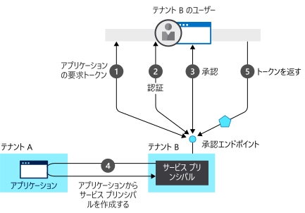

# 認証の基本

## 認証とは

この記事では、保護された Web アプリ、Web API、または保護された Web API を呼び出すアプリを作成するために理解する必要がある認証の概念の多くについて説明します。 よく知らない用語がある場合は、(glossary)[developer-glossary.md] をお試しください。

**認証**は、ユーザーが身元を証明するプロセスです。 認証は AuthN と短縮される場合があります。

**承認**は、認証された利用者に対し、何かを実行する権限を付与する行為です。 アクセスが許可されるデータと、そのデータで実行できる操作を指定します。 承認は AuthZ と短縮される場合があります。

それぞれ独自のユーザー名とパスワードの情報を保持するアプリを作成する (これにより、複数のアプリにまたがってユーザーを追加または削除する必要があるときに管理上の負担が大きくなります) 代わりに、アプリで、一元化された ID プロバイダーに責任を委任することができます。

Azure Active Directory (Azure AD) は、クラウド内の一元化された ID プロバイダーです。 認証と承認を委任することにより、ユーザーが特定の場所にいることを要求する条件付きアクセス ポリシー、多要素認証の使用のほか、ユーザーが 1 回サインインすると、同じ一元化されたディレクトリを共有するすべての Web アプリに自動的にサインインできるようにするなどのシナリオを実現できます。 この機能は、シングル サインオン (SSO) と呼ばれます。

一元化された ID プロバイダーは、ユーザーが世界中にいて、企業のネットワークから必ずしもサインインするわけではないアプリにとってさらに重要です。 Azure AD では、ユーザーが認証され、アクセス トークンが提供されます。 [アクセス トークン](https://docs.microsoft.com/azure/active-directory/develop/developer-glossary#access-token)は、承認サーバーから発行されるセキュリティ トークンです。 トークンの対象となるユーザーとアプリに関する情報が含まれ、Web API やその他の保護されたリソースにアクセスするために使用できます。

Microsoft ID プラットフォームでは、Identity as a Service を提供することでアプリケーション開発者による認証を容易にしています。また、コーディングをすばやく開始できるように、[OAuth 2.0](https://oauth.net/2/) や [OpenID Connect](https://openid.net/connect/) などの業界標準プロトコルや、さまざまなプラットフォーム向けのオープン ソース ライブラリをサポートしています。 そのため、開発者はすべての Microsoft ID にサインインし、[Microsoft Graph](https://developer.microsoft.com/graph/)、その他の Microsoft API、または開発者が作成した API を呼び出すトークンを取得できます。 詳細については、「[Microsoft ID プラットフォームの進化](about-microsoft-identity-platform.md)」を参照してください。

### テナント

クラウド ID プロバイダーでは、数多くの組織にサービスが提供されます。 異なる組織のユーザーを分けるために、Azure AD はテナントに分割され、組織ごとに 1 つのテナントがあります。

テナントでは、ユーザーとその関連アプリが追跡されます。 Microsoft ID プラットフォームでは、個人の Microsoft アカウントでサインインするユーザーもサポートしています。

また、Azure AD では、組織がユーザー (通常は、Google アカウントなどのソーシャル ID を使用するお客様) をサインインさせることができるように、Azure Active Directory B2C も提供しています。 詳細については、[Azure Active Directory B2C のドキュメント](https://docs.microsoft.com/azure/active-directory-b2c)に関するページを参照してください。

### セキュリティ トークン

セキュリティ トークンには、ユーザーとアプリに関する情報が含まれます。 Azure AD で使用される JSON ベースのトークン (JWT) に要求が含まれます。

要求では、一方のエンティティ ([クライアント アプリケーション](https://docs.microsoft.com/azure/active-directory/develop/developer-glossary#client-application)、[リソース所有者](https://docs.microsoft.com/azure/active-directory/develop/developer-glossary#resource-owner)など) に関するアサーションが、もう一方のエンティティ ([リソース サーバー](https://docs.microsoft.com/azure/active-directory/develop/developer-glossary#resource-server)など) に渡されます。

要求は、トークンのサブジェクトに関する事実を伝達する名前と値のペアです。 たとえば、要求には、[承認サーバー](https://docs.microsoft.com/azure/active-directory/develop/developer-glossary#authorization-server)によって認証されたセキュリティ プリンシパルに関する事実が含まれることがあります。 特定のトークン内にある要求は、多くの要素 (トークンの種類、サブジェクトの認証に使用された資格情報の種類、アプリケーション構成など) に依存します。

アプリケーションでは、次のようなさまざまなタスクの要求を使用できます。

* トークンを検証する
* トークン サブジェクトのテナントを識別する
* ユーザー情報を表示する
* サブジェクトの承認を判断する

要求は、次のような情報を提供するキーと値のペアで構成されます。

* トークンを生成したセキュリティ トークン サーバー
* トークンが生成された日付
* サブジェクト (ユーザーなど、デーモンを除く)
* 対象ユーザー。トークンが生成されたアプリです
* トークンを要求したアプリ (クライアント)。 Web アプリの場合、これは対象ユーザーと同じである可能性があります

要求の詳細については、[アクセス トークン](access-tokens.md)と[ ID トークン](id-tokens.md)に関する記事を参照してください。

トークンを検証するには、トークンが生成されたアプリ、ユーザーをサインインさせた Web アプリ、または呼び出される Web API が必要です。 トークンは、秘密キーを使用してセキュリティ トークン サーバー (STS) によって署名されます。 STS により、対応する公開キーが発行されます。 トークンを検証するには、アプリでは、秘密キーを使用して署名が作成されたことを検証するために、STS 公開キーを使用して署名が検証されます。

トークンが有効な時間は限られています。 通常、STS では、アプリケーションまたは保護されたリソースにアクセスするためのアクセス トークンと、アクセス トークンの有効期限が近づいたときにアクセス トークンを更新するために使用する更新トークンの 2 つのトークンが提供されます。

アクセス トークンは、`Authorization` ヘッダーのベアラー トークンとして Web API に渡されます。 アプリでは、STS に更新トークンを提供できます。アプリへのユーザー アクセスが取り消されていない場合、新しいアクセス トークンと新しい更新トークンが返されます。 ユーザーが退職する場合、この方法を使用して対処します。 ユーザーが承認されなくなると、STS で更新トークンを受け取っても、有効なアクセス トークンは新たに発行されません。

## アプリケーション モデル

アプリケーションでは、ユーザー自身をサインインさせることも、ID プロバイダーにサインインを委任することもできます。 Azure AD でサポートされるサインイン シナリオの詳細については、「[認証フローとアプリケーションのシナリオ](authentication-flows-app-scenarios.md)」を参照してください。

ID プロバイダーで、ユーザーが特定のアプリにアクセスできることを認識するためには、ユーザーとアプリケーションの両方を ID プロバイダーに登録する必要があります。 アプリケーションを Azure AD に登録するとき、アプリケーションの ID 構成を提供します。これによって Azure AD との連携が可能となります。 アプリを登録すると、次のことも可能になります。

* サインイン ダイアログ内で、アプリケーションのブランド化をカスタマイズします。 これは、ユーザーがアプリを初めて使用するときに目にするため重要です。
* ユーザーが組織に属している場合にのみサインインできるようにするかどうかを決定します。 これはシングル テナント アプリケーションです。 または、ユーザーが職場または学校のアカウントを使用してサインインできるようにします。 これはマルチ テナント アプリケーションです。 また、個人の Microsoft アカウントや、LinkedIn、Google などのソーシャル アカウントを許可することもできます。
* スコープのアクセス許可を要求します。 たとえば、サインインしたユーザーのプロファイルを読み取るためのアクセス許可を付与する "user. read" スコープを要求できます。
* Web API へのアクセスを定義するスコープを定義します。 通常、アプリで API にアクセスする場合、定義したスコープへのアクセス許可を要求する必要があります。
* Azure AD にアプリの ID を証明するシークレットを Azure AD と共有します。  これは、アプリが機密クライアント アプリケーションである場合に関連します。 機密クライアント アプリケーションは、資格情報を安全に保持できるアプリケーションです。 資格情報を格納するには、信頼されたバックエンド サーバーが必要です。

アプリケーションが登録されると、トークンの要求時にアプリによって Azure AD と共有される一意の ID が付与されます。 アプリが[機密クライアント アプリケーション](https://docs.microsoft.com/azure/active-directory/develop/developer-glossary#client-application)である場合は、証明書またはシークレットが使用されたかどうかに応じて、秘密キーまたは公開キー*も共有されます。

Microsoft ID プラットフォームは、次の 2 つの主な機能を果たすモデルを使用するアプリケーションを表します。

* サポートされる認証プロトコルによって、アプリを識別する
* 認証に必要なすべての識別子、URL、シークレット、および関連情報を指定する

Microsoft ID プラットフォームでは、以下が行われます。

* 実行時に認証をサポートするために必要なすべてのデータを保持します
* 状況次第でアプリからアクセスする必要があるリソースと、特定の要求がどのような状況下で満たされる必要があるかどうかを決定するための、すべてのデータを保持します
* アプリ開発者のテナント内とその他の任意の Azure AD テナントにアプリ プロビジョニングを実装するためのインフラストラクチャを提供します
* トークンの要求時にユーザーの同意を処理し、テナント間でのアプリの動的プロビジョニングを容易にする

同意とは、リソース所有者からクライアント アプリケーションに承認 (リソース所有者に代わって特定の権限で保護されたリソースにアクセスするための) を付与するプロセスです。 Microsoft ID プラットフォームでは、以下が行われます。

* ユーザーと管理者が、その代理としてアプリがリソースにアクセスすることの同意を、動的に付与または拒否できるようにします。
* 管理者が、アプリに許可する操作と特定のアプリを使用できるユーザー、およびディレクトリのリソースにアクセスする方法を、最終的に決定できるようにします。

Microsoft ID プラットフォームでは、[アプリケーション オブジェクト](https://docs.microsoft.com/azure/active-directory/develop/developer-glossary#application-object)によってアプリケーションが記述されます。 デプロイ時に、Microsoft ID プラットフォームではアプリケーション オブジェクトがブループリントとして使用され、ディレクトリまたはテナント内のアプリケーションの具体的なインスタンスを表す[サービス プリンシパル](https://docs.microsoft.com/azure/active-directory/develop/developer-glossary#service-principal-object)が作成されます。 サービス プリンシパルは、特定のターゲット ディレクトリでアプリが実際に何ができるか、誰がそれを使用できるか、どのリソースにアクセスできるのか、などを定義します。 Microsoft ID プラットフォームでは、**同意**により、アプリケーション オブジェクトからサービス プリンシパルが作成されます。

次の図は、同意に基づくシンプルな Microsoft ID プラットフォーム プロビジョニングの流れを示しています。 2 つのテナントが示されています。A と B です。テナント A ではアプリケーションを所有しています。 テナント B は、サービス プリンシパルを使用して、アプリケーションをインスタンス化します。  

このプロビジョニングの流れは次のとおりです。

1. テナント B のユーザーがアプリでサインインしようとすると、承認エンドポイントがアプリケーションのトークンを要求します。
1. 認証のためにユーザーの資格情報が取得および検証されます。
1. ユーザーは、アプリからテナント B にアクセスすることに同意するように求められます。
1. Microsoft ID プラットフォームでは、テナント B にサービス プリンシパルを作成するためのブループリントとして、テナント A のアプリケーション オブジェクトが使用されます。
1. ユーザーは、要求されたトークンを受け取ります。

追加のテナントに対してこのプロセスを繰り返すことができます。 テナント A は、アプリ (アプリケーション オブジェクト) のブループリントを保持します。 アプリに同意が与えられている他のすべてのテナントのユーザーと管理者は、各テナントの対応するサービス プリンシパル オブジェクトから、アプリケーションに許可されている操作を引き続き制御します。 詳細については、[Microsoft ID プラットフォームのアプリケーション オブジェクトとサービス プリンシパル オブジェクト](app-objects-and-service-principals.md)に関するページを参照してください。

## Azure AD を使用した Web アプリのサインイン フロー

ユーザーがブラウザーで Web アプリに移動すると、次のことが起こります。

* Web アプリで、ユーザーが認証されているかどうかが判断されます。
* ユーザーが認証されていない場合は、ユーザーをサインインさせるように Web アプリから Azure AD に委任されます。 そのサインインは、ユーザーに資格情報を入力する、多要素認証を使用する、パスワードをまったく使用しない (Windows Hello を使用するなど) ように求めることを意味する可能性のある組織のポリシーに準拠します。
* ユーザーは、クライアント アプリが必要とするアクセスに同意するように求められます。 これは、ユーザーが同意したアクセスを表すトークンを Azure AD で配信できるように、クライアント アプリを Azure AD に登録する必要があるためです。

ユーザーが正常に認証されると、次のことが起こります。

* Azure AD で、Web アプリにトークンが送信されます。
* Cookie が保存され、Azure AD のドメインに関連付けられ、ブラウザーの cookie jar にユーザーの ID が含まれます。 次回、アプリがブラウザーを使用して Azure AD 認証エンドポイントに移動するときに、ユーザーがもう一度サインインする必要がないように、ブラウザーから Cookie が提示されます。 これも SSO の実現方法です。 Cookie は Azure AD によって生成され、内容は Azure AD によってのみ理解されます。
* その後、Web アプリにより、トークンが検証されます。 検証が成功した場合、Web アプリで、保護されたページが表示され、セッション Cookie がブラウザーの cookie jar に保存されます。 ユーザーが別のページに移動すると、Web アプリでは、そのユーザーがセッション Cookie に基づいて認証されていることを認識します。

次のシーケンス図は、この相互作用をまとめたものです。

### Web アプリで、ユーザーが認証されているかどうかが判断されるしくみ

Web アプリの開発者は、すべてのページまたは特定のページのみで認証を必要とするかどうかを指定できます。 たとえば、ASP.NET/ASP.NET Core では、`[Authorize]` 属性をコントローラー アクションに追加してこれを行います。 

この属性により、ASP.NET で、ユーザーの ID が含まれるセッション Cookie の存在が確認されます。 Cookie が存在しない場合、ASP.NET により、指定された ID プロバイダーに認証がリダイレクトされます。 ID プロバイダーが Azure AD 場合、Web アプリにより、`https://login.microsoftonline.com` に認証がリダイレクトされ、サインイン ダイアログが表示されます。

### Web アプリでサインインが Azure AD に委任され、トークンが取得されるしくみ

ユーザー認証は、ブラウザーを介して行われます。 OpenID プロトコルで、標準の HTTP プロトコル メッセージが使用されます。
* Web アプリでは、Azure AD を使用するために HTTP 302 (リダイレクト) がブラウザーに送信されます。
* ユーザーが認証されると、Azure AD では、ブラウザーからリダイレクトを使用して Web アプリにトークンが送信されます。
* リダイレクトは、リダイレクト URI の形式で Web アプリから提供されます。 このリダイレクト URI は、Azure AD アプリケーション オブジェクトに登録されます。 アプリケーションは複数の URL でデプロイされる可能性があるため、リダイレクト URI は複数存在する場合があります。 そのため、Web アプリで、使用するリダイレクト URI も指定する必要があります。
* Azure AD では、Web アプリから送信されるリダイレクト URI が、アプリの登録されたリダイレクト URI のいずれかであることを確認します。

## Azure AD を使用したデスクトップおよびモバイル アプリのサインイン フロー

上述したフローは、デスクトップ アプリケーションとモバイル アプリケーションに適用されますが、若干の違いがあります。

デスクトップ アプリケーションとモバイル アプリケーションでは、認証のために、埋め込み Web コントロールまたはシステム ブラウザーを使用できます。 次の図は、デスクトップ アプリまたはモバイル アプリで Microsoft 認証ライブラリ (MSAL) を使用してアクセス トークンを取得し、Web API を呼び出す方法を示しています。

MSAL では、ブラウザーを使用してトークンを取得します。 Web アプリと同様に、認証は Azure AD に委任されます。

Azure AD は Web アプリの場合と同じ ID Cookie をブラウザーに保存するため、ネイティブ アプリまたはモバイル アプリでシステム ブラウザーを使用する場合は、対応する Web アプリを使用してすぐに SSO を取得します。

既定では、MSAL ではシステム ブラウザーが使用されます。 埋め込みコントロールを使用して、より統合されたユーザー エクスペリエンスを提供する .NET Framework デスクトップ アプリケーションは、例外となります。

## 次のステップ

* 一般的な用語について理解を深めるには、「[Microsoft ID プラットフォーム開発者向け用語集](developer-glossary.md)」を参照してください。
* Microsoft ID プラットフォームでサポートされているユーザーを認証するためのその他のシナリオの詳細については、「[認証フローとアプリケーションのシナリオ](authentication-flows-app-scenarios.md)」を参照してください。
* Microsoft アカウント、Azure AD アカウント、および Azure AD B2C ユーザーを 1 つの合理化されたプログラミング モデルで使用するアプリケーションの開発に役立つ Microsoft ライブラリの詳細については、「[Microsoft Authentication Library (MSAL) の概要](msal-overview.md)」を参照してください。
* ご利用の App Service アプリ用の認証を構成する方法については、[App Service と Microsoft ID プラットフォームの統合](/azure/app-service/configure-authentication-provider-aad)に関するページを参照してください。
