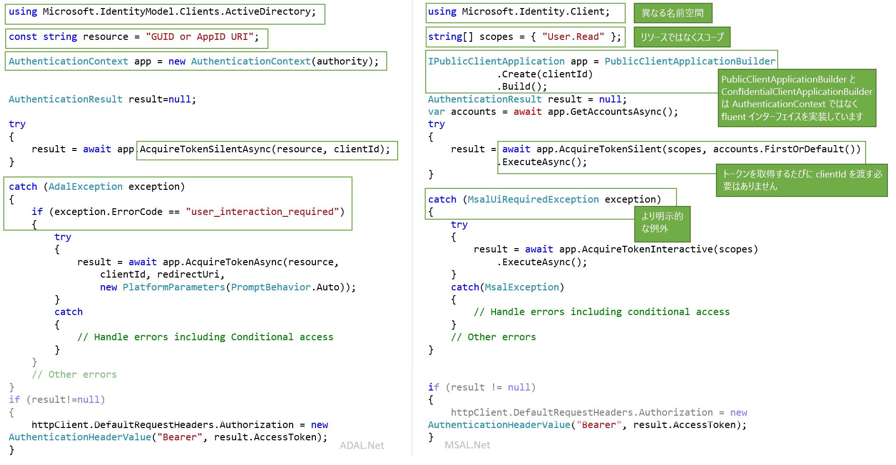

# <a name="migrating-applications-to-msalnet"></a>MSAL.NET へのアプリケーションの移行

Azure AD エンティティを認証し、Azure AD からのトークンを要求する場合、Microsoft Authentication Library for .NET (MSAL.NET) と Azure AD Authentication Library for .NET (ADAL.NET) の両方が使用されます。 これまで、ほとんどの開発者は、開発者プラットフォーム用の Azure AD (v1.0) で、Azure AD Authentication Library (ADAL) を使用してトークンを要求することで、Azure AD ID (職場と学校のアカウント) を認証していました。 現在では、MSAL.NET を使用して、より広範な Microsoft ID (Azure AD の ID と Microsoft アカウント、および Azure AD B2C 経由のソーシャル アカウントとローカル アカウント) を Microsoft ID プラットフォーム エンドポイントを介して認証することができます。 

この記事では、Microsoft Authentication Library for .NET (MSAL.NET) と Azure AD Authentication Library for .NET (ADAL.NET) のいずれかを選択する方法について説明し、2 つのライブラリを比較します。  

## <a name="differences-between-adal-and-msal-apps"></a>ADAL アプリと MSAL アプリの違い
ほとんどの場合、MSAL.NET と Microsoft ID プラットフォーム エンドポイント (最新世代の Microsoft 認証ライブラリ) を使用します。 MSAL.NET を使用して、Azure AD (職場と学校のアカウント)、Microsoft (個人用) アカウント (MSA)、または Azure AD B2C でアプリケーションにサインインしているユーザーのためにトークンを取得します。 

開発者向け Azure AD (v1.0) エンドポイント (および ADAL.NET) を既に使い慣れている場合は、[Microsoft ID プラットフォーム (v2.0) エンドポイントの違い](active-directory-v2-compare.md)に関するページをお読みください。

ただし、アプリケーションで以前のバージョンの [Active Directory フェデレーション サービス (AD FS)](/windows-server/identity/active-directory-federation-services) を使用してユーザーをサインインさせる必要がある場合は、引き続き ADAL.NET を使用する必要があります。 詳細については、「[ADFS support](https://aka.ms/msal-net-adfs-support)」 (ADFS のサポート) を参照してください。

次の図は、ADAL.NET と MSAL.NET の違いをいくつかまとめたものです。

### <a name="nuget-packages-and-namespaces"></a>NuGet パッケージと名前空間

ADAL.NET は [Microsoft.IdentityModel.Clients.ActiveDirectory](https://www.nuget.org/packages/Microsoft.IdentityModel.Clients.ActiveDirectory) NuGet パッケージから使用されます。 使用する名前空間は `Microsoft.IdentityModel.Clients.ActiveDirectory` です。

MSAL.NET を使用するには、[Microsoft.Identity.Client](https://www.nuget.org/packages/Microsoft.Identity.Client) NuGet パッケージを追加し、`Microsoft.Identity.Client` 名前空間を使用する必要があります

### <a name="scopes-not-resources"></a>リソースではなくスコープ

ADAL.NET では*リソース* のトークンが取得されますが、MSAL.NET では*スコープ* のトークンが取得されます。 多くの MSAL.NET AcquireToken オーバーライドでは、スコープ (`IEnumerable<string> scopes`) というパラメーターが必要になります。 このパラメーターは、要求された目的のアクセス許可とリソースを宣言する文字列のシンプルなリストです。 よく知られているスコープとして、[Microsoft Graph のスコープ](/graph/permissions-reference)があります。

MSAL.NET で v1.0 リソースにアクセスすることもできます。 詳細については、[v1.0 アプリケーションのスコープ](#scopes-for-a-web-api-accepting-v10-tokens)に関する記述を参照してください。 

### <a name="core-classes"></a>コア クラス

- ADAL.NET では、機関経由の、Security Token Service (STS) または承認サーバーへの接続の表現として、[AuthenticationContext](https://github.com/AzureAD/azure-activedirectory-library-for-dotnet/wiki/AuthenticationContext:-the-connection-to-Azure-AD) を使用します。 一方、MSAL.NET は[クライアント アプリケーション](https://github.com/AzureAD/microsoft-authentication-library-for-dotnet/wiki/Client-Applications)を中心として設計されています。 2 つの別個のクラス `PublicClientApplication` と `ConfidentialClientApplication` が提供されます

- トークンの取得:ADAL.NET と MSAL.NET の認証呼び出し (ADAL.NET の場合は `AcquireTokenAsync` と `AcquireTokenSilentAsync`、MSAL.NET の場合は `AcquireTokenInteractive` と `AcquireTokenSilent`) は同じですが、必要なパラメーターは異なります。 1 つの違いは、MSAL.NET では、AcquireTokenXX の呼び出しごとにアプリケーションの `ClientID` を渡す必要がなくなったことです。 実際、`ClientID` は、(`IPublicClientApplication` または `IConfidentialClientApplication` の) 構築時に 1 回だけ設定されます。

### <a name="iaccount-not-iuser"></a>IUser ではなく IAccount

ADAL.NET でユーザーが操作されていました。 ユーザーは人間またはソフトウェア エージェントですが、Microsoft ID システムで 1 つまたは複数のアカウント (いくつかの Azure AD アカウント、Azure AD B2C、Microsoft の個人用アカウント) を保有/所有/担当することができます。 

MSAL.NET 2.x では、現在、(IAccount インターフェイス経由で) アカウントの概念が定義されます。 この破壊的変更によって、適切なセマンティクスが提供されます。つまり、同じユーザーが、異なる Azure AD ディレクトリで、いくつかのアカウントを持つことができます。 また、MSAL.NET では、ホーム アカウント情報が提供されるので、ゲスト シナリオより詳細な情報が提供されます。

IUser と IAccount の違いの詳細については、[MSAL.NET 2.x](https://aka.ms/msal-net-2-released) に関するページを参照してください。

### <a name="exceptions"></a>例外

#### <a name="interaction-required-exceptions"></a>対話に必要な例外

MSAL.NET にはより明示的な例外があります。 たとえば、ADAL でサイレント認証が失敗した場合のプロシージャは、例外をキャッチして、`user_interaction_required` エラー コードを探すことです。

```csharp
catch(AdalException exception)
{
 if (exception.ErrorCode == “user_interaction_required”)
 {
  try
  {“try to authenticate interactively”}}
 }
}
```

詳細については、ADAL.NET で[トークンを取得する場合の推奨パターン](https://github.com/AzureAD/azure-activedirectory-library-for-dotnet/wiki/AcquireTokenSilentAsync-using-a-cached-token#recommended-pattern-to-acquire-a-token)に関する記事を参照してください

MSAL.NET を使用して、`MsalUiRequiredException` をキャッチします ([AcquireTokenSilent](https://github.com/AzureAD/microsoft-authentication-library-for-dotnet/wiki/AcquireTokenSilentAsync-using-a-cached-token) に関するページを参照)。

```csharp
catch(MsalUiRequiredException exception)
{
 try {“try to authenticate interactively”}
}
```

#### <a name="handling-claim-challenge-exceptions"></a>要求チャレンジ例外の処理

ADAL.NET では、要求チャレンジ例外が次のように処理されます。

- `AdalClaimChallengeException` は、リソースでユーザーからの要求がさらに必要な場合 (2 要素認証など) に、サービスによってスローされる例外 (`AdalServiceException` から派生) です。 `Claims` メンバーには、予期される要求がある JSON フラグメントがいくつか含まれています。
- また、ADAL.NET では、この例外を受け取るパブリック クライアント アプリケーションで、要求パラメーターを指定して `AcquireTokenInteractive` オーバーライドを呼び出す必要があります。 この `AcquireTokenInteractive` のオーバーライドでは、キャッシュのヒットは不要であるため試行もされません。 理由は、キャッシュ内のトークンに適切な要求がないためです (それ以外の場合、`AdalClaimChallengeException` はスローされていません)。 そのため、キャッシュを確認する必要はありません。 `ClaimChallengeException` は、OBO を行う WebAPI で受け取ることができますが、`AcquireTokenInteractive` は、この Web API を呼び出すパブリック クライアント アプリケーションで呼び出す必要があることに注意してください。
- サンプルを含む詳細については、「[Handling AdalClaimChallengeException](https://github.com/AzureAD/azure-activedirectory-library-for-dotnet/wiki/Exceptions-in-ADAL.NET#handling-adalclaimchallengeexception)」 (AdalClaimChallengeException の処理) を参照してください

MSAL.NET では、要求チャレンジ例外が次のように処理されます。

- `Claims` は `MsalServiceException` に表示されます。
- `AcquireTokenInteractive` ビルダーに適用できる `.WithClaim(claims)` メソッドがあります。 

### <a name="supported-grants"></a>サポートされている許可

MSAL.NET および v2.0 エンドポイントではまだ、すべての許可がサポートされているわけではありません。 以下は、ADAL.NET と MSAL.NET のサポートされている許可を比較してまとめたものです。

#### <a name="public-client-applications"></a>パブリック クライアント アプリケーション

以下は、デスクトップおよびモバイル アプリケーション用の ADAL.NET と MSAL.NET でサポートされている許可です

許可 | ADAL.NET | MSAL.NET
----- |----- | -----
Interactive | [対話型認証](https://github.com/AzureAD/azure-activedirectory-library-for-dotnet/wiki/Acquiring-tokens-interactively---Public-client-application-flows) | [MSAL.NET での対話型のトークンの取得](https://github.com/AzureAD/microsoft-authentication-library-for-dotnet/wiki/Acquiring-tokens-interactively)
統合 Windows 認証 | [Windows での統合認証 (Kerberos)](https://github.com/AzureAD/azure-activedirectory-library-for-dotnet/wiki/AcquireTokenSilentAsync-using-Integrated-authentication-on-Windows-(Kerberos)) | [統合 Windows 認証](msal-authentication-flows.md#integrated-windows-authentication)
ユーザー名/パスワード | [ユーザー名とパスワードでのトークンの取得](https://github.com/AzureAD/azure-activedirectory-library-for-dotnet/wiki/Acquiring-tokens-with-username-and-password)| [ユーザー名とパスワードによる認証](msal-authentication-flows.md#usernamepassword)
デバイス コード フロー | [Web ブラウザーを使用しないデバイスのデバイス プロファイル](https://github.com/AzureAD/azure-activedirectory-library-for-dotnet/wiki/Device-profile-for-devices-without-web-browsers) | [デバイス コード フロー](msal-authentication-flows.md#device-code)

#### <a name="confidential-client-applications"></a>機密クライアント アプリケーション

以下は、Web アプリケーション、Web API、デーモン アプリケーション用の ADAL.NET と MSAL.NET でサポートされている許可です。

アプリの種類 | 許可 | ADAL.NET | MSAL.NET
----- | ----- | ----- | -----
Web アプリ、Web API、デーモン | クライアントの資格情報 | [ADAL.NET のクライアント資格情報フロー](https://github.com/AzureAD/azure-activedirectory-library-for-dotnet/wiki/Client-credential-flows) | [MSAL.NET のクライアント資格情報フロー](msal-authentication-flows.md#client-credentials))
Web API | 次の代理 | [ADAL.NET でのユーザーの代わりのサービス間呼び出し](https://github.com/AzureAD/azure-activedirectory-library-for-dotnet/wiki/Service-to-service-calls-on-behalf-of-the-user) | [MSAL.NET での次の代理](msal-authentication-flows.md#on-behalf-of)
Web アプリ | 承認コード | [ADAL.NET を使用する Web アプリの承認コードでのトークンの取得](https://github.com/AzureAD/azure-activedirectory-library-for-dotnet/wiki/Acquiring-tokens-with-authorization-codes-on-web-apps) | [MSAL.NET を使用する Web アプリの承認コードでのトークンの取得](msal-authentication-flows.md#authorization-code)

### <a name="cache-persistence"></a>キャッシュの永続化

ADAL.NET では、`TokenCache` クラスを拡張し、セキュリティで保護されたストレージ (.NET Framework と .NET Core) のないプラットフォームで、`BeforeAccess` および `BeforeWrite` メソッドを使用して、目的の永続化機能を実装することができます。 詳細については、[ADAL.NET でのトークン キャッシュのシリアル化](https://github.com/AzureAD/azure-activedirectory-library-for-dotnet/wiki/Token-cache-serialization)に関するページを参照してください。

MSAL.NET では、トークン キャッシュがシールド クラスとなり、拡張することはできません。 そのため、トークン キャッシュの永続化の実装は、シールド トークン キャッシュと対話するヘルパー クラスの形式でなければなりません。 この対話については、[MSAL.NET でのトークン キャッシュのシリアル化](https://github.com/AzureAD/microsoft-authentication-library-for-dotnet/wiki/token-cache-serialization)に関するページで説明されています。

## <a name="signification-of-the-common-authority"></a>一般的な機関の意味

V1.0 では、 https://login.microsoftonline.com/common 機関を使用する場合、ユーザーが (組織用の) AAD アカウントでサインインできるようにします。 [ADAL.NET での機関の検証](https://github.com/AzureAD/azure-activedirectory-library-for-dotnet/wiki/AuthenticationContext:-the-connection-to-Azure-AD#authority-validation)に関するページを参照してください

v2.0 で https://login.microsoftonline.com/common 機関を使用する場合、ユーザーが AAD 組織または Microsoft の個人用アカウント (MSA) でサインインできるようにします。 MSAL.NET では、AAD アカウントへのログインを制限する場合 (ADAL.NET の動作と同じ)、 https://login.microsoftonline.com/organizations を使用する必要があります。 詳細については、[パブリック クライアント アプリケーション](https://github.com/AzureAD/microsoft-authentication-library-for-dotnet/wiki/Client-Applications#publicclientapplication)に関するページの `authority` パラメーターについての記事を参照してください。

## <a name="v10-and-v20-tokens"></a>v1.0 トークンと v2.0 トークン

トークンには次の 2 つのバージョンがあります。
- v1.0 トークン
- v2.0 トークン 

v1.0 エンドポイント (ADAL で使用) では、v1.0 トークンのみが出力されます。

しかし、v2.0 エンドポイント (MSAL で使用) では、Web API で受け入れられるバージョンのトークンが出力されます。 Web API のアプリケーション マニフェストのプロパティでは、開発者は、受け入れられるトークンのバージョンを選択することができます。 [アプリケーション マニフェスト](reference-app-manifest.md)に関するリファレンス ドキュメントの `accessTokenAcceptedVersion` についての記事を参照してください。

v1.0 トークンと v2.0 トークンの詳細については、[Azure Active Directory アクセス トークン](access-tokens.md)に関するページを参照してください

## <a name="scopes-for-a-web-api-accepting-v10-tokens"></a>v1.0 トークンを受け入れる Web API のスコープ

OAuth 2 アクセス許可は、v1.0 Web API (リソース) アプリケーションでクライアント アプリケーションに公開するアクセス許可スコープです。 これらのアクセス許可スコープは、同意中にクライアント アプリケーションに付与できます。 [Azure Active Directory アプリケーション マニフェスト](active-directory-application-manifest.md)に関するページの oauth2Permissions についてのセクションを参照してください。

### <a name="scopes-to-request-access-to-specific-oauth2-permissions-of-a-v10-application"></a>v1.0 アプリケーションの特定の OAuth2 アクセス許可へのアクセス権を要求するスコープ

v1.0 アプリケーションの特定のスコープのためにトークンを取得する場合 (AAD グラフ、 https://graph.windows.net) など)、目的のリソース ID とそのリソースの目的の OAuth2 アクセス許可を連結して、`scopes` を作成する必要はありません。

たとえば、App ID URI が `ResourceId` である v1.0 Web API にユーザーの名前でアクセスするには、以下を使用します。

```csharp
var scopes = new [] {  ResourceId+"/user_impersonation"};
```

AAD グラフ API (https://graph.windows.net/) を使用して、MSAL.NET Azure Active Directory で読み取りと書き込みを行う場合、次のスニペットのようにスコープ リストを作成します。

```csharp
ResourceId = "https://graph.windows.net/";
var scopes = new [] { ResourceId + “Directory.Read”, ResourceID + “Directory.Write”}
```

#### <a name="warning-should-you-have-one-or-two-slashes-in-the-scope-corresponding-to-a-v10-web-api"></a>警告:v1.0 Web API に対応するスコープに 1 つまたは 2 つのスラッシュがある場合

Azure Resource Manager API (https://management.core.windows.net/) に対応するスコープを書き込む場合は、次のスコープを要求する必要があります (2 つのスラッシュに注意) 

```csharp
var scopes = new[] {"https://management.core.windows.net//user_impersonation"};
var result = await app.AcquireTokenInteractive(scopes).ExecuteAsync();

// then call the API: https://management.azure.com/subscriptions?api-version=2016-09-01
```

これは、Resource Manager API ではその対象ユーザーの要求 (`aud`) でスラッシュが予期されるためです。したがって、API 名をスコープと区別するためのスラッシュがあります。

Azure AD で使用されるロジックは次のとおりです。
- v1.0 アクセス トークン (使用可能な場合のみ) を使用する ADAL (v1.0) エンドポイントの場合、aud=resource となります
- v2.0 トークンを受け入れるリソースのためにアクセス トークンを要求する MSAL (v2.0 エンドポイント) の場合は、aud=resource.AppId となります
- v1.0 アクセス トークンを受け入れるリソースのためにアクセス トークンを要求する MSAL (v2.0 エンドポイント) の場合 (上記の例の場合)、Azure AD では、最後のスラッシュの前のすべてを取得し、それをリソース ID として使用することで、要求されたスコープからの目的の対象ユーザーを解析します。 そのため、https:\//database.windows.net が "https://database.windows.net/ " の対象ユーザーを必要とする場合、https:\/ /database.windows.net//.default のスコープを要求する必要があります。 問題 #[747](https://github.com/AzureAD/microsoft-authentication-library-for-dotnet/issues/747) の「Resource url's trailing slash is omitted, which caused sql auth failure #747」 (リソース URL の末尾のスラッシュが省略されたため、SQL 認証エラー #747 が発生した) も参照してください


### <a name="scopes-to-request-access-to-all-the-permissions-of-a-v10-application"></a>v1.0 アプリケーションのすべてのアクセス許可へのアクセス権を要求するスコープ

たとえば、v1.0 アプリケーションのすべての静的なスコープのためにトークンを取得する場合は、以下を使用する必要があります

```csharp
ResourceId = "someAppIDURI";
var scopes = new [] {  ResourceId+"/.default"};
```

### <a name="scopes-to-request-in-the-case-of-client-credential-flow--daemon-app"></a>クライアント資格証明フロー / デーモン アプリの場合に要求するスコープ

クライアント資格情報フローの場合、`/.default` スコープも渡します。 これにより、管理者がアプリケーションの登録で同意したアプリレベルのすべてのアクセス許可が、Azure AD に示されます。

## <a name="adal-to-msal-migration"></a>ADAL から MSAL への移行

ADAL.NET v2.X では、更新トークンが公開されました。これにより、これらのトークンをキャッシュし、ADAL 2.x で提供される `AcquireTokenByRefreshToken` メソッドを使用することで、そのトークンの使用に関するソリューションを開発することができるようになります。 これらのソリューションのいくつかは、次のようなシナリオで使用されました。
* 長時間実行されているサービスで、ユーザーの代わりにダッシュボードの更新などのアクションを行うが、ユーザーが接続されなくなった。 
* クライアントで RT を Web サービスに移行できるようにする WebFarm シナリオ (サーバー側ではなく、クライアント側でキャッシュが行われ、Cookie が暗号化される)

これは MSAL.NET には当てはまりません。しかし、セキュリティ上の理由で、この方法での更新トークンの利用は推奨されなくなりました。 API では、以前取得された更新トークンを渡す方法が提供されないため、MSAL 3.x への移行が困難になります。 

さいわい、MSAL.NET では現在、API で以前の更新トークンを `IConfidentialClientApplication` に移行することができます 

```CSharp
/// <summary>
/// Acquires an access token from an existing refresh token and stores it and the refresh token into 
/// the application user token cache, where it will be available for further AcquireTokenSilent calls.
/// This method can be used in migration to MSAL from ADAL v2 and in various integration 
/// scenarios where you have a RefreshToken available. 
/// (see https://aka.ms/msal-net-migration-adal2-msal2)
/// </summary>
/// <param name="scopes">Scope to request from the token endpoint. 
/// Setting this to null or empty will request an access token, refresh token and ID token with default scopes</param>
/// <param name="refreshToken">The refresh token from ADAL 2.x</param>
IByRefreshToken.AcquireTokenByRefreshToken(IEnumerable<string> scopes, string refreshToken);
```
 
この方法では、必要なスコープ (リソース) と共に、以前使用された更新トークンを提供することができます。 更新トークンは新しいものと交換され、アプリケーションにキャッシュされます。  

この方法は、一般的ではないシナリオ用であるため、最初に `IByRefreshToken` にキャストしないと、`IConfidentialClientApplication` で簡単にはアクセスできません。

このコード スニペットでは、機密クライアント アプリケーションでの移行コードがいくつか示されています。 `GetCachedRefreshTokenForSignedInUser` では、ADAL 2.x を活用していた以前のバージョンのアプリケーションによって、ストレージに格納された更新トークンを取得します。 `GetTokenCacheForSignedInUser` では、サインインしたユーザーのためにキャッシュを逆シリアル化します (機密クライアント アプリケーションでユーザーごとに 1 つのキャッシュが必要であるため)。

```csharp
TokenCache userCache = GetTokenCacheForSignedInUser();
string rt = GetCachedRefreshTokenForSignedInUser();

IConfidentialClientApplication app;
app = ConfidentialClientApplicationBuilder.Create(clientId)
 .WithAuthority(Authority)
 .WithRedirectUri(RedirectUri)
 .WithClientSecret(ClientSecret)
 .Build();
IByRefreshToken appRt = app as IByRefreshToken;
         
AuthenticationResult result = await appRt.AcquireTokenByRefreshToken(null, rt)
                                         .ExecuteAsync()
                                         .ConfigureAwait(false);
```

新しい更新トークンがキャッシュに格納されている間に、AuthenticationResult でアクセス トークンと ID トークンが返されているのがわかります。

更新トークンが使用可能なさまざまな統合シナリオで、この方法を使用することもできます。

## <a name="next-steps"></a>次の手順

スコープの詳細については、[Microsoft ID プラットフォーム エンドポイントでのスコープ、アクセス許可、および同意](v2-permissions-and-consent.md)に関するページを参照してください
