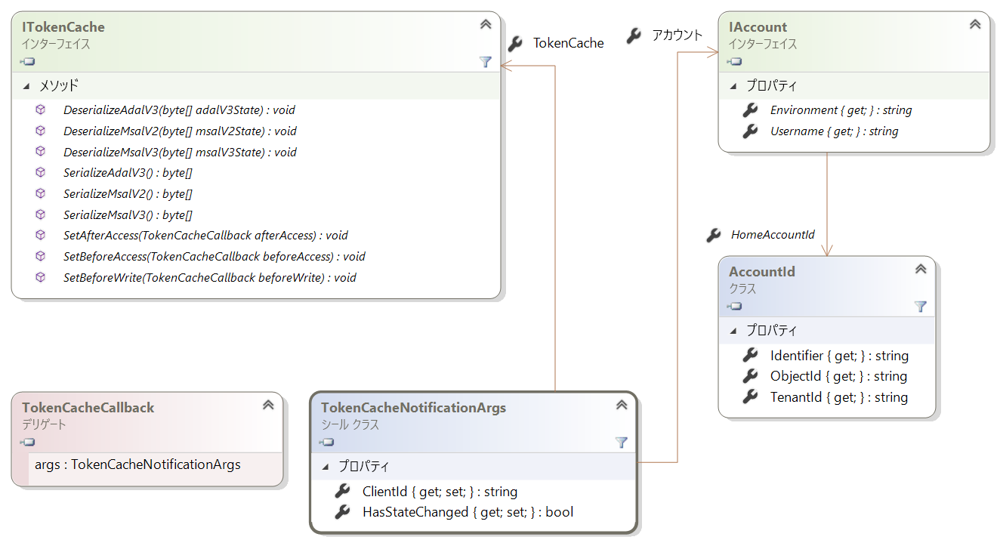
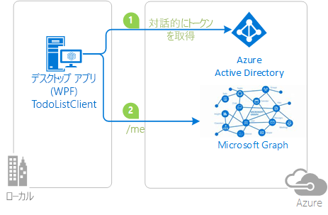

# <a name="token-cache-serialization-in-msalnet"></a>MSAL.NET でのトークン キャッシュのシリアル化
[トークンは、取得](msal-acquire-cache-tokens.md)後に Microsoft Authentication Library (MSAL) でキャッシュされます。  アプリケーション コードでは、別のメソッドでトークンを取得する前に、キャッシュからトークンを取得しようとする必要があります。  この記事では、MSAL.NET でのトークン キャッシュの既定のシリアル化とカスタムのシリアル化について説明します。

この記事は MSAL.NET 3.x 用です。 MSAL.NET 2.x に関心がある場合は、「[Token cache serialization in MSAL.NET 2.x](https://github.com/AzureAD/microsoft-authentication-library-for-dotnet/wiki/Token-cache-serialization-2x)」(MSAL.NET 2.x でのトークン キャッシュのシリアル化) を参照してください。

## <a name="default-serialization-for-mobile-platforms"></a>モバイル プラットフォーム用の既定のシリアル化

MSAL.NET では、既定でメモリ内のトークン キャッシュが提供されています。 プラットフォームの一部としてセキュリティで保護されたストレージをユーザーが使用できるプラットフォーム用に、既定でシリアル化が提供されています。 これは、ユニバーサル Windows プラットフォーム (UWP)、Xamarin.iOS、Xamarin.Android の場合です。

> [!Note]
> Xamarin.Android プロジェクトを MSAL.NET 1.x から MSAL.NET 3.x に移行する場合は、Visual Studio デプロイによってローカル ストレージの復元がトリガーされるときに、キャッシュされた古いトークンが返されることを回避するために、プロジェクトに `android:allowBackup="false"` を追加することをお勧めします。 [問題 #659](https://github.com/AzureAD/microsoft-authentication-library-for-dotnet/issues/659#issuecomment-436181938) を参照してください。

## <a name="custom-serialization-for-windows-desktop-apps-and-web-appsweb-apis"></a>Windows デスクトップ アプリと Web アプリ/Web API 用のカスタムのシリアル化

モバイル プラットフォーム (UWP、Xamarin.iOS、Xamarin.Android) ではカスタムのシリアル化を使用できません。 MSAL では、これらのプラットフォームに対して安全性とパフォーマンスに優れたシリアル化メカニズムを既に定義しています。 ただし、.NET デスクトップおよび .NET Core アプリケーションのアーキテクチャにはさまざまなものがあり、MSAL では汎用的なシリアル化メカニズムを実装できません。 たとえば、Web サイトでは Redis Cache にトークンが格納され、デスクトップ アプリでは暗号化ファイルにトークンが格納されたりする場合があります。 したがって、追加設定なしに使用できるシリアル化は提供されていません。 .NET デスクトップまたは .NET Core で永続的なトークン キャッシュ アプリケーションを入手するには、シリアル化をカスタマイズする必要があります。

トークン キャッシュのシリアル化では、次のクラスとインターフェイスが使用されます。

- `ITokenCache` では、トークン キャッシュのシリアル化要求をサブスクライブするイベントと、キャッシュをさまざまな形式 (ADAL v3.0、MSAL 2.x、および MSAL 3.x = ADAL v5.0) でシリアル化または逆シリアル化するメソッドを定義します。
- `TokenCacheCallback` は、シリアル化を処理できるようにイベントに渡されるコールバックです。 `TokenCacheNotificationArgs` の型の引数で呼び出されます。
- `TokenCacheNotificationArgs` では、アプリケーションの `ClientId` と、トークンを使用できるユーザーへの参照のみを提供します。

  

> [!IMPORTANT]
> アプリケーションの `UserTokenCache` プロパティと `AppTokenCache` プロパティを呼び出すと、MSAL.NET によりトークン キャッシュが自動的に作成され、`IToken` キャッシュが提供されます。 インターフェイスを自分で実装することはできません。 カスタムのトークン キャッシュのシリアル化を実装する際には、お客様の責任で次の処理を行います。
> - `BeforeAccess` と `AfterAccess` の各 "イベント" (またはこれらの非同期版) に対応します。 `BeforeAccess` デリゲートではキャッシュの逆シリアル化を行い、`AfterAccess` デリゲートではキャッシュのシリアル化を行います。
> - これらのイベントの一部では、BLOB が格納されるか、または読み込まれ、イベント引数を介して任意のストレージに渡されます。

[パブリック クライアント アプリケーション](msal-client-applications.md) (デスクトップ) と[機密クライアント アプリケーション](msal-client-applications.md) (Web アプリ/Web API、デーモン アプリ) のどちらに対してトークン キャッシュのシリアル化を作成しているかに応じて、戦略は異なります。

### <a name="token-cache-for-a-public-client"></a>パブリック クライアント用のトークン キャッシュ 

MSAL.NET v2.x 以降では、パブリック クライアント用のトークン キャッシュをシリアル化するための複数のオプションが用意されています。 キャッシュは、MSAL.NET 形式にのみシリアル化することができます (この統一形式のキャッシュは、MSAL およびプラットフォーム間で共通です)。  また、ADAL V3 の[レガシ](https://github.com/AzureAD/azure-activedirectory-library-for-dotnet/wiki/Token-cache-serialization) トークン キャッシュのシリアル化をサポートすることもできます。

ADAL.NET 3.x、ADAL.NET 5.x、および MSAL.NET の間でシングル サインオン状態を共有するようトークン キャッシュのシリアル化をカスタマイズする方法については、サンプル「[active-directory-dotnet-v1-to-v2](https://github.com/Azure-Samples/active-directory-dotnet-v1-to-v2)」を参照してください。

> [!Note]
> MSAL 2.x では、MSAL.NET 1.1.4-preview トークン キャッシュ形式はサポートされなくなりました。 MSAL.NET 1.x を利用するアプリケーションがある場合、ユーザーは再度サインインする必要があります。 または、ADAL 4.x (および 3.x) からの移行がサポートされています。

#### <a name="simple-token-cache-serialization-msal-only"></a>トークン キャッシュの単純なシリアル化 (MSAL のみ)

デスクトップ アプリケーション用のトークン キャッシュについて、カスタムのシリアル化の単純な実装の例を次に示します。 ここでは、ユーザーのトークン キャッシュは、アプリケーションと同じフォルダー内のファイルです。

アプリケーションをビルドした後、`TokenCacheHelper.EnableSerialization()` メソッドを呼び出し、アプリケーションに `UserTokenCache` を渡すことで、シリアル化を有効にします。

```csharp
app = PublicClientApplicationBuilder.Create(ClientId)
    .Build();
TokenCacheHelper.EnableSerialization(app.UserTokenCache);
```

`TokenCacheHelper` ヘルパー クラスは、次のように定義されます。

```csharp
static class TokenCacheHelper
 {
  public static void EnableSerialization(ITokenCache tokenCache)
  {
   tokenCache.SetBeforeAccess(BeforeAccessNotification);
   tokenCache.SetAfterAccess(AfterAccessNotification);
  }

  /// <summary>
  /// Path to the token cache
  /// </summary>
  public static readonly string CacheFilePath = System.Reflection.Assembly.GetExecutingAssembly().Location + ".msalcache.bin3";

  private static readonly object FileLock = new object();


  private static void BeforeAccessNotification(TokenCacheNotificationArgs args)
  {
   lock (FileLock)
   {
    args.TokenCache.DeserializeMsalV3(File.Exists(CacheFilePath)
            ? ProtectedData.Unprotect(File.ReadAllBytes(CacheFilePath),
                                      null,
                                      DataProtectionScope.CurrentUser)
            : null);
   }
  }

  private static void AfterAccessNotification(TokenCacheNotificationArgs args)
  {
   // if the access operation resulted in a cache update
   if (args.HasStateChanged)
   {
    lock (FileLock)
    {
     // reflect changesgs in the persistent store
     File.WriteAllBytes(CacheFilePath,
                         ProtectedData.Protect(args.TokenCache.SerializeMsalV3(),
                                                 null,
                                                 DataProtectionScope.CurrentUser)
                         );
    }
   }
  }
 }
```

パブリック クライアント アプリケーション (Windows、Mac、Linux で実行されているデスクトップ アプリケーション) 用の製品品質トークン キャッシュ ファイル ベースのシリアライザーのプレビューは、[Microsoft.Identity.Client.Extensions.Msal](https://github.com/AzureAD/microsoft-authentication-extensions-for-dotnet/tree/master/src/Microsoft.Identity.Client.Extensions.Msal) オープン ソース ライブラリで入手できます。 これを、次の NuGet パッケージからアプリケーションに追加することができます。[Microsoft.Identity.Client.Extensions.Msal](https://www.nuget.org/packages/Microsoft.Identity.Client.Extensions.Msal/)。

#### <a name="dual-token-cache-serialization-msal-unified-cache-and-adal-v3"></a>トークン キャッシュのデュアル シリアル化 (MSAL 統一キャッシュと ADAL v3)

トークン キャッシュのシリアル化を統一キャッシュ形式の両方 (同じプラットフォーム上の ADAL.NET 4.x、MSAL.NET 2.x、および同じ世代以前のその他の MSAL に共通) で実装する場合は、次のコードを参照してください。

```csharp
string appLocation = Path.GetDirectoryName(Assembly.GetEntryAssembly().Location;
string cacheFolder = Path.GetFullPath(appLocation) + @"..\..\..\..");
string adalV3cacheFileName = Path.Combine(cacheFolder, "cacheAdalV3.bin");
string unifiedCacheFileName = Path.Combine(cacheFolder, "unifiedCache.bin");

IPublicClientApplication app;
app = PublicClientApplicationBuilder.Create(clientId)
                                    .Build();
FilesBasedTokenCacheHelper.EnableSerialization(app.UserTokenCache,
                                               unifiedCacheFileName,
                                               adalV3cacheFileName);

```

この場合、ヘルパー クラスは次のように定義されます。

```csharp
using System;
using System.IO;
using System.Security.Cryptography;
using Microsoft.Identity.Client;

namespace CommonCacheMsalV3
{
 /// <summary>
 /// Simple persistent cache implementation of the dual cache serialization (ADAL V3 legacy
 /// and unified cache format) for a desktop applications (from MSAL 2.x)
 /// </summary>
 static class FilesBasedTokenCacheHelper
 {
  /// <summary>
  /// Enables the serialization of the token cache
  /// </summary>
  /// <param name="adalV3CacheFileName">File name where the cache is serialized with the
  /// ADAL V3 token cache format. Can
  /// be <c>null</c> if you don't want to implement the legacy ADAL V3 token cache
  /// serialization in your MSAL 2.x+ application</param>
  /// <param name="unifiedCacheFileName">File name where the cache is serialized
  /// with the Unified cache format, common to
  /// ADAL V4 and MSAL V2 and above, and also across ADAL/MSAL on the same platform.
  ///  Should not be <c>null</c></param>
  /// <returns></returns>
  public static void EnableSerialization(ITokenCache tokenCache, string unifiedCacheFileName, string adalV3CacheFileName)
  {
   UnifiedCacheFileName = unifiedCacheFileName;
   AdalV3CacheFileName = adalV3CacheFileName;

   tokenCache.SetBeforeAccess(BeforeAccessNotification);
   tokenCache.SetAfterAccess(AfterAccessNotification);
  }

  /// <summary>
  /// File path where the token cache is serialized with the unified cache format
  /// (ADAL.NET V4, MSAL.NET V3)
  /// </summary>
  public static string UnifiedCacheFileName { get; private set; }

  /// <summary>
  /// File path where the token cache is serialized with the legacy ADAL V3 format
  /// </summary>
  public static string AdalV3CacheFileName { get; private set; }

  private static readonly object FileLock = new object();

  public static void BeforeAccessNotification(TokenCacheNotificationArgs args)
  {
   lock (FileLock)
   {
    args.TokenCache.DeserializeAdalV3(ReadFromFileIfExists(AdalV3CacheFileName));
    try
    {
     args.TokenCache.DeserializeMsalV3(ReadFromFileIfExists(UnifiedCacheFileName));
    }
    catch(Exception ex)
    {
     // Compatibility with the MSAL v2 cache if you used one
     args.TokenCache.DeserializeMsalV2(ReadFromFileIfExists(UnifiedCacheFileName));
    }
   }
  }

  public static void AfterAccessNotification(TokenCacheNotificationArgs args)
  {
   // if the access operation resulted in a cache update
   if (args.HasStateChanged)
   {
    lock (FileLock)
    {
     WriteToFileIfNotNull(UnifiedCacheFileName, args.TokenCache.SerializeMsalV3());
     if (!string.IsNullOrWhiteSpace(AdalV3CacheFileName))
     {
      WriteToFileIfNotNull(AdalV3CacheFileName, args.TokenCache.SerializeAdalV3());
     }
    }
   }
  }

  /// <summary>
  /// Read the content of a file if it exists
  /// </summary>
  /// <param name="path">File path</param>
  /// <returns>Content of the file (in bytes)</returns>
  private static byte[] ReadFromFileIfExists(string path)
  {
   byte[] protectedBytes = (!string.IsNullOrEmpty(path) && File.Exists(path))
       ? File.ReadAllBytes(path) : null;
   byte[] unprotectedBytes = encrypt ?
       ((protectedBytes != null) ? ProtectedData.Unprotect(protectedBytes, null, DataProtectionScope.CurrentUser) : null)
       : protectedBytes;
   return unprotectedBytes;
  }

  /// <summary>
  /// Writes a blob of bytes to a file. If the blob is <c>null</c>, deletes the file
  /// </summary>
  /// <param name="path">path to the file to write</param>
  /// <param name="blob">Blob of bytes to write</param>
  private static void WriteToFileIfNotNull(string path, byte[] blob)
  {
   if (blob != null)
   {
    byte[] protectedBytes = encrypt
      ? ProtectedData.Protect(blob, null, DataProtectionScope.CurrentUser)
      : blob;
    File.WriteAllBytes(path, protectedBytes);
   }
   else
   {
    File.Delete(path);
   }
  }

  // Change if you want to test with an un-encrypted blob (this is a json format)
  private static bool encrypt = true;
 }
}
```

### <a name="token-cache-for-a-web-app-confidential-client-application"></a>Web アプリ (機密クライアント アプリケーション) 用のトークンのキャッシュ

Web アプリまたは Web API では、キャッシュでセッション、Redis Cache、またはデータベースを利用できます。

覚えておくべき重要なことは、Web アプリと Web API では、ユーザーごと (アカウントごと) に 1 つのトークン キャッシュが必要となるということです。 アカウントごとにトークン キャッシュをシリアル化する必要があります。

Web アプリと Web API 用のトークン キャッシュの使用方法の例については、フェーズ「[2-2 Token Cache](https://github.com/Azure-Samples/active-directory-aspnetcore-webapp-openidconnect-v2/tree/master/2-WebApp-graph-user/2-2-TokenCache)」にある [ASP.NET Core Web アプリのチュートリアル](https://ms-identity-aspnetcore-webapp-tutorial)を参照してください。 実装については、[microsoft-authentication-extensions-for-dotnet](https://github.com/AzureAD/microsoft-authentication-extensions-for-dotnet) ライブラリにある [TokenCacheProviders](https://github.com/AzureAD/microsoft-authentication-extensions-for-dotnet/tree/master/src/Microsoft.Identity.Client.Extensions.Web/TokenCacheProviders) フォルダー ([Microsoft.Identity.Client.Extensions.Web](https://github.com/AzureAD/microsoft-authentication-extensions-for-dotnet/tree/master/src/Microsoft.Identity.Client.Extensions.Web) フォルダー内) を参照してください。 

## <a name="next-steps"></a>次の手順
次のサンプルでは、トークン キャッシュのシリアル化を示します。

| サンプル | プラットフォーム | 説明|
| ------ | -------- | ----------- |
|[active-directory-dotnet-desktop-msgraph-v2](https://github.com/azure-samples/active-directory-dotnet-desktop-msgraph-v2) | デスクトップ (WPF) | Microsoft Graph API を呼び出す Windows デスクトップ .NET (WPF) アプリケーション。 |
|[active-directory-dotnet-v1-to-v2](https://github.com/Azure-Samples/active-directory-dotnet-v1-to-v2) | デスクトップ (コンソール) | 特に、[トークン キャッシュの移行](https://github.com/Azure-Samples/active-directory-dotnet-v1-to-v2/blob/master/TokenCacheMigration/README.md)で、Azure AD v1.0 アプリケーション (ADAL.NET を使用) から Azure AD v2.0 アプリケーション (集約型のアプリケーションとも呼ばれる。MSAL.NET を使用) への移行を示す一連の Visual Studio ソリューション。|
