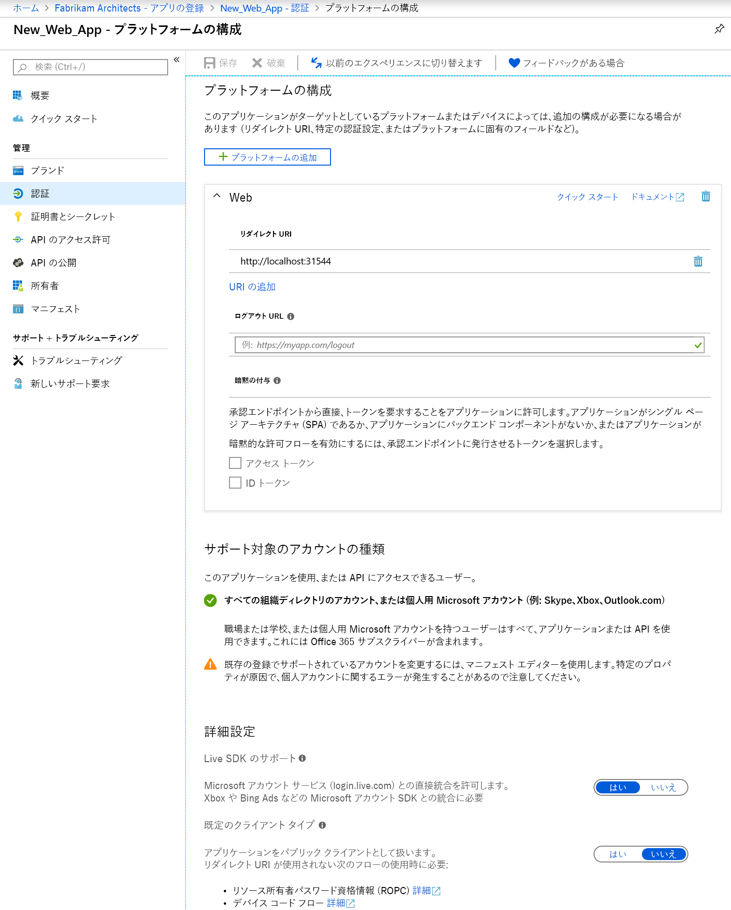

# クイック スタート:Web API にアクセスするためのクライアント アプリケーションの構成

Web/confidential クライアント アプリケーションが認証を必要とする認可付与フローに参加 (し、アクセス トークンを取得) できるようにするには、セキュリティで保護された資格情報を確立する必要があります。 Azure portal でサポートされている既定の認証方法は、クライアント ID と秘密鍵の組み合わせです。

さらに、同意フレームワークでは、リソース アプリケーションによって公開されている Web API (Microsoft Graph API など) にクライアントがアクセスできるようになる前に、要求されたアクセス許可に基づいてクライアントに必要なアクセス許可が付与されていることを確認します。 既定では、すべてのアプリケーションが Microsoft Graph API からのアクセス許可を選択できます。 [Graph API の [サインインとユーザー プロファイルの読み取り] アクセス許可](https://developer.microsoft.com/graph/docs/concepts/permissions_reference#user-permissions)が既定で選択されています。 目的の Web API ごとに [2 種類のアクセス許可](developer-glossary.md#permissions)から選択できます。

* **アプリケーションのアクセス許可** - クライアント アプリケーションは、アプリケーション自体として (ユーザー コンテキストなしで) Web API に直接アクセスする必要があります。 この種類のアクセス許可には管理者の同意が必要であるほか、パブリック (デスクトップおよびモバイル) クライアント アプリケーションでは使用できません。
* **委任されたアクセス許可** - クライアント アプリケーションは、サインインしているユーザーとして Web API にアクセスする必要があります。アクセスにあたっては、選択されているアクセス許可に応じて制限が適用されます。 この種類のアクセス許可は、管理者の同意が必要でない限り、ユーザーが付与できます。

  > [!NOTE]
  > 委任されたアクセス許可をアプリケーションに追加しても、テナント内のユーザーに対して自動的に同意が与えられるわけではありません。 管理者がすべてのユーザーに代わって同意を許可しない限り、ユーザーはやはり追加された委任されたアクセス許可に実行時に手動で同意する必要があります。

このクイック スタートでは、アプリを次のように構成する方法を説明します。

* [リダイレクト URI をアプリケーションに追加する](#add-redirect-uris-to-your-application)
* [アプリケーションの詳細設定を構成する](#configure-advanced-settings-for-your-application)
* [サポートされるアカウントの種類を変更する](#modify-supported-account-types)
* [資格情報を Web アプリケーションに追加する](#add-credentials-to-your-web-application)
* [Web API にアクセスするためのアクセス許可を追加する](#add-permissions-to-access-web-apis)

## 前提条件

最初に、以下の前提条件を完了していることを確認します。

* サポートされている[アクセス許可と同意](v2-permissions-and-consent.md)について学習する。他のユーザーまたはアプリケーションによって使用されるアプリケーションを構築する場合は、これを理解しておくことが重要です。
* アプリケーションが登録されているテナントを持つ。
  * アプリを登録していない場合は、[Microsoft ID プラットフォームを使用してアプリケーションを登録する方法について学習](quickstart-register-app.md)します。

## Azure portal にサインインしてアプリを選択する

アプリを構成する前に、次の手順を実行します。

1. 職場または学校アカウントか、個人の Microsoft アカウントを使用して、[Azure portal](https://portal.azure.com) にサインインします。
1. ご利用のアカウントで複数のテナントにアクセスできる場合は、右上隅でアカウントを選択し、ポータルのセッションを目的の Azure AD テナントに設定します。
1. **Azure Active Directory** を検索して選択します。 
1. 左ウィンドウで、 **[アプリの登録]** を選択します。
1. 構成するアプリケーションを探して選択します。 アプリを選択すると、アプリケーションの **[概要]** またはメイン登録ページが表示されます。
1. Web API にアクセスするようにアプリケーションを構成するには、以下の手順を実行します。
    * [リダイレクト URI をアプリケーションに追加する](#add-redirect-uris-to-your-application)
    * [アプリケーションの詳細設定を構成する](#configure-advanced-settings-for-your-application)
    * [サポートされるアカウントの種類を変更する](#modify-supported-account-types)
    * [資格情報を Web アプリケーションに追加する](#add-credentials-to-your-web-application)
    * [Web API にアクセスするためのアクセス許可を追加する](#add-permissions-to-access-web-apis)

## リダイレクト URI をアプリケーションに追加する

リダイレクト URI をアプリケーションに追加するには:

1. アプリの **[概要]** ページで、 **[認証]** セクションを選択します。
1. Web アプリケーションとパブリック クライアント アプリケーションのカスタム リダイレクト URI を追加するには、次の手順を実行します。
   1. **[リダイレクト URI]** セクションを見つけます。
   1. 構築するアプリケーションの種類として **[Web]** または **[パブリック クライアント (モバイルとデスクトップ)]** を選択します。
   1. アプリケーションのリダイレクト URI を入力します。
      * Web アプリケーションの場合は、アプリケーションのベース URL を指定します。 ローカル コンピューターで実行されている Web アプリケーションの URL であれば、たとえば `http://localhost:31544` のようになります。 ユーザーはこの URL を使用して、Web クライアント アプリケーションにサインインすることになります。
      * パブリック アプリケーションの場合は、トークン応答を返すために Azure AD に使用される URI を指定します。 `https://MyFirstApp` など、ご自分のアプリケーションに固有の値を入力してください。

1. パブリック クライアント (モバイル、デスクトップ) に推奨されるリダイレクト URI の中から選択するには、以下の手順に従います。
    1. **[パブリック クライアント (モバイル、デスクトップ) に推奨されるリダイレクト URI]** セクションを探します。
    1. チェック ボックスを使用して、アプリケーションの適切なリダイレクト URI を選択します。 カスタム リダイレクト URI を入力することもできます。 何を使えばよいかわからない場合は、ライブラリのドキュメントを参照してください。

リダイレクト URI には、いくつかの制限があります。 詳細については、[リダイレクト URI の制約と制限](https://docs.microsoft.com/azure/active-directory/develop/reply-url)に関するページを参照してください。
> [!NOTE]
> 新しい**認証**設定エクスペリエンスを試してみてください。このエクスペリエンスでは、対象とするプラットフォームまたはデバイスに基づいてアプリケーションの設定を構成できます。
>
> このビューを表示するには、既定の **[認証]** ページ ビューで **[新しいエクスペリエンスを試す]** を選択します。
>
> ![[新しいエクスペリエンスを試す] をクリックして、[プラットフォーム構成] ビューを表示する](./media/quickstart-update-azure-ad-app-preview/authentication-try-new-experience-cropped.png)
>
> この操作により、[新しい **[プラットフォーム構成]** ページ](#configure-platform-settings-for-your-application)が表示されます。

### アプリケーションの詳細設定を構成する

登録するアプリケーションに応じて、次のようないくつかの追加設定を構成する必要があります。

* **ログアウト URL**
* シングルページ アプリの場合は、 **[暗黙の付与]** を有効にし、承認エンドポイントによって発行されるトークンを選択できます。
* 統合 Windows 認証、デバイス コード フロー、または **[既定のクライアントの種類]** セクションのユーザー名およびパスワードを使用してトークンを取得しているデスクトップ アプリの場合は、 **[アプリケーションは、パブリック クライアントとして扱います]** 設定を **[はい]** に構成します。
* Live SDK を使用して Microsoft アカウント サービスと統合していたレガシ アプリの場合は、 **[Live SDK サポート]** を構成します。 新しいアプリでは、この設定は必要ありません。
* **既定のクライアントの種類**

### サポートされるアカウントの種類を変更する

**[サポートされているアカウントの種類]** では、アプリケーションを使用できるユーザーまたは API にアクセスできるユーザーを指定します。

アプリケーションを初めて登録するときに、[サポートされているアカウントの種類を構成](quickstart-register-app.md)した後は、次の場合にのみ、アプリケーション マニフェスト エディターを使用してこの設定を変更できます。

* アカウントの種類を **AzureADMyOrg** または **AzureADMultipleOrgs** から **AzureADandPersonalMicrosoftAccount** に、またはその逆に変更します。
* アカウントの種類を **AzureADMyOrg** から **AzureADMultipleOrgs** に、またはその逆に変更します。

既存のアプリの登録で、サポートされているアカウントの種類を変更するには、次のようにします。

* [アプリケーション マニフェストの構成](reference-app-manifest.md)に関するページを参照して、`signInAudience` キーを更新します。

## アプリケーションのプラットフォーム設定を構成する

プラットフォームまたはデバイスに基づいてアプリケーション設定を構成するには、以下のものが対象になります。

1. [**プラットフォーム構成]** ページで、 **[プラットフォームを追加]** を選択し、使用可能なオプションを選択します。

   ![[プラットフォームの構成] ページを表示](./media/quickstart-update-azure-ad-app-preview/authentication-platform-configurations-configure-platforms.png)

1. 選択したプラットフォームに基づいて設定情報を入力します。

   | プラットフォーム                | 選択              | 構成設定            |
   |-------------------------|----------------------|-----------------------------------|
   | **Web アプリケーション**    | **Web**              | アプリケーションの**リダイレクト URI** を入力します。 |
   | **モバイル アプリケーション** | **iOS**              | アプリの**バンドル ID** を入力します。これは、Info.plist の XCode または [ビルド設定] で見つけることができます。 バンドル ID を追加すると、アプリケーションのリダイレクト URI が自動的に作成されます。 |
   |                         | **Android**          | * アプリの**パッケージ名**を指定します。これは、AndroidManifest.xml ファイルで見つけることができます。 * **名ハッシュ**を生成して入力します。 署名ハッシュを追加すると、アプリケーションのリダイレクト URI が自動的に作成されます。  |
   | **デスクトップとデバイス**   | **デスクトップとデバイス** | * 省略可能。 デスクトップとデバイス用のアプリを構築している場合は、 **[推奨されるリダイレクト URI]** でいずれかを選択します。 * 省略可能。 **カスタム リダイレクト URI** を入力します。これは、Azure AD が認証要求に応答してユーザーをリダイレクトする場所として使用されます。 たとえば、対話が必要な .NET Core アプリケーションの場合、`https://localhost` を使用します。 |

   > [!IMPORTANT]
   > 最新の MSAL ライブラリを使用していない、またはブローカーを使用していないモバイル アプリケーションでは、これらのアプリケーションのリダイレクト URI を **[デスクトップとデバイス]** で構成する必要があります。

1. 選択したプラットフォームによっては、構成できる追加の設定がある場合があります。 **Web** アプリの場合は、以下のことができます。
    * さらにリダイレクト URI を追加する
    * **暗黙的な許可**を構成して、次のように、承認エンドポイントによって発行されるトークンを選択する。
        * シングルページ アプリの場合は、 **[アクセス トークン]** と **[ID トークン]** の両方を選択します
        * Web アプリの場合は、 **[ID トークン]** を選択します

## 資格情報を Web アプリケーションに追加する

資格情報を Web アプリケーションに追加するには:

1. アプリの **[概要]** ページで、 **[証明書とシークレット]** セクションを選択します。

1. 証明書を追加するには、次の手順を実行します。

    1. **[証明書のアップロード]** を選択します。
    1. アップロードするファイルを選択します。 ファイルの種類は .cer、.pem、.crt のいずれかである必要があります。
    1. **[追加]** を選択します。

1. クライアント シークレットを追加するには、次の手順を実行します。

    1. **[新しいクライアント シークレット]** を選択します。
    1. クライアント シークレットの説明を追加します。
    1. 期間を選択します。
    1. **[追加]** を選択します。

> [!NOTE]
> 構成の変更を保存すると、右端の列にクライアント シークレットの値が格納されます。 クライアント アプリケーションのコードで使用するので、**必ず値をコピーしておいてください**。このページを一度閉じると、値にアクセスできなくなります。

## Web API にアクセスするためのアクセス許可を追加する

クライアントからリソース API にアクセスするためのアクセス許可を追加するには:

1. アプリの **[概要]** ページで、 **[API のアクセス許可]** を選択します。
1. **[構成されたアクセス許可]** セクションで、 **[アクセス許可の追加]** ボタンを選択します。
1. 既定では、ビューで **[Microsoft API]** から選択することができます。 次の中から、目的の API のセクションを選択します。
    * **[Microsoft API]** - Microsoft Graph などの Microsoft API のアクセス許可を選択することができます。
    * **[所属する組織で使用している API]** - 組織によって公開されている API、または組織が統合した API のアクセス許可を選択することができます。
    * **[自分の API]** - 自分で公開した API のアクセス許可を選択することができます。
1. API を選択すると、 **[API アクセス許可の要求]** ページが表示されます。 委任されたアクセス許可とアプリケーションのアクセス許可の両方を API が公開している場合は、アプリケーションに必要なアクセス許可の種類を選択します。
1. 完了したら、 **[アクセス許可の追加]** を選択します。 **[API のアクセス許可]** ページに戻ります。アクセス許可は保存され、テーブルに追加されています。

## API のアクセス許可および管理者の同意の UI の理解

### 構成されたアクセス許可

このセクションは、アプリケーション オブジェクトに対して明示的に構成されているアクセス許可 (アプリの必須リソース アクセス リストの一部であるアクセス許可) を示します。 この表のアクセス許可を追加または削除できます。 管理者はまた、このセクションの一連の API のアクセス許可または個々のアクセス許可に管理者の同意を付与したり、取り消したりすることもできます。

### 付与されたその他のアクセス許可

アプリケーションがテナントで登録されている場合は、 **[Other permissions granted for Tenant] (テナントに付与されたその他のアクセス許可)** というタイトルの追加のセクションが表示されることがあります。 このセクションは、テナントに付与されているが、アプリケーション オブジェクトに対して明示的に構成されていないアクセス許可 (動的に要求され、同意されたアクセス許可など) を示します。 このセクションは、適用されるアクセス許可が少なくとも 1 つ存在する場合にのみ表示されます。

このセクションに表示される一連の API のアクセス許可または個々のアクセス許可を **[構成されたアクセス許可]** セクションに追加できます。 管理者はまた、このセクションの個々の API またはアクセス許可への管理者の同意を取り消すこともできます。

### 管理者の同意のボタン

アプリケーションがテナントで登録されている場合は、 **[Grant admin consent for Tenant] (テナントに管理者の同意を付与する)** ボタンが表示されます。 これは、ユーザーが管理者でないか、またはアプリケーションに対してアクセス許可が構成されていない場合は無効になります。
管理者は、このボタンを使用して、アプリケーションに対して構成されたアクセス許可に容易に管理者の同意を付与できます。 管理者の同意のボタンをクリックすると、新しいウィンドウが開き、すべての構成されたアクセス許可を示す同意プロンプトが表示されます。

> [!NOTE]
> アクセス許可がアプリケーションに対して構成されてから、同意プロンプトに表示されるまでには遅延が発生します。 同意プロンプトにすべての構成されたアクセス許可が表示されない場合は、それを閉じて再度起動してください。

付与されているが、まだ構成されていないアクセス許可がある場合は、管理者の同意のボタンをクリックすると、これらのアクセス許可の処理方法を決定するよう求められます。 構成されたアクセス許可に追加するか、または削除することができます。

同意プロンプトには、 **[許可]** または **[キャンセル]** のオプションが表示されます。 **[許可]** を選択すると、管理者の同意が付与されます。 **[キャンセル]** を選択すると、管理者の同意は付与されず、同意が拒否されたことを示すエラーが表示されます。

> [!NOTE]
> 管理者の同意を付与 (同意プロンプトで **[許可]** を選択) してから、UI に管理者の同意の状態が反映されるまでには遅延が発生します。

## 次のステップ

以下のその他のアプリ管理関連のクイック スタートを学習します。

* [Microsoft ID プラットフォームにアプリケーションを登録する](quickstart-register-app.md)
* [Web API を公開するようにアプリケーションを構成する](quickstart-configure-app-expose-web-apis.md)
* [アプリケーションによってサポートされるアカウントを変更する](quickstart-modify-supported-accounts.md)
* [Microsoft ID プラットフォームに登録されたアプリケーションを削除する](quickstart-remove-app.md)

登録されたアプリケーションを表す 2 つの Azure AD オブジェクトと、両者間の関係については、[Application objects and service principal objects](app-objects-and-service-principals.md)\(アプリケーション オブジェクトとサービス プリンシパル オブジェクト\) を参照してください。

Azure Active Directory でアプリケーションを開発するときに使用するブランド化ガイドラインについては、[アプリケーションのブランド化ガイドライン](howto-add-branding-in-azure-ad-apps.md)を参照してください。
