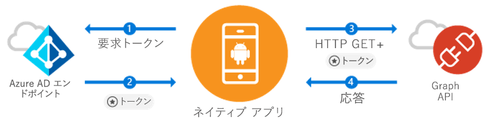

# <a name="quickstart-sign-in-users-and-call-the-microsoft-graph-api-from-an-android-app"></a>クイック スタート:Android アプリからユーザーにサインインし、Microsoft Graph API を呼び出す

[!INCLUDE [active-directory-develop-applies-v1-adal](../../../includes/active-directory-develop-applies-v1-adal.md)]

Android アプリケーションを開発している場合、Azure Active Directory (Azure AD) ユーザーには簡単にサインインできるのでお勧めです。 Azure AD を使用すると、アプリケーションから Microsoft Graph または独自の保護された Web API を介してユーザー データにアクセスできます。

Azure AD Authentication Library (ADAL) Android ライブラリは業界標準の OAuth 2.0 と OpenID Connect を使用して [Microsoft Azure Active Directory アカウント](https://azure.microsoft.com/services/active-directory/)をサポートしているので、アプリから [Microsoft Azure Cloud](https://cloud.microsoft.com) と [Microsoft Graph API](https://developer.microsoft.com/graph) を使い始めることができます。

このクイック スタートでは、次の方法について説明します。

* Microsoft Graph のトークンを取得する
* トークンを更新する
* Microsoft Graph を呼び出す
* ユーザーをサインアウトする

## <a name="prerequisites"></a>前提条件

作業を開始するには、ユーザーを作成し、アプリケーションを登録できるようにするために Azure AD テナントが必要になります。 テナントを所有していない場合は、「 [How to get an Azure Active Directory tenant (Azure Active Directory テナントの取得方法)](quickstart-create-new-tenant.md)」を参照して取得してください。

## <a name="scenario-sign-in-users-and-call-the-microsoft-graph"></a>シナリオ:ユーザーにサインインして Microsoft Graph を呼び出す



このアプリはすべての Azure AD アカウントで使用できます。 単一テナントと複数テナントの両方をサポートします (手順内で説明します)。 Microsoft Graph を介してエンタープライズ ユーザーと接続し、Azure + O365 データにアクセスするアプリを構築する方法を示します。 認証フロー中に、エンド ユーザーはサインインしてアプリケーションのアクセス許可に同意する必要があります。場合によっては、管理者がアプリケーションに対して同意する必要があります。 このサンプルのロジックの大部分は、エンド ユーザーを認証し、Microsoft Graph に対して基本的な呼び出しを行う方法を示す処理に使われています。

## <a name="sample-code"></a>サンプル コード

[GitHub](https://github.com/Azure-Samples/active-directory-android) に完全なサンプル コードがあります。

```Java
// Initialize your app with MSAL
AuthenticationContext mAuthContext = new AuthenticationContext(
        MainActivity.this,
        AUTHORITY,
        false);


// Perform authentication requests
mAuthContext.acquireToken(
    getActivity(),
    RESOURCE_ID,
    CLIENT_ID,
    REDIRECT_URI,
    PromptBehavior.Auto,
    getAuthInteractiveCallback());

// ...

// Get tokens to call APIs like the Microsoft Graph
mAuthResult.getAccessToken()
```

## <a name="step-1-register-and-configure-your-app"></a>手順 1:アプリの登録と構成

[Azure Portal](https://portal.azure.com) を使用して、Microsoft にネイティブ クライアント アプリケーションを登録する必要があります。

1. アプリの登録へのアクセス
    - [Azure Portal](https://aad.portal.azure.com) に移動します。
    - ***[Azure Active Directory]*** > ***[アプリの登録]*** の順に選択します。

2. アプリケーションの作成
    - **[新しいアプリケーションの登録]** を選択します。
    - **[名前]** フィールドにアプリ名を入力します。
    - **[アプリケーションの種類]** で **[ネイティブ]** を選択します。
    - **[リダイレクト URI]** に「`http://localhost`」と入力します。

3. Microsoft Graph の構成
    - **[設定]、[必要なアクセス許可]** の順に選択します。
    - **[追加]** を選択し、**[API を選択します]** 内の ***[Microsoft Graph]*** を選択します。
    - アクセス許可 **[サインインとユーザー プロファイルの読み取り]** を選択し、**[選択]** を選択して保存します。
        - このアクセス許可は `User.Read` スコープにマップされます。
    - 省略可能:**[必要なアクセス許可] > [Windows Azure Active Directory]** 内で、選択したアクセス許可 **[サインインとユーザー プロファイルの読み取り]** を削除します。 これで、ユーザーの同意ページにアクセス許可が 2 回表示されなくなります。

4. おめでとうございます! アプリの構成が完了しました。 次のセクションでは、以下を実行する必要があります。
    - `Application ID`
    - `Redirect URI`

## <a name="step-2-get-the-sample-code"></a>手順 2:サンプル コードの取得

1. コードを複製します。
    ```
    git clone https://github.com/Azure-Samples/active-directory-android
    ```
2. Android Studio でサンプルを開きます。
    - **[Open an existing Android Studio project]\(既存の Android Studio プロジェクトを開く\)** を選択します。

## <a name="step-3-configure-your-code"></a>手順 3:コードの構成

このコード サンプルのすべての構成は、***src/main/java/com/azuresamples/azuresampleapp/MainActivity.java*** ファイルにあります。

1. 定数 `CLIENT_ID` を `ApplicationID` で置き換えます。
2. 定数 `REDIRECT URI` を以前 (`http://localhost`) に構成した `Redirect URI` で置き換えます。

## <a name="step-4-run-the-sample"></a>手順 4:サンプルを実行する

1. **[ビルド]、[プロジェクトのクリーン]** の順に選択します。
2. **[実行]、[アプリの実行]** の順に選択します。
3. このアプリをビルドすると、基本的なユーザー エクスペリエンスが表示されます。 `Call Graph API` ボタンをクリックすると、サインインが求められ、新しいトークンを使用して Microsoft Graph API が自動的に呼び出されます。

## <a name="next-steps"></a>次の手順

1. ライブラリの構造と、新しいシナリオと機能の構成方法の詳細については、[ADAL Android Wiki](https://github.com/AzureAD/azure-activedirectory-library-for-android/wiki) を確認してください。
2. ネイティブ シナリオでは、アプリには埋め込み Webview が使用され、アプリ画面は表示されたままになります。 `Redirect URI` には任意の値を入力できます。
3. 問題や要望がある場合は、 Stackoverflow でタグ `azure-active-directory` を指定して問題を作成するか、投稿してください。

### <a name="cross-app-sso"></a>クロス アプリ SSO

「[Android で ADAL を使用してクロス アプリ SSO を有効にする方法](howto-v1-enable-sso-android.md)」を確認してください。

### <a name="auth-telemetry"></a>認証テレメトリ

ADAL ライブラリには、アプリ開発者が自作アプリの動作を理解し、より優れたエクスペリエンスを構築できる認証テレメトリが用意されています。 そのため、サインインの成功、アクティブなユーザーなどの興味深い分析をキャプチャすることができます。 認証テレメトリを使用するには、イベントを集計して格納するテレメトリ サービスをアプリ開発者が確立する必要があります。

認証テレメトリの詳細については、[ADAL Android 認証テレメトリ](https://github.com/AzureAD/azure-activedirectory-library-for-android/wiki/Telemetry)に関するページを参照してください。
