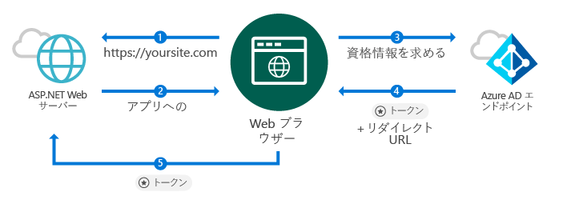
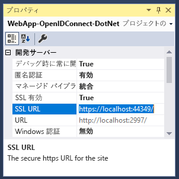
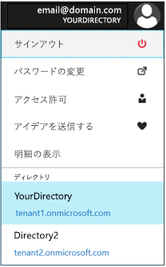

# <a name="quickstart-add-sign-in-with-microsoft-to-an-aspnet-web-app"></a>クイック スタート: ASP.NET Web アプリへの "Microsoft でサインイン" の追加

[!INCLUDE [active-directory-develop-applies-v1](../../../includes/active-directory-develop-applies-v1.md)]

このクイック スタートでは、OpenID Connect を使用する従来の Web ブラウザー ベースのアプリケーションで、ASP.NET MVC ソリューションを使用して "Microsoft でサインイン" を実装する方法について説明します。 ASP.NET アプリケーションで職場や学校のアカウントからのサインインを有効にする方法について説明します。

このクイック スタートの最後では、アプリケーションは Azure Active Directory (Azure AD) と統合された組織の職場および学校のアカウントのサインインを受け入れます。

> [!NOTE]
> 職場や学校のアカウントに加えて個人のアカウントのサインインを有効にする必要がある場合は、[v2.0 エンドポイント](azure-ad-endpoint-comparison.md)を使用します。 詳細については、[こちらの v2.0 エンドポイント用の ASP.NET チュートリアル](tutorial-v2-asp-webapp.md)と、v2.0 エンドポイントの現在の制限事項を説明している[こちらの記事](active-directory-v2-limitations.md)をご覧ください。

## <a name="prerequisites"></a>前提条件

最初に、これらの前提条件を満たしていることを確認します。

* Visual Studio 2015 Update 3 または Visual Studio 2017 がインストールされている。 お持ちでない場合は、 [Visual Studio 2017 を無料でダウンロードできます。](https://www.visualstudio.com/downloads/)

## <a name="scenario-sign-in-users-from-work-and-school-accounts-in-your-aspnet-app"></a>シナリオ: ASP.NET アプリで職場や学校のアカウントからユーザーにサインインする



このシナリオでは、ブラウザーが ASP.NET の Web サイトにアクセスし、サインイン ボタンを使用して認証を行うようユーザーに要求します。 このシナリオでは、Web ページを表示する処理の大半がサーバー側で発生します。

このクイック スタートでは、空のテンプレートから開始して ASP.NET Web アプリケーションにユーザーをサインインさせる方法と、サインイン ボタンとすべてのコントローラーおよびメソッドの追加などの手順を示し、これらのタスクの背後にある概念について説明します。 または、[Visual Studio Web テンプレート](https://docs.microsoft.com/aspnet/visual-studio/overview/2013/creating-web-projects-in-visual-studio#organizational-account-authentication-options)を使用し、**[組織アカウント]** を選択してからクラウド オプションの 1 つ (このオプションでは、追加のコントローラー、メソッド、ビューを備えた、より豊富なテンプレートを使用します) を選択して、Azure AD ユーザー (職場および学校のアカウント) をサインインさせるプロジェクトも作成できます。

## <a name="libraries"></a>ライブラリ

このクイック スタートでは、次のパッケージを使用します。

| ライブラリ | 説明 |
|---|---|
| [Microsoft.Owin.Security.OpenIdConnect](https://www.nuget.org/packages/Microsoft.Owin.Security.OpenIdConnect/) | アプリケーションで認証に OpenIDConnect を使用できるようにするためのミドルウェア |
| [Microsoft.Owin.Security.Cookies](https://www.nuget.org/packages/Microsoft.Owin.Security.Cookies) |アプリケーションで Cookie を使用してユーザー セッションを維持できるようにするためのミドルウェア |
| [Microsoft.Owin.Host.SystemWeb](https://www.nuget.org/packages/Microsoft.Owin.Host.SystemWeb) | ASP.NET 要求パイプラインを使用した、IIS 上での OWIN ベース アプリケーションの実行が可能 |
|  |  |

## <a name="step-1-set-up-your-project"></a>手順 1: プロジェクトの設定

これらの手順では、ASP.NET プロジェクトで OpenID 接続を使用して、OWIN ミドルウェアから認証パイプラインをインストールおよび構成する方法を示します。

代わりにこのサンプルの Visual Studio プロジェクトをダウンロードするには、次の手順に従います。
1. [GitHub でプロジェクトをダウンロードします](https://github.com/AzureADQuickStarts/WebApp-OpenIdConnect-DotNet/archive/GuidedSetup.zip)。
1. [構成手順](#configure-your-webconfig-and-register-an-application)に進み、実行前にコード サンプルを構成します。

## <a name="step-2-create-your-aspnet-project"></a>手順 2: ASP.NET プロジェクトを作成する

1. Visual Studio で、**[ファイル] > [新規] > [プロジェクト]** の順に移動します。
2. **[Visual C#\Web]** で **[ASP.NET Web アプリケーション (.NET Framework)]** を選択します。
3. アプリケーションに名前を付けて、**[OK]** を選択します。
4. **[Empty]** を選択して、**MVC** 参照を追加するチェック ボックスをオンにします。

## <a name="step-3-add-authentication-components"></a>手順 3: 認証コンポーネントの追加

1. Visual Studio で、**[ツール]、[NuGet パッケージ マネージャー]、[パッケージ マネージャー コンソール]** の順に移動します。
2. パッケージ マネージャー コンソールのウィンドウで以下を入力し、**OWIN ミドルウェア NuGet パッケージ**を追加します。

    ```powershell
    Install-Package Microsoft.Owin.Security.OpenIdConnect
    Install-Package Microsoft.Owin.Security.Cookies
    Install-Package Microsoft.Owin.Host.SystemWeb
    ```

<!--start-collapse-->
> ### <a name="about-these-packages"></a>これらのパッケージについて
>上記のライブラリでは、Cookie ベースの認証によって、OpenID 接続を使用したシングル サインオン (SSO) が有効になります。 認証が完了し、ユーザーを表すトークンがアプリケーションに送信されたら、OWIN ミドルウェアはセッションの Cookie を作成します。 そしてブラウザーはこの Cookie を後の要求に使用するため、ユーザーは再認証を受ける必要がなく、追加の検証は必要ありません。
<!--end-collapse-->

## <a name="step-4-configure-the-authentication-pipeline"></a>手順 4: 認証パイプラインを構成する

次の手順に従って、OWIN ミドルウェアの*スタートアップ クラス*を作成し、OpenID 接続の認証を構成します。 このクラスは自動的に実行されます。

> [!TIP]
> プロジェクトのルート フォルダー内に `Startup.cs` ファイルがない場合:<br/>
> 1. プロジェクトのルート フォルダーを右クリックして、**[追加]、[新しい項目...]、[OWIN Startup クラス]** の順に選択します。<br/>
> 2. これに `Startup.cs` という名前を付けます。<br/>
>
>> 選択したクラスが標準的な C# クラスではなく、OWIN Startup クラスであることを確認します。 これを確認するには、名前空間の上に `[assembly: OwinStartup(typeof({NameSpace}.Startup))]` があるかチェックします。

OWIN ミドルウェアの*スタートアップ クラス*を作成するには、次の手順に従います。

1. *OWIN* と *Microsoft.IdentityModel* の名前空間を `Startup.cs` に追加します。

    [!code-csharp[main](../../../WebApp-OpenIDConnect-DotNet/WebApp-OpenIDConnect-DotNet/Startup.cs?name=AddedNameSpaces "Startup.cs")]

2. スタートアップ クラスを次のコードに置き換えます。

    [!code-csharp[main](../../../WebApp-OpenIDConnect-DotNet/WebApp-OpenIDConnect-DotNet/Startup.cs?name=Startup "Startup.cs")]

<!--start-collapse-->
> [!NOTE]
> *OpenIDConnectAuthenticationOptions* で指定したパラメーターは、アプリケーションが Azure AD と通信するための調整役として機能します。 OpenID Connect ミドルウェアは Cookie を使用するため、上記のコードで示したように、Cookie 認証も設定する必要があります。 *ValidateIssuer* 値によって、OpenIdConnect はアクセスを 1 つの特定の組織に制限しないように設定されます。
<!--end-collapse-->

<!--end-setup-->

<!--start-use-->

## <a name="step-5-add-a-controller-to-handle-sign-in-and-sign-out-requests"></a>手順 5: サインインとサインアウト要求を処理するコントローラーを追加する

サインインとサインアウトの方法を公開する新しいコントローラーを作成します。

1.  **Controllers** フォルダーを右クリックし、**[追加]、[コントローラー]** の順に選択します
2.  **[MVC (.NET version) Controller – Empty] (MVC (.NET バージョン) コントローラー – 空)** を選択します。
3.  **[追加]** を選択します。
4.  これに `HomeController` という名前を付け、**[追加]** を選択します。
5.  クラスに **OWIN** 名前空間を追加します。

    [!code-csharp[main](../../../WebApp-OpenIDConnect-DotNet/WebApp-OpenIDConnect-DotNet/Controllers/HomeController.cs?name=AddedNameSpaces "HomeController.cs")]

6. コードを使用して認証チャレンジを開始し、サインインとサインアウトを処理する以下のメソッドをコントローラーに追加します。

    [!code-csharp[main](../../../WebApp-OpenIDConnect-DotNet/WebApp-OpenIDConnect-DotNet/Controllers/HomeController.cs?name=SigInAndSignOut "HomeController.cs")]

## <a name="step-6-create-the-apps-home-page-to-sign-in-users-via-a-sign-in-button"></a>手順 6: アプリのホーム ページを作成し、サインイン ボタンでユーザーをサインインする

Visual Studio で新しいビューを作成してサインイン ボタンを追加し、認証後にユーザー情報を表示します。

1. **Views\Home** フォルダーを右クリックし、**[ビューの追加]** を選択します。
1. これに **Index** という名前を付けます。
1. サインイン ボタンが含まれいる次の HTML をファイルに追加します。

    [!code-html[main](../../../WebApp-OpenIDConnect-DotNet/WebApp-OpenIDConnect-DotNet/Views/Home/Index.cshtml "Index.cshtml")]

<!--start-collapse--> このページは、SVG 形式で黒の背景の [サインイン] ボタンを追加します。<br/><br/> その他のサインイン ボタンについては、[ブランド化ガイドライン](howto-add-branding-in-azure-ad-apps.md)をご覧ください。
<!--end-collapse-->

## <a name="step-7-display-users-claims-by-adding-a-controller"></a>手順 7: コントローラーを追加してユーザーの要求を表示する

このコントローラーでは、コントローラーを保護する `[Authorize]` 属性の使用例を示します。 この属性は、認証されたユーザーのみを許可して、コントローラーへのアクセスを制限します。 次のコードではこの属性を利用して、サインインの一部として取得されたユーザー要求を表示します。

1. **Controllers** フォルダーを右クリックして、**[追加]、[コントローラー]** の順に選択します。
1. **[MVC (.NET version) Controller – Empty] (MVC (.NET バージョン) コントローラー – 空)** を選択します。
1. **[追加]** を選択します。
1. これに **ClaimsController** という名前を付けます。
1. コントローラー クラスのコードを、以下のコードに置き換えます。これによって、クラスに `[Authorize]` 属性が追加されます。

    [!code-csharp[main](../../../WebApp-OpenIDConnect-DotNet/WebApp-OpenIDConnect-DotNet/Controllers/ClaimsController.cs?name=ClaimsController "ClaimsController.cs")]

<!--start-collapse-->
> [!NOTE]
> `[Authorize]` 属性を使用しているため、このコントローラーのすべてのメソッドは、ユーザーが認証されている場合にのみ実行できます。 認証されていないユーザーがコントローラーにアクセスしようとすると、OWIN は認証チャレンジを開始し、ユーザーに認証を強制します。 上記のコードは、ユーザーのトークンに含まれる特定のユーザー属性のユーザーの要求コレクションを参照します。 これらの属性には、ユーザーのフルネームとユーザー名、さらにグローバル ユーザー識別子のサブジェクトが含まれます。 また、ユーザーの組織の ID を表す*テナント ID* も含まれています。
<!--end-collapse-->

## <a name="step-8-create-a-view-to-display-the-users-claims"></a>手順 8: ユーザー要求を表示するビューを作成する

Visual Studio で、Web ページでユーザー要求を表示するための新しいビューを作成します。

1. **Views\Claims** フォルダーを右クリックして、**[ビューの追加]** を選択します。
1. これに **Index** という名前を付けます。
1. 次の HTML をファイルに追加します。

    [!code-html[main](../../../WebApp-OpenIDConnect-DotNet/WebApp-OpenIDConnect-DotNet/Views/Claims/Index.cshtml "Index.cshtml")]

<!--end-use-->

<!--start-configure-->

## <a name="step-9-configure-your-webconfig-and-register-an-application"></a>手順 9: *web.config* を構成してアプリケーションを登録する

1. Visual Studio で、`configuration\appSettings` セクションの下の (ルート フォルダーにある) `web.config` に、以下のコードを追加します。

    ```xml
    <add key="ClientId" value="Enter_the_Application_Id_here" />
    <add key="RedirectUrl" value="Enter_the_Redirect_Url_here" />
    <add key="Tenant" value="common" />
    <add key="Authority" value="https://login.microsoftonline.com/{0}" />
    ```
2. ソリューション エクスプローラーで、プロジェクトを選択して <i>[プロパティ]</i> ウィンドウを確認します ([プロパティ] ウィンドウが表示されない場合は F4 キーを押します)
3. [SSL 有効] を <code>True</code> に変更します
4. プロジェクトの SSL URL をクリップボードにコピーします。<br/><br/><br />
5. <code>web.config</code> で、<code>Enter_the_Redirect_URL_here</code> をプロジェクトの SSL URL に置き換えます。

### <a name="register-your-application-in-the-azure-portal-then-add-its-information-to-webconfig"></a>Azure Portal でアプリケーションを登録し、その情報を *web.config* に追加します

1. [[Microsoft Azure Portal - アプリの登録]](https://portal.azure.com/#blade/Microsoft_AAD_IAM/ActiveDirectoryMenuBlade/RegisteredApps) に移動して、アプリケーションを登録します。
2. **[新しいアプリケーションの登録]** を選択します。
3. アプリケーションの名前を入力します。
4. Visual Studio プロジェクトの *SSL URL* を **[サインオン URL]** に貼り付けます。 この URL は、登録するアプリケーションの応答 URL の一覧にも自動的に追加されます。
5. **[作成]** を選んで、アプリケーションを登録します。 このアクションにより、アプリケーションの一覧に戻ります。
6. ここで、作成したアプリケーションの検索や選択を行って、そのプロパティを開きます。
7. **[アプリケーション ID]** の下にある GUID をクリップボードにコピーします。
8. Visual Studio に戻り、`web.config` で `Enter_the_Application_Id_here` を登録したアプリケーションのアプリケーション ID に置き換えます。

> [!TIP]
> アカウントが複数のディレクトリにアクセスするように構成されている場合は、Azure portal の右上にあるアカウント名をクリックし、選択したディレクトリを指定されたとおりに検証して、アプリケーションを登録する組織の適切なディレクトリを選択したことを確認します。<br/>

## <a name="step-10-configure-sign-in-options"></a>手順 10: サインイン オプションの構成

1 つの組織の Azure AD インスタンスに属するユーザーのみにサインインを許可するか、任意の組織に属するユーザーからのサインインを受け入れるようにアプリケーションを構成できます。 次のいずれかの手順に従ってください。

### <a name="configure-your-application-to-allow-sign-ins-of-work-and-school-accounts-from-any-company-or-organization-multi-tenant"></a>任意の会社または組織の職場および学校のアカウントのサインインを許可するようにアプリケーションを構成する (マルチテナント)

Azure AD と統合されている会社または組織の職場および学校のアカウントのサインインを受け入れる場合は、次の手順に従います。 これは、"*SaaS アプリケーション*" で一般的なシナリオです。

1. [[Microsoft Azure Portal - アプリの登録]](https://portal.azure.com/#blade/Microsoft_AAD_IAM/ActiveDirectoryMenuBlade/RegisteredApps) に戻り、登録したアプリケーションを探します。
2. **[すべての設定]** で **[プロパティ]** を選択します。
3. **[マルチテナント]** プロパティを **[はい]** に変更して、**[保存]** を選択します。

この設定およびマルチテナント アプリケーションの概念について詳しくは、[マルチテナントの概要](howto-convert-app-to-be-multi-tenant.md)をご覧ください。

### <a name="restrict-users-from-only-one-organizations-active-directory-instance-to-sign-in-to-your-application-single-tenant"></a>アプリケーションへのサインインを 1 つの組織の Active Directory インスタンスのユーザーのみに制限する (シングルテナント)

このオプションは、基幹業務アプリケーションで一般的なシナリオです。

アプリケーションが特定の Azure AD インスタンスに属するアカウント (そのインスタンスの *ゲスト アカウント* を含む) からのサインインのみを受け入れるようにする場合は、以下の手順を実行します。

1. `Common` からの *web.config* の `Tenant` パラメーターを組織のテナント名前と置き換えます (例: *contoso.onmicrosoft.com*)。
1. [*OWIN Startup クラス*](#configure-the-authentication-pipeline) 内の `ValidateIssuer` 引数を `true` に変更します。

特定の組織の一覧のみからユーザーを許可するには、次の手順を実行します。

1. `ValidateIssuer` を true に設定します。
1. 組織の一覧を指定するには、`ValidIssuers` パラメーターを使用します。

または、*IssuerValidator* パラメーターを使用して発行者を検証するカスタム メソッドを実装することもできます。 `TokenValidationParameters` について詳しくは、[こちらの MSDN の記事](https://msdn.microsoft.com/library/system.identitymodel.tokens.tokenvalidationparameters.aspx "TokenValidationParameters に関する MSDN 記事")をご覧ください。

<!--end-configure-->

<!--start-configure-arp-->
<!--
## Configure your ASP.NET Web App with the application's registration information

In this step, you will configure your project to use SSL, and then use the SSL URL to configure your application’s registration information. After this, add the application’ registration information to your solution via *web.config*.

1.  In Solution Explorer, select the project and look at the `Properties` window (if you don’t see a Properties window, press F4)
2.  Change `SSL Enabled` to `True`
3.  Copy the value from `SSL URL` above and paste it in the `Redirect URL` field on the top of this page, then click *Update*:<br/><br/><br />
4.  Add the following in `web.config` file located in root’s folder, under section `configuration\appSettings`:

```xml
<add key="ClientId" value="[Enter the application Id here]" />
<add key="RedirectUri" value="[Enter the Redirect URL here]" />
<add key="Tenant" value="common" />
<add key="Authority" value="https://login.microsoftonline.com/{0}" /> 
```
-->
<!--end-configure-arp-->
<!--start-test-->

## <a name="step-11-test-your-code"></a>手順 11: コードのテスト

1. **F5** を押して、Visual Studio でプロジェクトを実行します。 ブラウザーが開き、`http://localhost:{port}` に移動します。**[Microsoft アカウントでサインイン]** ボタンが表示されます。
1. サインイン用ボタンを選択します。

### <a name="sign-in"></a>[サインイン]

テストの準備ができたら、職場アカウント (Azure AD) を使用してサインインします。

![[Microsoft アカウントでサインイン] ボタンが表示されたブラウザー ウィンドウ](./media/quickstart-v1-aspnet-webapp/aspnetbrowsersignin.png)

![[Microsoft アカウントでサインイン] ボタンが表示されたブラウザー ウィンドウ](./media/quickstart-v1-aspnet-webapp/aspnetbrowsersignin2.png)

#### <a name="expected-results"></a>予想される結果

サインインすると、Microsoft アプリケーション登録ポータルのアプリケーションの登録情報で指定した HTTPS URL を持つ Web サイトのホーム ページにリダイレクトされます。 このページには "*こんにちは {ユーザー}*" とサインアウトのリンクの他に、ユーザーの要求を確認するリンク、つまり前に作成した承認コントローラーのリンクが表示されます。

### <a name="see-users-claims"></a>ユーザーの要求を確認する

ハイパーリンクを選択して、ユーザーの要求を確認します。 このアクションにより、認証されたユーザーのみが利用できるコントローラーとビューに移動します。

#### <a name="expected-results"></a>予想される結果

 ログオンしたユーザーの次の基本プロパティが記載されたテーブルが表示されます。

| プロパティ | 値 | 説明 |
|---|---|---|
| Name | {ユーザーのフルネーム} | ユーザーの姓と名 |
| ユーザー名 | <span>user@domain.com</span> | ログオンしたユーザーの識別に使用されるユーザー名 |
| Subject| {件名} |Web 上でユーザーのログオンを一意に識別する文字列 |
| テナント ID | {Guid} | ユーザーの Azure AD 組織を一意に表す *guid* |

さらに、認証要求に含まれるすべてのユーザー要求が記載されたテーブルが表示されます。 ID トークンに含まれるすべての要求の一覧とその説明については、[ID トークン内の要求の一覧](https://docs.microsoft.com/azure/active-directory/develop/active-directory-token-and-claims)をご覧ください。

### <a name="optional-access-a-method-that-has-an-authorize-attribute"></a>(省略可能) *[Authorize]* 属性を持つメソッドにアクセスする

この手順では、匿名ユーザーとして要求コントローラーへのアクセスをテストします。<br/>
ユーザーのサインアウトのリンクを選択し、サインアウトのプロセスを完了します。<br/>
お使いのブラウザーで「 http://localhost:{port}/claims」を入力し、`[Authorize]` 属性で保護されているコントローラーにアクセスします

#### <a name="expected-results"></a>予想される結果

ビュー表示の認証を要求するプロンプトが表示されます。

## <a name="additional-information"></a>追加情報

<!--start-collapse-->
### <a name="protect-your-entire-web-site"></a>Web サイト全体を保護する

`Global.asax` の `Application_Start` メソッドで `GlobalFilters` に `AuthorizeAttribute` を追加して、Web サイト全体を保護します。

```csharp
GlobalFilters.Filters.Add(new AuthorizeAttribute());
```
<!--end-collapse-->

<div></div>
<br/>

<!--end-test-->

## <a name="next-steps"></a>次の手順

ここからは、さらなるシナリオに進むことができます。

> [!div class="nextstepaction"]
> [ASP.NET チュートリアル](https://docs.microsoft.com/azure/active-directory/develop/tutorial-v2-asp-webapp)