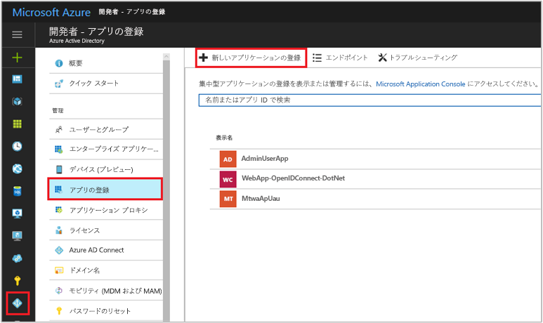
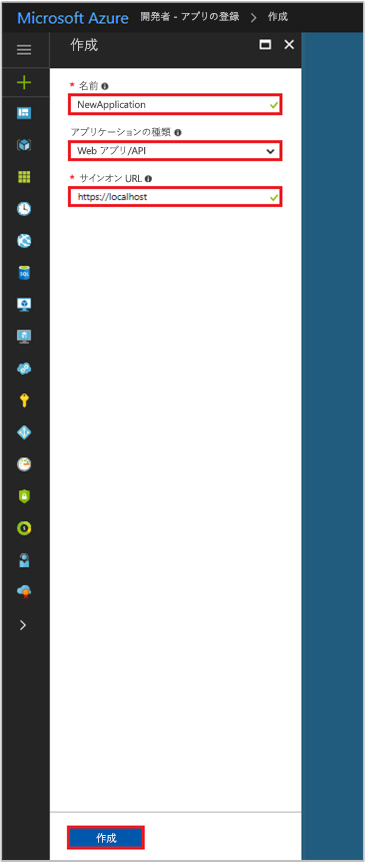

# <a name="integrating-applications-with-azure-active-directory"></a>Azure Active Directory とアプリケーションの統合
[!INCLUDE [active-directory-devguide](../../../includes/active-directory-devguide.md)]

エンタープライズ開発者や SaaS (サービスとしてのソフトウェア) プロバイダーは、商用クラウド サービスまたは基幹業務アプリケーションを開発し、それらを Azure Active Directory (Azure AD) と統合することによって、自社のサービスにセキュリティで保護されたサインインと認可を実現することができます。 アプリケーションまたはサービスを Azure AD と統合するには、まず開発者がアプリケーションを Azure AD に登録しておく必要があります。

この記事では、Azure AD でアプリケーションの登録を追加、更新、または削除する方法について説明します。 Azure AD と統合できるさまざまなアプリケーションの種類や、他のリソース (Web API など) にアクセスできるようにアプリケーションを構成する方法などについて説明します。

登録されたアプリケーションを表す 2 つの Azure AD オブジェクト、およびそれらの関係の詳細については、[アプリケーション オブジェクトとサービス プリンシパル オブジェクト](app-objects-and-service-principals.md)に関するページを参照してください。Azure Active Directory を使ってアプリケーションを開発するときに使用するブランド化ガイドラインの詳細については、[統合されたアプリケーションのブランド化に関するガイドライン](howto-add-branding-in-azure-ad-apps.md)を参照してください。

## <a name="adding-an-application"></a>アプリケーションの追加
アプリケーションで Azure AD の機能を使用するには、まず Azure AD テナントにそのアプリケーションを登録する必要があります。 この登録プロセスでは、アプリケーションが配置されている URL、ユーザーが認証された後の応答の送信先となる URL、アプリを識別する URI など、アプリケーションの詳細を Azure AD に提供します。

### <a name="to-register-a-new-application-using-the-azure-portal"></a>Azure Portal を使用して新しいアプリケーションを登録するには
1. [Azure Portal](https://portal.azure.com) にサインインします。
2. ご利用のアカウントで複数の Azure AD テナントにアクセスできる場合は、右上隅でアカウントをクリックし、ポータルのセッションを目的のテナントに設定します。
3. 左側のナビゲーション ウィンドウで、**[Azure Active Directory]** サービスをクリックし、**[アプリの登録]**、**[新しいアプリケーションの登録]** の順にクリックします。

   

4. **[作成]** ページが表示されたら、アプリケーションの登録情報を入力します。 

  - **名前:** わかりやすいアプリケーション名を入力します
  - **アプリケーションの種類:** 
    - デバイスのローカルにインストールされている[クライアント アプリケーション](developer-glossary.md#client-application)については、[ネイティブ] を選択します。 OAuth の public [ネイティブ クライアント](developer-glossary.md#native-client)の場合には、この設定を使用します。
    - セキュリティで保護されたサーバーにインストールされている[クライアント アプリケーション](developer-glossary.md#client-application)と[リソース/API アプリケーション](developer-glossary.md#resource-server)については、[Web アプリ/API] を選択します。 OAuth の confidential [Web クライアント](developer-glossary.md#web-client)と、public [ユーザーエージェントベース クライアント](developer-glossary.md#user-agent-based-client)の場合には、この設定を使用します。 同じアプリケーションでクライアントとリソース/API を両方とも公開することもできます。
  - **サインオン URL:** 種類に [Web アプリ/API] を選択したアプリケーションについて、アプリのベース URL を入力します。 ローカル マシンで実行されている Web アプリの URL であれば、たとえば `http://localhost:31544` のようになります。 ユーザーはこの URL を使用して、Web クライアント アプリケーションにサインインすることになります。 
  - **リダイレクト URI:** 種類に [ネイティブ] を選択したアプリケーションについて、Azure AD がトークン応答を返すために使用する URI を入力します。 `http://MyFirstAADApp` など、アプリケーションに固有の値を入力してください。

   

   Web アプリケーションまたはネイティブ アプリケーションの具体的な例が必要な場合には、[クイック スタート](azure-ad-developers-guide.md#get-started)を参照してください。

5. 完了したら、**[作成]** をクリックします。 Azure AD によりアプリケーションに一意の ID が割り当てられ、アプリケーションのメイン登録ページが表示されます。 アプリケーションが Web アプリケーションとネイティブ アプリケーションのどちらであるかに応じて、アプリケーションに機能を追加するためのさまざまなオプションが表示されます。 同意の概要と、アプリケーション登録で追加の構成機能 (資格情報、アクセス許可、他のテナントのユーザーによるサインインの有効化) を有効にする方法の詳細については、次のセクションを参照してください。

  > [!NOTE]
  > 既定では、新しく登録された Web アプリケーションは、同じテナントのユーザー**のみ**サインインできる構成になります。
  > 
  > 

## <a name="updating-an-application"></a>アプリケーションの更新
アプリケーションを Azure AD に登録した後には、Web API にアクセスできるようにしたり、他の組織で使用できるようにしたりするために、登録したアプリケーションを更新する作業が必要になることがあります。 このセクションでは、アプリケーションをさらに細かく構成するためのさまざまな方法を説明します。 まずは、同意フレームワークの概要を説明します。他のユーザーまたはアプリケーションが使用する必要があるアプリケーションを構築する場合には、このフレームワークについて理解しておくことが重要です。

### <a name="overview-of-the-consent-framework"></a>同意フレームワークの概要

Azure AD の同意フレームワークを使用すると、マルチテナントの Web クライアント アプリケーションやネイティブ クライアント アプリケーションを簡単に開発できます。 こうしたアプリケーションには、登録されている Azure AD テナントとは異なるテナントのユーザー アカウントを使ってサインインできます。 また、独自の Web API に加えて、Microsoft Graph API (Azure Active Directory、Intune、および Office 365 のサービスへのアクセスに使用する API) をはじめとする Microsoft サービスの API など、各種の Web API にもアクセスが必要になることがあります。 このフレームワークの根底には、ディレクトリのデータにアクセスする可能性があるためにディレクトリへの登録を要求しているアプリケーションに対して同意を与えるユーザーまたは管理者が存在します。

たとえば、Web クライアント アプリケーションで Office 365 ユーザーの予定表情報を読み取る必要があるときは、まずそのユーザーがクライアント アプリケーションに同意を与える必要があります。 同意が与えられると、クライアント アプリケーションがユーザーに代わって Microsoft Graph API を呼び出し、必要に応じて予定表情報を利用できるようになります。 [Microsoft Graph API](https://graph.microsoft.io) は、Office 365 のデータ (Exchange の予定表とメッセージ、SharePoint のサイトとリスト、OneDrive のドキュメント、OneNote のノートブック、Planner のタスク、Excel のブックなど)、Azure AD のユーザーとグループなど、Microsoft クラウド サービスのさまざまなデータ オブジェクトにアクセスするための API です。 

Azure AD の同意フレームワークは、OAuth 2.0 と、public クライアントまたは confidential クライアントを使用した OAuth 2.0 のさまざまなフロー (Authorization Code Grant や Client Credentials Grant など) を基盤としています。 Azure AD では OAuth 2.0 を採用することによって、スマートフォン、タブレット、サーバーなどにインストールされるアプリケーションから Web アプリケーションに至るまで、多種多様なクライアント アプリケーションの作成と、そのアプリケーションが必要なリソースにアクセスすることを可能にしています。

OAuth 2.0 の認可付与を採用している同意フレームワークの使い方の詳細については、[OAuth 2.0 と Azure AD を使用した Web アプリケーションへのアクセスの承認](v1-protocols-oauth-code.md)に関するページと、「[Azure AD の認証シナリオ](authentication-scenarios.md)」を参照してください。 Microsoft Graph を使って Office 365 に対するアクセスの承認を得る方法の詳細については、[Microsoft Graph によるアプリ認証](https://graph.microsoft.io/docs/authorization/auth_overview)に関するページを参照してください。

#### <a name="example-of-the-consent-experience"></a>同意エクスペリエンスの例

以下の手順は、アプリケーションの開発者とユーザーにとっての同意エクスペリエンスがどのようなものになるかを示したものです。

1. 何らかのリソース/API にアクセスするために一定のアクセス許可を要求する必要がある Web クライアント アプリケーションがあると仮定しましょう。 構成方法については次のセクションで詳しく説明するとして、ここで重要なのは、構成時に Azure Portal を使用してアクセス許可の要求を宣言するという点です。 この設定は他の構成設定と同じく、アプリケーションを Azure AD に登録する作業の一環として行います。
   
  
    
2. 現在、アプリケーションの更新が終わって、アプリケーションが実行中になり、これからユーザーが初めてアプリケーションを使用するところだとします。 アプリケーションではまず、Azure AD の `/authorize` エンドポイントから認証コードを取得する必要があります。 取得した認証コードは、後でアクセス トークンと更新トークンの取得に使用します。

3. ユーザーの認証がまだであれば、Azure AD の `/authorize` エンドポイントによりサインイン画面が表示されます。
   
  

4. ユーザーのサインインが終わると、そのユーザーに対して同意ページを表示する必要があるかどうかが Azure AD により判定されます。 表示の要否の判定基準は、ユーザー (またはそのユーザーが所属する組織の管理者) がアプリケーションに既に同意を与えているかどうかです。 同意がまだであれば、Azure AD からユーザーに対して同意を求めるメッセージと、アプリケーションが機能するうえで必要なアクセス許可が表示されます。 同意ダイアログに表示されるアクセス許可は、Azure Portal の [委任されたアクセス許可] で選択したものと同じになります。
   
  

5. ユーザーが同意すると、アプリケーションに認証コードが返されます。アクセス トークンと更新トークンを取得するときには、この認証コードが必要になります。 このフローの詳細については、「Azure AD の認証シナリオ」の「[Web アプリケーション対 Web API](authentication-scenarios.md#web-application-to-web-api)」を参照してください。

6. 管理者であれば、テナント内のユーザー全員に代わってアプリケーションの委任されたアクセス許可に同意することもできます。 管理者が同意すると、そのテナントのユーザーには同意ダイアログが表示されなくなります。この同意は、管理者ロールが与えられたユーザーが [Azure portal](https://portal.azure.com) で行うことができます。 アプリケーションの **[設定]** ページで、**[必要なアクセス許可]**、**[アクセス許可の付与]** の順にクリックしてください。 

  
    
  > [!NOTE]
  > ADAL.js を使用するシングルページ アプリ (SPA) では現在、**[アクセス許可の付与]** ボタンを使用して明示的に同意する必要があります。 そうしないと、アクセス トークンが要求されたときにアプリケーションでエラーが発生します。 

### <a name="configure-a-client-application-to-access-web-apis"></a>Web API にアクセスするためのクライアント アプリケーションの構成
Web/confidential クライアント アプリケーションが認証を必要とする認可付与フローに参加 (し、アクセス トークンを取得) するためには、セキュリティで保護された資格情報を確立する必要があります。 Azure portal でサポートされている既定の認証方法は、クライアント ID と秘密鍵の組み合わせです。 このセクションでは、クライアントの資格情報に秘密鍵を追加するために必要な構成手順について説明します。

さらに、同意フレームワークでは、リソース アプリケーションによって公開されている Web API (Microsoft Graph API など) にクライアントがアクセスできるようになる前に、要求されたアクセス許可に基づいてクライアントに必要なアクセス許可が付与されていることを確認します。 既定では、どのアプリケーションも "Windows Azure Active Directory" (Graph API) および "Windows Azure Service Management API" のアクセス許可を選択できます。 また、[Graph API の [サインインとユーザー プロファイルの読み取り] アクセス許可](https://msdn.microsoft.com/Library/Azure/Ad/Graph/howto/azure-ad-graph-api-permission-scopes#PermissionScopeDetails)が既定で選択されています。 Office 365 のサブスクリプションを保有しているアカウントが存在するテナントにクライアントを登録しようとしている場合には、SharePoint と Exchange Online 用の Web API とアクセス許可を選択できます。 目的の Web API ごとに [2 種類のアクセス許可](developer-glossary.md#permissions)から選択できます。

- アプリケーションのアクセス許可: クライアント アプリケーションは、(ユーザー コンテキストなしで) アプリケーションとして Web API に直接アクセスする必要があります。 この種類のアクセス許可には管理者の同意が必要であるほか、ネイティブ クライアント アプリケーションでは使用できません。

- 委任されたアクセス許可: クライアント アプリケーションは、サインインしているユーザーとして Web API にアクセスする必要があります。アクセスにあたっては、選択されているアクセス許可に応じて制限が適用されます。 この種類のアクセス許可は、管理者の同意が必要でない限り、ユーザーが付与できます。 

  > [!NOTE]
  > 委任されたアクセス許可をアプリケーションに追加しても、テナント内のユーザーに対して自動的に同意が与えられるわけではありません。 追加したアクセス許可については、実行時にユーザーが手動で同意する必要があります。もっとも、管理者が Azure Portal のアプリケーション ページで **[必要なアクセス許可]** セクションの **[アクセス許可の付与]** をクリックした場合には、この限りではありません。 

#### <a name="to-add-application-credentials-or-permissions-to-access-web-apis"></a>Web API にアクセスするためのアプリケーションの資格情報またはアクセス許可を追加するには
1. [Azure Portal](https://portal.azure.com) にサインインします。
2. ご利用のアカウントで複数の Azure AD テナントにアクセスできる場合は、右上隅でアカウントをクリックし、ポータルのセッションを目的のテナントに設定します。
3. 左側のナビゲーション ウィンドウで、**[Azure Active Directory]** サービスをクリックし、**[アプリの登録]** をクリックして、構成するアプリケーションを検索/クリックします。

   

4. アプリケーションのメイン登録ページが表示され、そのアプリケーションの **[設定]** ページが開きます。 Web アプリケーションの資格情報の秘密鍵を追加するには、次の操作を行います。
  - **[設定]** ページの **[キー]** セクションをクリックします。 
  - 鍵の説明を追加します。
  - 期間として 1 年または 2 年を選択します。
  - **[保存]** をクリックします。 構成の変更を保存すると、右端の列に鍵の値が格納されます。 クライアント アプリケーションのコードで使用するので、**必ず鍵をコピーしておいてください**。このページを一度閉じると、鍵にアクセスできなくなります。

  

5. 次の手順に従い、クライアントからリソース API にアクセスするためのアクセス許可を追加します。
  - **[設定]** ページの **[必要なアクセス許可]** セクションをクリックします。 
  - **[追加]** をクリックします。
  - **[API を選択します]** をクリックし、選択するリソースの種類を選択します。
  - 利用可能な API の一覧を参照するか、検索ボックスを使用して、ディレクトリ内にあって Web API を公開している利用可能なリソース アプリケーションの中から選択します。 目的のリソースをクリックし、**[選択]** をクリックします。
  - **[アクセスの有効化]** ページが表示されます。 アプリケーションのアクセス許可や委任されたアクセス許可のうち、アプリケーションが API にアクセスするうえで必要なものを選択します。
   
  

  

6. 完了したら、**[アクセスの有効化]** ページで **[選択]** をクリックし、**[API アクセスの追加]** ページ で **[完了]** をクリックします。 **[必要なアクセス許可]** ページに戻ります。ページでは API の一覧に新しいリソースが追加されています。

  > [!NOTE]
  > **[完了]** をクリックすると、構成済みの他のアプリケーションに対するアクセス許可に基づいて、ディレクトリ内のアプリケーションのアクセス許可も自動的に設定されます。 これらのアプリケーションのアクセス許可は、アプリケーションの **[設定]** ページで確認できます。
  > 
  > 

### <a name="configuring-a-resource-application-to-expose-web-apis"></a>Web API を公開するためのリソース アプリケーションの構成

自ら Web API を開発し、クライアント アプリケーションで利用できるようにすることもできます。そのためには、アクセスの[スコープ](developer-glossary.md#scopes)と[ロール](developer-glossary.md#roles)を公開する必要があります。 Web API を適切に構成すれば、Graph API や Office 365 API など、他の Microsoft Web API と同じように利用できるようになります。 アクセスのスコープとロールを公開するには、[アプリケーション マニフェスト](developer-glossary.md#application-manifest)を使用します。アプリケーション マニフェストは、アプリケーションの ID 構成を示した JSON ファイルです。 

以下のセクションでは、リソース アプリケーションのマニフェストを変更してアクセス スコープを公開する方法について説明します。

#### <a name="adding-access-scopes-to-your-resource-application"></a>リソース アプリケーションへのアクセス スコープの追加

1. [Azure Portal](https://portal.azure.com) にサインインします。
2. ご利用のアカウントで複数の Azure AD テナントにアクセスできる場合は、右上隅でアカウントをクリックし、ポータルのセッションを目的のテナントに設定します。

3. 左側のナビゲーション ウィンドウで、**[Azure Active Directory]** サービスをクリックし、**[アプリの登録]** をクリックして、構成するアプリケーションを検索/クリックします。

   

4. アプリケーションのメイン登録ページが表示され、そのアプリケーションの **[設定]** ページが開きます。 アプリケーションの登録ページで **[マニフェスト]** をクリックして、**[マニフェストの編集]** ページに切り替えます。 Web ベースのマニフェスト エディターが開き、ポータルでマニフェストを**編集**できます。 必要があれば、**[ダウンロード]** をクリックしてローカルで編集します。編集を終えたら **[アップロード]** をクリックすると、アプリケーションに編集後のマニフェストが適用されます。

5. この例では、`oauth2Permissions` コレクションに以下の JSON 要素を追加して、リソース/API で `Employees.Read.All` という新しいスコープを公開します。 既存の `user_impersonation` スコープは、登録時に既定で提供されます。 `user_impersonation` は、クライアント アプリケーションがリソースに対するアクセス許可を要求するにあたり、サインインしたユーザーの ID を使えるようにするためのものです。 既存の `user_impersonation` スコープ要素の後にコンマを追加したうえで、リソースのニーズに応じてプロパティの値を変更してください。 

  ```json
  {
    "adminConsentDescription": "Allow the application to have read-only access to all Employee data.",
    "adminConsentDisplayName": "Read-only access to Employee records",
    "id": "2b351394-d7a7-4a84-841e-08a6a17e4cb8",
    "isEnabled": true,
    "type": "User",
    "userConsentDescription": "Allow the application to have read-only access to your Employee data.",
    "userConsentDisplayName": "Read-only access to your Employee records",
    "value": "Employees.Read.All"
  }
  ```
  > [!NOTE]
  > "id" の値は、[guidgen](https://msdn.microsoft.com/library/ms241442%28v=vs.80%29.aspx) などの GUID 生成ツールや、プログラムを使って作成する必要があります。 この値は、Web API によって公開されるスコープの一意の識別子となります。 クライアントに対して Web API にアクセスするためのアクセス許可が適切に構成されていると、そのクライアントには、Azure AD によって OAuth 2.0 アクセス トークンが発行されます。 クライアントが Web API を呼び出すときには、このアクセス トークンを提示することになります。そして、このアクセス トークンでは、スコープ (scp) 要求がアプリケーションの登録時に要求されたアクセス許可のとおりに設定されています。
  >
  > 公開するスコープは、必要に応じて後から追加することもできます。 たとえば、Web API で、さまざまな機能が関連付けられたスコープをいくつも公開しているとします。 リソースでは、受け取った OAuth 2.0 アクセス トークンのスコープ (`scp`) 要求を評価することによって、実行時に Web API へのアクセスを制御します。
  > 

6. 完了したら、**[保存]** をクリックします。 これで Web API の構成が終わり、ディレクトリ内の他のアプリケーションが利用できるようになりました。 

  

#### <a name="verify-the-web-api-is-exposed-to-other-applications-in-your-tenant"></a>テナント内の他のアプリケーションに Web API が公開されているかどうかの確認
1. Azure AD テナントに戻って、**[アプリの登録]** をもう一度クリックし、構成するクライアント アプリケーションを検索/クリックします。

   

2. 「[Web API にアクセスするためのクライアント アプリケーションの構成](#configure-a-client-application-to-access-web-apis)」の手順 5. をもう一度実行します。 **[API を選択します]** の手順まで進んだら、検索フィールドにアプリケーション名を入力してリソースを検索し、**[選択]** をクリックします。 

3. **[アクセスの有効化]** ページに新しいスコープが表示されていれば、クライアントのアクセス許可の要求で利用できる状態です。

  

#### <a name="more-on-the-application-manifest"></a>アプリケーション マニフェストの詳細

アプリケーション マニフェストは、実際にはアプリケーション エンティティを更新するためのメカニズムとしての役割を果たすものです。ここまでに取り上げた API のアクセス スコープをはじめ、Azure AD アプリケーションの ID 構成の属性はすべて、このアプリケーション エンティティで定義されています。 アプリケーション エンティティとそのスキーマの詳細については、[Graph API のアプリケーション エンティティに関するドキュメント](https://msdn.microsoft.com/Library/Azure/Ad/Graph/api/entity-and-complex-type-reference#application-entity)を参照してください。 このドキュメントでは、API のアクセス許可を指定するために使用するアプリケーション エンティティのメンバーについて、詳細な参照情報を確認できます。たとえば、次のような情報です。  

- appRoles メンバー: Web API の[アプリケーションのアクセス許可](developer-glossary.md#permissions)を定義するときに使用する [AppRole](https://msdn.microsoft.com/Library/Azure/Ad/Graph/api/entity-and-complex-type-reference#approle-type) エンティティのコレクションです。 
- oauth2Permissions メンバー: Web API の[委任されたアクセス許可](developer-glossary.md#permissions)を定義するときに使用する [OAuth2Permission](https://msdn.microsoft.com/Library/Azure/Ad/Graph/api/entity-and-complex-type-reference#oauth2permission-type) エンティティのコレクションです。

アプリケーション マニフェストの概念一般の詳細については、[Azure Active Directory のアプリケーション マニフェスト](reference-app-manifest.md)に関するページを参照してください。

### <a name="accessing-the-azure-ad-graph-and-office-365-via-microsoft-graph-apis"></a>Microsoft Graph API による Azure AD Graph と Office 365 へのアクセス  

前に説明したように、独自のアプリケーションのための API を公開してそれにアクセスするだけでなく、クライアント アプリケーションを登録して、Microsoft のリソースにより公開されている API にアクセスすることもできます。 Microsoft Graph API (ポータルのリソース/API 一覧では "Microsoft Graph") は、Azure AD に登録されているすべてのアプリケーションが利用できます。 Office 365 サブスクリプションにサインアップしたアカウントが存在するテナントにクライアント アプリケーションを登録した場合には、さまざまな Office 365 リソースにより公開されているスコープにもアクセスできます。

Microsoft Graph API により公開されているスコープの全容については、[Microsoft Graph のアクセス許可に関するリファレンス](https://developer.microsoft.com/en-us/graph/docs/concepts/permissions_reference)を参照してください。

> [!NOTE]
> 現時点では、ネイティブ クライアント アプリケーションに [Access your organization's directory]\(組織のディレクトリにアクセスする\) アクセス許可を使用した場合、そのアプリケーションで Azure AD Graph API しか呼び出すことができなくなるという制約があります。 この制約は、Web アプリケーションには適用されません。
> 
> 

### <a name="configuring-multi-tenant-applications"></a>マルチテナント アプリケーションの構成

Azure AD にアプリケーションを登録するときには、自分が所属する組織のユーザーだけがそのアプリケーションにアクセスできるようにすることもあれば、 反対に、外部組織のユーザーがアプリケーションにアクセスできるようにすることもあります。 前者をシングルテナント アプリケーション、後者をマルチテナント アプリケーションと呼びます。 このセクションでは、シングルテナント アプリケーションの構成を変更してマルチテナント アプリケーションにする方法を説明します。

シングルテナント アプリケーションとマルチテナント アプリケーションの違いに注意することが重要です。  

- シングルテナント アプリケーションは、1 つの組織で使用することを想定しています。 典型例としては、エンタープライズ開発者が作成した基幹業務 (LOB) アプリケーションが挙げられます。 シングルテナント アプリケーションには、アプリケーションを登録したテナントと同じテナントに存在するアカウントのユーザーのみがアクセスできます。 このため、1 つのディレクトリにプロビジョニングするだけで済みます。
- マルチテナント アプリケーションは、多数の組織で使用することを想定しています。 サービスとしてのソフトウェア (SaaS) Web アプリケーションとも呼ばれ、独立系ソフトウェア ベンダー (ISV) が作成したアプリケーションがその典型例です。 マルチテナント アプリケーションは、ユーザーがアクセスする必要があるテナントそれぞれにプロビジョニングする必要があります。 アプリケーションが登録されているテナント以外のテナントの場合、登録にはユーザーまたは管理者の同意が必要です。 ネイティブ クライアント アプリケーションは、リソース所有者のデバイスにインストールされるので、既定でマルチテナントになります。 同意フレームワークの詳細については、前の「[同意フレームワークの概要](#overview-of-the-consent-framework)」セクションを参照してください。

アプリケーションをマルチテナントにするには、アプリケーション登録の変更と、Web アプリケーション自体に対する変更の両方が必要です。 以下のセクションでは、そのどちらについても説明します。

#### <a name="changing-the-application-registration-to-support-multi-tenant"></a>マルチテナントのサポートのためのアプリケーション登録の変更

組織の外部の顧客やパートナーが利用できるアプリケーションを作成する場合には、Azure Portal でアプリケーションの定義を更新する必要があります。

> [!IMPORTANT]
> Azure AD では、マルチテナント アプリケーションのアプリ ID URI がグローバルで一意になっている必要があります。 アプリ ID URI は、プロトコル メッセージでアプリケーションを識別する手段の 1 つです。 シングル テナント アプリケーションの場合、アプリ ID URI はそのテナント内で一意であれば十分です。 これに対してマルチテナント アプリケーションの場合、Azure AD が全テナントから該当するアプリケーションを特定できるように、アプリ ID URI がグローバルで一意になっている必要があります。 グローバルな一意性を確保するため、アプリ ID URI には Azure AD テナントの検証済みドメインと一致するホスト名が含まれていなければならないという条件が存在します。 たとえば、テナントの名前が contoso.onmicrosoft.com の場合、有効なアプリ ID URI は https://contoso.onmicrosoft.com/myapp のようになります。 また、テナントの検証済みドメインが contoso.com の場合、有効なアプリ ID URI は https://contoso.com/myapp のようになります。 アプリ ID URI がこのパターンに従っていないと、アプリケーションのマルチテナントとしての設定が失敗します。
> 

外部ユーザーがアプリケーションにアクセスできるようにするには、次の操作を行います。 

1. [Azure Portal](https://portal.azure.com) にサインインします。
2. ご利用のアカウントで複数の Azure AD テナントにアクセスできる場合は、右上隅でアカウントをクリックし、ポータルのセッションを目的のテナントに設定します。
3. 左側のナビゲーション ウィンドウで、**[Azure Active Directory]** サービスをクリックし、**[アプリの登録]** をクリックして、構成するアプリケーションを検索/クリックします。 アプリケーションのメイン登録ページが表示され、そのアプリケーションの **[設定]** ページが開きます。
4. **[設定]** ページで **[プロパティ]** をクリックし、**[マルチテナント]** スイッチを **[はい]** に変更します。

ここに挙げた変更が終わると、他の組織のユーザーと管理者からその組織のユーザーに対して、アプリケーションへのサインインを許可できるようになります。その結果、アプリケーションがそのユーザーのテナントで保護されているリソースにアクセスできるようになります。

#### <a name="changing-the-application-to-support-multi-tenant"></a>マルチテナントのサポートのためのアプリケーションの変更

マルチテナント アプリケーションのサポートは、Azure AD の同意フレームワークに大きく依存しています。 同意とは、他のテナントのユーザーからアプリケーションに対して、そのユーザーのテナントで保護されているリソースへのアクセスを許可できるようにするメカニズムです。 このエクスペリエンスを "ユーザーの同意" と呼びます。

Web アプリケーションではほかにも、次のものが提供されることがあります。

- 管理者による "会社のサインアップ"。 このエクスペリエンスは "管理者の同意" とも呼ばれ、管理者が組織内の "*すべてのユーザー*" に代わって同意を与えることができるようにするものです。 管理者の同意を与えることができるのは、グローバル管理者ロールに属するアカウントで認証したユーザーのみです。それ以外のユーザーが同意しようとしても、エラーが発生します。

- ユーザーのサインアップ エクスペリエンス。 ユーザーの画面に [サインアップ] ボタンが表示されます。このボタンを押すと、ブラウザーが Azure AD OAuth2.0 の `/authorize` エンドポイントまたは OpenID Connect の `/userinfo` エンドポイントにリダイレクトされます。 これらのエンドポイントでは、アプリケーションが id_token を調べて、新しいユーザーに関する情報を取得できます。 サインアップ フェーズの後は、「[同意フレームワークの概要](#overview-of-the-consent-framework)」セクションで示したものとよく似た同意プロンプトがユーザーに表示されます。

マルチテナント アクセスとサインイン/サインアップ エクスペリエンスのサポートに必要なアプリケーションの変更の詳細については、次を参照してください。

- [マルチテナント アプリケーション パターンを使用してすべての Azure Active Directory (AD) ユーザーがサインインできるようにする方法](howto-convert-app-to-be-multi-tenant.md)
- [マルチテナント コード サンプル](https://azure.microsoft.com/documentation/samples/?service=active-directory&term=multi-tenant)の一覧。 
- [クイック スタート: Azure AD のサインイン ページに会社のブランドを追加する](../fundamentals/customize-branding.md)

### <a name="enabling-oauth-20-implicit-grant-for-single-page-applications"></a>シングル ページ アプリケーションでの OAuth 2.0 Implicit Grant の有効化

シングル ページ アプリケーション (SPA) の場合、ブラウザーで実行される JavaScript ヘビーなフロント エンドを備え、このフロントエンドからアプリケーションの Web API バックエンドを呼び出してビジネス ロジックを実行するというのが典型的な構造です。 Azure AD でホストされている SPA では、Azure AD によるユーザー認証と、アプリケーションの JavaScript クライアントによるバックエンド Web API の呼び出しを保護するためのトークンの取得に、OAuth 2.0 Implicit Grant を使用します。 

この認証プロトコルはほかにも、ユーザーが同意した後、クライアントとアプリケーション用に構成されている他の Web API リソースとの間に発生する呼び出しを保護するトークンを取得するときにも利用できます。 暗黙的な認可付与の詳細と、それが自身のアプリケーションのシナリオに適しているかどうかの判断に役立つ情報は、「[Azure Active Directory (AD) での OAuth2 の暗黙的な許可フローについて](v1-oauth2-implicit-grant-flow.md)」を参照してください。

既定では、アプリケーションに対して OAuth 2.0 Implicit Grant が無効になっています。 アプリケーションに対して OAuth 2.0 Implicit Grant を有効にするには、[アプリケーション マニフェスト](reference-app-manifest.md)で `oauth2AllowImplicitFlow` の値を設定します。

#### <a name="to-enable-oauth-20-implicit-grant"></a>OAuth 2.0 Implicit Grant を有効にするには

> [!NOTE]
> アプリケーション マニフェストを編集する方法の詳細については、前の「[Web API を公開するためのリソース アプリケーションの構成](#configuring-a-resource-application-to-expose-web-apis)」セクションを参照してください。
>

1. [Azure Portal](https://portal.azure.com) にサインインします。
2. ご利用のアカウントで複数の Azure AD テナントにアクセスできる場合は、右上隅でアカウントをクリックし、ポータルのセッションを目的のテナントに設定します。
3. 左側のナビゲーション ウィンドウで、**[Azure Active Directory]** サービスをクリックし、**[アプリの登録]** をクリックして、構成するアプリケーションを検索/クリックします。 アプリケーションのメイン登録ページが表示され、そのアプリケーションの **[設定]** ページが開きます。
4. アプリケーションの登録ページで **[マニフェスト]** をクリックして、**[マニフェストの編集]** ページに切り替えます。 Web ベースのマニフェスト エディターが開き、ポータルでマニフェストを**編集**できます。 "oauth2AllowImplicitFlow" を探し、値を "true" に設定します。 既定値は "false" です。
   
  ```json
  "oauth2AllowImplicitFlow": true,
  ```
5. 更新したマニフェストを保存します。 保存が完了すると、ユーザー認証に OAuth 2.0 Implicit Grant を使用するように Web API が構成されます。

## <a name="removing-an-application"></a>アプリケーションの削除
このセクションでは、Azure AD テナントからアプリケーションの登録を削除する方法について説明します。

### <a name="removing-an-application-authored-by-your-organization"></a>組織が作成したアプリケーションの削除
テナントの [アプリの登録] メイン ページで [マイ アプリ] フィルターを適用すると、組織が登録したアプリケーションが表示されます。 表示されるアプリケーションは、Azure Portal から手動で登録したか、PowerShell または Graph API を使ってプログラムにより登録したものです。 さらに具体的には、テナント内でアプリケーション オブジェクトとサービス プリンシパル オブジェクトの両方によって表されるアプリケーションです。 詳細については、[アプリケーション オブジェクトおよびサービス プリンシパル オブジェクト](app-objects-and-service-principals.md)に関するページを参照してください。

#### <a name="to-remove-a-single-tenant-application-from-your-directory"></a>ディレクトリからシングルテナント アプリケーションを削除するには
1. [Azure Portal](https://portal.azure.com) にサインインします。
2. ご利用のアカウントで複数の Azure AD テナントにアクセスできる場合は、右上隅でアカウントをクリックし、ポータルのセッションを目的のテナントに設定します。
3. 左側のナビゲーション ウィンドウで、**[Azure Active Directory]** サービスをクリックし、**[アプリの登録]** をクリックして、構成するアプリケーションを検索/クリックします。 アプリケーションのメイン登録ページが表示され、そのアプリケーションの **[設定]** ページが開きます。
4. アプリケーションのメイン登録ページで **[削除]** をクリックします。
5. 確認メッセージが表示されたら、 **[はい]** をクリックします。

#### <a name="to-remove-a-multi-tenant-application-from-its-home-directory"></a>ホーム ディレクトリからマルチテナント アプリケーションを削除するには
1. [Azure Portal](https://portal.azure.com) にサインインします。
2. ご利用のアカウントで複数の Azure AD テナントにアクセスできる場合は、右上隅でアカウントをクリックし、ポータルのセッションを目的のテナントに設定します。
3. 左側のナビゲーション ウィンドウで、**[Azure Active Directory]** サービスをクリックし、**[アプリの登録]** をクリックして、構成するアプリケーションを検索/クリックします。 アプリケーションのメイン登録ページが表示され、そのアプリケーションの **[設定]** ページが開きます。
4. **[設定]** ページで **[プロパティ]** を選択し、**[マルチテナント]** を **[いいえ]** に切り替えてアプリケーションをシングルテナントに変更してから、**[保存]** をクリックします。 アプリケーションのサービス プリンシパル オブジェクトは、そのアプリケーションに既に同意を与えている組織すべてのテナントで保持されます。
5. アプリケーションのメイン登録ページで **[削除]** をクリックします。
6. 確認メッセージが表示されたら、 **[はい]** をクリックします。

### <a name="removing-a-multi-tenant-application-authorized-by-another-organization"></a>別の組織によって承認されているマルチテナント アプリケーションの削除
テナントの [アプリの登録] メイン ページで [すべてのアプリ] フィルターを適用すると表示されるアプリケーションのうち、[マイ アプリ] に登録されているものを除いたものが、マルチテナント アプリケーションです。 技術的な話をすると、ここに挙げたマルチテナント アプリケーションは、別のテナントに存在し、同意プロセスの最中に組織のテナントに登録されたものです。 さらに具体的には、組織のテナントの中に対応するアプリケーション オブジェクトが存在せず、サービス プリンシパル オブジェクトのみによって表されるアプリケーションです。 アプリケーション オブジェクトとサービス プリンシパル オブジェクトの違いの詳細については、[Azure AD のアプリケーション オブジェクトとサービス プリンシパル オブジェクト](app-objects-and-service-principals.md)に関するページを参照してください。

(同意を与えた後に) ディレクトリに対するマルチテナント アプリケーションのアクセス権を削除するには、会社の管理者がアプリケーションのサービス プリンシパルを削除する必要があります。 削除にあたっては、管理者にグローバル管理者のアクセス権が必要になります。Azure portal で削除するか、[Azure AD PowerShell コマンドレット](http://go.microsoft.com/fwlink/?LinkId=294151)を使用して削除できます。

## <a name="next-steps"></a>次の手順
- Azure AD での認証のしくみの詳細については、「[Azure AD の認証シナリオ](authentication-scenarios.md)」を参照してください。
- アプリのビジュアル面のガイダンスに関するヒントについては、[統合アプリケーションのブランド化に関するガイドライン](howto-add-branding-in-azure-ad-apps.md)を参照してください。
- アプリケーションのアプリケーション オブジェクトとサービス プリンシパル オブジェクトの関係の詳細については、[アプリケーション オブジェクトとサービス プリンシパル オブジェクト](app-objects-and-service-principals.md)に関するページを参照してください。
- アプリ マニフェストの役割の詳細については、[Azure Active Directory のアプリケーション マニフェスト](reference-app-manifest.md)に関するページを参照してください。
- Azure AD の開発者向けの重要な概念の定義については、[Azure AD の開発者向け用語集](developer-glossary.md)のページを参照してください。
- 開発者向けのすべての関連コンテンツの概要については、[Active Directory 開発者ガイド](azure-ad-developers-guide.md)を参照してください。

