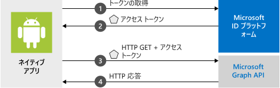

# <a name="quickstart-sign-in-users-and-call-the-microsoft-graph-api-from-an-android-app"></a>クイック スタート:Android アプリからユーザーにサインインし、Microsoft Graph API を呼び出す

このクイックスタートでは、コード サンプルを使用して、Android アプリケーションから Microsoft ID プラットフォームを使用することによって個人、仕事、または学校のアカウントへのサインイン、アクセス トークンの取得、Microsoft Graph API の呼び出しを行う方法を示します。 (図については、「[このサンプルのしくみ](#how-the-sample-works)」を参照してください)。

アプリケーションは、Microsoft ID プラットフォームがアプリケーションにトークンを提供できるように、Azure Active Directory 内のアプリ オブジェクトによって表現される必要があります。

> [!div renderon="docs"]
> 便宜上、コード サンプルには、`AndroidManifest.xml` ファイルで事前に構成された既定の `redirect_uri` が付属しているため、最初に独自のアプリ オブジェクトを登録する必要はありません。 `redirect_uri` は、アプリの署名キーに一部基づいています。 サンプル プロジェクトは、指定された `redirect_uri` が機能するように署名キーを使用して事前に構成されています。 アプリ オブジェクトの登録とアプリケーションとの統合の詳細については、「[Android アプリケーションからユーザーにサインインし、Microsoft Graph を呼び出す](tutorial-v2-android.md)」のチュートリアルを参照してください。


> [!NOTE]
> **前提条件**
> * Android Studio 
> * Android 16 以降

> [!div class="sxs-lookup" renderon="portal"]
> ### <a name="step-1-configure-your-application-in-the-azure-portal"></a>手順 1:Azure portal でのアプリケーションの構成 
>  このクイック スタートのコード サンプルを動作させるには、Auth ブローカーと互換性があるリダイレクト URI を追加する必要があります。
> > [!div renderon="portal" id="makechanges" class="nextstepaction"]
> > [これらの変更を行います]()
>
> > [!div id="appconfigured" class="alert alert-info"]
> >  アプリケーションはこれらの属性で構成されています
>
> ### <a name="step-2-download-the-project"></a>手順 2:プロジェクトのダウンロード 
> [!div class="sxs-lookup" renderon="portal"]
> Android Studio を使用してプロジェクトを実行します。
> [!div renderon="portal" id="autoupdate" class="nextstepaction"]
> [コード サンプルをダウンロードします](https://github.com/Azure-Samples/ms-identity-android-java/archive/master.zip)
>
> [!div class="sxs-lookup" renderon="portal"]
> ### <a name="step-3-your-app-is-configured-and-ready-to-run"></a>手順 3:アプリが構成され、実行準備ができる
> アプリのプロパティの値を使用してプロジェクトを構成したら、実行する準備は完了です。 
> このサンプル アプリは、**単一アカウント モード**画面で開始します。 既定のスコープである **user.read** は既定で指定されます。これは、Microsoft Graph API 呼び出し時にご自分のプロファイル データを読み取るときに使用します。 Microsoft Graph API 呼び出しの URL は、既定で指定されます。 このどちらも必要に応じて変更できます。
>
> 
>
> 単一と複数アカウント モードを切り替えるには、アプリのメニューを使用します。
>
> 単一アカウント モードで、職場またはホーム アカウントを使用してサインインします。
>
> 1. **[Get graph data interactively]\(グラフ データを対話形式で取得する\)** を選択して、ユーザーに資格情報の入力を求めます。 Microsoft Graph API の呼び出しからの出力が画面の下部に表示されます。
> 2. サインインしたら、 **[Get graph data silently]\(グラフ データをサイレントで取得する\)** を選択して、ユーザーに資格情報の入力を再度求めることなく、Microsoft Graph API を呼び出します。 Microsoft Graph API の呼び出しからの出力が画面の下部に表示されます。
>
> 複数アカウント モードでは、同じ手順を繰り返すことができます。  さらに、サインインしているアカウントを削除することもできます。その場合、そのアカウントのキャッシュされたトークンも削除されます。

> [!div class="sxs-lookup" renderon="portal"]
> > [!NOTE]
> > `Enter_the_Supported_Account_Info_Here`

> [!div renderon="docs"]
> ## <a name="step-1-get-the-sample-app"></a>手順 1:サンプル アプリを入手する
>
> [コードをダウンロードします](https://github.com/Azure-Samples/ms-identity-android-java/archive/master.zip)。
>
> ## <a name="step-2-run-the-sample-app"></a>手順 2:サンプル アプリを実行する
>
> Android Studio の **[available devices]\(使用可能なデバイス\)** ドロップダウンからエミュレーターまたは物理デバイスを選択し、アプリを実行します。
>
> このサンプル アプリは、**単一アカウント モード**画面で開始します。 既定のスコープである **user.read** は既定で指定されます。これは、Microsoft Graph API 呼び出し時にご自分のプロファイル データを読み取るときに使用します。 Microsoft Graph API 呼び出しの URL は、既定で指定されます。 このどちらも必要に応じて変更できます。
>
> 
>
> 単一と複数アカウント モードを切り替えるには、アプリのメニューを使用します。
>
> 単一アカウント モードで、職場またはホーム アカウントを使用してサインインします。
>
> 1. **[Get graph data interactively]\(グラフ データを対話形式で取得する\)** を選択して、ユーザーに資格情報の入力を求めます。 Microsoft Graph API の呼び出しからの出力が画面の下部に表示されます。
> 2. サインインしたら、 **[Get graph data silently]\(グラフ データをサイレントで取得する\)** を選択して、ユーザーに資格情報の入力を再度求めることなく、Microsoft Graph API を呼び出します。 Microsoft Graph API の呼び出しからの出力が画面の下部に表示されます。
>
> 複数アカウント モードでは、同じ手順を繰り返すことができます。  さらに、サインインしているアカウントを削除することもできます。その場合、そのアカウントのキャッシュされたトークンも削除されます。

## <a name="how-the-sample-works"></a>このサンプルのしくみ



コードは、単一および複数アカウントの MSAL アプリを記述する方法を示すフラグメントに分かれています。 コード ファイルは、次のように整理されています。

| ファイル  | 対象  |
|---------|---------|
| MainActivity | UI を管理します |
| MSGraphRequestWrapper  | MSAL から提供されたトークンを使用して Microsoft Graph API を呼び出します |
| MultipleAccountModeFragment  | 複数アカウント アプリケーションを初期化し、ユーザー アカウントを読み込み、Microsoft Graph API を呼び出すためのトークンを取得します |
| SingleAccountModeFragment | 単一アカウント アプリケーションを初期化し、ユーザー アカウントを読み込み、Microsoft Graph API を呼び出すためのトークンを取得します |
| res/auth_config_multiple_account.json  | 複数アカウントの構成ファイル |
| res/auth_config_single_account.json  | 単一アカウントの構成ファイル |
| Gradle Scripts/build.grade (Module:app) | MSAL ライブラリの依存関係はここに追加します |

この後、これらのファイルについて詳しく説明し、それぞれの MSAL 固有のコードを紹介します。

### <a name="adding-msal-to-the-app"></a>アプリへの MSAL の追加

MSAL ([com.microsoft.identity.client](https://javadoc.io/doc/com.microsoft.identity.client/msal)) はユーザーをサインインし、Microsoft ID プラットフォームによって保護されている API へのアクセス用のトークンを要求するために使用するライブラリです。 Gradle 3.0 以降では、**Gradle Scripts** > **build.gradle (Module: app)** の **Dependencies** に以下を追加すると、ライブラリがインストールされます。

```gradle  
implementation 'com.microsoft.identity.client:msal:1.+'
```

これは、サンプル プロジェクトの build.gradle (Module: app) で確認できます。

```java
dependencies {
    ...
    implementation 'com.microsoft.identity.client:msal:1.+'
    ...
}
```

これにより、Gradle に maven central から MSAL をダウンロードしてビルドするよう指示します。

### <a name="msal-imports"></a>MSAL のインポート

MSAL ライブラリに関連するインポートは `com.microsoft.identity.client.*` です。  たとえば、実際のパブリック クライアント アプリケーションを表す `PublicClientApplication` クラスの名前空間である `import com.microsoft.identity.client.PublicClientApplication;` があります。

### <a name="singleaccountmodefragmentjava"></a>SingleAccountModeFragment.java

このファイルは、単一アカウントの MSAL アプリを作成し、Microsoft Graph API を呼び出す方法を示しています。

単一アカウント アプリは、1 人のユーザーのみが使用します。  たとえば、お使いのマッピング アプリへのサインインに使用するアカウントは 1 つだけです。

#### <a name="single-account-msal-initialization"></a>単一アカウントの MSAL の初期化

`auth_config_single_account.json` の `onCreateView()` では、`auth_config_single_account.json` ファイルに格納されている構成情報を使用して、単一アカウントの `PublicClientApplication` を作成します。  このようにして、単一アカウントの MSAL アプリで使用する MSAL ライブラリを初期化します。

```java
...
// Creates a PublicClientApplication object with res/raw/auth_config_single_account.json
PublicClientApplication.createSingleAccountPublicClientApplication(getContext(),
        R.raw.auth_config_single_account,
        new IPublicClientApplication.ISingleAccountApplicationCreatedListener() {
            @Override
            public void onCreated(ISingleAccountPublicClientApplication application) {
                /**
                 * This test app assumes that the app is only going to support one account.
                 * This requires "account_mode" : "SINGLE" in the config json file.
                 **/
                mSingleAccountApp = application;
                loadAccount();
            }

            @Override
            public void onError(MsalException exception) {
                displayError(exception);
            }
        });
```

#### <a name="sign-in-a-user"></a>ユーザーのサインイン

`SingleAccountModeFragment.java` では、ユーザーをサインインさせるコードは、`initializeUI()` 内の `signInButton` クリック ハンドラーにあります。

トークンの取得を試行する前に `signIn()` を呼び出します。 `signIn()` は、`acquireToken()` が呼び出された場合と同様に動作し、ユーザーにサインインを求める対話形式のプロンプトを表示します。

ユーザーのサインインは非同期操作です。 ユーザーがサインインすると、コールバックが渡され、Microsoft Graph API が呼び出され、UI が更新されます。

```java
mSingleAccountApp.signIn(getActivity(), null, getScopes(), getAuthInteractiveCallback());
```

#### <a name="sign-out-a-user"></a>ユーザーのサインアウト

`SingleAccountModeFragment.java` では、ユーザーをサインアウトさせるコードは、`initializeUI()` 内の `signOutButton` クリック ハンドラーにあります。  ユーザーのサインアウトは非同期操作です。 ユーザーがサインアウトすると、そのアカウントのトークン キャッシュもクリアされます。 ユーザー アカウントからサインアウトすると、コールバックが作成され、UI が更新されます。

```java
mSingleAccountApp.signOut(new ISingleAccountPublicClientApplication.SignOutCallback() {
    @Override
    public void onSignOut() {
        updateUI(null);
        performOperationOnSignOut();
    }

    @Override
    public void onError(@NonNull MsalException exception) {
        displayError(exception);
    }
});
```

#### <a name="get-a-token-interactively-or-silently"></a>トークンの対話形式またはサイレントでの取得

ユーザーに表示するプロンプトの数を最小限に抑えるには、通常、トークンをサイレントで取得します。 そのときにエラーが発生した場合は、対話形式でトークンの取得を試行します。 アプリが初めて `signIn()` を呼び出すと、実質的には `acquireToken()` の呼び出しとして機能し、ユーザーに資格情報の入力を求めます。

ユーザーは、自分のアカウントの選択、自分の資格情報の入力、またはアプリから要求されたアクセス許可への同意を要求される場合があります。

* ユーザーが初めてアプリケーションにサインインする場合
* ユーザーが自分のパスワードをリセットした場合、ユーザーは自分の資格情報を入力する必要がある
* 同意が取り消された場合
* アプリが明示的に同意を要求する場合
* アプリケーションがリソースへのアクセスを初めて要求している場合
* MFA またはその他の条件付きアクセス ポリシーが必要な場合

UI をユーザーに表示して、トークンを対話形式で取得するコードは、`SingleAccountModeFragment.java` 内の `initializeUI()` の `callGraphApiInteractiveButton` クリック ハンドラーにあります。

```java
/**
 * If acquireTokenSilent() returns an error that requires an interaction (MsalUiRequiredException),
 * invoke acquireToken() to have the user resolve the interrupt interactively.
 *
 * Some example scenarios are
 *  - password change
 *  - the resource you're acquiring a token for has a stricter set of requirement than your Single Sign-On refresh token.
 *  - you're introducing a new scope which the user has never consented for.
 **/
mSingleAccountApp.acquireToken(getActivity(), getScopes(), getAuthInteractiveCallback());
```

ユーザーが既にサインインしている場合は、`initializeUI()` の `callGraphApiSilentButton` クリック ハンドラーに示すように、`acquireTokenSilentAsync()` を使用することで、アプリはトークンをサイレントで要求できます。

```java
/**
 * Once you've signed the user in,
 * you can perform acquireTokenSilent to obtain resources without interrupting the user.
 **/
  mSingleAccountApp.acquireTokenSilentAsync(getScopes(), AUTHORITY, getAuthSilentCallback());
```

#### <a name="load-an-account"></a>アカウントの読み込み

アカウントを読み込むコードは `SingleAccountModeFragment.java` の `loadAccount()` にあります。  ユーザーのアカウントの読み込みは非同期操作です。そのため、アカウントの読み込み、変更、またはエラーが発生した場合を処理するコールバックが MSAL に渡されます。  また、次のコードでは `onAccountChanged()` も処理します。これは、アカウントが削除された場合や、ユーザーが別のアカウントに変更した場合などに発生します。

```java
private void loadAccount() {
    ...

    mSingleAccountApp.getCurrentAccountAsync(new ISingleAccountPublicClientApplication.CurrentAccountCallback() {
        @Override
        public void onAccountLoaded(@Nullable IAccount activeAccount) {
            // You can use the account data to update your UI or your app database.
            updateUI(activeAccount);
        }

        @Override
        public void onAccountChanged(@Nullable IAccount priorAccount, @Nullable IAccount currentAccount) {
            if (currentAccount == null) {
                // Perform a cleanup task as the signed-in account changed.
                performOperationOnSignOut();
            }
        }

        @Override
        public void onError(@NonNull MsalException exception) {
            displayError(exception);
        }
    });
```

#### <a name="call-microsoft-graph"></a>Microsoft Graph の呼び出し

ユーザーがサインインすると、`SingleAccountModeFragment.java` で定義されている `callGraphAPI()` によって Microsoft Graph の呼び出しが HTTP 要求を介して行われます。 この関数は、`authenticationResult` からのアクセス トークンの取得、MSGraphRequestWrapper への呼び出しのパッケージ化、呼び出しの結果の表示など、いくつかのタスクを実行することでサンプルを簡素化するラッパーです。

```java
private void callGraphAPI(final IAuthenticationResult authenticationResult) {
    MSGraphRequestWrapper.callGraphAPIUsingVolley(
            getContext(),
            graphResourceTextView.getText().toString(),
            authenticationResult.getAccessToken(),
            new Response.Listener<JSONObject>() {
                @Override
                public void onResponse(JSONObject response) {
                    /* Successfully called graph, process data and send to UI */
                    ...
                }
            },
            new Response.ErrorListener() {
                @Override
                public void onErrorResponse(VolleyError error) {
                    ...
                }
            });
}
```

### <a name="auth_config_single_accountjson"></a>auth_config_single_account.json

これは、単一のアカウントを使用する MSAL アプリの構成ファイルです。

これらのフィールドの説明については、[Android の MSAL 構成ファイルについて](msal-configuration.md)のページを参照してください。

`"account_mode" : "SINGLE"` が存在する点に注意してください。これにより、単一のアカウントを使用するようこのアプリを構成しています。

`"client_id"` は、Microsoft が管理するアプリ オブジェクト登録を使用するように事前に構成されています。
`"redirect_uri"` は、コード サンプルで提供される署名キーを使用するように事前に構成されています。

```json
{
  "client_id" : "0984a7b6-bc13-4141-8b0d-8f767e136bb7",
  "authorization_user_agent" : "DEFAULT",
  "redirect_uri" : "msauth://com.azuresamples.msalandroidapp/1wIqXSqBj7w%2Bh11ZifsnqwgyKrY%3D",
  "account_mode" : "SINGLE",
  "broker_redirect_uri_registered": true,
  "authorities" : [
    {
      "type": "AAD",
      "audience": {
        "type": "AzureADandPersonalMicrosoftAccount",
        "tenant_id": "common"
      }
    }
  ]
}
```

### <a name="multipleaccountmodefragmentjava"></a>MultipleAccountModeFragment.java

このファイルは、複数アカウントの MSAL アプリを作成し、Microsoft Graph API を呼び出す方法を示しています。

複数アカウント アプリの例としては、職場アカウントや個人用アカウントなど、複数のユーザー アカウントを使用できるメール アプリがあります。

#### <a name="multiple-account-msal-initialization"></a>複数アカウントの MSAL の初期化

`MultipleAccountModeFragment.java` ファイルの `onCreateView()` では、`auth_config_multiple_account.json file` に格納されている構成情報を使用して、複数アカウントのアプリ オブジェクト (`IMultipleAccountPublicClientApplication`) を作成します。

```java
// Creates a PublicClientApplication object with res/raw/auth_config_multiple_account.json
PublicClientApplication.createMultipleAccountPublicClientApplication(getContext(),
        R.raw.auth_config_multiple_account,
        new IPublicClientApplication.IMultipleAccountApplicationCreatedListener() {
            @Override
            public void onCreated(IMultipleAccountPublicClientApplication application) {
                mMultipleAccountApp = application;
                loadAccounts();
            }

            @Override
            public void onError(MsalException exception) {
                ...
            }
        });
```

作成された `MultipleAccountPublicClientApplication` オブジェクトはクラス メンバー変数に格納されます。これは、MSAL ライブラリを操作して、トークンを取得したり、ユーザー アカウントを読み込んだり、削除したりする場合に使用できます。

#### <a name="load-an-account"></a>アカウントの読み込み

通常、複数アカウント アプリでは、MSAL 操作に使用するアカウントを選択する `getAccounts()` を呼び出します。 アカウントを読み込むコードは `MultipleAccountModeFragment.java` ファイルの `loadAccounts()` にあります。  ユーザーのアカウントの読み込みは非同期操作です。 そのため、コールバックでは、アカウントの読み込み、変更、またはエラーが発生した場合を処理します。

```java
/**
 * Load currently signed-in accounts, if there's any.
 **/
private void loadAccounts() {
    if (mMultipleAccountApp == null) {
        return;
    }

    mMultipleAccountApp.getAccounts(new IPublicClientApplication.LoadAccountsCallback() {
        @Override
        public void onTaskCompleted(final List<IAccount> result) {
            // You can use the account data to update your UI or your app database.
            accountList = result;
            updateUI(accountList);
        }

        @Override
        public void onError(MsalException exception) {
            displayError(exception);
        }
    });
}
```

#### <a name="get-a-token-interactively-or-silently"></a>トークンの対話形式またはサイレントでの取得

ユーザーは、自分のアカウントの選択、自分の資格情報の入力、またはアプリから要求されたアクセス許可への同意を要求される場合があります。

* ユーザーが初めてアプリケーションにサインインした場合
* ユーザーが自分のパスワードをリセットした場合、ユーザーは自分の資格情報を入力する必要がある 
* 同意が取り消された場合 
* アプリが明示的に同意を要求する場合 
* アプリケーションがリソースへのアクセスを初めて要求している場合
* MFA またはその他の条件付きアクセス ポリシーが必要な場合

通常、複数アカウント アプリでは、`acquireToken()` を呼び出して、ユーザーに UI を表示し、トークンを対話形式で取得する必要があります。  トークンを対話形式で取得するコードは、`MultipleAccountModeFragment.java` ファイルの `initializeUI()` の `callGraphApiInteractiveButton` クリック ハンドラーにあります。

```java
/**
 * Acquire token interactively. It will also create an account object for the silent call as a result (to be obtained by getAccount()).
 *
 * If acquireTokenSilent() returns an error that requires an interaction,
 * invoke acquireToken() to have the user resolve the interrupt interactively.
 *
 * Some example scenarios are
 *  - password change
 *  - the resource you're acquiring a token for has a stricter set of requirement than your SSO refresh token.
 *  - you're introducing a new scope which the user has never consented for.
 **/
mMultipleAccountApp.acquireToken(getActivity(), getScopes(), getAuthInteractiveCallback());
```

アプリは、トークンを要求するたびに、ユーザーにサインインを要求するべきではありません。 ユーザーが既にサインインしている場合は、`MultipleAccountModeFragment.java` ファイルの `initializeUI()` の `callGraphApiSilentButton` クリック ハンドラーに示すように、`acquireTokenSilentAsync()` を使用することで、アプリはユーザーに入力を求めることなくトークンを自動的に要求できます。

```java
/**
 * Performs acquireToken without interrupting the user.
 *
 * This requires an account object of the account you're obtaining a token for.
 * (can be obtained via getAccount()).
 */
mMultipleAccountApp.acquireTokenSilentAsync(getScopes(),
    accountList.get(accountListSpinner.getSelectedItemPosition()),
    AUTHORITY,
    getAuthSilentCallback());
```

#### <a name="remove-an-account"></a>アカウントの削除

アカウントとそのアカウントのキャッシュされたすべてのトークンを削除するコードは、`MultipleAccountModeFragment.java` ファイル内の `initializeUI()` のアカウント削除ボタンのハンドラーにあります。 アカウントを削除する前に、アカウント オブジェクトが必要です。これは、`getAccounts()` や `acquireToken()` などの MSAL メソッドから取得します。 アカウントの削除は非同期操作であるため、`onRemoved` コールバックを指定して、UI を更新します。

```java
/**
 * Removes the selected account and cached tokens from this app (or device, if the device is in shared mode).
 **/
mMultipleAccountApp.removeAccount(accountList.get(accountListSpinner.getSelectedItemPosition()),
        new IMultipleAccountPublicClientApplication.RemoveAccountCallback() {
            @Override
            public void onRemoved() {
                ...
                /* Reload account asynchronously to get the up-to-date list. */
                loadAccounts();
            }

            @Override
            public void onError(@NonNull MsalException exception) {
                displayError(exception);
            }
        });
```

### <a name="auth_config_multiple_accountjson"></a>auth_config_multiple_account.json

これは、複数のアカウントを使用する MSAL アプリの構成ファイルです。

さまざまなフィールドの説明については、[Android の MSAL 構成ファイルについて](msal-configuration.md)のページを参照してください。

これは複数アカウント アプリであるため、[auth_config_single_account.json](#auth_config_single_accountjson) 構成ファイルとは異なり、この構成ファイルには `"account_mode" : "SINGLE"` の代わりに `"account_mode" : "MULTIPLE"` が含まれています。

`"client_id"` は、Microsoft が管理するアプリ オブジェクト登録を使用するように事前に構成されています。
`"redirect_uri"` は、コード サンプルで提供される署名キーを使用するように事前に構成されています。

```json
{
  "client_id" : "0984a7b6-bc13-4141-8b0d-8f767e136bb7",
  "authorization_user_agent" : "DEFAULT",
  "redirect_uri" : "msauth://com.azuresamples.msalandroidapp/1wIqXSqBj7w%2Bh11ZifsnqwgyKrY%3D",
  "account_mode" : "MULTIPLE",
  "broker_redirect_uri_registered": true,
  "authorities" : [
    {
      "type": "AAD",
      "audience": {
        "type": "AzureADandPersonalMicrosoftAccount",
        "tenant_id": "common"
      }
    }
  ]
}
```

## <a name="next-steps"></a>次のステップ

### <a name="learn-the-steps-to-create-the-application-used-in-this-quickstart"></a>このクイック スタートで使用されているアプリケーションを作成する手順

アクセス トークンを取得し、それを使用して Microsoft Graph API を呼び出すことができる Android アプリを構築するためのステップバイステップ ガイドについては、「[Android アプリケーションからユーザーにサインインし、Microsoft Graph を呼び出す](tutorial-v2-android.md)」チュートリアルを参照してください。

> [!div class="nextstepaction"]
> [Graph API 呼び出し Android チュートリアル](https://docs.microsoft.com/azure/active-directory/develop/guidedsetups/active-directory-android)

### <a name="msal-for-android-library-wiki"></a>Android 用 MSAL ライブラリ Wiki

Android 用 MSAL ライブラリの詳細をご覧ください。

> [!div class="nextstepaction"]
> [Android 用 MSAL ライブラリ Wiki](https://github.com/AzureAD/microsoft-authentication-library-for-android/wiki)

[!INCLUDE [Help and support](../../../includes/active-directory-develop-help-support-include.md)]

Microsoft ID プラットフォームの改善にご協力ください。 簡単な 2 つの質問からなるアンケートに記入し、ご意見をお聞かせください。

> [!div class="nextstepaction"]
> [Microsoft ID プラットフォームのアンケート](https://forms.office.com/Pages/ResponsePage.aspx?id=v4j5cvGGr0GRqy180BHbRyKrNDMV_xBIiPGgSvnbQZdUQjFIUUFGUE1SMEVFTkdaVU5YT0EyOEtJVi4u)
