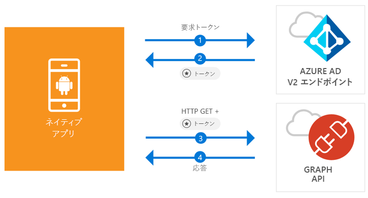

# <a name="quickstart-sign-in-users-and-call-the-microsoft-graph-api-from-an-android-app"></a>クイック スタート: Android アプリからユーザーにサインインし、Microsoft Graph API を呼び出す

[!INCLUDE [active-directory-develop-applies-v2-msal](../../../includes/active-directory-develop-applies-v2-msal.md)]

このクイック スタートには、Android アプリケーションから個人や仕事、学校のアカウントへのサインイン、アクセス トークンの取得、Microsoft Graph API の呼び出しを行う方法を示すコード サンプルが含まれています。



> [!NOTE]
> **前提条件**
> * Android Studio 3 またはそれ以降
> * Android SDK 21 以降が必要 (SDK 27 を推奨)

> [!div renderon="docs"]
> ## <a name="register-and-download"></a>登録とダウンロード
> ### <a name="register-and-configure-your-application-and-code-sample"></a>アプリケーションとコード サンプルの登録と構成
> #### <a name="step-1-register-your-application"></a>手順 1: アプリケーションの登録
> アプリケーションを登録し、ソリューションにアプリケーション登録情報を追加するには、次の手順を実行します。
> 1. [Microsoft アプリケーション登録ポータル](https://apps.dev.microsoft.com/portal/register-app)に移動して、アプリケーションを登録します。
> 1. **[アプリケーション名]** ボックスに、アプリケーションの名前を入力します。
> 1. **[Guided Setup]\(ガイド付きセットアップ\)** チェック ボックスがオフになっていることを確認し、**[作成]** を選択します。
> 1. **[プラットフォームの追加]**、**[ネイティブ アプリケーション]**、**[保存]** の順に選択します。

> [!div renderon="portal" class="sxs-lookup"]
> #### <a name="step-1-configure-your-application"></a>手順 1: アプリケーションの構成
> このクイック スタートのコード サンプルを動作させるには、応答 URL として **msal{AppId}://auth** ({AppId} はアプリのアプリケーション ID) を追加する必要があります。
> > [!div renderon="portal" id="makechanges" class="nextstepaction"]
> > [この変更を行う]()
>
> > [!div id="appconfigured" class="alert alert-info"]
> >  アプリケーションはこれらの属性で構成されています

#### <a name="step-2-download-the-project"></a>手順 2: プロジェクトのダウンロード

* [Android Studio プロジェクトのダウンロード](https://github.com/Azure-Samples/active-directory-android-native-v2/archive/master.zip)

#### <a name="step-3-configure-your-project"></a>手順 3: プロジェクトの構成

1. プロジェクトを解凍し、Android Studio で開きます。
1. **app** > **java** > **<i>{host}.{namespace}</i>** にある **MainActivity** を開きます。
1. `final static String CLIENT_ID` で始まる行を以下に置き換えます。

    > [!div renderon="portal" class="sxs-lookup"]
    > ```java
    > final static String CLIENT_ID = "ENTER_THE_APPLICATION_ID_HERE";
    > ```

    > [!div renderon="docs"]
    > ```java
    > final static String CLIENT_ID = "<ENTER_THE_APPLICATION_ID_HERE>";
    > ```

1. **app** > **manifests** > **AndroidManifest.xml** を開きます。
1. **manifest\application** ノードに次のアクティビティを追加します。 このコード スニペットにより **BrowserTabActivity** が登録され、OS は認証の完了後、アプリケーションを再開することが可能になります。

    > [!div renderon="docs"]
    > ```xml
    > <!--Intent filter to capture System Browser calling back to our app after Sign In-->
    > <activity
    >     android:name="com.microsoft.identity.client.BrowserTabActivity">
    >     <intent-filter>
    >         <action android:name="android.intent.action.VIEW" />
    >         <category android:name="android.intent.category.DEFAULT" />
    >         <category android:name="android.intent.category.BROWSABLE" />
    > 
    >         <!--Add in your scheme/host from registered redirect URI-->
    >         <!--By default, the scheme should be similar to 'msal[appId]' -->
    >         <data android:scheme="msal<ENTER_THE_APPLICATION_ID_HERE>"
    >             android:host="auth" />
    >     </intent-filter>
    > </activity>
    > ```

    > [!div renderon="portal" class="sxs-lookup"]
    > ```xml
    > <!--Intent filter to capture System Browser calling back to our app after Sign In-->
    > <activity
    >     android:name="com.microsoft.identity.client.BrowserTabActivity">
    >     <intent-filter>
    >         <action android:name="android.intent.action.VIEW" />
    >         <category android:name="android.intent.category.DEFAULT" />
    >         <category android:name="android.intent.category.BROWSABLE" />
    > 
    >         <!--Add in your scheme/host from registered redirect URI-->
    >         <!--By default, the scheme should be similar to 'msal[appId]' -->
    >         <data android:scheme="msalENTER_THE_APPLICATION_ID_HERE"
    >             android:host="auth" />
    >     </intent-filter>
    > </activity>
    > ```

> [!div renderon="docs"]
> <span>6.</span>`<ENTER_THE_APPLICATION_ID_HERE>` をアプリケーションの *Application ID* で置換します。 *Application ID* を検索する必要がある場合は、*[Overview]\(概要\)* ページに移動します。

## <a name="more-information"></a>詳細情報

このクイック スタートの詳細については、以下のセクションをお読みください。

### <a name="msal"></a>MSAL

MSAL ([com.microsoft.identity.client](http://javadoc.io/doc/com.microsoft.identity.client/msal)) はユーザーにサインインし、Microsoft Azure Active Directory (Azure AD) によって保護されている API にアクセスするトークンを要求するために使用するライブラリです。 Gradle を使用してこれをインストールするには、**Gradle Scripts** > **build.gradle (Module: app)** の **Dependencies** に以下を追加します。

```gradle  
implementation 'com.android.volley:volley:1.1.1'
implementation 'com.microsoft.identity.client:msal:0.1.+'
```

### <a name="msal-initialization"></a>MSAL の初期化

MSAL への参照を追加するには、次のコードを追加します。

```java
import com.microsoft.identity.client.*;
```

続いて、次のコードを使用して MSAL を初期化します。

```java
sampleApp = new PublicClientApplication(
        this.getApplicationContext(),
        CLIENT_ID);
```

> |各値の説明: ||
> |---------|---------|
> |`CLIENT_ID` | *portal.azure.com* に登録されているアプリケーションの Application ID |

### <a name="requesting-tokens"></a>トークンの要求

MSAL には、トークンの取得に使用する 2 つのメソッド `acquireToken`、`acquireTokenSilentAsync` があります。

#### <a name="getting-a-user-token-interactively"></a>ユーザー トークンを対話形式で取得する

Azure AD v2.0 エンドポイントの操作が強制される場合があります。その場合、コンテキストがシステム ブラウザーに切り替わり、ユーザーの資格情報の検証または同意が求められます。 次に例をいくつか示します。

* ユーザーが初めてアプリケーションにサインインした場合
* パスワードの有効期限が切れているため、ユーザーが資格情報を再入力する必要がある場合
* ご使用のアプリケーションが、ユーザーによる同意が必要なリソースへのアクセスを要求している場合
* 2 要素認証が必須である場合

```java
sampleApp.acquireToken(this, SCOPES, getAuthInteractiveCallback());
```

> |各値の説明:||
> |---------|---------|
> | `SCOPES` | 要求するスコープを含む (つまり、Microsoft Graph 用の `{ "user.read" }` またはカスタム Web API 用の `{ "<Application ID URL>/scope" }` (つまり、`api://<Application ID>/access_as_user`)) |
> | `getAuthInteractiveCallback` | 認証後にアプリケーションに制御が戻るときに実行されるコールバック |

#### <a name="getting-a-user-token-silently"></a>ユーザー トークンを自動で取得する

リソースへのアクセスが必要になるたびに、ユーザーに自分の資格情報を検証させたくない場合があります。 ほとんどの場合は、ユーザーの操作なしにトークンの取得や更新を行います。 最初に `acquireToken` メソッドを呼び出した後は、`AcquireTokenSilentAsync` メソッドを使用して保護されたリソースにアクセス するトークンを取得することができます。

```java
sampleApp.acquireToken(getActivity(), SCOPES, getAuthInteractiveCallback());
```

> |各値の説明:||
> |---------|---------|
> | `SCOPES` | 要求するスコープを含む (つまり、Microsoft Graph 用の `{ "user.read" }` またはカスタム Web API 用の `{ "<Application ID URL>/scope" }` (つまり、`api://<Application ID>/access_as_user`)) |
> | `getAuthInteractiveCallback` | 認証後にアプリケーションに制御が戻るときに実行されるコールバック |

## <a name="next-steps"></a>次の手順

### <a name="learn-the-steps-to-create-the-application-used-in-this-quickstart"></a>このクイック スタートで使用されているアプリケーションを作成する手順

アプリケーションや新機能の構築についての完全なステップ バイ ステップ ガイドは、Android チュートリアルをお試しください。このクイック スタートの完全な説明も含まれています。

> [!div class="nextstepaction"]
> [Graph API 呼び出し Android チュートリアル](https://docs.microsoft.com/azure/active-directory/develop/guidedsetups/active-directory-android)

### <a name="msal-for-android-library-wiki"></a>Android 用 MSAL ライブラリ Wiki

Android 用 MSAL ライブラリの詳細をご覧ください。

> [!div class="nextstepaction"]
> [Android 用 MSAL ライブラリ Wiki](https://github.com/AzureAD/microsoft-authentication-library-for-android/wiki)

[!INCLUDE [Help and support](../../../includes/active-directory-develop-help-support-include.md)]