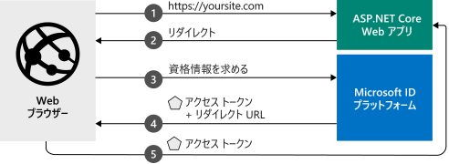

# <a name="quickstart-add-sign-in-with-microsoft-to-an-aspnet-core-web-app"></a>クイック スタート:ASP.NET Core Web アプリに Microsoft サインインを追加する

このクイックスタートでは、ASP.NET Core Web アプリで Azure Active Directory (Azure AD) 組織のユーザーをサインインする方法を示すコード サンプルをダウンロードして実行します。  

> [!div renderon="docs"]
> 次の図は、サンプル アプリの動作を示しています。
>
> 
>
> ## <a name="prerequisites"></a>前提条件
>
> * [Visual Studio 2019](https://visualstudio.microsoft.com/vs/) または [Visual Studio Code](https://code.visualstudio.com/)
> * [.NET Core SDK 3.1 以降](https://dotnet.microsoft.com/download)
>
> ## <a name="register-and-download-the-app"></a>アプリを登録してダウンロードする
> アプリケーションを作成するにあたっては、自動構成と手動構成という 2 つの選択肢があります。
>
> ### <a name="automatic-configuration"></a>自動構成
> アプリを自動的に構成したうえでコード サンプルをダウンロードする場合は、これらの手順に従います。
>
> 1. <a href="https://aka.ms/aspnetcore2-1-aad-quickstart-v2/" target="_blank">アプリの登録用の Azure portal ページ</a>に移動します。
> 1. アプリケーションの名前を入力し、 **[登録]** を選択します。
> 1. 画面の指示に従ってダウンロードし、1 回クリックするだけで、新しいアプリケーションが自動的に構成されます。
>
> ### <a name="manual-configuration"></a>手動構成
> アプリケーションとコードサンプルを手動で構成する場合は、次の手順を使用します。
> #### <a name="step-1-register-your-application"></a>手順 1:アプリケーションの登録
> 1. <a href="https://portal.azure.com/" target="_blank">Azure portal</a> にサインインします。
> 1. 複数のテナントにアクセスできる場合は、トップ メニューの **[ディレクトリとサブスクリプション]** フィルター :::image type="icon" source="./media/common/portal-directory-subscription-filter.png" border="false"::: を使用して、アプリケーションを登録するテナントを選択します。
> 1. **Azure Active Directory** を検索して選択します。
> 1. **[管理]** で **[アプリの登録]**  >  **[新規登録]** の順に選択します。
> 1. **[名前]** に、アプリケーションの名前を入力します。 たとえば、「**AspNetCore-Quickstart**」と入力します。 この名前は、アプリのユーザーに表示される場合があります。また、後で変更することができます。
> 1. **[リダイレクト URI]** に「 **https://localhost:44321/signin-oidc** 」と入力します。
> 1. **[登録]** を選択します。
> 1. **[管理]** で、 **[認証]** を選択します。
> 1. **[フロントチャネルのログアウト URL]** に「 **https://localhost:44321/signout-oidc** 」と入力します。
> 1. **[Implicit grant and hybrid flows]\(暗黙的な許可およびハイブリッド フロー\)** で、 **[ID トークン]** を選択します。
> 1. **[保存]** を選択します。

> [!div class="sxs-lookup" renderon="portal"]
> #### <a name="step-1-configure-your-application-in-the-azure-portal"></a>手順 1:Azure portal でのアプリケーションの構成
> このクイックスタートのコード サンプルを動作させるには、次のことを行います。
> - **[リダイレクト URI]** に「 **https://localhost:44321/** 」および「 **https://localhost:44321/signin-oidc** 」と入力します。
> - **[フロントチャネルのログアウト URL]** に「 **https://localhost:44321/signout-oidc** 」と入力します。 
>
> 要求の ID トークンが承認エンドポイントによって発行されます。
> > [!div renderon="portal" id="makechanges" class="nextstepaction"]
> > [この変更を行う]()
>
> > [!div id="appconfigured" class="alert alert-info"]
> >  アプリケーションはこれらの属性で構成されています。

#### <a name="step-2-download-the-aspnet-core-project"></a>手順 2:ASP.NET Core プロジェクトをダウンロードする

> [!div renderon="docs"]
> [ASP.NET Core ソリューションをダウンロード](https://github.com/Azure-Samples/active-directory-aspnetcore-webapp-openidconnect-v2/archive/aspnetcore3-1.zip)します。

> [!div renderon="portal" class="sxs-lookup"]
> プロジェクトを実行します。

> [!div renderon="portal" class="sxs-lookup" id="autoupdate" class="nextstepaction"]
> [コード サンプルをダウンロードします](https://github.com/Azure-Samples/active-directory-aspnetcore-webapp-openidconnect-v2/archive/aspnetcore3-1.zip)

[!INCLUDE [active-directory-develop-path-length-tip](../../../includes/active-directory-develop-path-length-tip.md)]

> [!div class="sxs-lookup" renderon="portal"]
> #### <a name="step-3-your-app-is-configured-and-ready-to-run"></a>手順 3:アプリが構成され、実行準備ができる
> アプリのプロパティの値を使用してプロジェクトを構成したら、実行する準備は完了です。
> [!div class="sxs-lookup" renderon="portal"]
> > [!NOTE]
> > `Enter_the_Supported_Account_Info_Here`
> [!div renderon="docs"]
> #### <a name="step-3-configure-your-aspnet-core-project"></a>手順 3:ASP.NET Core プロジェクトの構成
> 1. .zip アーカイブを、ドライブのルート付近にあるローカル フォルダーに抽出します。 たとえば、*C:\Azure-Samples* に展開します。
> 
>    Windows におけるパスの長さの制限に起因したエラーを防ぐため、ドライブのルートに近いディレクトリをアーカイブの展開先とすることをお勧めします。
> 1. Visual Studio 2019 でソリューションを開きます。
> 1. *appsettings.json* ファイルを開き、次のコードを変更します。
>
>    ```json
>    "Domain": "Enter the domain of your tenant, e.g. contoso.onmicrosoft.com",
>    "ClientId": "Enter_the_Application_Id_here",
>    "TenantId": "common",
>    ```
>
>    - `Enter_the_Application_Id_here` を、Azure portal で登録したアプリケーションのアプリケーション (クライアント) ID に置き換えます。 **アプリケーション (クライアント) ID** の値は、アプリの **[概要]** ページで確認できます。
>    - `common` を、次のいずれかに置き換えます。
>       - アプリケーションで **[この組織のディレクトリ内のアカウントのみ]** がサポートされている場合は、この値をディレクトリ (テナント) ID (GUID) またはテナント名 (例: `contoso.onmicrosoft.com`) に置き換えます。 **ディレクトリ (テナント) ID** の値は、アプリの **[概要]** ページで確認できます。
>       - アプリケーションで **任意の組織のディレクトリ内のアカウント** がサポートされる場合は、この値を `organizations` に置き換えます。
>       - アプリケーションで **[すべての Microsoft アカウント ユーザー]** がサポートされている場合は、この値を `common` のままにします。
>
> このクイックスタートでは、*appsettings.json* ファイル内のその他の値は変更しないでください。
>
> #### <a name="step-4-build-and-run-the-application"></a>手順 4: アプリケーションをビルドして実行する
>
> アプリをビルドして実行するには、Visual Studio で **[デバッグ]** メニュー、 **[デバッグの開始]** の順に選択するか、F5 キーを押します。
>
> 資格情報の入力を求められ、アプリに必要なアクセス許可に同意するよう求められます。 同意プロンプトで **[同意する]** を選択します。
>
> :::image type="content" source="media/quickstart-v2-aspnet-core-webapp/webapp-01-consent.png" alt-text="同意ダイアログボックスのスクリーンショット。アプリがユーザーに要求しているアクセス許可が表示されます。":::
>
> 要求されたアクセス許可に同意すると、Azure Active Directory の資格情報を使用して正常にサインインしたことがアプリに表示されます。
>
> :::image type="content" source="media/quickstart-v2-aspnet-core-webapp/webapp-02-signed-in.png" alt-text="実行中の Web アプリとサインイン ユーザーを表示する Web ブラウザーのスクリーンショット。":::

## <a name="more-information"></a>詳細情報

このセクションでは、ユーザーをサインインさせるために必要なコードの概要を示します。 この概要は、コードの働きや主な引数、また既存の ASP.NET Core アプリケーションにサインインを追加する方法を理解するうえで役立ちます。

> [!div class="sxs-lookup" renderon="portal"]
> ### <a name="how-the-sample-works"></a>このサンプルのしくみ
>
> 

### <a name="startup-class"></a>スタートアップ クラス

*Microsoft.AspNetCore.Authentication* ミドルウェアは、ホスティング プロセスの起動時に実行される `Startup` クラスを使用します。

```csharp
  public void ConfigureServices(IServiceCollection services)
  {
      services.AddAuthentication(OpenIdConnectDefaults.AuthenticationScheme)
          .AddMicrosoftIdentityWebApp(Configuration.GetSection("AzureAd"));

      services.AddControllersWithViews(options =>
      {
          var policy = new AuthorizationPolicyBuilder()
              .RequireAuthenticatedUser()
              .Build();
          options.Filters.Add(new AuthorizeFilter(policy));
      });
      services.AddRazorPages()
          .AddMicrosoftIdentityUI();
  }
```

`AddAuthentication()` メソッドは、Cookie ベースの認証を追加するようサービスを構成します。 この認証は、ブラウザーのシナリオで使用されるほか、チャレンジを OpenID Connect に設定する際に使用されます。

`.AddMicrosoftIdentityWebApp` を含む行によって、Microsoft ID プラットフォーム認証がアプリケーションに追加されます。 その後、*appsettings.json* 構成ファイルの `AzureAD` セクションにある次の情報に基づいてユーザーのサインインを処理するように構成されます。

| *appsettings.json* のキー | 説明                                                                                                                                                          |
|------------------------|----------------------------------------------------------------------------------------------------------------------------------------------------------------------|
| `ClientId`             | Azure portal に登録されているアプリケーションのアプリケーション (クライアント) ID。                                                                                       |
| `Instance`             | ユーザーが認証するためのセキュリティ トークン サービス (STS) エンドポイント。 通常、この値は、Azure パブリック クラウドを示す `https://login.microsoftonline.com/` です。 |
| `TenantId`             | テナントの名前またはテナント ID (GUID)。職場または学校アカウントあるいは Microsoft 個人アカウントを使用してユーザーをサインインする場合は `common`。                             |

`Configure()` メソッドには、`app.UseAuthentication()` と `app.UseAuthorization()` という 2 つの重要なメソッドが含まれており、それらの名前付き機能を有効にします。 また、`Configure()` メソッドで、少なくとも 1 つの `endpoints.MapControllerRoute()` 呼び出し (または `endpoints.MapControllers()` 呼び出し) に、Microsoft Identity Web のルートを登録する必要があります。

```csharp
app.UseAuthentication();
app.UseAuthorization();

app.UseEndpoints(endpoints =>
{

    endpoints.MapControllerRoute(
        name: "default",
        pattern: "{controller=Home}/{action=Index}/{id?}");
    endpoints.MapRazorPages();
});

// endpoints.MapControllers(); // REQUIRED if MapControllerRoute() isn't called.
```

### <a name="attribute-for-protecting-a-controller-or-methods"></a>コントローラーまたはメソッドを保護するための属性

`[Authorize]` 属性を使用して、コントローラーまたはコントローラーのメソッドを保護できます。 この属性は、認証されたユーザーのみを許可することで、コントローラーまたはメソッドへのアクセスを制限します。 ユーザーが認証されていない場合、コントローラーにアクセスするための認証チャレンジを開始することができます。

[!INCLUDE [Help and support](../../../includes/active-directory-develop-help-support-include.md)]

## <a name="next-steps"></a>次のステップ

この ASP.NET Core チュートリアルを含む GitHub リポジトリには、次の方法を示す手順とその他のコード サンプルが含まれています。

- 新しい ASP.NET Core Web アプリに認証を追加する。
- Microsoft Graph、他の Microsoft API、またはユーザー独自の Web API を呼び出す。
- 承認を追加する。
- 国内クラウドで、またはソーシャル ID を使用してユーザーのサインインを処理する。

> [!div class="nextstepaction"]
> [GitHub の ASP.NET Core Web アプリのチュートリアル](https://github.com/Azure-Samples/active-directory-aspnetcore-webapp-openidconnect-v2/)
