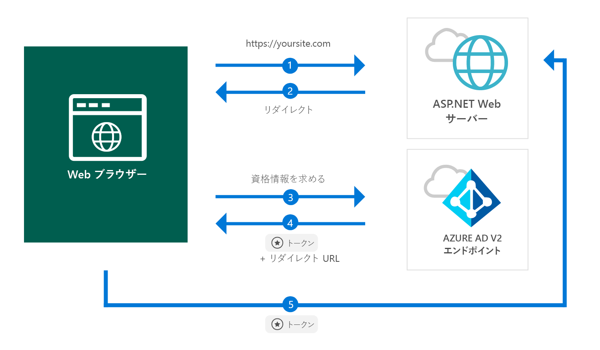

# <a name="quickstart-add-sign-in-with-microsoft-to-an-aspnet-web-app"></a>クイック スタート: ASP.NET Web アプリへの "Microsoft でサインイン" の追加

[!INCLUDE [active-directory-develop-applies-v2](../../../includes/active-directory-develop-applies-v2.md)]

このクイック スタートでは、ASP.NET Web アプリで、(hotmail.com、outlook.com などの) 個人アカウント、また職場や学校のアカウントを任意の Azure Active Directory (Azure AD) インスタンスからサインインさせる方法を学びます。



> [!div renderon="docs"]
> ## <a name="register-and-download-your-quickstart-app"></a>クイック スタート アプリを登録してダウンロードする
> クイック スタート アプリケーションを開始する方法としては、次の 2 つの選択肢があります。
> * [簡易] [選択肢 1: アプリを登録して自動構成を行った後、コード サンプルをダウンロードする](#option-1-register-and-auto-configure-your-app-and-then-download-your-code-sample)
> * [手動] [選択肢 2: アプリケーションを登録し、コード サンプルを手動で構成する](#option-2-register-and-manually-configure-your-application-and-code-sample)
>
> ### <a name="option-1-register-and-auto-configure-your-app-and-then-download-your-code-sample"></a>選択肢 1: アプリを登録して自動構成を行った後、コード サンプルをダウンロードする
>
> 1. [Azure portal の [アプリケーションの登録 (プレビュー)]](https://portal.azure.com/#blade/Microsoft_AAD_RegisteredApps/applicationsListBlade/quickStartType/AspNetWebAppQuickstartPage/sourceType/docs) に移動します。
> 1. アプリケーションの名前を入力して **[登録]** をクリックします。
> 1. 画面の指示に従ってダウンロードし、1 回クリックするだけで、新しいアプリケーションが自動的に構成されます。
>
> ### <a name="option-2-register-and-manually-configure-your-application-and-code-sample"></a>選択肢 2: アプリケーションを登録し、コード サンプルを手動で構成する
>
> #### <a name="step-1-register-your-application"></a>手順 1: アプリケーションの登録
> アプリケーションを登録し、その登録情報をソリューションに手動で追加するには、次の手順を実行します。
>
> 1. 職場または学校アカウントか、個人の Microsoft アカウントを使用して、[Azure portal](https://portal.azure.com) にサインインします。
> 1. ご利用のアカウントで複数のテナントにアクセスできる場合は、右上隅でアカウントを選択し、ポータルのセッションを目的の Azure AD テナントに設定します。
> 1. 左側のナビゲーション ウィンドウで、**[Azure Active Directory]** サービスを選択し、**[アプリの登録 (プレビュー)]** > **[新規登録]** を選択します。
> 1. **[アプリケーションの登録]** ページが表示されたら、以下のアプリケーションの登録情報を入力します。
>      - **[名前]** セクションに、アプリのユーザーに表示されるわかりやすいアプリケーション名を入力します (例: `ASPNET-Quickstart`)。
>      - **[応答 URL]** に「`https://localhost:44368/`」を追加し、**[登録]** をクリックします。
**[認証]** メニューを選択し、**[暗黙の付与]** の **[ID トークン]** を設定して、**[保存]** を選択します。

> [!div class="sxs-lookup" renderon="portal"]
> #### <a name="step-1-configure-your-application-in-azure-portal"></a>手順 1: Azure portal でのアプリケーションの構成
> このクイック スタートのサンプル コードを動作させるには、応答 URL として `https://localhost:44368/` を追加する必要があります。
> > [!div renderon="portal" id="makechanges" class="nextstepaction"]
> > [この変更を行う]()
>
> > [!div id="appconfigured" class="alert alert-info"]
> >  アプリケーションはこの属性で構成されています

#### <a name="step-2-download-your-project"></a>手順 2: プロジェクトのダウンロード

[Visual Studio 2017 ソリューションのダウンロード](https://github.com/AzureADQuickStarts/AppModelv2-WebApp-OpenIDConnect-DotNet/archive/master.zip)

#### <a name="step-3-configure-your-visual-studio-project"></a>手順 3: Visual Studio プロジェクトの構成

1. ルート フォルダーに近いローカル フォルダー (例: **C:\Azure-Samples**) に zip ファイルを展開します。
1. Visual Studio でソリューションを開きます (AppModelv2-WebApp-OpenIDConnect-DotNet.sln)
1. **[Web.config]** を編集し、`ClientId` パラメーターと `Tenant` パラメーターを次のように置き換えます。

    ```xml
    <add key="ClientId" value="Enter_the_Application_Id_here" />
    <add key="Tenant" value="Enter_the_Tenant_Info_Here" />
    ```

> [!div renderon="docs"]
> 各値の説明:
> - `Enter_the_Application_Id_here` - 登録したアプリケーションのアプリケーション ID。
> - `Enter_the_Tenant_Info_Here` - 以下のいずれかのオプション。
>   - アプリケーションでサポートされるのが **[所属する組織のみ]** である場合、この値を **[テナント ID]** または **[テナント名]** (例: contoso.microsoft.com) に置き換えます。
>   - アプリケーションで **[任意の組織のディレクトリ内のアカウント]** がサポートされる場合は、この値を `organizations` に置き換えます。
>   - アプリケーションで **[すべての Microsoft アカウント ユーザー]** がサポートされる場合は、この値を `common` に置き換えます。
>
> > [!TIP]
> > *[アプリケーション ID]*、*[ディレクトリ (テナント) ID]*、*[サポートされているアカウントの種類]* の値を見つけるには、**[概要]** ページに移動します。

## <a name="more-information"></a>詳細情報

このセクションでは、ユーザーをサインインさせるために必要なコードの概要を示します。 これは、コードの機能や主な引数について理解するために、また、既存の ASP.NET アプリケーションにサインインを追加する場合にも役立ちます。

### <a name="owin-middleware-nuget-packages"></a>OWIN ミドルウェア NuGet パッケージ

ASP.NET で OpenID Connect を使用して Cookie ベースの認証を行うために、OWIN Middleware パッケージを使用して認証パイプラインをセットアップできます。 これらのパッケージは、Visual Studio の**パッケージ マネージャー コンソール**で次のコマンドを実行してインストールできます。

```powershell
Install-Package Microsoft.Owin.Security.OpenIdConnect
Install-Package Microsoft.Owin.Security.Cookies
Install-Package Microsoft.Owin.Host.SystemWeb
```

### <a name="owin-startup-class"></a>OWIN Startup クラス

OWIN ミドルウェアでは、ホスト側プロセスの初期化時に実行される*スタートアップ クラス* (このクイック スタートの場合、ルート フォルダーにある *startup.cs* ファイル) を使用します。 次のコードは、このクイック スタートで使用されるパラメーターを示しています。

```csharp
public void Configuration(IAppBuilder app)
{
    app.SetDefaultSignInAsAuthenticationType(CookieAuthenticationDefaults.AuthenticationType);

    app.UseCookieAuthentication(new CookieAuthenticationOptions());
    app.UseOpenIdConnectAuthentication(
        new OpenIdConnectAuthenticationOptions
        {
            // Sets the ClientId, authority, RedirectUri as obtained from web.config
            ClientId = clientId,
            Authority = authority,
            RedirectUri = redirectUri,
            // PostLogoutRedirectUri is the page that users will be redirected to after sign-out. In this case, it is using the home page
            PostLogoutRedirectUri = redirectUri,
            Scope = OpenIdConnectScope.OpenIdProfile,
            // ResponseType is set to request the id_token - which contains basic information about the signed-in user
            ResponseType = OpenIdConnectResponseType.IdToken,
            // ValidateIssuer set to false to allow personal and work accounts from any organization to sign in to your application
            // To only allow users from a single organizations, set ValidateIssuer to true and 'tenant' setting in web.config to the tenant name
            // To allow users from only a list of specific organizations, set ValidateIssuer to true and use ValidIssuers parameter
            TokenValidationParameters = new TokenValidationParameters()
            {
                ValidateIssuer = false
            },
            // OpenIdConnectAuthenticationNotifications configures OWIN to send notification of failed authentications to OnAuthenticationFailed method
            Notifications = new OpenIdConnectAuthenticationNotifications
            {
                AuthenticationFailed = OnAuthenticationFailed
            }
        }
    );
}
```

> |Where  |  |
> |---------|---------|
> | `ClientId`     | Azure portal に登録されているアプリケーションのアプリケーション ID |
> | `Authority`    | ユーザーが認証するための STS エンドポイント。 パブリック クラウドでは通常 https://login.microsoftonline.com/{tenant}/v2.0 で、{tenant} はテナントの名前、テナント ID、または共通エンドポイントへの参照を表す *common* (マルチテナント アプリケーションで使用) |
> | `RedirectUri`  | Azure AD v2.0 エンドポイントに対する認証後にユーザーが送られる URL |
> | `PostLogoutRedirectUri`     | サインオフ後にユーザーが送られる URL |
> | `Scope`     | 要求されているスコープのスペース区切りリスト |
> | `ResponseType`     | 認証からの応答に ID トークンが含まれていることを要求します |
> | `TokenValidationParameters`     | トークン検証のためのパラメーターのリスト。 この場合、`ValidateIssuer` は `false` に設定され、任意の個人、あるいは職場または学校のアカウント タイプからのサインインを受け付け可能であることを示します |
> | `Notifications`     | さまざまな *OpenIdConnect* メッセージで実行可能なデリゲートの一覧 |

### <a name="initiate-an-authentication-challenge"></a>認証チャレンジの開始

コントローラーで認証チャレンジを要求することによって、ユーザーにサインインを強制することができます。

```csharp
public void SignIn()
{
    if (!Request.IsAuthenticated)
    {
        HttpContext.GetOwinContext().Authentication.Challenge(
            new AuthenticationProperties{ RedirectUri = "/" },
            OpenIdConnectAuthenticationDefaults.AuthenticationType);
    }
}
```

> [!TIP]
> 上記の方法を使用して認証チャレンジを要求することはオプションであり、通常は、認証されたユーザーと未認証ユーザーの両方からビューにアクセスできるようにする場合に使用します。 代わりに、次のセクションで説明する方法を使ってコントローラーを保護することもできます。

### <a name="protect-a-controller-or-a-controllers-method"></a>コントローラーまたはコントローラーのメソッドの保護

`[Authorize]` 属性を使用して、コントローラーまたはコントローラー アクションを保護できます。 この属性は、認証されたユーザーにしかコントローラー内のアクションへのアクセスを許可しない、つまり、`[Authorize]` 属性によって装飾されたアクションまたはコントローラーのいずれかに*未認証*ユーザーがアクセスしようとしたときに認証チャレンジを自動的に発生させることによって、コントローラーまたはアクションへのアクセスを制限します。

## <a name="next-steps"></a>次の手順

アプリケーションや新機能の構築についての完全なステップ バイ ステップ ガイドは、ASP.NET チュートリアルをお試しください。このクイック スタートの完全な説明も含まれています。

### <a name="learn-the-steps-to-create-the-application-used-in-this-quickstart"></a>このクイック スタートで使用されているアプリケーションを作成する手順

> [!div class="nextstepaction"]
> [サインインのチュートリアル](./tutorial-v2-asp-webapp.md)

[!INCLUDE [Help and support](../../../includes/active-directory-develop-help-support-include.md)]