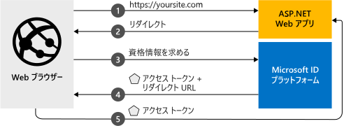

# <a name="quickstart-add-microsoft-identity-platform-sign-in-to-an-aspnet-web-app"></a>クイック スタート:ASP.NET Web アプリに Microsoft ID プラットフォーム サインインを追加する

このクイックスタートでは、ASP.NET Web アプリで Azure Active Directory (Azure AD) 組織のユーザーをサインインする方法を示すコード サンプルをダウンロードして実行します。 

> [!div renderon="docs"]
> 次の図は、サンプル アプリの動作を示しています。
>
> 
>
> ## <a name="prerequisites"></a>前提条件
>
> * アクティブなサブスクリプションが含まれる Azure アカウント。 [無料でアカウントを作成できます](https://azure.microsoft.com/free/?WT.mc_id=A261C142F)。
> * [Visual Studio 2019](https://visualstudio.microsoft.com/vs/)
> * [.NET Framework 4.7.2 以降](https://dotnet.microsoft.com/download/visual-studio-sdks)
>
> ## <a name="register-and-download-the-app"></a>アプリを登録してダウンロードする
> アプリケーションを作成するにあたっては、自動構成と手動構成という 2 つの選択肢があります。
>
> ### <a name="automatic-configuration"></a>自動構成
> アプリを自動的に構成したうえでコード サンプルをダウンロードする場合は、これらの手順に従います。
>
> 1. <a href="https://portal.azure.com/#blade/Microsoft_AAD_RegisteredApps/applicationsListBlade/quickStartType/AspNetWebAppQuickstartPage/sourceType/docs" target="_blank">アプリの登録用の Azure portal ページ</a>に移動します。
> 1. アプリケーションの名前を入力し、 **[登録]** を選択します。
> 1. 画面の指示に従ってダウンロードし、1 回クリックするだけで、新しいアプリケーションが自動的に構成されます。
>
> ### <a name="manual-configuration"></a>手動構成
> アプリケーションとコードサンプルを手動で構成する場合は、次の手順を使用します。
>
> #### <a name="step-1-register-your-application"></a>手順 1:アプリケーションの登録
>
> 1. <a href="https://portal.azure.com/" target="_blank">Azure portal</a> にサインインします。
> 1. 複数のテナントにアクセスできる場合は、トップ メニューの **[ディレクトリとサブスクリプション]** フィルター :::image type="icon" source="./media/common/portal-directory-subscription-filter.png" border="false"::: を使用して、アプリケーションを登録するテナントを選択します。
> 1. **Azure Active Directory** を検索して選択します。
> 1. **[管理]** で **[アプリの登録]**  >  **[新規登録]** の順に選択します。
> 1. **[名前]** に、アプリケーションの名前を入力します。 たとえば、「**ASPNET-Quickstart**」と入力します。 この名前は、アプリのユーザーに表示される場合があります。また、後で変更することができます。
> 1. **[リダイレクト URI]** に **https://localhost:44368/** を追加し、 **[登録]** を選択します。
> 1. **[管理]** で、 **[認証]** を選択します。
> 1. **[Implicit grant and hybrid flows]\(暗黙的な許可およびハイブリッド フロー\)** セクションで、 **[ID トークン]** を選択します。
> 1. **[保存]** を選択します。

> [!div class="sxs-lookup" renderon="portal"]
> #### <a name="step-1-configure-your-application-in-the-azure-portal"></a>手順 1:Azure portal でのアプリケーションの構成
> このクイックスタートのコード サンプルを動作させるには、 **[リダイレクト URI]** に「 **https://localhost:44368/** 」と入力します。
>
> > [!div renderon="portal" id="makechanges" class="nextstepaction"]
> > [この変更を行う]()
>
> > [!div id="appconfigured" class="alert alert-info"]
> >  アプリケーションはこの属性で構成されています。

#### <a name="step-2-download-the-project"></a>手順 2:プロジェクトのダウンロード

> [!div renderon="docs"]
> [Visual Studio 2019 ソリューションのダウンロード](https://github.com/AzureADQuickStarts/AppModelv2-WebApp-OpenIDConnect-DotNet/archive/master.zip)

> [!div renderon="portal" class="sxs-lookup"]
> Visual Studio 2019 を使用してプロジェクトを実行します。
> [!div renderon="portal" id="autoupdate" class="sxs-lookup nextstepaction"]
> [コード サンプルをダウンロードします](https://github.com/AzureADQuickStarts/AppModelv2-WebApp-OpenIDConnect-DotNet/archive/master.zip)

[!INCLUDE [active-directory-develop-path-length-tip](../../../includes/active-directory-develop-path-length-tip.md)]

> [!div class="sxs-lookup" renderon="portal"]
> #### <a name="step-3-your-app-is-configured-and-ready-to-run"></a>手順 3:アプリが構成され、実行準備ができる
> アプリのプロパティの値を使用してプロジェクトを構成しました。

> [!div renderon="docs"]
> #### <a name="step-3-run-your-visual-studio-project"></a>手順 3:Visual Studio プロジェクトを実行する

1. ルート フォルダーに近いローカル フォルダーに .zip ファイルを展開します。 たとえば、*C:\Azure-Samples* に展開します。
   
   Windows におけるパスの長さの制限に起因したエラーを防ぐため、ドライブのルートに近いディレクトリをアーカイブの展開先とすることをお勧めします。
2. Visual Studio でソリューションを開きます (*AppModelv2-WebApp-OpenIDConnect-DotNet.sln*)。
3. Visual Studio のバージョンによっては、プロジェクト **AppModelv2-WebApp-OpenIDConnect-DotNet** を右クリックして **[NuGet パッケージの復元]** を選択することが必要になる場合があります。
4. **[表示]**  >  **[その他のウィンドウ]**  >  **[パッケージ マネージャー コンソール]** を選択してパッケージ マネージャー コンソールを開きます。 次に、`Update-Package Microsoft.CodeDom.Providers.DotNetCompilerPlatform -r` を実行します。

> [!div renderon="docs"]
> 5. *[Web.config]* を編集し、`ClientId`、`Tenant`、`redirectUri` の各パラメーターを次のように置き換えます。
>    ```xml
>    <add key="ClientId" value="Enter_the_Application_Id_here" />
>    <add key="Tenant" value="Enter_the_Tenant_Info_Here" />
>    <add key="redirectUri" value="https://localhost:44368/" />
>    ```
>    このコードでは:
>
>    - `Enter_the_Application_Id_here` は、先ほど作成したアプリの登録のアプリケーション (クライアント) ID です。 Azure portal の **[アプリの登録]** にあるアプリの **[概要]** ページで、アプリケーション (クライアント) ID を見つけます。
>    - `Enter_the_Tenant_Info_Here` には、次のいずれかを選択します。
>      - アプリケーションでサポートされるのが **[所属する組織のみ]** である場合、この値をディレクトリ (テナント) ID またはテナント名 (例: `contoso.onmicrosoft.com`) に置き換えます。 Azure portal の **[アプリの登録]** にあるアプリの **[概要]** ページで、ディレクトリ (テナント) ID を見つけます。
>      - アプリケーションで **任意の組織のディレクトリ内のアカウント** がサポートされる場合は、この値を `organizations` に置き換えます。
>      - アプリケーションで **[すべての Microsoft アカウント ユーザー]** がサポートされる場合は、この値を `common` に置き換えます。
>    - `redirectUri` は、先ほど Azure portal の **[アプリの登録]** で入力した **リダイレクト URI** です。
>

> [!div class="sxs-lookup" renderon="portal"]
> > [!NOTE]
> > `Enter_the_Supported_Account_Info_Here`

## <a name="more-information"></a>詳細情報

このセクションでは、ユーザーをサインインさせるために必要なコードの概要を示します。 この概要は、コードの働きや主な引数、また既存の ASP.NET アプリケーションにサインインを追加する方法を理解するうえで役立ちます。

> [!div class="sxs-lookup" renderon="portal"]
> ### <a name="how-the-sample-works"></a>このサンプルのしくみ
>
> 

### <a name="owin-middleware-nuget-packages"></a>OWIN ミドルウェア NuGet パッケージ

ASP.NET で OpenID Connect を使用して Cookie ベースの認証を行うために、OWIN ミドルウェア パッケージを使用して認証パイプラインをセットアップできます。 これらのパッケージは、Visual Studio 内のパッケージ マネージャー コンソールから次のコマンドを実行してインストールできます。

```powershell
Install-Package Microsoft.Owin.Security.OpenIdConnect
Install-Package Microsoft.Owin.Security.Cookies
Install-Package Microsoft.Owin.Host.SystemWeb
```

### <a name="owin-startup-class"></a>OWIN スタートアップ クラス

OWIN ミドルウェアでは、ホスト プロセスの開始時に実行される "*スタートアップ クラス*" が使用されます。 このクイックスタートでは、ルート フォルダーに *startup.cs* ファイルがあります。 次のコードは、このクイックスタートで使用されるパラメーターを示しています。

```csharp
public void Configuration(IAppBuilder app)
{
    app.SetDefaultSignInAsAuthenticationType(CookieAuthenticationDefaults.AuthenticationType);

    app.UseCookieAuthentication(new CookieAuthenticationOptions());
    app.UseOpenIdConnectAuthentication(
        new OpenIdConnectAuthenticationOptions
        {
            // Sets the client ID, authority, and redirect URI as obtained from Web.config
            ClientId = clientId,
            Authority = authority,
            RedirectUri = redirectUri,
            // PostLogoutRedirectUri is the page that users will be redirected to after sign-out. In this case, it's using the home page
            PostLogoutRedirectUri = redirectUri,
            Scope = OpenIdConnectScope.OpenIdProfile,
            // ResponseType is set to request the code id_token, which contains basic information about the signed-in user
            ResponseType = OpenIdConnectResponseType.CodeIdToken,
            // ValidateIssuer set to false to allow personal and work accounts from any organization to sign in to your application
            // To only allow users from a single organization, set ValidateIssuer to true and the 'tenant' setting in Web.config to the tenant name
            // To allow users from only a list of specific organizations, set ValidateIssuer to true and use the ValidIssuers parameter
            TokenValidationParameters = new TokenValidationParameters()
            {
                ValidateIssuer = false // Simplification (see note below)
            },
            // OpenIdConnectAuthenticationNotifications configures OWIN to send notification of failed authentications to the OnAuthenticationFailed method
            Notifications = new OpenIdConnectAuthenticationNotifications
            {
                AuthenticationFailed = OnAuthenticationFailed
            }
        }
    );
}
```

> |Where  | 説明 |
> |---------|---------|
> | `ClientId`     | Azure portal に登録されているアプリケーションのアプリケーション ID。 |
> | `Authority`    | ユーザーが認証するためのセキュリティ トークン サービス (STS) エンドポイント。 通常、パブリック クラウドでは `https://login.microsoftonline.com/{tenant}/v2.0` になります。 この URL の *{tenant}* には、テナントの名前またはテナント ID を指定するか、共通エンドポイントへの参照を表す `common` を指定します (共通エンドポイントは、マルチテナント型のアプリケーションで使用されます。) |
> | `RedirectUri`  | Microsoft ID プラットフォームに対する認証後にユーザーが誘導される URL。 |
> | `PostLogoutRedirectUri`     | サインオフ後にユーザーが誘導される URL。 |
> | `Scope`     | 要求されているスコープのスペース区切りリスト。 |
> | `ResponseType`     | 認証からの応答に承認コードと ID トークンを含めるという要求。 |
> | `TokenValidationParameters`     | トークン検証のためのパラメーター リスト。 この場合、`ValidateIssuer` は `false` に設定され、任意の個人、あるいは職場または学校のアカウント タイプからのサインインを受け付け可能であることを示します。 |
> | `Notifications`     | `OpenIdConnect` メッセージに対して実行できるデリゲートのリスト。 |


> [!NOTE]
> `ValidateIssuer = false` の設定は、このクイック スタートを単純にするためのものです。 実際のアプリケーションでは、発行者を検証します。 その方法については、サンプルを参照してください。

### <a name="authentication-challenge"></a>認証チャレンジ

コントローラーで認証チャレンジを要求することによって、ユーザーにサインインを強制することができます。

```csharp
public void SignIn()
{
    if (!Request.IsAuthenticated)
    {
        HttpContext.GetOwinContext().Authentication.Challenge(
            new AuthenticationProperties{ RedirectUri = "/" },
            OpenIdConnectAuthenticationDefaults.AuthenticationType);
    }
}
```

> [!TIP]
> この方法を使用して認証チャレンジを要求するかどうかは任意です。 通常、認証されたユーザーと認証されていないユーザーの両方に、なんらかのビューへのアクセスを用意したい場合に、これを使用します。 代わりに、次のセクションで説明する方法を使ってコントローラーを保護することもできます。

### <a name="attribute-for-protecting-a-controller-or-a-controller-actions"></a>コントローラーまたはコントローラー アクションを保護するための属性

コントローラーまたはコントローラー アクションは、`[Authorize]` 属性を使用して保護することができます。 この属性は、認証されたユーザーにのみコントローラーのアクションへのアクセスを許可することで、コントローラーまたはアクションへのアクセスを制限します。 認証チャレンジは、`[Authorize]` 属性によって修飾されたいずれかのアクションまたはコントローラーに対して非認証ユーザーがアクセスを試みると自動的に実行されます。

[!INCLUDE [Help and support](../../../includes/active-directory-develop-help-support-include.md)]

## <a name="next-steps"></a>次のステップ

アプリケーションや新機能の構築についての完全なステップ バイ ステップ ガイドについては、ASP.NET チュートリアルをお試しください。このクイックスタートの完全な説明も含まれています。

> [!div class="nextstepaction"]
> [ASP.NET Web アプリにサインインを追加する](tutorial-v2-asp-webapp.md)
