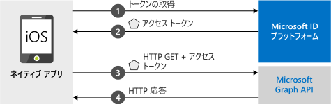

# <a name="quickstart-sign-in-users-and-call-the-microsoft-graph-api-from-an-ios-app"></a>クイック スタート:iOS アプリからユーザーにサインインし、Microsoft Graph API を呼び出す

[!INCLUDE [active-directory-develop-applies-v2-msal](../../../includes/active-directory-develop-applies-v2-msal.md)]

このクイック スタートには、ネイティブ iOS アプリケーションから個人や仕事、学校のアカウントへのサインイン、アクセス トークンの取得、Microsoft Graph API の呼び出しを行う方法を示すコード サンプルが含まれています。



> [!NOTE]
> **前提条件**
> * XCode 10 以降
> * iOS 10 以降 

> [!div renderon="docs"]
> ## <a name="register-and-download-your-quickstart-app"></a>クイック スタート アプリを登録してダウンロードする
> クイック スタート アプリケーションを開始する方法としては、次の 2 つの選択肢があります。
> * [簡易] [選択肢 1: アプリを登録して自動構成を行った後、コード サンプルをダウンロードする](#option-1-register-and-auto-configure-your-app-and-then-download-your-code-sample)
> * [手動] [選択肢 2: アプリケーションを登録し、コード サンプルを手動で構成する](#option-2-register-and-manually-configure-your-application-and-code-sample)
>
> ### <a name="option-1-register-and-auto-configure-your-app-and-then-download-your-code-sample"></a>選択肢 1: アプリを登録して自動構成を行った後、コード サンプルをダウンロードする
> #### <a name="step-1-register-your-application"></a>手順 1:アプリケーションの登録
> アプリを登録するには、
> 1. 新しい [Azure portal の [アプリの登録]](https://portal.azure.com/#blade/Microsoft_AAD_RegisteredApps/applicationsListBlade/quickStartType/IosQuickstartPage/sourceType/docs) ウィンドウに移動します。
> 1. アプリケーションの名前を入力し、 **[登録]** を選択します。
> 1. 画面の指示に従ってダウンロードし、1 回クリックするだけで、新しいアプリケーションが自動的に構成されます。
>
> ### <a name="option-2-register-and-manually-configure-your-application-and-code-sample"></a>オプション 2:アプリケーションを登録し、アプリケーションとコード サンプルを手動で構成する
>
> #### <a name="step-1-register-your-application"></a>手順 1: アプリケーションの登録
> アプリケーションを登録し、その登録情報をソリューションに手動で追加するには、次の手順を実行します。
>
> 1. 開発者用の Microsoft ID プラットフォームの [[アプリの登録]](https://aka.ms/MobileAppReg) ページに移動します。
> 1. **[新規登録]** を選択します。
> 1. **[アプリケーションの登録]** ページが表示されたら、以下のアプリケーションの登録情報を入力します。
>      - **[名前]** セクションに、アプリのユーザーがアプリにサインインまたは同意したときにユーザーに表示されるわかりやすいアプリケーション名を入力します (例: `iOSQuickstart`)。
>      - このページの他の設定はスキップします。 
>      - [`Register`] ボタンをクリックします。
> 1. 新しいアプリをクリックし、`Authentication` > `Add Platform` > `iOS` の順に選択します。    
>      - アプリケーションの***バンドル ID*** を入力します。 
> 1. `Configure` を選択し、後に備えて ***MSAL 構成***の詳細を保存します。 

> [!div renderon="portal" class="sxs-lookup"]
>
> #### <a name="step-1-configure-your-application"></a>手順 1:アプリケーションの作成
> このクイック スタートのコード サンプルを動作させるには、Auth ブローカーと互換性があるリダイレクト URI を追加する必要があります。 
> > [!div renderon="portal" id="makechanges" class="nextstepaction"]
> > [この変更を行う]()
>
> > [!div id="appconfigured" class="alert alert-info"]
> >  アプリケーションはこれらの属性で構成されています

#### <a name="step-2-download-your-web-server-or-project"></a>手順 2:Web サーバーまたはプロジェクトのダウンロード

- [コード サンプルのダウンロード](https://github.com/Azure-Samples/active-directory-ios-swift-native-v2/archive/master.zip)

#### <a name="step-3-configure-your-project"></a>手順 3:プロジェクトを構成する

> [!div renderon="docs"]
> 上のオプション 1 を選択した場合は、以下の手順を省略できます。 

> [!div renderon="portal" class="sxs-lookup"]
> 1. zip ファイルを解凍し、XCode でプロジェクトを開きます。
> 1. **ViewController.swift** を編集し、'let kClientID' で始まる行を次のコード スニペットで置換します。
>    ```swift
>    let kClientID = "Enter_the_Application_Id_here"
>    let kAuthority = "https://login.microsoftonline.com/Enter_the_Tenant_Info_Here"
>    ``` 
> 1. **Info.plist** を右クリックし、 **[形式を指定して開く]**  >  **[ソース コード]** を選択します。
> 1. dict ルート ノードの下で、***バンドル ID*** と置き換えます。
>
>    ```xml
>    <key>CFBundleURLTypes</key>
>    <array>
>       <dict>
>          <key>CFBundleURLSchemes</key>
>          <array>
>             <string>msauth.Enter_the_Bundle_Id_Here</string>
>          </array>
>       </dict>
>    </array>
> 
>    ```
> 1. アプリをビルドして実行します。 

> [!div class="sxs-lookup" renderon="portal"]
> > [!NOTE]
> > このクイックスタートは、Enter_the_Supported_Account_Info_Here をサポートしています。

> [!div renderon="docs"]
>
> 1. zip ファイルを解凍し、XCode でプロジェクトを開きます。
> 1. **ViewController.swift** を編集し、'let kClientID' で始まる行を次のコード スニペットで置換します。
>
>    ```swift
>    let kClientID = "<ENTER_YOUR_APPLICATION/CLIENT_ID>"
> 
>    ```
> 1. **Info.plist** を右クリックし、 **[形式を指定して開く]**  >  **[ソース コード]** を選択します。
> 1. dict ルート ノードの下で、***バンドル ID*** と置き換えます。
>
>    ```xml
>    <key>CFBundleURLTypes</key>
>    <array>
>       <dict>
>          <key>CFBundleURLSchemes</key>
>          <array>
>             <string>msauth.<ENTER_YOUR_BUNDLE_ID></string>
>          </array>
>       </dict>
>    </array>
>
>    ```
> 1. アプリをビルドして実行します。 

## <a name="more-information"></a>詳細情報

このクイック スタートの詳細については、以下のセクションをお読みください。

### <a name="getting-msal"></a>MSAL の取得

MSAL ([MSAL.framework](https://github.com/AzureAD/microsoft-authentication-library-for-objc)) はユーザーをサインインし、Microsoft ID プラットフォームによって保護されている API にアクセスするトークンを要求するために使用するライブラリです。 MSAL は、次のプロセスを使用してアプリケーションに追加できます。

```
$ vi Podfile

```
次の内容を (プロジェクトのターゲットと共に) この podfile に追加します。

```
use_frameworks!

target 'MSALiOS' do
   pod 'MSAL', '~> 0.4.0'
end

```

### <a name="msal-initialization"></a>MSAL の初期化

MSAL への参照を追加するには、次のコードを追加します。

```swift
import MSAL
```

続いて、次のコードを使用して MSAL を初期化します。

```swift
let authority = try MSALAADAuthority(url: URL(string: kAuthority)!)
            
let msalConfiguration = MSALPublicClientApplicationConfig(clientId: kClientID, redirectUri: nil, authority: authority)
self.applicationContext = try MSALPublicClientApplication(configuration: msalConfiguration)

```

> |各値の説明: ||
> |---------|---------|
> | `clientId` | *portal.azure.com* に登録されているアプリケーションの Application ID |
> | `authority` | Microsoft ID プラットフォーム エンドポイント。 ほとんどの場合は *https<span/>://login.microsoftonline.com/common* |
> | `redirectUri` | アプリケーションのリダイレクト URI。 'nil' を渡すと、既定値またはカスタムのリダイレクト URI を使用できます。 |

### <a name="additional-app-requirements"></a>アプリのその他の要件  

アプリでは、`AppDelegate` 内に次の内容も必要です。 これにより、認証を実行するときに MSAL SDK が Auth ブローカー アプリからのトークン応答を処理できるようになります。

 ```swift
 func application(_ app: UIApplication, open url: URL, options: [UIApplication.OpenURLOptionsKey : Any] = [:]) -> Bool {
         guard let sourceApplication = options[UIApplication.OpenURLOptionsKey.sourceApplication] as? String else {
             return false
         }
         
         return MSALPublicClientApplication.handleMSALResponse(url, sourceApplication: sourceApplication)
     }

```

最後に、アプリでは、`LSApplicationQueriesSchemes` エントリが ***Info.plist*** に `CFBundleURLTypes` と並んで存在している必要があります。 サンプルにはこれが含まれています。 

   ```xml 
   <key>LSApplicationQueriesSchemes</key>
   <array>
      <string>msauth</string>
      <string>msauthv2</string>
   </array>
   ```

### <a name="sign-in-users--request-tokens"></a>ユーザーをサインインさせてトークンを要求する

MSAL には、トークンの取得に使用する 2 つのメソッド `acquireToken`、`acquireTokenSilent` があります。

#### <a name="acquiretoken-getting-a-token-interactively"></a>acquireToken:トークンを対話形式で取得する

状況によっては、ユーザーが Microsoft ID プラットフォームと対話する必要があります。 このような場合、エンド ユーザーは自分のアカウントを選択する、自分の資格情報を入力する、またはアプリのアクセス許可に同意することを要求される可能性があります。 たとえば、次のように入力します。 

* ユーザーが初めてアプリケーションにサインインした場合
* ユーザーが自分のパスワードをリセットした場合、ユーザーは自分の資格情報を入力する必要がある 
* アプリケーションがリソースへのアクセスを初めて要求している場合
* MFA またはその他の条件付きアクセス ポリシーが必要な場合

```swift
let parameters = MSALInteractiveTokenParameters(scopes: kScopes)
applicationContext.acquireToken(with: parameters) { (result, error) in /* Add your handling logic */}
```

> |各値の説明:||
> |---------|---------|
> | `scopes` | 要求するスコープを含む (つまり、Microsoft Graph 用の `[ "user.read" ]` またはカスタム Web API 用の `[ "<Application ID URL>/scope" ]`) (`api://<Application ID>/access_as_user`) |

#### <a name="acquiretokensilent-getting-an-access-token-silently"></a>acquireTokenSilent:アクセス トークンを自動的に取得する

アプリは、ユーザーがトークンを要求するたびに、サインインすることをユーザーに要求するべきではありません。 ユーザーが既にサインインしている場合は、この方法により、アプリはトークンを暗黙的に要求できます。 

```swift
let parameters = MSALSilentTokenParameters(scopes: kScopes, account: applicationContext.allAccounts().first)
applicationContext.acquireTokenSilent(with: parameters) { (result, error) in /* Add your handling logic */}
```

> |各値の説明: ||
> |---------|---------|
> | `scopes` | 要求するスコープを含む (つまり、Microsoft Graph 用の `[ "user.read" ]` またはカスタム Web API 用の `[ "<Application ID URL>/scope" ]`) (`api://<Application ID>/access_as_user`) |
> | `account` | トークンが要求されているアカウント。 このクイックスタートは単一アカウントのアプリケーションです。複数アカウントのアプリを構築する場合は、どのアカウントをトークン要求に使用するかを識別するためのロジックを定義する必要があります `applicationContext.account(forHomeAccountId: self.homeAccountId)` |

## <a name="next-steps"></a>次の手順

アプリケーションの構築についての完全なステップ バイ ステップ ガイドは、iOS チュートリアルをお試しください。このクイック スタートの完全な説明も含まれています。

### <a name="learn-the-steps-to-create-the-application-used-in-this-quickstart"></a>このクイック スタートで使用されているアプリケーションを作成する手順

> [!div class="nextstepaction"]
> [Graph API 呼び出し iOS チュートリアル](https://docs.microsoft.com/azure/active-directory/develop/guidedsetups/active-directory-ios)

[!INCLUDE [Help and support](../../../includes/active-directory-develop-help-support-include.md)]

Microsoft ID プラットフォームの改善にご協力ください。 簡単な 2 つの質問からなるアンケートに記入し、ご意見をお聞かせください。

> [!div class="nextstepaction"]
> [Microsoft ID プラットフォームのアンケート](https://forms.office.com/Pages/ResponsePage.aspx?id=v4j5cvGGr0GRqy180BHbRyKrNDMV_xBIiPGgSvnbQZdUQjFIUUFGUE1SMEVFTkdaVU5YT0EyOEtJVi4u)