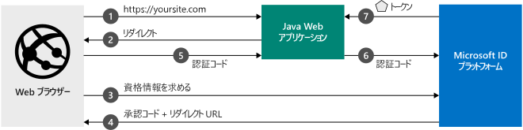

# <a name="quickstart-add-sign-in-with-microsoft-to-a-java-web-app"></a>クイック スタート:Java Web アプリに "Microsoft でサインイン" を追加する

このクイックスタートでは、Java Web アプリを Microsoft ID プラットフォームと統合する方法を説明します。 お使いのアプリによって、ユーザーがサインインされ、Microsoft Graph API を呼び出すためのアクセス トークンが取得されて、Microsoft Graph API への要求が行われます。

このクイックスタートを完了すると、アプリケーションは、個人用の Microsoft アカウント (outlook.com、live.com など) と、Azure Active Directory を使用する会社や組織の職場または学校アカウントのサインインを受け入れるようになります。 (図については、「[このサンプルのしくみ](#how-the-sample-works)」を参照してください)。

## <a name="prerequisites"></a>前提条件

このサンプルを実行するには、次のものが必要になります。

- [Java Development Kit (JDK)](https://openjdk.java.net/) 8 以降および [Maven](https://maven.apache.org/)。

> [!div renderon="docs"]
> ## <a name="register-and-download-your-quickstart-app"></a>クイック スタート アプリを登録してダウンロードする
> クイックスタート アプリケーションを開始する方法としては、[簡易] (オプション 1) と [手動] (オプション 2) の 2 つの選択肢があります。
>
> ### <a name="option-1-register-and-auto-configure-your-app-and-then-download-your-code-sample"></a>オプション 1: アプリを登録して自動構成を行った後、コード サンプルをダウンロードする
>
> 1. [Azure portal の [アプリの登録]](https://portal.azure.com/#blade/Microsoft_AAD_IAM/ActiveDirectoryMenuBlade/RegisteredApps) に移動します。
> 1. アプリケーションの名前を入力し、 **[登録]** を選択します。
> 1. 指示に従って新しいアプリケーションをダウンロードし、自動構成します。
>
> ### <a name="option-2-register-and-manually-configure-your-application-and-code-sample"></a>オプション 2:アプリケーションを登録し、アプリケーションとコード サンプルを手動で構成する
>
> #### <a name="step-1-register-your-application"></a>手順 1:アプリケーションの登録
>
> アプリケーションを登録し、その登録情報をソリューションに手動で追加するには、次の手順を実行します。
>
> 1. 職場または学校アカウントか、個人の Microsoft アカウントを使用して、[Azure portal](https://portal.azure.com) にサインインします。
> 1. ご利用のアカウントで複数のテナントにアクセスできる場合は、右上隅でアカウントを選択し、ポータルのセッションを目的の Azure AD テナントに設定します。
>
> 1. 開発者用の Microsoft ID プラットフォームの [[アプリの登録]](/azure/active-directory/develop/) ページに移動します。
> 1. **[新規登録]** を選択します。
> 1. **[アプリケーションの登録]** ページが表示されたら、以下のアプリケーションの登録情報を入力します。
>    - **[名前]** セクションに、アプリのユーザーに表示されるわかりやすいアプリケーション名を入力します (例: `java-webapp`)。
>    - ここでは **[リダイレクト URI]** は空白のままにして、 **[登録]** を選択します。
> 1. **[概要]** ページで、アプリケーションの **[アプリケーション (クライアント) ID]** と **[ディレクトリ (テナント) ID]** の値を見つけます。 後のためにこれらの値をコピーします。
> 1. メニューから **[認証]** を選択し、次の情報を追加します。
>    - **[リダイレクト URI]** で `https://localhost:8080/msal4jsample/secure/aad` と `https://localhost:8080/msal4jsample/graph/me` を追加します。
>    - **[保存]** を選択します。
> 1. メニューから **[証明書とシークレット]** を選択し、 **[クライアント シークレット]** セクションで **[新しいクライアント シークレット]** をクリックします。
>
>    - キーの説明 (インスタンス アプリ シークレットの) を入力します。
>    - キーの有効期間として **[1 年]** を選択します。
>    - キーの値は、 **[追加]** を選択すると表示されます。
>    - 後のためにキーの値をコピーします。 このキー値は、再度表示することも、その他の方法で取得することもできないため、Azure portal から参照できるようになったらすぐに記録してください。
>
> [!div class="sxs-lookup" renderon="portal"]
> #### <a name="step-1-configure-your-application-in-the-azure-portal"></a>手順 1:Azure portal でのアプリケーションの構成
>
> このクイックスタートのコード サンプルを動作させるには、以下の操作が必要です。
>
> 1. 応答 URL として `https://localhost:8080/msal4jsample/secure/aad` および `https://localhost:8080/msal4jsample/graph/me` を追加します。
> 1. クライアント シークレットを作成します。
> > [!div renderon="portal" id="makechanges" class="nextstepaction"]
> > [これらの変更を行います]()
>
> > [!div id="appconfigured" class="alert alert-info"]
> >  アプリケーションはこれらの属性で構成されています。

#### <a name="step-2-download-the-code-sample"></a>手順 2:コード サンプルのダウンロード
> [!div renderon="docs"]
> [コード サンプルのダウンロード](https://github.com/Azure-Samples/ms-identity-java-webapp/archive/master.zip)

> [!div class="sxs-lookup" renderon="portal"]
> プロジェクトをダウンロードし、ルート フォルダーに近いローカル フォルダー (例: **C:\Azure-Samples**) に ZIP ファイルを展開します。
> 
> localhost で https を使用するには、server.ssl.key プロパティを入力します。 自己署名証明書を生成するには、keytool ユーティリティ (JRE に含まれています) を使用します。
>
>  ```
>   Example:
>   keytool -genkeypair -alias testCert -keyalg RSA -storetype PKCS12 -keystore keystore.p12 -storepass password
>
>   server.ssl.key-store-type=PKCS12  
>   server.ssl.key-store=classpath:keystore.p12  
>   server.ssl.key-store-password=password  
>   server.ssl.key-alias=testCert
>   ```
>   生成されたキーストア ファイルを "resources" フォルダーに配置します。
   
> [!div renderon="portal" id="autoupdate" class="nextstepaction"]
> [コード サンプルをダウンロードします]()

> [!div renderon="docs"]
> #### <a name="step-3-configure-the-code-sample"></a>手順 3:コード サンプルの構成
> 1. ZIP ファイルをローカル フォルダーに展開します。
> 1. 統合開発環境を使用する場合は、その IDE でサンプルを開きます (オプション)。
> 1. application.properties ファイルを開きます。これは、src/main/resources/ フォルダーにあり、フィールド *aad. clientId*、*aad. authority*、および *aad.secretKey* の値を **アプリケーション ID**、**テナント ID**、および**クライアント シークレット**のそれぞれの値で置き換えます。
>
>    ```file
>    aad.clientId=Enter_the_Application_Id_here
>    aad.authority=https://login.microsoftonline.com/Enter_the_Tenant_Info_Here/
>    aad.secretKey=Enter_the_Client_Secret_Here
>    aad.redirectUriSignin=https://localhost:8080/msal4jsample/secure/aad
>    aad.redirectUriGraph=https://localhost:8080/msal4jsample/graph/me
>    aad.msGraphEndpointHost="https://graph.microsoft.com/"
>    ```
> 各値の説明:
>
> - `Enter_the_Application_Id_here` - 登録したアプリケーションのアプリケーション ID。
> - `Enter_the_Client_Secret_Here` - 登録済みアプリケーション用に **[証明書とシークレット]** で作成した **[クライアント シークレット]** です。
> - `Enter_the_Tenant_Info_Here` - 登録したアプリケーションの**ディレクトリ (テナント) ID** 値です。
> 1. localhost で https を使用するには、server.ssl.key プロパティを入力します。 自己署名証明書を生成するには、keytool ユーティリティ (JRE に含まれています) を使用します。
>
>  ```
>   Example:
>   keytool -genkeypair -alias testCert -keyalg RSA -storetype PKCS12 -keystore keystore.p12 -storepass password
>
>   server.ssl.key-store-type=PKCS12  
>   server.ssl.key-store=classpath:keystore.p12  
>   server.ssl.key-store-password=password  
>   server.ssl.key-alias=testCert
>   ```
>   生成されたキーストア ファイルを "resources" フォルダーに配置します。


> [!div class="sxs-lookup" renderon="portal"]
> #### <a name="step-3-run-the-code-sample"></a>手順 3:コード サンプルの実行
> [!div renderon="docs"]
> #### <a name="step-4-run-the-code-sample"></a>手順 4:コード サンプルの実行

プロジェクトを実行するには、次のいずれかを行うことができます。

埋め込みの Spring Boot サーバーを使用して IDE から直接実行するか、または [maven](https://maven.apache.org/plugins/maven-war-plugin/usage.html) を使用して WAR ファイルにパッケージ化し、[Apache Tomcat](http://tomcat.apache.org/) などの J2EE コンテナー ソリューションにデプロイします。

##### <a name="running-from-ide"></a>IDE からの実行

IDE から Web アプリケーションを実行している場合は、[実行] をクリックし、プロジェクトのホーム ページに移動します。 このサンプルでは、標準のホームページ URL は https://localhost:8080 です。

1. 前面のページで、 **[ログイン]** ボタンを選択して Azure Active Directory にリダイレクトし、ユーザーに資格情報の入力を求めます。

1. ユーザーは認証されると、 *https://localhost:8080/msal4jsample/secure/aad* にリダイレクトされます。 ユーザーがサインインしたので、ページにサインインしたアカウントに関する情報が表示されます。 サンプル UI には、次のボタンがあります。
    - "*サインアウト*": 現在のユーザーをアプリケーションからサインアウトし、ホーム ページにリダイレクトします。
    - *Show User Info (ユーザー情報の表示)* :Microsoft Graph のトークンを取得し、そのトークンを含む要求で Microsoft Graph を呼び出します。これにより、サインインしたユーザーに関する基本情報が返されます。


   
> [!IMPORTANT]
> このクイック スタート アプリケーションは、クライアント シークレットを使用して、それ自体を機密クライアントとして識別します。 クライアント シークレットはプロジェクト ファイルにプレーン テキストとして追加されるため、セキュリティ上の理由から、アプリケーションを運用アプリケーションと見なす前に、クライアント シークレットの代わりに証明書を使用することをお勧めします。 証明書の使用方法の詳細については、「[アプリケーションを認証するための証明書資格情報](https://docs.microsoft.com/azure/active-directory/develop/active-directory-certificate-credentials)」を参照してください。

## <a name="more-information"></a>詳細情報

### <a name="how-the-sample-works"></a>このサンプルのしくみ


### <a name="getting-msal"></a>MSAL の取得

MSAL for Java (MSAL4J) は、ユーザーをサインインさせるために使用されたり、Microsoft ID プラットフォームによって保護されている API にアクセスするためのトークンを要求するために使用されたりする Java ライブラリです。

Maven または Gradle を使用して、アプリケーションに MSAL4J を追加し、アプリケーションの pom.xml (Maven) または build.gradle (Gradle) ファイルに対して以下の変更を行うことで、依存関係を管理します。

```XML
<dependency>
    <groupId>com.microsoft.azure</groupId>
    <artifactId>msal4j</artifactId>
    <version>1.0.0</version>
</dependency>
```

```$xslt
compile group: 'com.microsoft.azure', name: 'msal4j', version: '1.0.0'
```

### <a name="msal-initialization"></a>MSAL の初期化

MSAL for Java を使用するファイルの先頭に次のコードを追加して、MSAL4J への参照を追加します。

```Java
import com.microsoft.aad.msal4j.*;
```

## <a name="next-steps"></a>次の手順

アクセス許可と同意について学習します。

> [!div class="nextstepaction"]
> [アクセス許可と同意](https://docs.microsoft.com/azure/active-directory/develop/v2-permissions-and-consent)

このシナリオ用の認証フローの詳細については、OAuth 2.0 承認コード フローを参照してください。

> [!div class="nextstepaction"]
> [承認コードの Oauth フロー](https://docs.microsoft.com/azure/active-directory/develop/v2-oauth2-auth-code-flow)

Microsoft ID プラットフォームの改善にご協力ください。 簡単な 2 つの質問からなるアンケートに記入し、ご意見をお聞かせください。

> [!div class="nextstepaction"]
> [Microsoft ID プラットフォームのアンケート](https://forms.office.com/Pages/ResponsePage.aspx?id=v4j5cvGGr0GRqy180BHbRyKrNDMV_xBIiPGgSvnbQZdUQjFIUUFGUE1SMEVFTkdaVU5YT0EyOEtJVi4u)

[!INCLUDE [Help and support](../../../includes/active-directory-develop-help-support-include.md)]
