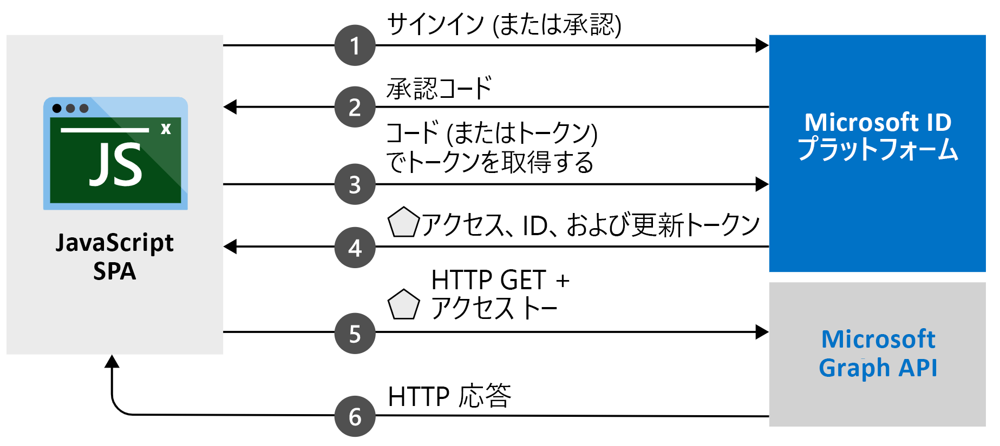

# <a name="quickstart-sign-in-and-get-an-access-token-in-an-angular-spa-using-the-auth-code-flow"></a>クイックスタート: 認可コード フローを使用して Angular SPA 内でユーザーをサインインさせ、アクセス トークンを取得する

このクイックスタートでは、認可コード フローを使用して、JavaScript Angular シングルページ アプリケーション (SPA) でユーザーをサインインさせ、Microsoft Graph を呼び出す方法を示すコード サンプルをダウンロードして実行します。 このコード サンプルでは、Microsoft Graph API または任意の Web API を呼び出すためのアクセス トークンを取得する方法を示します。 

図については、「[このサンプルのしくみ](#how-the-sample-works)」を参照してください。

このクイックスタートでは、認可コード フローで MSAL Angular v2 を使用します。 暗黙的なフローで MSAL Angular 1.x を使用する同様のクイックスタートについては、[クイックスタート: JavaScript シングルページ アプリ内でのユーザーのサインイン](./quickstart-v2-angular.md)に関するページを参照してください。

> [!IMPORTANT]
> MSAL Angular v2 [!INCLUDE [PREVIEW BOILERPLATE](../../../includes/active-directory-develop-preview.md)]

## <a name="prerequisites"></a>前提条件

* Azure サブスクリプション - [Azure サブスクリプションを無料で作成する](https://azure.microsoft.com/free/?WT.mc_id=A261C142F)
* [Node.js](https://nodejs.org/en/download/)
* [Visual Studio Code](https://code.visualstudio.com/download) または別のコード エディター

> [!div renderon="docs"]
> ## <a name="register-and-download-your-quickstart-application"></a>クイック スタート アプリケーションを登録してダウンロードする
> クイックスタートのアプリケーションを起動するには、次のオプションのいずれかを使用します。
>
> ### <a name="option-1-express-register-and-auto-configure-your-app-and-then-download-your-code-sample"></a>オプション 1 (簡易): アプリを登録して自動構成を行った後、コード サンプルをダウンロードする
>
> 1. <a href="https://portal.azure.com/#blade/Microsoft_AAD_RegisteredApps/ApplicationsListBlade/quickStartType/JavascriptSpaQuickstartPage/sourceType/docs" target="_blank">Azure portal のアプリの登録</a>クイックスタート エクスペリエンスに移動します。
> 1. アプリケーションの名前を入力します。
> 1. **[サポートされているアカウントの種類]** で、 **[Accounts in any organizational directory and personal Microsoft accounts]\(任意の組織のディレクトリ内のアカウントと個人用の Microsoft アカウント\)** を選択します。
> 1. **[登録]** を選択します。
> 1. クイックスタート ペインに移動し、指示に従って新しいアプリケーションをダウンロードして自動的に構成します。
>
> ### <a name="option-2-manual-register-and-manually-configure-your-application-and-code-sample"></a>オプション 2 (手動): アプリケーションを登録し、アプリケーションとコード サンプルを手動で構成する
>
> #### <a name="step-1-register-your-application"></a>手順 1:アプリケーションの登録
>
> 1. <a href="https://portal.azure.com/" target="_blank">Azure portal</a> にサインインします。
> 1. 複数のテナントにアクセスできる場合は、トップ メニューの **[ディレクトリとサブスクリプション]** フィルター:::image type="icon" source="./media/common/portal-directory-subscription-filter.png" border="false":::を使用して、アプリケーションを登録するテナントを選択します。
> 1. **Azure Active Directory** を検索して選択します。
> 1. **[管理]** で **[アプリの登録]**  >  **[新規登録]** の順に選択します。
> 1. アプリケーションの **[名前]** を入力します。 この名前は、アプリのユーザーに表示される場合があります。また、後で変更することができます。
> 1. **[サポートされているアカウントの種類]** で、 **[Accounts in any organizational directory and personal Microsoft accounts]\(任意の組織のディレクトリ内のアカウントと個人用の Microsoft アカウント\)** を選択します。
> 1. **[登録]** を選択します。 後で使用するために、アプリの **[概要]** ページで、 **[アプリケーション (クライアント) ID]** の値を書き留めます。
> 1. **[管理]** で、 **[認証]** を選択します。
> 1. **[プラットフォーム構成]** で **[プラットフォームを追加]** を選択します。 表示されたウィンドウで **[シングルページ アプリケーション]** を選択します。
> 1. **[リダイレクト URI]** の値を `http://localhost:4200/` に設定します。 これは NodeJS がローカル コンピューターでリッスンする既定のポートです。 ユーザー認証が成功すると、この URI に認証応答が返されます。 
> 1. **[構成]** を選択して変更を適用します。
> 1. **[プラットフォーム構成]** の **[シングルページ アプリケーション]** を展開します。
> 1. **[許可の種類]** で、自分のリダイレクト URI が PKCE を使用した認可コード フローの対象になっていることを確認します。

> [!div class="sxs-lookup" renderon="portal"]
> #### <a name="step-1-configure-your-application-in-the-azure-portal"></a>手順 1:Azure portal でのアプリケーションの構成
> このクイックスタートのコード サンプルを動作させるには、**リダイレクト URI** (`http://localhost:4200/`) を追加します。
> > [!div renderon="portal" id="makechanges" class="nextstepaction"]
> > [これらの変更を行います]()
>
> > [!div id="appconfigured" class="alert alert-info"]
> >  アプリケーションはこれらの属性で構成されています。

 #### <a name="step-2-download-the-project"></a>手順 2:プロジェクトのダウンロード

> [!div renderon="docs"]
> Node.js を使用して Web サーバーでプロジェクトを実行するために、[コア プロジェクト ファイルをダウンロード](https://github.com/Azure-Samples/ms-identity-javascript-angular-spa/archive/main.zip)します。

> [!div renderon="portal" class="sxs-lookup"]
> Node.js を使用して Web サーバーでプロジェクトを実行する

> [!div renderon="portal" class="sxs-lookup" id="autoupdate" class="nextstepaction"]
> [コード サンプルをダウンロードします](https://github.com/Azure-Samples/ms-identity-javascript-angular-spa/archive/main.zip)

> [!div renderon="docs"]
> #### <a name="step-3-configure-your-javascript-app"></a>手順 3:JavaScript アプリの構成
>
> *src* フォルダーの *app* フォルダーを開いて *app.module.ts* ファイルを開き、`auth` オブジェクトの `clientID`、`authority`、`redirectUri` の各値を更新します。
>
> ```javascript
> // MSAL instance to be passed to msal-angular
> export function MSALInstanceFactory(): IPublicClientApplication {
>   return new PublicClientApplication({
>     auth: {
>       clientId: 'Enter_the_Application_Id_Here',
>       authority: 'Enter_the_Cloud_Instance_Id_HereEnter_the_Tenant_Info_Here',
>       redirectUri: 'Enter_the_Redirect_Uri_Here'
>     },
>     cache: {
>       cacheLocation: BrowserCacheLocation.LocalStorage,
>       storeAuthStateInCookie: isIE, // set to true for IE 11
>     },
>   });
> }
> ```

> [!div renderon="portal" class="sxs-lookup"]
> > [!NOTE]
> > `Enter_the_Supported_Account_Info_Here`

> [!div renderon="docs"]
>
> 以下の説明に従って、`auth` セクションの値を変更します。
>
> - `Enter_the_Application_Id_Here` は、登録したアプリケーションの **アプリケーション (クライアント) ID** です。
>
>    **[アプリケーション (クライアント) ID]** の値を見つけるには、Azure portal でアプリ登録の **[概要]** ページに移動します。
> - `Enter_the_Cloud_Instance_Id_Here` は、Azure クラウドのインスタンスです。 メイン (グローバル) Azure クラウドの場合は、「`https://login.microsoftonline.com/`」と入力します。 **各国** のクラウド (中国など) の場合は、「[各国のクラウド](authentication-national-cloud.md)」を参照してください。
> - `Enter_the_Tenant_info_here` には、次のいずれかが設定されます。
>   - お使いのアプリケーションで "*この組織のディレクトリ内のアカウント*" がサポートされる場合は、この値を **テナント ID** または **テナント名** に置き換えます。 たとえば、「 `contoso.microsoft.com` 」のように入力します。
>
>    **[ディレクトリ (テナント) ID]** の値を見つけるには、Azure portal でアプリ登録の **[概要]** ページに移動します。
>   - アプリケーションで "*任意の組織のディレクトリ内のアカウント*" がサポートされる場合は、この値を `organizations` に置き換えます。
>   - アプリケーションにおいて "*任意の組織のディレクトリ内のアカウントと個人用の Microsoft アカウント*" をサポートする場合は、この値を `common` に置き換えます。 **このクイック スタートでは**、`common` を使用します。
>   - "*個人用の Microsoft アカウントのみ*" にサポートを制限するには、この値を `consumers` に置き換えます。
>
>    **[サポートされているアカウントの種類]** 値を見つけるには、Azure portal でアプリ登録の **[概要]** ページに移動します。
> - `Enter_the_Redirect_Uri_Here` は `http://localhost:4200/` です。
>
> メイン (グローバル) Azure クラウドを使用している場合、*app.module.ts* の `authority` の値は、次のようになります。
>
> ```javascript
> authority: "https://login.microsoftonline.com/common",
> ```
>

> [!div class="sxs-lookup" renderon="portal"]
> #### <a name="step-3-your-app-is-configured-and-ready-to-run"></a>手順 3:アプリが構成され、実行準備ができる
> アプリのプロパティの値を使用してプロジェクトを構成しました。

> [!div renderon="docs"]
>
> 同じファイル内で下へスクロールし、`graphMeEndpoint` を更新します。 
> - 文字列 `Enter_the_Graph_Endpoint_Herev1.0/me` を `https://graph.microsoft.com/v1.0/me` に置き換えます。
> - `Enter_the_Graph_Endpoint_Herev1.0/me` は、API 呼び出しの対象となるエンドポイントです。 メイン (グローバル) Microsoft Graph API サービスの場合は、「`https://graph.microsoft.com/`」 (末尾のスラッシュを含める) と入力します。 詳細については、[ドキュメント](/graph/deployments)を参照してください。
>
>
> ```javascript
> export function MSALInterceptorConfigFactory(): MsalInterceptorConfiguration {
>   const protectedResourceMap = new Map<string, Array<string>>();
>   protectedResourceMap.set('Enter_the_Graph_Endpoint_Herev1.0/me', ['user.read']);
>
>   return {
>     interactionType: InteractionType.Redirect,
>     protectedResourceMap
>   };
> }
> ```
>
>
 #### <a name="step-4-run-the-project"></a>手順 4:プロジェクトを実行する

Node.js を使用して Web サーバーでプロジェクトを実行します。

1. サーバーを起動するために、プロジェクト ディレクトリ内から次のコマンドを実行します。
    ```console
    npm install
    npm start
    ```
1. `http://localhost:4200/` を参照します。

1. **[ログイン]** を選択してサインイン プロセスを開始してから、Microsoft Graph API を呼び出します。

    初回サインイン時に、自分のプロファイルにアプリケーションがアクセスして自分をサインインさせることについて同意を求められます。 正常にサインインした後、 **[プロファイル]** ボタンをクリックして、自分のユーザー情報をページに表示します。

## <a name="more-information"></a>詳細情報

### <a name="how-the-sample-works"></a>このサンプルのしくみ



### <a name="msaljs"></a>msal.js

MSAL.js ライブラリは、ユーザーをサインインさせ、Microsoft ID プラットフォームによって保護された API へのアクセスに使用されるトークンを要求します。 

Node.js がインストール済みの場合は、次のように Node.js Package Manager (npm) を使用して最新バージョンをダウンロードできます。

```console
npm install @azure/msal-browser @azure/msal-angular@2
```

## <a name="next-steps"></a>次のステップ

vanilla JavaScript を使用して認可コード フロー アプリケーションを作成する詳細なステップ バイ ステップ ガイドについては、次のチュートリアルを参照してください。

> [!div class="nextstepaction"]
> [サインインして MS Graph を呼び出すチュートリアル](./tutorial-v2-javascript-auth-code.md)