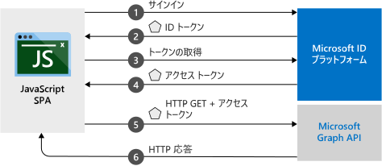

# <a name="quickstart-sign-in-users-and-acquire-an-access-token-from-a-javascript-single-page-application"></a>クイック スタート:ユーザーをサインインさせて、JavaScript のシングルページ アプリケーションからアクセス トークンを取得する

このクイックスタートでは、JavaScript シングルページ アプリケーション (SPA) で個人アカウント、職場アカウント、学校アカウントのユーザーをサインインさせる方法を示すコード サンプルを使用する方法について説明します。 JavaScript SPA では、Microsoft Graph API または任意の Web API を呼び出すためのアクセス トークンを取得することもできます。



## <a name="prerequisites"></a>前提条件

このクイックスタートでは、次の設定が必要です。
* Node.js サーバーを使用してプロジェクトを実行するために、[Node.js](https://nodejs.org/en/download/) をダウンロードしてインストールする。
* プロジェクト ファイルを編集するために、[Visual Studio Code](https://code.visualstudio.com/download) をダウンロードしてインストールする。
* プロジェクトを Visual Studio ソリューションとして実行するために、[Visual Studio 2019](https://visualstudio.microsoft.com/downloads/) をダウンロードしてインストールする。

> [!div renderon="docs"]
> ## <a name="register-and-download-your-quickstart-application"></a>クイック スタート アプリケーションを登録してダウンロードする
> クイックスタートのアプリケーションを起動するには、次のオプションのいずれかを使用します。
>
> ### <a name="option-1-express-register-and-auto-configure-your-app-and-then-download-your-code-sample"></a>オプション 1 (簡易): アプリを登録して自動構成を行った後、コード サンプルをダウンロードする
>
> 1. 職場または学校アカウントか、個人の Microsoft アカウントを使用して、[Azure portal](https://portal.azure.com) にサインインします。
> 1. そのアカウントで複数のテナントにアクセスできる場合は、右上でアカウントを選択してから、ポータルのセッションを、使用したい Azure Active Directory (Azure AD) テナントに設定します。
> 1. 新しい [Azure portal の [アプリの登録]](https://portal.azure.com/#blade/Microsoft_AAD_RegisteredApps/ApplicationsListBlade/quickStartType/JavascriptSpaQuickstartPage/sourceType/docs) ウィンドウに移動します。
> 1. アプリケーションの名前を入力し、 **[登録]** を選択します。
> 1. 指示に従って新しいアプリケーションをダウンロードし、自動構成します。
>
> ### <a name="option-2-manual-register-and-manually-configure-your-application-and-code-sample"></a>オプション 2 (手動): アプリケーションを登録し、アプリケーションとコード サンプルを手動で構成する
>
> #### <a name="step-1-register-your-application"></a>手順 1: アプリケーションの登録
>
> 1. 職場または学校アカウントか、個人の Microsoft アカウントを使用して、[Azure portal](https://portal.azure.com) にサインインします。
>
> 1. そのアカウントで複数のテナントにアクセスできる場合は、右上でアカウントを選択してから、ポータルのセッションを、使用したい Azure AD テナントに設定します。
> 1. 開発者用の Microsoft ID プラットフォームの [[アプリの登録]](https://go.microsoft.com/fwlink/?linkid=2083908) ページに移動します。
> 1. **[新規登録]** を選択します。
> 1. **[アプリケーションの登録]** ページが表示されたら、アプリケーションの名前を入力します。
> 1. **[サポートされているアカウントの種類]** で、 **[Accounts in any organizational directory and personal Microsoft accounts]\(任意の組織のディレクトリ内のアカウントと個人用の Microsoft アカウント\)** を選択します。
> 1. **[リダイレクト URI]** セクションのドロップダウン リストで、**Web** プラットフォームを選択し、値を `http://localhost:30662/` に設定します。
> 1. **[登録]** を選択します。 後で使用するために、アプリの **[概要]** ページで、 **[アプリケーション (クライアント) ID]** の値を書き留めます。
> 1. このクイック スタートでは、[暗黙的な許可フロー](v2-oauth2-implicit-grant-flow.md)を有効にする必要があります。 登録済みのアプリケーションの左側のウィンドウで、 **[認証]** を選択します。
> 1. **[詳細設定]** セクションの **[暗黙の付与]** で、 **[ID トークン]** チェック ボックスと **[アクセス トークン]** チェック ボックスをオンにします。 このアプリでは、ユーザーのサインインを実行して API を呼び出す必要があるため、ID トークンとアクセス トークンが必要です。
> 1. ウィンドウの上部で **[保存]** を選択します。

> [!div class="sxs-lookup" renderon="portal"]
> #### <a name="step-1-configure-your-application-in-the-azure-portal"></a>手順 1:Azure portal でのアプリケーションの構成
> このクイックスタートのコード サンプルを動作させるには、リダイレクト URI として `http://localhost:30662/` を追加し、 **[暗黙の付与]** を有効にします。
> > [!div renderon="portal" id="makechanges" class="nextstepaction"]
> > [これらの変更を行います]()
>
> > [!div id="appconfigured" class="alert alert-info"]
> >  アプリケーションはこれらの属性で構成されています。

#### <a name="step-2-download-the-project"></a>手順 2:プロジェクトのダウンロード

開発環境に適したオプションを選択します。

* Node.js を使用して Web サーバーでプロジェクトを実行するために、[コア プロジェクト ファイルをダウンロード](https://github.com/Azure-Samples/active-directory-javascript-graphapi-v2/archive/quickstart.zip)します。 ファイルを開くには、[Visual Studio Code](https://code.visualstudio.com/) などのエディターを使用します。

* (省略可能) IIS サーバーでプロジェクトを実行するために、[Visual Studio プロジェクトをダウンロード](https://github.com/Azure-Samples/active-directory-javascript-graphapi-v2/archive/vsquickstart.zip)します。 ローカル フォルダー (例: *C:\Azure-Samples*) に zip ファイルを解凍します。


#### <a name="step-3-configure-your-javascript-app"></a>手順 3:JavaScript アプリの構成

> [!div renderon="docs"]
> *JavaScriptSPA* フォルダーで、*index.html* を編集し、`msalConfig` の下にある `clientID` と `authority` の値を設定します。

> [!div class="sxs-lookup" renderon="portal"]
> *JavaScriptSPA* フォルダーで、*index.html* を編集し、`msalConfig` を次のコードに置き換えます。

```javascript
var msalConfig = {
    auth: {
        clientId: "Enter_the_Application_Id_here",
        authority: "https://login.microsoftonline.com/Enter_the_Tenant_info_here"
    },
    cache: {
        cacheLocation: "localStorage",
        storeAuthStateInCookie: true
    }
};

```
> [!div renderon="portal"]
> > [!NOTE]
> > このクイックスタートは、Enter_the_Supported_Account_Info_Here をサポートしています。


> [!div renderon="docs"]
>
> 各値の説明:
> - *\<Enter_the_Application_Id_here>* は、登録したアプリケーションの**アプリケーション (クライアント) ID** です。
> - *\<Enter_the_Tenant_info_here>* は、次のオプションのいずれかに設定されます。
>    - アプリケーションで "*この組織のディレクトリ内のアカウントのみ*" がサポートされる場合は、この値を**テナント ID** または**テナント名** (例: *contoso.microsoft.com*) に置き換えます。
>    - アプリケーションで "*任意の組織のディレクトリ内のアカウント*" がサポートされる場合は、この値を **organizations** に置き換えます。
>    - アプリケーションで "*任意の組織のディレクトリ内のアカウントと、個人用の Microsoft アカウント*" がサポートされる場合は、この値を **common** に置き換えます。 "*個人用の Microsoft アカウントのみ*" にサポートを制限するには、この値を **consumers** に置き換えます。
>
> > [!TIP]
> > **[アプリケーション (クライアント) ID]** 、 **[ディレクトリ (テナント) ID]** 、 **[サポートされているアカウントの種類]** の値を見つけるには、Azure portal でアプリの **[概要]** ページに移動します。
>

#### <a name="step-4-run-the-project"></a>手順 4:プロジェクトを実行する

* [Node.js](https://nodejs.org/en/download/) を使用している場合:

    1. サーバーを起動するために、プロジェクトのディレクトリから次のコマンドを実行します。

        ```batch
        npm install
        node server.js
        ```

    1. Web ブラウザーを開き、`http://localhost:30662/` に移動します｡
    1. **[サインイン]** を選択してサインインを開始してから、Microsoft Graph API を呼び出します。


* [Visual Studio](https://visualstudio.microsoft.com/downloads/) を使用している場合は、プロジェクト ソリューションを選択し、F5 キーを押してプロジェクトを実行します。

ブラウザーにアプリケーションが読み込まれたら、 **[サインイン]** を選択します。 初回サインイン時に、アプリケーションがユーザーのプロファイルにアクセスし、ユーザーをサインインすることへの同意を求められます。 正常にサインインした後は、ユーザー プロファイル情報がページに表示されている必要があります。

## <a name="more-information"></a>詳細情報

### <a name="msaljs"></a>msal.js

MSAL ライブラリは、ユーザーをサインインさせ、Microsoft ID プラットフォームによって保護された API へのアクセスに使用されるトークンを要求します。 クイックスタートの *index.html* ファイルにはこのライブラリへの参照が含まれています。

```html
<script src="https://secure.aadcdn.microsoftonline-p.com/lib/1.0.0/js/msal.min.js"></script>
```
> [!TIP]
> 上記のバージョンは、[MSAL.js のリリース](https://github.com/AzureAD/microsoft-authentication-library-for-js/releases)に関するページにある最新のリリース バージョンに置き換えることができます。


別の方法として、Node.js がインストール済みの場合は、次のようにして最新バージョンを Node.js Package Manager (npm) を介してダウンロードすることもできます。

```batch
npm install msal
```

### <a name="msal-initialization"></a>MSAL の初期化

クイックスタートのコードには、MSAL ライブラリを初期化する方法も示されています。

```javascript
var msalConfig = {
    auth: {
        clientId: "Enter_the_Application_Id_here",
        authority: "https://login.microsoftonline.com/Enter_the_Tenant_Info_Here"
    },
    cache: {
        cacheLocation: "localStorage",
        storeAuthStateInCookie: true
    }
};

var myMSALObj = new Msal.UserAgentApplication(msalConfig);
```

> |Where  |  |
> |---------|---------|
> |`ClientId`     | Azure portal に登録されているアプリケーションのアプリケーション ID。|
> |`authority`    | (省略可能) 先ほど構成に関するセクションで説明したように、アカウントの種類をサポートする機関 URL。 既定の機関は `https://login.microsoftonline.com/common`です。 |
> |`cacheLocation`  | (省略可能) 認証状態のブラウザー ストレージを設定します。 既定では sessionStorage です。   |
> |`storeAuthStateInCookie`  | (省略可能) 認証フローの検証に必要な認証要求の状態をブラウザーの Cookie に格納するライブラリ。 この Cookie は、特定の[既知の問題](https://github.com/AzureAD/microsoft-authentication-library-for-js/wiki/Known-issues-on-IE-and-Edge-Browser#issues)に対処するために、IE および Edge ブラウザー用に設定されます。 |

使用できる構成オプションの詳細については、[クライアント アプリケーションの初期化](msal-js-initializing-client-applications.md)に関する記事を参照してください。

### <a name="sign-in-users"></a>ユーザーのサインイン

次のコード スニペットは、ユーザーをサインインする方法を示しています。

```javascript
var requestObj = {
    scopes: ["user.read"]
};

myMSALObj.loginPopup(requestObj).then(function (loginResponse) {
    //Login Success callback code here
}).catch(function (error) {
    console.log(error);
});
```

> |Where  |  |
> |---------|---------|
> | `scopes`   | (省略可能) サインイン時にユーザーの同意を得るために必要なスコープが含まれます。 たとえば、Microsoft Graph の場合は `[ "user.read" ]`、カスタム Web API (つまり、`api://<Application ID>/access_as_user`) の場合は `[ "<Application ID URL>/scope" ]` になります。 |

> [!TIP]
> あるいは、`loginRedirect` メソッドを使用して、現在のページをポップアップ ウィンドウではなくサインイン ページにリダイレクトすることもできます。

### <a name="request-tokens"></a>トークンの要求

MSAL では、`acquireTokenRedirect`、`acquireTokenPopup`、`acquireTokenSilent` の 3 つのメソッドを使用してトークンを取得します。

#### <a name="get-a-user-token-silently"></a>ユーザー トークンを自動で取得する

`acquireTokenSilent` メソッドは、ユーザーの操作なしでトークンの取得や更新を処理します。 最初に `loginRedirect` または `loginPopup` メソッドが実行され、その後の呼び出しでは、保護されたリソースにアクセスするトークンを取得するために `acquireTokenSilent` メソッドが通常使用されます。 トークンを要求または更新するための呼び出しは自動的に行われます。

```javascript
var requestObj = {
    scopes: ["user.read"]
};

myMSALObj.acquireTokenSilent(requestObj).then(function (tokenResponse) {
    // Callback code here
    console.log(tokenResponse.accessToken);
}).catch(function (error) {
    console.log(error);
});
```

> |Where  |  |
> |---------|---------|
> | `scopes`   | API のアクセス トークンで返されるように要求されているスコープを含めます。 たとえば、Microsoft Graph の場合は `[ "user.read" ]`、カスタム Web API (つまり、`api://<Application ID>/access_as_user`) の場合は `[ "<Application ID URL>/scope" ]` になります。|

#### <a name="get-a-user-token-interactively"></a>ユーザー トークンを対話形式で取得する

ユーザーに Microsoft ID プラットフォーム エンドポイントとのやり取りを強制しなければならない場合があります。 例:
* パスワードの有効期限が切れているため、ユーザーは資格情報を再入力する必要がある。
* お使いのアプリケーションが、ユーザーによる同意が必要な追加のリソース スコープへのアクセスを要求している。
* 2 要素認証が必須である。

ほとんどのアプリケーションでお勧めしている通常のパターンは、最初に `acquireTokenSilent` を呼び出し、例外をキャッチしてから、`acquireTokenPopup` (または `acquireTokenRedirect`) を呼び出して、対話型要求を開始するというものです。

`acquireTokenPopup` を呼び出すことで、サインインの際にポップアップ ウィンドウが表示されるようになります (または、`acquireTokenRedirect` によってユーザーが Microsoft ID プラットフォーム エンドポイントにリダイレクトされるようになります)。ユーザーはそのウィンドウ内で、自分の資格情報の確認、必要なリソースへの同意、2 要素認証の完了のいずれかの方法で操作を行う必要があります。

```javascript
var requestObj = {
    scopes: ["user.read"]
};

myMSALObj.acquireTokenPopup(requestObj).then(function (tokenResponse) {
    // Callback code here
    console.log(tokenResponse.accessToken);
}).catch(function (error) {
    console.log(error);
});
```

> [!NOTE]
> このクイックスタートでは、Microsoft Internet Explorer の場合は `loginRedirect` および `acquireTokenRedirect` メソッドを使用しています。Internet Explorer によるポップアップ ウィンドウの処理に関連した[既知の問題](https://github.com/AzureAD/microsoft-authentication-library-for-js/wiki/Known-issues-on-IE-and-Edge-Browser#issues)があるためです。

## <a name="next-steps"></a>次の手順

このクイックスタート用アプリケーションの構築に関する詳細なステップ バイ ステップ ガイドについては、次を参照してください。

> [!div class="nextstepaction"]
> [サインインして MS Graph を呼び出すチュートリアル](https://docs.microsoft.com/azure/active-directory/develop/guidedsetups/active-directory-javascriptspa)

MSAL リポジトリでドキュメント、FAQ、イシューなどを閲覧するには、次を参照してください。

> [!div class="nextstepaction"]
> [MSAL.js GitHub リポジトリ](https://github.com/AzureAD/microsoft-authentication-library-for-js)

Microsoft ID プラットフォームの改善にご協力ください。 簡単な 2 つの質問からなるアンケートに記入し、ご意見をお聞かせください。

> [!div class="nextstepaction"]
> [Microsoft ID プラットフォームのアンケート](https://forms.office.com/Pages/ResponsePage.aspx?id=v4j5cvGGr0GRqy180BHbRyKrNDMV_xBIiPGgSvnbQZdUQjFIUUFGUE1SMEVFTkdaVU5YT0EyOEtJVi4u)