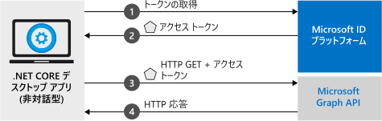

# <a name="quickstart-acquire-a-token-and-call-microsoft-graph-api-using-console-apps-identity"></a>クイック スタート:トークンを取得し、コンソール アプリの ID を使用して Microsoft Graph API を呼び出す

このチュートリアルでは、アプリ自体の ID を使用してアクセス トークンを取得した後、Microsoft Graph API を呼び出して、ディレクトリ内の[ユーザーの一覧](https://docs.microsoft.com/graph/api/user-list)を表示する .NET Core アプリケーションを記述する方法について説明します。 このシナリオは、オペレーターがいない無人のジョブや、ユーザーの ID ではなくアプリケーション ID を使用して実行する必要がある Windows サービスがある状況で役立ちます。 (図については、「[このサンプルのしくみ](#how-the-sample-works)」を参照してください)。

## <a name="prerequisites"></a>前提条件

このクイック スタートでは [.NET Core 2.2](https://www.microsoft.com/net/download/dotnet-core/2.2) が必要です。

> [!div renderon="docs"]
> ## <a name="register-and-download-your-quickstart-app"></a>クイック スタート アプリを登録してダウンロードする

> [!div renderon="docs" class="sxs-lookup"]
>
> クイック スタート アプリケーションを開始する方法としては、次の 2 つの選択肢があります。[簡易] (以下のオプション 1) と [手動] (オプション 2)
>
> ### <a name="option-1-register-and-auto-configure-your-app-and-then-download-your-code-sample"></a>オプション 1: アプリを登録して自動構成を行った後、コード サンプルをダウンロードする
>
> 1. 新しい [Azure portal の [アプリの登録]](https://portal.azure.com/?Microsoft_AAD_RegisteredApps=true#blade/Microsoft_AAD_RegisteredApps/applicationsListBlade/quickStartType/DotNetCoreDaemonQuickstartPage/sourceType/docs) ウィンドウに移動します。
> 1. アプリケーションの名前を入力し、 **[登録]** を選択します。
> 1. 画面の指示に従ってダウンロードし、1 回クリックするだけで、新しいアプリケーションが自動的に構成されます。
>
> ### <a name="option-2-register-and-manually-configure-your-application-and-code-sample"></a>オプション 2:アプリケーションを登録し、アプリケーションとコード サンプルを手動で構成する

> [!div renderon="docs"]
> #### <a name="step-1-register-your-application"></a>手順 1:アプリケーションの登録
> アプリケーションを登録し、その登録情報をソリューションに手動で追加するには、次の手順を実行します。
>
> 1. 職場または学校アカウントか、個人の Microsoft アカウントを使用して、[Azure portal](https://portal.azure.com) にサインインします。
> 1. ご利用のアカウントで複数のテナントにアクセスできる場合は、右上隅でアカウントを選択し、ポータルのセッションを目的の Azure AD テナントに設定します。
> 1. 開発者用の Microsoft ID プラットフォームの [[アプリの登録]](https://go.microsoft.com/fwlink/?linkid=2083908) ページに移動します。
> 1. **[新規登録]** を選択します。
> 1. **[アプリケーションの登録]** ページが表示されたら、以下のアプリケーションの登録情報を入力します。 
> 1. **[名前]** セクションに、アプリのユーザーに表示されるわかりやすいアプリケーション名 (`Daemon-console` など) を入力した後、 **[登録]** を選択してアプリケーションを作成します。
> 1. 登録されたら、 **[証明書とシークレット]** メニューを選択します。
> 1. **[クライアント シークレット]** で、 **[+ 新しいクライアント シークレット]** を選択します。 名前を付け、 **[追加]** を選択します。 シークレットを安全な場所にコピーします。 コード内でそれを使用する必要があります。
> 1. 次に、 **[API のアクセス許可]** メニューを選択し、 **[+ アクセス許可の追加]** ボタンをクリックし、 **[Microsoft Graph]** を選択します。
> 1. **[アプリケーションのアクセス許可]** を選択します。
> 1. **[ユーザー]** ノードで、 **[User.Read.All]** を選択し、 **[アクセス許可の追加]** を選択します。

> [!div class="sxs-lookup" renderon="portal"]
> ### <a name="download-and-configure-your-quickstart-app"></a>クイックスタート アプリをダウンロードして構成する
> 
> #### <a name="step-1-configure-your-application-in-azure-portal"></a>手順 1:Azure portal でのアプリケーションの構成
> このクイック スタート用サンプル コードを動作させるには、クライアント シークレットを作成し、Graph API の **User.Read.All** アプリケーションのアクセス許可を追加します。
> > [!div renderon="portal" id="makechanges" class="nextstepaction"]
> > [これらの変更を行います]()
>
> > [!div id="appconfigured" class="alert alert-info"]
> >  アプリケーションはこれらの属性で構成されています。

#### <a name="step-2-download-your-visual-studio-project"></a>手順 2:Visual Studio プロジェクトをダウンロードする

> [!div renderon="docs"]
> [Visual Studio プロジェクトをダウンロードする](https://github.com/Azure-Samples/active-directory-dotnetcore-daemon-v2/archive/master.zip)

> [!div class="sxs-lookup" renderon="portal"]
> Visual Studio 2019 を使用してプロジェクトを実行します。
> [!div renderon="portal" id="autoupdate" class="nextstepaction"]
> [コード サンプルをダウンロードします](https://github.com/Azure-Samples/active-directory-dotnetcore-daemon-v2/archive/master.zip)

> [!div class="sxs-lookup" renderon="portal"]
> > [!NOTE]
> > `Enter_the_Supported_Account_Info_Here`
    
> [!div renderon="docs"]
> #### <a name="step-3-configure-your-visual-studio-project"></a>手順 3:Visual Studio プロジェクトの構成
> 
> 1. ディスクのルートに近いローカル フォルダー (例: **C:\Azure-Samples**) に zip ファイルを展開します。
> 1. Visual Studio でソリューション **1-Call-MSGraph\daemon-console.sln** を開きます (省略可能)。
> 1. **appsettings.json** を編集し、`ClientId`、`Tenant`、および `ClientSecret` フィールドの値を次のように置き換えます。
> 
>    ```json
>    "Tenant": "Enter_the_Tenant_Id_Here",
>    "ClientId": "Enter_the_Application_Id_Here",
>    "ClientSecret": "Enter_the_Client_Secret_Here"
>    ```
>   各値の説明:
>   - `Enter_the_Application_Id_Here` - 登録したアプリケーションの**アプリケーション (クライアント) ID**。
>   - `Enter_the_Tenant_Id_Here` - この値を**テナント ID** または**テナント名** (例: contoso.microsoft.com) に置き換えます。
>   - `Enter_the_Client_Secret_Here` - この値を手順 1 で作成されたクライアント シークレットに置き換えます。

> [!div renderon="docs"]
> > [!TIP]
> > **アプリケーション (クライアント) ID** と**ディレクトリ (テナント) ID** の値を見つけるには、Azure portal 上でアプリの **[概要]** ページに移動します。 新しいキーを生成するには、 **[証明書とシークレット]** ページに移動します。

> [!div class="sxs-lookup" renderon="portal"]
> #### <a name="step-3-admin-consent"></a>手順 3:管理者の同意

> [!div renderon="docs"]
> #### <a name="step-4-admin-consent"></a>手順 4:管理者の同意

この時点でアプリケーションを実行すると、*HTTP 403 - Forbidden* エラー "`Insufficient privileges to complete the operation`" が表示されます。 これは、すべての "*アプリ専用のアクセス許可*" には管理者の同意が必要であるために発生します。これは、ディレクトリのグローバル管理者にお使いのアプリケーションに同意してもらう必要があることを意味します。 ご自身のロールに応じて、次のオプションのいずれかを選択します。

##### <a name="global-tenant-administrator"></a>グローバル テナント管理者

> [!div renderon="docs"]
> グローバル テナント管理者の場合は、Azure Portal 上で [アプリケーションの登録 (プレビュー)] の **[API のアクセス許可]** ページに移動し、 **[{Tenant Name} に管理者の同意を与えます]** ({Tenant Name} はお使いのディレクトリの名前) を選択します。

> [!div renderon="portal" class="sxs-lookup"]
> グローバル管理者の場合は、 **[API のアクセス許可]** ページに移動し、 **[Enter_the_Tenant_Name_Here に管理者の同意を与えます]** を選択します。
> > [!div id="apipermissionspage"]
> > [[API のアクセス許可] ページに移動する]()

##### <a name="standard-user"></a>標準ユーザー

テナントの標準ユーザーの場合は、お使いのアプリケーションに管理者の同意を与えるようグローバル管理者に依頼する必要があります。 これを行うには、次の URL を管理者に知らせます。

```url
https://login.microsoftonline.com/Enter_the_Tenant_Id_Here/adminconsent?client_id=Enter_the_Application_Id_Here
```

> [!div renderon="docs"]
>> 各値の説明:
>> * `Enter_the_Tenant_Id_Here` - この値を**テナント ID** または**テナント名** (例: contoso.microsoft.com) に置き換えます。
>> * `Enter_the_Application_Id_Here` - 登録したアプリケーションの**アプリケーション (クライアント) ID**。

> [!NOTE]
> 前の URL を使用してアプリに同意を与えた後でエラー "*AADSTS50011:No reply address is registered for the application*" (AADSTS50011: アプリケーションの応答アドレスが登録されていません) が表示される場合があります。 これは、このアプリケーションと URL にはリダイレクト URI がないために発生します。このエラーは無視してください。

> [!div class="sxs-lookup" renderon="portal"]
> #### <a name="step-4-run-the-application"></a>手順 4:アプリケーションの実行

> [!div renderon="docs"]
> #### <a name="step-5-run-the-application"></a>手順 5:アプリケーションの実行

Visual Studio を使用している場合は、**F5** キーを押してアプリケーションを実行します。それ以外の場合は、コマンド プロンプトまたはコンソールを使用してアプリケーションを実行します。

```console
cd {ProjectFolder}\daemon-console\1-Call-Graph
dotnet run
```

> 各値の説明:
> * *{ProjectFolder}* は zip ファイルを抽出したフォルダーです。 例: **C:\Azure-Samples\active-directory-dotnetcore-daemon-v2**

結果として、Azure AD ディレクトリ内のユーザーの一覧が表示されます。

> [!IMPORTANT]
> このクイック スタート アプリケーションは、クライアント シークレットを使用して、それ自体を機密クライアントとして識別します。 クライアント シークレットはプロジェクト ファイルにプレーン テキストとして追加されるため、セキュリティ上の理由から、アプリケーションを運用アプリケーションと見なす前に、クライアント シークレットの代わりに証明書を使用することをお勧めします。 証明書の使用方法の詳細については、このサンプルの GitHub リポジトリにある[これらの手順](https://github.com/Azure-Samples/active-directory-dotnetcore-daemon-v2/#variation-daemon-application-using-client-credentials-with-certificates)を参照してください。

## <a name="more-information"></a>詳細情報

### <a name="how-the-sample-works"></a>このサンプルのしくみ


### <a name="msalnet"></a>MSAL.NET

MSAL ([Microsoft.Identity.Client](https://www.nuget.org/packages/Microsoft.Identity.Client)) はユーザーをサインインし、Microsoft ID プラットフォームによって保護されている API へのアクセス用のトークンを要求するために使用するライブラリです。 説明したとおり、このクイック スタートでは、委任されたアクセス許可ではなく、アプリケーション自体の ID を使用してトークンを要求しています。 ここで使用される認証フローは、" *[クライアント資格情報 OAuth フロー](v2-oauth2-client-creds-grant-flow.md)* " と呼ばれます。 クライアント資格情報フローで MSAL.NET を使用する方法の詳細については、[こちらの記事](https://aka.ms/msal-net-client-credentials)を参照してください。

 MSAL.NET は、Visual Studio の**パッケージ マネージャー コンソール**で次のコマンドを実行することでインストールできます。

```powershell
Install-Package Microsoft.Identity.Client
```

または、Visual Studio を使用していない場合は、次のコマンドを実行して MSAL をプロジェクトに追加できます。

```console
dotnet add package Microsoft.Identity.Client
```

### <a name="msal-initialization"></a>MSAL の初期化

MSAL への参照を追加するには、次のコードを追加します。

```csharp
using Microsoft.Identity.Client;
```

続いて、次のコードを使用して MSAL を初期化します。

```csharp
IConfidentialClientApplication app;
app = ConfidentialClientApplicationBuilder.Create(config.ClientId)
                                          .WithClientSecret(config.ClientSecret)
                                          .WithAuthority(new Uri(config.Authority))
                                          .Build();
```

> | 各値の説明: ||
> |---------|---------|
> | `config.ClientSecret` | Azure Portal 上でアプリケーションに対して作成されるクライアント シークレット。 |
> | `config.ClientId` | Azure portal に登録されているアプリケーションの "**アプリケーション (クライアント) ID**"。 この値は、Azure portal のアプリの **[概要]** ページで確認できます。 |
> | `config.Authority`    | (省略可能) ユーザーを認証するための STS エンドポイント。 通常、パブリック クラウド上では <https://login.microsoftonline.com/{tenant}> です。{tenant} はご自分のテナントの名前またはテナント ID です。|

詳細については、[`ConfidentialClientApplication` 用の参照ドキュメント](https://docs.microsoft.com/dotnet/api/microsoft.identity.client.iconfidentialclientapplication?view=azure-dotnet)をご覧ください。

### <a name="requesting-tokens"></a>トークンの要求

アプリの ID を使用してトークンを要求するには、`AcquireTokenForClient` メソッドを使用します。

```csharp
result = await app.AcquireTokenForClient(scopes)
                  .ExecuteAsync();
```

> |各値の説明:| |
> |---------|---------|
> | `scopes` | 要求されるスコープが含まれています。 Confidential クライアントの場合は、`{Application ID URI}/.default` のような形式を使用して、要求されるスコープが Azure Portal 上で設定されるアプリ オブジェクト内に静的に定義されたものであることを示す必要があります (Microsoft Graph では、`{Application ID URI}` は `https://graph.microsoft.com` を指します)。 カスタム Web API の場合、`{Application ID URI}` は、Azure Portal 上で [アプリケーションの登録 (プレビュー)] の **[API の公開]** セクションに定義されます。 |

詳細については、[`AcquireTokenForClient` 用の参照ドキュメント](https://docs.microsoft.com/dotnet/api/microsoft.identity.client.confidentialclientapplication.acquiretokenforclient?view=azure-dotnet)をご覧ください。

[!INCLUDE [Help and support](../../../includes/active-directory-develop-help-support-include.md)]

## <a name="next-steps"></a>次のステップ

デーモン アプリケーションの詳細については、シナリオのランディング ページを参照してください。

> [!div class="nextstepaction"]
> [Web API を呼び出すデーモン アプリケーション](scenario-daemon-overview.md)

デーモン アプリケーションのチュートリアルについては、次のページを参照してください。

> [!div class="nextstepaction"]
> [デーモン .NET Core コンソールのチュートリアル](https://github.com/Azure-Samples/active-directory-dotnetcore-daemon-v2)

アクセス許可と同意について学習します。

> [!div class="nextstepaction"]
> [アクセス許可と同意](v2-permissions-and-consent.md)

このシナリオ用の認証フローの詳細については、OAuth 2.0 クライアント資格情報フローを参照してください。

> [!div class="nextstepaction"]
> [クライアント資格情報 OAuth フロー](v2-oauth2-client-creds-grant-flow.md)
