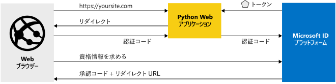

# <a name="quickstart-add-sign-in-with-microsoft-to-a-python-web-app"></a>クイック スタート: Python Web アプリに Microsoft でサインインを追加する

このクイックスタートでは、Python Web アプリを Microsoft ID プラットフォームと統合する方法を説明します。 お使いのアプリによって、ユーザーがサインインされ、Microsoft Graph API を呼び出すためのアクセス トークンが取得されて、Microsoft Graph API への要求が行われます。

このガイドを完了すると、アプリケーションは、個人用の Microsoft アカウント (outlook.com、live.com など) と、Azure Active Directory を使用する会社や組織の職場または学校アカウントのサインインを受け入れるようになります。 (図については、「[このサンプルのしくみ](#how-the-sample-works)」を参照してください)。


## <a name="prerequisites"></a>前提条件

このサンプルを実行するには、次のものが必要になります。

- [Python 2.7 以降](https://www.python.org/downloads/release/python-2713)または [Python 3 以降](https://www.python.org/downloads/release/python-364/)
- [Flask](http://flask.pocoo.org/)、[Flask-Session](https://pythonhosted.org/Flask-Session/)、[要求](https://requests.kennethreitz.org/en/master/)
- [MSAL Python](https://github.com/AzureAD/microsoft-authentication-library-for-python)

> [!div renderon="docs"]
>
> ## <a name="register-and-download-your-quickstart-app"></a>クイック スタート アプリを登録してダウンロードする
>
> クイックスタート アプリケーションを開始する方法としては、[簡易] (オプション 1) と [手動] (オプション 2) の 2 つの選択肢があります。
>
> ### <a name="option-1-register-and-auto-configure-your-app-and-then-download-your-code-sample"></a>オプション 1: アプリを登録して自動構成を行った後、コード サンプルをダウンロードする
>
> 1. [Azure portal の [アプリの登録]](https://portal.azure.com/#blade/Microsoft_AAD_RegisteredApps/applicationsListBlade/quickStartType/PythonQuickstartPage/sourceType/docs) に移動します。
> 1. アプリケーションの名前を入力し、 **[登録]** を選択します。
> 1. 指示に従って新しいアプリケーションをダウンロードし、自動構成します。
>
> ### <a name="option-2-register-and-manually-configure-your-application-and-code-sample"></a>オプション 2:アプリケーションを登録し、アプリケーションとコード サンプルを手動で構成する
>
> #### <a name="step-1-register-your-application"></a>手順 1:アプリケーションの登録
>
> アプリケーションを登録し、その登録情報をソリューションに手動で追加するには、次の手順を実行します。
>
> 1. 職場または学校アカウントか、個人の Microsoft アカウントを使用して、[Azure portal](https://portal.azure.com) にサインインします。
> 1. ご利用のアカウントで複数のテナントにアクセスできる場合は、右上隅でアカウントを選択し、ポータルのセッションを目的の Azure AD テナントに設定します。
> 1. 開発者用の Microsoft ID プラットフォームの [[アプリの登録]](https://go.microsoft.com/fwlink/?linkid=2083908) ページに移動します。
> 1. **[新規登録]** を選択します。
> 1. **[アプリケーションの登録]** ページが表示されたら、以下のアプリケーションの登録情報を入力します。
>      - **[名前]** セクションに、アプリのユーザーに表示されるわかりやすいアプリケーション名を入力します (例: `python-webapp`)。
>      - **[サポートされているアカウントの種類]** で、 **[Accounts in any organizational directory and personal Microsoft accounts]\(任意の組織のディレクトリ内のアカウントと個人用の Microsoft アカウント\)** を選択します。
>      - **[登録]** を選択します。
>      - 後で使用するために、アプリの **[概要]** ページで、 **[アプリケーション (クライアント) ID]** の値を書き留めます。
> 1. メニューから **[認証]** を選択し、次の情報を追加します。
>    - **Web** プラットフォーム構成を追加します。 **リダイレクト URI** として `http://localhost:5000/getAToken` を追加します。
>    - **[保存]** を選択します。
> 1. 左側のメニューで **[証明書とシークレット]** を選択し、 **[クライアント シークレット]** セクションで **[新しいクライアント シークレット]** をクリックします。
>
>      - キーの説明 (インスタンス アプリ シークレットの) を入力します。
>      - キーの有効期間として **[1 年]** を選択します。
>      - **[追加]** をクリックすると、キーの値が表示されます。
>      - キーの値をコピーします。 この情報は後で必要になります。
> 1. **[API のアクセス許可]** セクションを選択します
>
>      - **[アクセス許可の追加]** をクリックします。さらに、
>      - **[Microsoft API]** タブが選択されていることを確認します
>      - *[よく使用される Microsoft API]* セクションで、 **[Microsoft Graph]** をクリックします
>      - **[委任されたアクセス許可]** セクションで、適切なアクセス許可がオンになっていることを確認します:**User.ReadBasic.All**。 必要に応じて検索ボックスを使用します。
>      - **[アクセス許可の追加]** ボタンを選択します
>
> [!div class="sxs-lookup" renderon="portal"]
>
> #### <a name="step-1-configure-your-application-in-azure-portal"></a>手順 1:Azure portal でのアプリケーションの構成
>
> このクイックスタートのコード サンプルを動作させるには、以下の操作が必要です。
>
> 1. 応答 URL を `http://localhost:5000/getAToken` として追加する
> 1. クライアント シークレットを作成します。
> 1. Microsoft Graph API の委任されたアクセス許可 User.ReadBasic.All を追加します。
>
> > [!div renderon="portal" id="makechanges" class="nextstepaction"]
> > [これらの変更を行います]()
> > [!div id="appconfigured" class="alert alert-info"]
> >  アプリケーションはこの属性で構成されています

#### <a name="step-2-download-your-project"></a>手順 2:プロジェクトのダウンロード
> [!div renderon="docs"]
> [コード サンプルのダウンロード](https://github.com/Azure-Samples/ms-identity-python-webapp/archive/master.zip)

> [!div class="sxs-lookup" renderon="portal"]
> プロジェクトをダウンロードし、ルート フォルダーに近いローカル フォルダー (例: **C:\Azure-Samples**) に ZIP ファイルを展開します。
> [!div renderon="portal" id="autoupdate" class="nextstepaction"]
> [コード サンプルをダウンロードします](https://github.com/Azure-Samples/ms-identity-python-webapp/archive/master.zip)

> [!div class="sxs-lookup" renderon="portal"]
> > [!NOTE]
> > `Enter_the_Supported_Account_Info_Here`

> [!div renderon="docs"]
> #### <a name="step-3-configure-the-application"></a>手順 3: アプリケーションの構成
>
> 1. ルート フォルダーに近いローカル フォルダー (例: **C:\Azure-Samples**) に zip ファイルを展開します。
> 1. 統合開発環境を使用する場合は、その IDE でサンプルを開きます (オプション)。
> 1. **app_config.py** ファイルを開きます。このファイルはルート フォルダーにあり、次のコード スニペットに置き換えることができます。
>
> ```python
> CLIENT_ID = "Enter_the_Application_Id_here"
> CLIENT_SECRET = "Enter_the_Client_Secret_Here"
> AUTHORITY = "https://login.microsoftonline.com/Enter_the_Tenant_Name_Here"
> ```
> 各値の説明:
>
> - `Enter_the_Application_Id_here` - 登録したアプリケーションのアプリケーション ID。
> - `Enter_the_Client_Secret_Here` - 登録済みアプリケーション用に **[証明書とシークレット]** で作成した **[クライアント シークレット]** です。
> - `Enter_the_Tenant_Name_Here` - 登録したアプリケーションの**ディレクトリ (テナント) ID** 値です。

> [!div class="sxs-lookup" renderon="portal"]
> #### <a name="step-3-run-the-code-sample"></a>手順 3:コード サンプルの実行

> [!div renderon="docs"]
> #### <a name="step-4-run-the-code-sample"></a>手順 4:コード サンプルの実行

1. MSAL Python ライブラリ、Flask フレームワーク、サーバー側のセッション管理用の Flask-Sessions、および requests を、次のように pip を使用してインストールする必要があります。

    ```Shell
    pip install -r requirements.txt
    ```

2. シェルまたはコマンド ラインから app.py を実行する:

    ```Shell
    python app.py
    ```
   > [!IMPORTANT]
   > このクイック スタート アプリケーションは、クライアント シークレットを使用して、それ自体を機密クライアントとして識別します。 クライアント シークレットはプロジェクト ファイルにプレーン テキストとして追加されるため、セキュリティ上の理由から、アプリケーションを運用アプリケーションと見なす前に、クライアント シークレットの代わりに証明書を使用することをお勧めします。 証明書の使用方法の詳細については、[これらの手順](https://docs.microsoft.com/azure/active-directory/develop/active-directory-certificate-credentials)を参照してください。

## <a name="more-information"></a>詳細情報

### <a name="how-the-sample-works"></a>このサンプルのしくみ


### <a name="getting-msal"></a>MSAL の取得
MSAL は、ユーザーをサインインさせるために使用されたり、Microsoft ID プラットフォームによって保護されている API にアクセスするためのトークンを要求するために使用されたりするライブラリです。
MSAL Python は、Pip を使用してアプリケーションに追加できます。

```Shell
pip install msal
```

### <a name="msal-initialization"></a>MSAL の初期化
MSAL を使用するファイルの先頭に次のコードを追加すると、MSAL Python への参照を追加できます。

```Python
import msal
```

## <a name="next-steps"></a>次のステップ

ユーザーのサインインを行う Web API と、Web アプリの呼び出しの詳細を確認します。

> [!div class="nextstepaction"]
> [シナリオ: ユーザーのサインインを行う Web アプリ](scenario-web-app-sign-user-overview.md)

[!INCLUDE [Help and support](../../../includes/active-directory-develop-help-support-include.md)]
