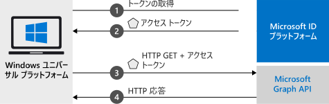

# <a name="quickstart-call-the-microsoft-graph-api-from-a-universal-windows-platform-uwp-application"></a>クイック スタート:ユニバーサル Windows プラットフォーム (UWP) アプリケーションから Microsoft Graph API を呼び出す

このクイック スタートには、ユニバーサル Windows プラットフォーム (UWP) アプリケーションから個人用アカウントや職場または学校アカウントを持つユーザーのサインイン、アクセス トークンの取得、Microsoft Graph API の呼び出しを行う方法を示すコード サンプルが含まれています。



> [!div renderon="docs"]
> ## <a name="register-and-download-your-quickstart-app"></a>クイック スタート アプリを登録してダウンロードする
> [!div renderon="docs" class="sxs-lookup"]
> クイック スタート アプリケーションを開始する方法としては、次の 2 つの選択肢があります。
> * [簡易] [選択肢 1: アプリを登録して自動構成を行った後、コード サンプルをダウンロードする](#option-1-register-and-auto-configure-your-app-and-then-download-your-code-sample)
> * [手動] [選択肢 2: アプリケーションを登録し、コード サンプルを手動で構成する](#option-2-register-and-manually-configure-your-application-and-code-sample)
>
> ### <a name="option-1-register-and-auto-configure-your-app-and-then-download-your-code-sample"></a>選択肢 1: アプリを登録して自動構成を行った後、コード サンプルをダウンロードする
>
> 1. 新しい [Azure portal の [アプリの登録 (プレビュー)]](https://portal.azure.com/#blade/Microsoft_AAD_RegisteredApps/applicationsListBlade/quickStartType/UwpQuickstartPage/sourceType/docs) ウィンドウに移動します。
> 1. アプリケーションの名前を入力して **[登録]** をクリックします。
> 1. 画面の指示に従ってダウンロードし、1 回クリックするだけで、新しいアプリケーションが自動的に構成されます。
>
> ### <a name="option-2-register-and-manually-configure-your-application-and-code-sample"></a>選択肢 2: アプリケーションを登録し、アプリケーションとコード サンプルを手動で構成する
> [!div renderon="docs"]
> #### <a name="step-1-register-your-application"></a>手順 1: アプリケーションの登録
> アプリケーションを登録し、その登録情報をソリューションに追加するには、次の手順を実行します。
> 1. 職場または学校アカウントか、個人の Microsoft アカウントを使用して、[Azure portal](https://portal.azure.com) にサインインします。
> 1. ご利用のアカウントで複数のテナントにアクセスできる場合は、右上隅でアカウントを選択し、ポータルのセッションを目的の Azure AD テナントに設定します。
> 1. 開発者用の Microsoft ID プラットフォームの [[アプリの登録]](https://aka.ms/MobileAppReg) ページに移動します。
> 1. **[新規登録]** を選択します。
> 1. **[アプリケーションの登録]** ページが表示されたら、以下のアプリケーションの登録情報を入力します。
>      - **[名前]** セクションに、アプリのユーザーに表示されるわかりやすいアプリケーション名を入力します (例: `UWP-App-calling-MsGraph`)。
>      - **[サポートされているアカウントの種類]** セクションで、 **[Accounts in any organizational directory and personal Microsoft accounts (for example, Skype, Xbox, Outlook.com)]\(任意の組織のディレクトリ内のアカウントと個人用の Microsoft アカウント (例: Skype、Xbox、Outlook.com)\)** を選択します。
>      - **[登録]** を選択して、アプリケーションを作成します。
> 1. アプリのページの一覧から **[認証]** を選択します。
> 1. **[デスクトップとデバイス]** セクションを展開します  ( **[デスクトップとデバイス]** セクションが表示されない場合は、最初に上部のバナーをクリックしてプレビューの認証エクスペリエンスを表示します)。
> 1. **[リダイレクト URI]** セクションで、 **[URI の追加]** を選択します。  「**urn:ietf:wg:oauth:2.0:oob**」と入力します。
> 1. **[保存]** を選択します。

> [!div renderon="portal" class="sxs-lookup"]
> #### <a name="step-1-configure-your-application"></a>手順 1:アプリケーションの作成
> このクイック スタートのコード サンプルを動作させるには、リダイレクト URL として **urn:ietf:wg:oauth:2.0:oob** を追加する必要があります。
> > [!div renderon="portal" id="makechanges" class="nextstepaction"]
> > [この変更を行う]()
>
> > [!div id="appconfigured" class="alert alert-info"]
> >  アプリケーションはこれらの属性で構成されています。

#### <a name="step-2-download-your-visual-studio-project"></a>手順 2:Visual Studio プロジェクトのダウンロード

 - [Visual Studio プロジェクトのダウンロード](https://github.com/Azure-Samples/active-directory-dotnet-native-uwp-v2/archive/msal3x.zip)

#### <a name="step-3-configure-your-visual-studio-project"></a>手順 3:Visual Studio プロジェクトの構成

1. ディスクのルートに近いローカル フォルダー (例: **C:\Azure-Samples**) に zip ファイルを展開します。
1. Visual Studio でプロジェクトを開きます。 UWP SDK のインストールを求められる場合があります。 その場合は、受け入れます。
1. **MainPage.Xaml.cs** を編集し、`ClientId` フィールドの値を次のように置き換えます。

    ```csharp
    private const string ClientId = "Enter_the_Application_Id_here";
    ```
> [!div class="sxs-lookup" renderon="portal"]
> > [!NOTE]
> > このクイックスタートでは、Enter_the_Supported_Account_Info_Here をサポートしています。    

> [!div renderon="docs"]
> 各値の説明:
> - `Enter_the_Application_Id_here` - 登録したアプリケーションのアプリケーション ID。
>
> > [!TIP]
> > "*アプリケーション ID*" の値を確認するには、ポータルの **[概要]** セクションに移動してください。

#### <a name="step-4-run-your-application"></a>手順 4:アプリケーションを実行する

Windows マシンでクイックスタートを試すには:

1. Visual Studio ツールバーで、適切なプラットフォーム (おそらく ARM ではなく、**x64** または **x86**) を選択します。
   > ターゲット デバイスが *[デバイス]* から *[ローカル コンピューター]* に変わるのを確認します。
1. [デバッグ]、 **[デバッグなしで開始]** の順に選択します。

## <a name="more-information"></a>詳細情報

このセクションでは、このクイック スタートについての詳しい情報を取り上げます。

### <a name="msalnet"></a>MSAL.NET

MSAL ([Microsoft.Identity.Client](https://www.nuget.org/packages/Microsoft.Identity.Client)) は、ユーザーをサインインし、セキュリティ トークンを要求するために使用されるライブラリです。 セキュリティ トークンは、Microsoft ID プラットフォームによって保護されている API にアクセスするために使用されます。 MSAL は、Visual Studio の "*パッケージ マネージャー コンソール*" で次のコマンドを実行してインストールできます。

```powershell
Install-Package Microsoft.Identity.Client -IncludePrerelease
```

### <a name="msal-initialization"></a>MSAL の初期化

MSAL への参照を追加するには、次のコードを追加します。

```csharp
using Microsoft.Identity.Client;
```

その後、MSAL は次のコードを使用して初期化されます。

```csharp
public static IPublicClientApplication PublicClientApp;
PublicClientApp = new PublicClientApplicationBuilder.Create(ClientId)
                                                    .Build();
```

> |各値の説明: ||
> |---------|---------|
> | `ClientId` | Azure portal に登録されているアプリケーションの "**アプリケーション (クライアント) ID**"。 この値は、Azure portal のアプリの **[概要]** ページで確認できます。 |

### <a name="requesting-tokens"></a>トークンの要求

MSAL には、UWP アプリでトークンを取得するための 2 つのメソッド `AcquireTokenInteractive` および `AcquireTokenSilent` があります。

#### <a name="get-a-user-token-interactively"></a>ユーザー トークンを対話形式で取得する

ユーザーは Microsoft ID プラットフォーム エンドポイントの操作を強制される場合があります。その場合、各自の資格情報の検証または同意を行うポップアップ ウィンドウが表示されます。 次に例をいくつか示します。

- ユーザーが初めてアプリケーションにサインインした場合
- パスワードの有効期限が切れているため、ユーザーが資格情報を再入力する必要がある場合
- ご使用のアプリケーションが、ユーザーによる同意が必要なリソースへのアクセスを要求している場合
- 2 要素認証が必須である場合

```csharp
authResult = await App.PublicClientApp.AcquireTokenInteractive(scopes)
                      .ExecuteAsync();
```

> |各値の説明:||
> |---------|---------|
> | `scopes` | 要求するスコープを含む (Microsoft Graph 用の `{ "user.read" }` またはカスタム Web API 用の `{ "api://<Application ID>/access_as_user" }` など)。 |

#### <a name="get-a-user-token-silently"></a>ユーザー トークンを自動で取得する

最初の `AcquireTokenInteractive` メソッドを呼び出した後、`AcquireTokenSilent` メソッドを使用して、保護されたリソースにアクセスするためのトークンを取得します。 リソースへのアクセスを必要とするたびに自分の資格情報を確認するようユーザーに要求したくありません。 ほとんどの場合は、ユーザーの操作なしにトークンの取得や更新を求めます。

```csharp
var accounts = await App.PublicClientApp.GetAccountsAsync();
var firstAccount = accounts.FirstOrDefault();
authResult = await App.PublicClientApp.AcquireTokenSilent(scopes, firstAccount)
                                      .ExecuteAsync();
```

> |各値の説明: ||
> |---------|---------|
> | `scopes` | 要求するスコープを含む (Microsoft Graph 用の `{ "user.read" }` またはカスタム Web API 用の `{ "api://<Application ID>/access_as_user" }` など) |
> | `firstAccount` | キャッシュ内の最初のユーザー アカウントを指定する (MSAL は、1 つのアプリで複数のユーザーをサポート) |

[!INCLUDE [Help and support](../../../includes/active-directory-develop-help-support-include.md)]

## <a name="next-steps"></a>次の手順

アプリケーションや新機能の構築についての完全なステップ バイ ステップ ガイドは、Windows デスクトップ チュートリアルをお試しください。このクイック スタートの完全な説明も含まれています。

> [!div class="nextstepaction"]
> [UWP -Graph API 呼び出しチュートリアル](tutorial-v2-windows-uwp.md)
