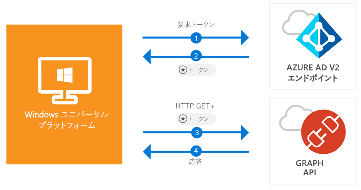

# <a name="quickstart-call-the-microsoft-graph-api-from-a-universal-windows-platform-uwp-application"></a>クイック スタート: ユニバーサル Windows プラットフォーム (UWP) アプリケーションから Microsoft Graph API を呼び出す

[!INCLUDE [active-directory-develop-applies-v2-msal](../../../includes/active-directory-develop-applies-v2-msal.md)]

このクイック スタートには、ユニバーサル Windows プラットフォーム (UWP) アプリケーションから個人や仕事、学校のアカウントへのユーザーのサインイン、アクセス トークンの取得、Microsoft Graph API の呼び出しを行う方法を示すコード サンプルが含まれています。



> [!div renderon="docs"]
> ## <a name="register-and-download-your-quickstart-app"></a>クイック スタート アプリを登録してダウンロードする
> [!div renderon="docs" class="sxs-lookup"]
> クイック スタート アプリケーションを開始する方法としては、次の 2 つの選択肢があります。
> * [簡易] [選択肢 1: アプリを登録して自動構成を行った後、コード サンプルをダウンロードする](#option-1-register-and-auto-configure-your-app-and-then-download-your-code-sample)
> * [手動] [選択肢 2: アプリケーションとコード サンプルを登録して手動で構成する](#option-2-register-and-manually-configure-your-application-and-code-sample)
>
> ### <a name="option-1-register-and-auto-configure-your-app-and-then-download-your-code-sample"></a>選択肢 1: アプリを登録して自動構成を行った後、コード サンプルをダウンロードする
>
> 1. [Azure portal の [アプリケーションの登録]](https://portal.azure.com/?Microsoft_AAD_RegisteredApps=true#blade/Microsoft_AAD_RegisteredApps) に移動します。
> 1. アプリケーションの名前を入力して **[登録]** をクリックします。
> 1. 画面の指示に従ってダウンロードし、1 回クリックするだけで、新しいアプリケーションが自動的に構成されます。
>
> ### <a name="option-2-register-and-manually-configure-your-application-and-code-sample"></a>選択肢 2: アプリケーションとコード サンプルを登録して手動で構成する
> [!div renderon="docs"]
> #### <a name="step-1-register-your-application"></a>手順 1: アプリケーションの登録
> アプリケーションを登録し、その登録情報をソリューションに追加するには、次の手順を実行します。
> 1. 職場または学校アカウントか、個人の Microsoft アカウントを使用して、[Azure portal](https://portal.azure.com) にサインインします。
> 1. ご利用のアカウントで複数のテナントにアクセスできる場合は、右上隅でアカウントを選択し、ポータルのセッションを目的の Azure AD テナントに設定します。
> 1. 左側のナビゲーション ウィンドウで、**[Azure Active Directory]** サービスを選択し、**[アプリの登録 (プレビュー)]** > **[新規登録]** を選択します。
> 1. **[アプリケーションの登録]** ページが表示されたら、以下のアプリケーションの登録情報を入力します。
>      - **[名前]** セクションに、アプリのユーザーに表示されるわかりやすいアプリケーション名を入力します (例: `UWP-App-calling-MsGraph`)。
>      - **[サポートされているアカウントの種類]** セクションで、**[Accounts in any organizational directory and personal Microsoft accounts (for example, Skype, Xbox, Outlook.com)]\(任意の組織のディレクトリ内のアカウントと個人用の Microsoft アカウント (例: Skype、Xbox、Outlook.com)\)** を選択します。
>      - **[登録]** を選択して、アプリケーションを作成します。
> 1. アプリのページの一覧から **[認証]** を選択します。
> 1. **[リダイレクト URL]** セクションで、**[パブリック クライアント (モバイル、デスクトップ) に推奨されるリダイレクト URI]** セクションを探し、**["urn:ietf:wg:oauth:2.0:oob]** を選択します。
> 1. **[保存]** を選択します。

> [!div renderon="portal" class="sxs-lookup alert alert-info"]
> #### <a name="step-1-configure-your-application"></a>手順 1: アプリケーションの構成
> このクイック スタートのコード サンプルを動作させるには、リダイレクト URL として **urn:ietf:wg:oauth:2.0:oob** を追加する必要があります。
> > [!div renderon="portal" id="makechanges" class="nextstepaction"]
> > [この変更を行う]()
>
> > [!div id="appconfigured" class="alert alert-info"]
> >  アプリケーションはこれらの属性で構成されています。

#### <a name="step-2-download-your-visual-studio-project"></a>手順 2: Visual Studio プロジェクトのダウンロード

 - [Visual Studio 2017 プロジェクトのダウンロード](https://github.com/Azure-Samples/active-directory-dotnet-native-uwp-v2/archive/master.zip)

#### <a name="step-3-configure-your-visual-studio-project"></a>手順 3: Visual Studio プロジェクトの構成

1. ディスクのルートに近いローカル フォルダー (例: **C:\Azure-Samples**) に zip ファイルを展開します。
1. Visual Studio でプロジェクトを開きます。
1. **App.Xaml.cs** を編集し、`private static string ClientId` で始まる行を以下のコードに置き換えます。

    ```csharp
    private static string ClientId = "Enter_the_Application_Id_here";
    ```

## <a name="more-information"></a>詳細情報

このセクションでは、このクイック スタートについての詳しい情報を取り上げます。

### <a name="msalnet"></a>MSAL.NET

MSAL ([Microsoft.Identity.Client](https://www.nuget.org/packages/Microsoft.Identity.Client)) はユーザーにサインインし、Microsoft Azure Active Directory によって保護されている API にアクセスするトークンを要求するために使用するライブラリです。 MSAL は、Visual Studio の "*パッケージ マネージャー コンソール*" で次のコマンドを実行してインストールできます。

```powershell
Install-Package Microsoft.Identity.Client -Pre
```

### <a name="msal-initialization"></a>MSAL の初期化

MSAL への参照を追加するには、次のコードを追加します。

```csharp
using Microsoft.Identity.Client;
```

続いて、次のコードを使用して MSAL を初期化することができます。

```csharp
public static PublicClientApplication PublicClientApp = new PublicClientApplication(ClientId);
```

> |各値の説明: ||
> |---------|---------|
> | `ClientId` | Azure portal に登録されているアプリケーションの "**アプリケーション (クライアント) ID**"。 この値は、Azure portal のアプリの **[概要]** ページで確認できます。 |

### <a name="requesting-tokens"></a>トークンの要求

MSAL には、トークンの取得に使用する 2 つのメソッド `AcquireTokenAsync`、`AcquireTokenSilentAsync` があります。

#### <a name="get-a-user-token-interactively"></a>ユーザー トークンを対話形式で取得する

 Azure Active Directory v2.0 エンドポイントの操作を強制される場合があります。その場合、資格情報の検証または同意を行うポップアップ ウィンドウが表示されます。 たとえば、次のようなシナリオが考えられます。

- ユーザーが初めてアプリケーションにサインインする
- パスワードの有効期限が切れているために、ユーザーが資格情報を再入力する必要がある
- ご使用のアプリケーションが、ユーザーによる同意が必要なリソースへのアクセスを要求している
- 2 要素認証が必須である場合

```csharp
authResult = await App.PublicClientApp.AcquireTokenAsync(scopes);
```

> |各値の説明:||
> |---------|---------|
> | `scopes` | 要求するスコープを含む (Microsoft Graph 用の `{ "user.read" }` またはカスタム Web API 用の `{ "api://<Application ID>/access_as_user" }` など)。 |

#### <a name="get-a-user-token-silently"></a>ユーザー トークンを自動で取得する

リソースへのアクセスが必要になるたびに、ユーザーに自分の資格情報を検証させたくない場合があります。 ほとんどの場合は、ユーザーの操作なしにトークンの取得や更新を行います。 `AcquireTokenSilentAsync` は、最初に `AcquireTokenAsync` メソッドを呼び出した後、保護されたリソースにアクセスするためのトークンを取得する目的で一般的に使用されるメソッドです。

```csharp
var accounts = await App.PublicClientApp.GetAccountsAsync();
authResult = await App.PublicClientApp.AcquireTokenSilentAsync(scopes, accounts.FirstOrDefault());
```

> |各値の説明: ||
> |---------|---------|
> | `scopes` | 要求するスコープを含む (Microsoft Graph 用の `{ "user.read" }` またはカスタム Web API 用の `{ "api://<Application ID>/access_as_user" }` など) |
> | `accounts.FirstOrDefault()` | キャッシュ内の最初のユーザーを指定する (MSAL は、1 つのアプリで複数のユーザーをサポート) |

[!INCLUDE [Help and support](../../../includes/active-directory-develop-help-support-include.md)]

## <a name="next-steps"></a>次の手順

アプリケーションや新機能の構築についての完全なステップ バイ ステップ ガイドは、Windows デスクトップ チュートリアルをお試しください。このクイック スタートの完全な説明も含まれています。

> [!div class="nextstepaction"]
> [UWP -Graph API 呼び出しチュートリアル](tutorial-v2-windows-uwp.md)
