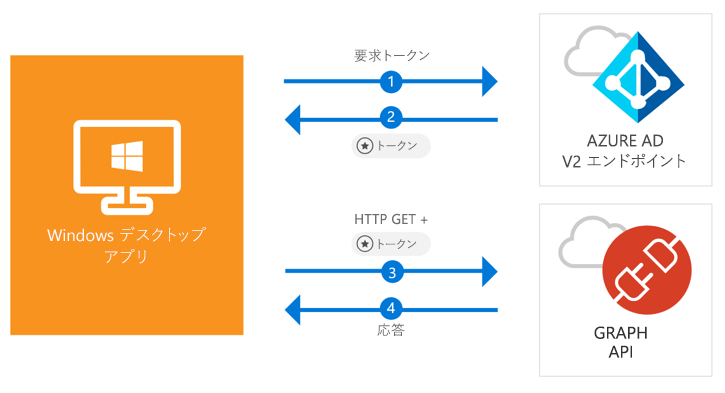

# <a name="quickstart-acquire-a-token-and-call-microsoft-graph-api-from-a-windows-desktop-app"></a>クイック スタート: トークンを取得し、Windows デスクトップ アプリから Microsoft Graph API を呼び出す

[!INCLUDE [active-directory-develop-applies-v2-msal](../../../includes/active-directory-develop-applies-v2-msal.md)]

このクイック スタートでは、Windows デスクトップ .NET (WPF) アプリケーションから個人や仕事、学校のアカウントへのサインイン、アクセス トークンの取得、Microsoft Graph API の呼び出しを実行できることを学びます。



> [!div renderon="docs"]
> ## <a name="register-and-download"></a>登録とダウンロード
> ### <a name="register-and-configure-your-application-and-code-sample"></a>アプリケーションとコード サンプルの登録と構成
> #### <a name="step-1-register-your-application"></a>手順 1: アプリケーションの登録
> アプリケーションを登録し、ソリューションにアプリケーション登録情報を追加するには、次の手順を実行します。
> 1. [Microsoft アプリケーション登録ポータル](https://apps.dev.microsoft.com/portal/register-app)に移動して、アプリケーションを登録します。
> 1. **[アプリケーション名]** ボックスに、アプリケーションの名前を入力します。
> 1. **[Guided Setup]\(ガイド付きセットアップ\)** チェック ボックスがオフになっていることを確認し、**[作成]** を選択します。
> 1. **[プラットフォームの追加]**、**[ネイティブ アプリケーション]**、**[保存]** の順に選択します。

> [!div renderon="portal" class="sxs-lookup"]
> #### <a name="step-1-configure-your-application"></a>手順 1: アプリケーションの構成
> このクイック スタートのコード サンプルを動作させるには、応答 URL として **urn:ietf:wg:oauth:2.0:oob** を追加する必要があります。
> > [!div renderon="portal" id="makechanges" class="nextstepaction"]
> > [この変更を行う]()
>
> > [!div id="appconfigured" class="alert alert-info"]
> >  アプリケーションはこれらの属性で構成されています

#### <a name="step-2-download-your-visual-studio-project"></a>手順 2: Visual Studio プロジェクトのダウンロード

[Visual Studio 2017 プロジェクトのダウンロード](https://github.com/Azure-Samples/active-directory-dotnet-desktop-msgraph-v2/archive/master.zip)

#### <a name="step-3-configure-your-visual-studio-project"></a>手順 3: Visual Studio プロジェクトの構成

1. ローカル フォルダー (例: **C:\Azure-Samples**) に zip ファイルを解凍します。
1. Visual Studio でプロジェクトを開きます。
1. **App.Xaml.cs** を編集し、`private static string ClientId` で始まる行を登録したアプリケーションの Application ID に置き換えます。

```csharp
private static string ClientId = "Enter_the_Application_Id_here";
```

## <a name="more-information"></a>詳細情報

### <a name="msalnet"></a>MSAL.NET

MSAL ([Microsoft.Identity.Client](https://www.nuget.org/packages/Microsoft.Identity.Client)) はユーザーにサインインし、Microsoft Azure Active Directory (Azure AD) によって保護されている API にアクセスするトークンを要求するために使用するライブラリです。 これは、Visual Studio の**パッケージ マネージャー コンソール**で次のコマンドを実行してインストールできます。

```powershell
Install-Package Microsoft.Identity.Client -Pre
```

### <a name="msal-initialization"></a>MSAL の初期化

MSAL への参照を追加するには、次のコードを追加します。

```csharp
using Microsoft.Identity.Client;
```

続いて、次のコードを使用して MSAL を初期化します。

```csharp
public static PublicClientApplication PublicClientApp = new PublicClientApplication(ClientId);
```

> |各値の説明: ||
> |---------|---------|
> | `ClientId` | *portal.microsoft.com* に登録されているアプリケーションの Application ID |

### <a name="requesting-tokens"></a>トークンの要求

MSAL には、トークンの取得に使用する 2 つのメソッド `AcquireTokenAsync`、`AcquireTokenSilentAsync` があります。

#### <a name="get-a-user-token-interactively"></a>ユーザー トークンを対話形式で取得する

Azure AD v2.0 エンドポイントの操作を強制される場合があります。その場合、資格情報の検証または同意を行うポップアップ ウィンドウが表示されます。 次に例をいくつか示します。

- ユーザーが初めてアプリケーションにサインインした場合
- パスワードの有効期限が切れているため、ユーザーが資格情報を再入力する必要がある場合
- ご使用のアプリケーションが、ユーザーによる同意が必要なリソースへのアクセスを要求している場合
- 2 要素認証が必須である場合

```csharp
authResult = await App.PublicClientApp.AcquireTokenAsync(_scopes);
```

> |各値の説明:||
> |---------|---------|
> | `_scopes` | 要求するスコープを含む (つまり、Microsoft Graph 用の `{ "user.read" }` またはカスタム Web API 用の `{ "api://<Application ID>/access_as_user" }`) |

#### <a name="get-a-user-token-silently"></a>ユーザー トークンを自動で取得する

リソースへのアクセスが必要になるたびに、ユーザーに自分の資格情報を検証させたくない場合があります。 ほとんどの場合は、ユーザーの操作なしにトークンの取得や更新を行います。 最初に `AcquireTokenAsync` メソッドを呼び出した後は、`AcquireTokenSilentAsync` メソッドを使用して保護されたリソースにアクセス するトークンを取得することができます。

```csharp
var accounts = await App.PublicClientApp.GetAccountsAsync();
authResult = await App.PublicClientApp.AcquireTokenSilentAsync(scopes, accounts.FirstOrDefault());
```

> |各値の説明: ||
> |---------|---------|
> |スコープ | 要求するスコープを含む (つまり、Microsoft Graph 用の `{ "user.read" }` またはカスタム Web API 用の `{ "api://<Application ID>/access_as_user" }`) |
> |accounts.FirstOrDefault() | キャッシュ内の最初のユーザー (MSAL は、1 つのアプリで複数のユーザーをサポート) |

## <a name="next-steps"></a>次の手順

アプリケーションや新機能の構築についての完全なステップ バイ ステップ ガイドは、Windows デスクトップ チュートリアルをお試しください。このクイック スタートの完全な説明も含まれています。

### <a name="learn-the-steps-to-create-the-application-used-in-this-quickstart"></a>このクイック スタートで使用されているアプリケーションを作成する手順

> [!div class="nextstepaction"]
> [Graph API 呼び出しチュートリアル](https://docs.microsoft.com/azure/active-directory/develop/guidedsetups/active-directory-windesktop)

[!INCLUDE [Help and support](../../../includes/active-directory-develop-help-support-include.md)]
