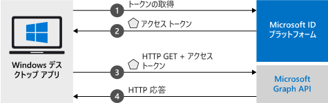

# <a name="quickstart-acquire-a-token-and-call-microsoft-graph-api-from-a-windows-desktop-app"></a>クイック スタート:Windows デスクトップ アプリからトークンを取得し、Microsoft Graph API を呼び出す

このクイック スタートでは、個人や仕事、学校のアカウントへのサインイン、アクセス トークンの取得、Microsoft Graph API の呼び出しを実行できる Windows デスクトップ .NET (WPF) アプリケーションの作成方法を学びます。



> [!div renderon="docs"]
> ## <a name="register-and-download-your-quickstart-app"></a>クイック スタート アプリを登録してダウンロードする
> クイック スタート アプリケーションを開始する方法としては、次の 2 つの選択肢があります。
> * [簡易] [選択肢 1: アプリを登録して自動構成を行った後、コード サンプルをダウンロードする](#option-1-register-and-auto-configure-your-app-and-then-download-your-code-sample)
> * [手動] [選択肢 2: アプリケーションを登録し、コード サンプルを手動で構成する](#option-2-register-and-manually-configure-your-application-and-code-sample)
>
> ### <a name="option-1-register-and-auto-configure-your-app-and-then-download-your-code-sample"></a>選択肢 1: アプリを登録して自動構成を行った後、コード サンプルをダウンロードする
>
> 1. 新しい [Azure portal の [アプリの登録]](https://portal.azure.com/#blade/Microsoft_AAD_RegisteredApps/applicationsListBlade/quickStartType/WinDesktopQuickstartPage/sourceType/docs) に移動します。
> 1. アプリケーションの名前を入力し、 **[登録]** を選択します。
> 1. 画面の指示に従ってダウンロードし、1 回クリックするだけで、新しいアプリケーションが自動的に構成されます。
>
> ### <a name="option-2-register-and-manually-configure-your-application-and-code-sample"></a>オプション 2:アプリケーションを登録し、アプリケーションとコード サンプルを手動で構成する
>
> #### <a name="step-1-register-your-application"></a>手順 1: アプリケーションの登録
> アプリケーションを登録し、その登録情報をソリューションに手動で追加するには、次の手順を実行します。
>
> 1. 職場または学校アカウントか、個人の Microsoft アカウントを使用して、[Azure portal](https://portal.azure.com) にサインインします。
> 1. ご利用のアカウントで複数のテナントにアクセスできる場合は、右上隅でアカウントを選択し、ポータルのセッションを目的の Azure AD テナントに設定します。
> 1. 開発者用の Microsoft ID プラットフォームの [[アプリの登録]](https://aka.ms/MobileAppReg) ページに移動します。
> 1. **[新規登録]** を選択します。
>      - **[名前]** セクションに、アプリのユーザーに表示されるわかりやすいアプリケーション名を入力します (例: `Win-App-calling-MsGraph`)。
>      - **[サポートされているアカウントの種類]** セクションで、 **[Accounts in any organizational directory and personal Microsoft accounts (for example, Skype, Xbox, Outlook.com)]\(任意の組織のディレクトリ内のアカウントと個人用の Microsoft アカウント (例: Skype、Xbox、Outlook.com)\)** を選択します。
>      - **[登録]** を選択して、アプリケーションを作成します。
> 1. アプリのページの一覧から **[認証]** を選択します。
> 1. **[デスクトップとデバイス]** セクションを展開します  ( **[デスクトップとデバイス]** セクションが表示されない場合は、最初に上部のバナーをクリックしてプレビューの認証エクスペリエンスを表示します)。
> 1. **[リダイレクト URI]** セクションで、 **[URI の追加]** を選択します。  「**urn:ietf:wg:oauth:2.0:oob**」と入力します。
> 1. **[保存]** を選択します。

> [!div class="sxs-lookup" renderon="portal"]
> #### <a name="step-1-configure-your-application-in-azure-portal"></a>手順 1:Azure portal でのアプリケーションの構成
> このクイック スタートのコード サンプルを動作させるには、応答 URL として **urn:ietf:wg:oauth:2.0:oob** を追加する必要があります。
> > [!div renderon="portal" id="makechanges" class="nextstepaction"]
> > [この変更を行う]()
>
> > [!div id="appconfigured" class="alert alert-info"]
> >  アプリケーションはこれらの属性で構成されています。

#### <a name="step-2-download-your-visual-studio-project"></a>手順 2:Visual Studio プロジェクトのダウンロード

[Visual Studio プロジェクトのダウンロード](https://github.com/Azure-Samples/active-directory-dotnet-desktop-msgraph-v2/archive/msal3x.zip) ([GitHub でプロジェクトを表示](https://github.com/Azure-Samples/active-directory-dotnet-desktop-msgraph-v2/))

#### <a name="step-3-configure-your-visual-studio-project"></a>手順 3:Visual Studio プロジェクトの構成

1. ディスクのルートに近いローカル フォルダー (例: **C:\Azure-Samples**) に zip ファイルを展開します。
1. Visual Studio でプロジェクトを開きます。
1. **App.Xaml.cs** を編集し、`ClientId` フィールドと `Tenant` フィールドの値を次のコードに置き換えます。

    ```csharp
    private static string ClientId = "Enter_the_Application_Id_here";
    private static string Tenant = "Enter_the_Tenant_Info_Here";
    ```
> [!div class="sxs-lookup" renderon="portal"]
> > [!NOTE]
> > このクイックスタートでは、Enter_the_Supported_Account_Info_Here をサポートしています。

> [!div renderon="docs"]
> 各値の説明:
> - `Enter_the_Application_Id_here` - 登録したアプリケーションの**アプリケーション (クライアント) ID**。
> - `Enter_the_Tenant_Info_Here` - 次のいずれかのオプションに設定します。
>   - アプリケーションで**この組織のディレクトリ内のアカウント**をサポートする場合は、この値を**テナント ID** または**テナント名**に置き換えます (たとえば、contoso.microsoft.com)
>   - アプリケーションで **[任意の組織のディレクトリ内のアカウント]** がサポートされる場合は、この値を `organizations` に置き換えます。
>   - アプリケーションで**任意の組織のディレクトリ内のアカウントと個人用の Microsoft アカウント**をサポートする場合は、この値を `common` に置き換えます
>
> > [!TIP]
> > **[アプリケーション (クライアント) ID]** 、 **[ディレクトリ (テナント) ID]** 、 **[サポートされているアカウントの種類]** の値を見つけるには、Azure portal でアプリの **[概要]** ページに移動します。

## <a name="more-information"></a>詳細情報

### <a name="msalnet"></a>MSAL.NET

MSAL ([Microsoft.Identity.Client](https://www.nuget.org/packages/Microsoft.Identity.Client)) はユーザーをサインインし、Microsoft ID プラットフォームによって保護されている API へのアクセス用のトークンを要求するために使用するライブラリです。 MSAL は、Visual Studio の "**パッケージ マネージャー コンソール**" で次のコマンドを実行してインストールできます。

```powershell
Install-Package Microsoft.Identity.Client -IncludePrerelease
```

### <a name="msal-initialization"></a>MSAL の初期化

MSAL への参照を追加するには、次のコードを追加します。

```csharp
using Microsoft.Identity.Client;
```

続いて、次のコードを使用して MSAL を初期化します。

```csharp
public static IPublicClientApplication PublicClientApp;
PublicClientApplicationBuilder.Create(ClientId)
                .WithAuthority(AzureCloudInstance.AzurePublic, Tenant)
                .Build();
```

> |各値の説明: ||
> |---------|---------|
> | `ClientId` | Azure portal に登録されているアプリケーションの "**アプリケーション (クライアント) ID**"。 この値は、Azure portal のアプリの **[概要]** ページで確認できます。 |

### <a name="requesting-tokens"></a>トークンの要求

MSAL には、トークンの取得に使用する 2 つのメソッド `AcquireTokenInteractive`、`AcquireTokenSilent` があります。

#### <a name="get-a-user-token-interactively"></a>ユーザー トークンを対話形式で取得する

ユーザーは Microsoft ID プラットフォーム エンドポイントの操作を強制される場合があります。その場合、各自の資格情報の検証または同意を行うポップアップ ウィンドウが表示されます。 次に例をいくつか示します。

- ユーザーが初めてアプリケーションにサインインした場合
- パスワードの有効期限が切れているため、ユーザーが資格情報を再入力する必要がある場合
- ご使用のアプリケーションが、ユーザーによる同意が必要なリソースへのアクセスを要求している場合
- 2 要素認証が必須である場合

```csharp
authResult = await App.PublicClientApp.AcquireTokenInteractive(_scopes)
                                      .ExecuteAsync();
```

> |各値の説明:||
> |---------|---------|
> | `_scopes` | 要求するスコープを含む (Microsoft Graph 用の `{ "user.read" }` またはカスタム Web API 用の `{ "api://<Application ID>/access_as_user" }` など)。 |

#### <a name="get-a-user-token-silently"></a>ユーザー トークンを自動で取得する

リソースへのアクセスが必要になるたびに、ユーザーに自分の資格情報を検証させたくない場合があります。 ほとんどの場合は、ユーザーの操作なしにトークンの取得や更新を行います。 最初に `AcquireTokenInteractive` メソッドを呼び出した後は、`AcquireTokenSilent` メソッドを使用して保護されたリソースにアクセス するトークンを取得することができます。

```csharp
var accounts = await App.PublicClientApp.GetAccountsAsync();
var firstAccount = accounts.FirstOrDefault();
authResult = await App.PublicClientApp.AcquireTokenSilent(scopes, firstAccount)
                                      .ExecuteAsync();
```

> |各値の説明: ||
> |---------|---------|
> | `scopes` | 要求するスコープを含む (Microsoft Graph 用の `{ "user.read" }` またはカスタム Web API 用の `{ "api://<Application ID>/access_as_user" }` など)。 |
> | `firstAccount` | キャッシュ内の最初のユーザーを指定する (MSAL は、1 つのアプリで複数のユーザーをサポート)。 |

[!INCLUDE [Help and support](../../../includes/active-directory-develop-help-support-include.md)]

## <a name="next-steps"></a>次の手順

アプリケーションや新機能の構築についての完全なステップ バイ ステップ ガイドは、Windows デスクトップ チュートリアルをお試しください。このクイック スタートの完全な説明も含まれています。

> [!div class="nextstepaction"]
> [Graph API 呼び出しチュートリアル](https://docs.microsoft.com/azure/active-directory/develop/guidedsetups/active-directory-windesktop)

Microsoft ID プラットフォームの改善にご協力ください。 簡単な 2 つの質問からなるアンケートに記入し、ご意見をお聞かせください。

> [!div class="nextstepaction"]
> [Microsoft ID プラットフォームのアンケート](https://forms.office.com/Pages/ResponsePage.aspx?id=v4j5cvGGr0GRqy180BHbRyKrNDMV_xBIiPGgSvnbQZdUQjFIUUFGUE1SMEVFTkdaVU5YT0EyOEtJVi4u)
