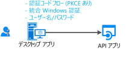
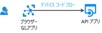

# シナリオ: Web API を呼び出すデスクトップ アプリ

Web API を呼び出すデスクトップ アプリを構築するために必要なすべてのことについて説明します。

## 前提条件

[!INCLUDE [Pre-requisites](../../../includes/active-directory-develop-scenarios-prerequisites.md)]

## 使用の開始

最初のアプリケーションをまだ作成していない場合は、.NET デスクトップのクイック スタートまたは UWP のクイック スタートに従って作成してください。

> [!div class="nextstepaction"]
> [クイック スタート:Windows デスクトップ アプリからトークンを取得し、Microsoft Graph API を呼び出す](./quickstart-v2-windows-desktop.md)

> [!div class="nextstepaction"]
> [クイック スタート:UWP アプリからトークンを取得し、Microsoft Graph API を呼び出す](./quickstart-v2-uwp.md)

## 概要

デスクトップ アプリケーションを作成して、ユーザーをアプリケーションにサインインさせ、Microsoft Graph、他の Microsoft API、または独自の Web API などの Web API を呼び出します。 次のようにいくつかの可能性があります。

- 対話型トークン取得を使用できます。

  - ご利用のデスクトップ アプリケーションでグラフィカル コントロールがサポートされている場合 (たとえば、Windows.Form アプリケーションや WPF アプリケーションの場合)。
  - または、.NET Core アプリケーションであり、システム ブラウザーで Azure AD との認証のやり取りが発生することに同意している場合。

- Windows でホストされているアプリケーションの場合、Windows ドメインに参加しているコンピューター、または AAD に参加しているコンピューターで実行されているアプリケーションが、統合 Windows 認証を使用して自動的にトークンを取得することも可能です。
- 最後に、推奨されていませんが、パブリック クライアント アプリケーションではユーザー名/パスワードを使用することができます。 これは一部のシナリオ (DevOps など) ではまだ必要ですが、それを使用するとアプリケーションに制約が課せされることに注意してください。 たとえば、多要素認証 (条件付きアクセス) を実行する必要があるユーザーはサインインさせることができません。 また、アプリケーションはシングル サインオン (SSO) のメリットを受けられません。

  さらに、先進認証の原則に反しており、これはレガシの理由のためにのみ提供されています。

  

- 移植可能なコマンド ライン ツール (おそらく、Linux または Mac で実行される .NET Core アプリケーション) を作成している場合、認証がシステム ブラウザーに委任されることに同意すると、対話式認証を使用できるようになります (.NET Core には [Web ブラウザー](https://aka.ms/msal-net-uses-web-browser)がまだ提供されておらず、そのため認証はシステム ブラウザーで行われます)。それ以外の場合、そのケースでの最良の選択肢は、デバイス コード フローを使用することです。 このフローは、IoT アプリケーションなどのブラウザーがないアプリケーションにも使用されます。

  

## 詳細

デスクトップ アプリケーションには多くの特異性があります。それらは主に、アプリケーションが対話式認証を使用しているかどうかによって決まります。

## 次の手順

> [!div class="nextstepaction"]
> [デスクトップ アプリ - アプリの登録](scenario-desktop-app-registration.md)
