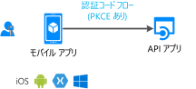

# シナリオ: Web API を呼び出すモバイル アプリケーション

Web API を呼び出すモバイル アプリを構築するために知っておくべきすべてのことについて説明します。

## 前提条件

[!INCLUDE [Prerequisites](../../../includes/active-directory-develop-scenarios-prerequisites.md)]

## 使用の開始

最初のモバイル アプリケーションを作成する場合は、クイック スタートをお試しください。

> [!div class="nextstepaction"]
> [クイック スタート:Android アプリからトークンを取得し、Microsoft Graph API を呼び出す](./quickstart-v2-android.md)
>
> [クイック スタート:iOS アプリからトークンを取得し、Microsoft Graph API を呼び出す](./quickstart-v2-ios.md)
>
> [クイック スタート:Xamarin iOS および Android アプリからトークンを取得し、Microsoft Graph API を呼び出す](https://github.com/Azure-Samples/active-directory-xamarin-native-v2)

## 概要

パーソナライズされたシームレスなユーザー エクスペリエンスはモバイル アプリにとって必要不可欠です。  Microsoft ID プラットフォームを使用すれば、モバイル開発者は iOS および Android のユーザーに対してこのエクスペリエンスを作り出すことができます。 お使いのアプリケーションで Azure Active Directory (Azure AD) ユーザー、個人の Microsoft アカウント ユーザー、Azure AD B2C ユーザーをサインインさせて、そのユーザーの代わりに Web API を呼び出すためのトークンを取得できます。 これらのフローを実装するため、業界標準の [OAuth2.0 承認コード フロー](v2-oauth2-auth-code-flow.md)を実装する Microsoft Authentication Library (MSAL) を使用します。

モバイル アプリに関する考慮事項:

- **ユーザー エクスペリエンスが重要**:ユーザーが、サインイン要求の前に該当のアプリの値を確認して、必要なアクセス許可のみを要求できるようにします。
- **すべてのユーザー構成をサポート**:多くのモバイル ビジネス ユーザーに、条件付きアクセスおよびデバイス コンプライアンスのポリシーが適用されています。 必ずこれらの重要なシナリオをサポートしてください。
- **シングル サインオン (SSO) の実装**:MSAL と Microsoft ID プラットフォームにより、デバイスのブラウザーまたは Microsoft Authenticator (および Android の Intune ポータル サイト) を介したシングル サインオンを容易に実現できます。

## 詳細

Microsoft ID プラットフォームでモバイル アプリを構築するときは、以下の考慮事項を念頭に置いてください。

- プラットフォームによっては、ユーザーが初めてサインインするときに何らかのユーザー対話が必要になる場合があります。 たとえば iOS では、Microsoft Authenticator (および Android の Intune ポータル サイト) を介して初めて SSO を使用するときに、アプリでユーザーの対話を表示する必要があります。
- iOS および Android の MSAL では、ユーザーをサインインさせるために、(お使いのアプリの上に表示される場合がある) 外部ブラウザーを使用することがあります。 アプリ内の WebView を代わりに使用するように構成をカスタマイズすることができます。
- モバイル アプリケーションでは、シークレットは決して使用しないでください。 すべてのユーザーがアクセスできるようになります。

## 次の手順

> [!div class="nextstepaction"]
> [アプリの登録](scenario-mobile-app-registration.md)
