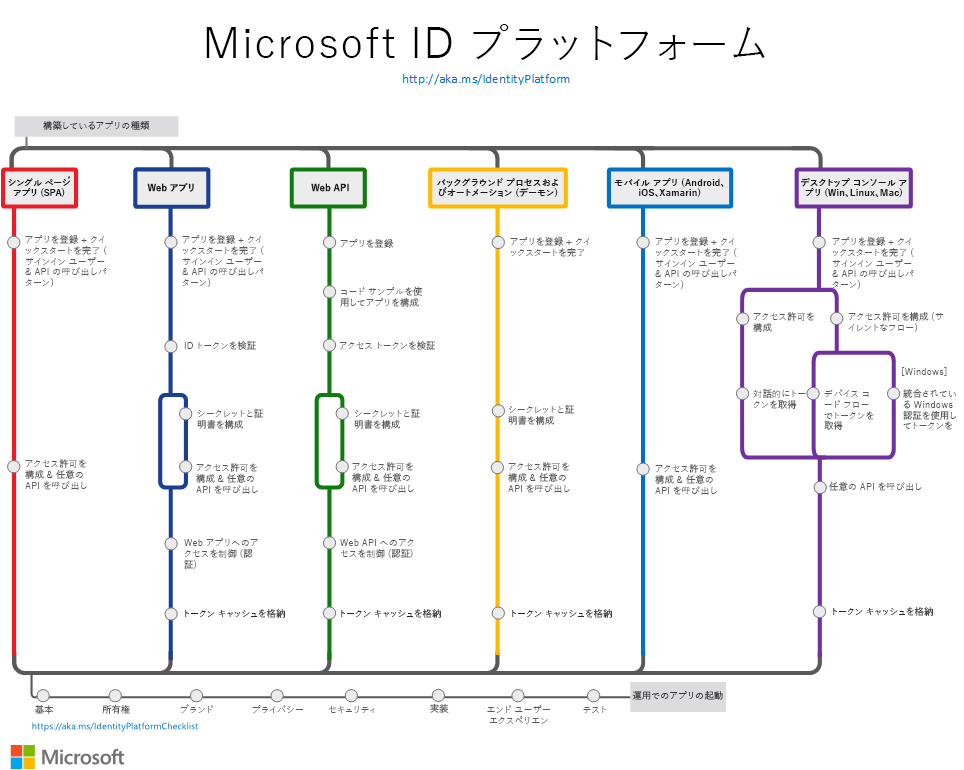

# Microsoft ID プラットフォーム (v2.0) の概要

Microsoft ID プラットフォームは、Azure Active Directory (Azure AD) 開発者プラットフォームの進化版です。 これにより、すべての Microsoft ID にサインインして、Microsoft API (Microsoft Graph) や開発者が構築した API を呼び出すためのトークンを取得するアプリケーションを開発者が構築できます。 Microsoft ID プラットフォームの構成は次のとおりです。

- 次のような、開発者が Microsoft ID を認証できるようにする **OAuth 2.0 および OpenID Connect 標準準拠の認証サービス**。
  - 職場または学校のアカウント (Azure AD を通じてプロビジョニングされます)
  - 個人的な Microsoft アカウント (Skype、Xbox、Outlook.com など)
  - ソーシャル アカウントまたはローカル アカウント (Azure AD B2C 使用)
- **オープンソース ライブラリ**:Microsoft Authentication Libraries (MSAL) およびその他の標準準拠ライブラリのサポート
- **アプリケーション管理ポータル**:Microsoft Azure portal で構築された登録および構成エクスペリエンスのほか、その他のすべての Azure の管理機能。
- **アプリケーション構成 API および PowerShell**: Microsoft Graph API および PowerShell を使用して対象のアプリケーションをプログラムで構成できます。これにより、DevOps タスクを自動化できます。
- **開発者向けコンテンツ**: 概念およびリファレンス ドキュメント、クイック スタート サンプル、コード サンプル、チュートリアル、およびハウツー ガイド。

開発者にとって、Microsoft ID プラットフォームは、パスワードなしの認証、ステップアップ認証、条件付きアクセスなど、ID およびセキュリティ領域における革新的技術をシームレスに統合します。  このような機能を自分で実装する必要はありません。Microsoft ID プラットフォームと統合されたアプリケーションは、このような革新的技術をネイティブに利用します。

Microsoft ID プラットフォームでは、一度コードを記述すればすべてのユーザーに対応できます。 アプリを一度ビルドすれば、多数のプラットフォームで動作させたり、リソース アプリケーション (API) と同様にクライアントとして機能するアプリを構築できます。

## 作業の開始

ID の処理は難しくありません。 

[Microsoft ID プラットフォームのビデオ](identity-videos.md)を見て、基本を学習してください。 

自身に当てはまる[シナリオ](authentication-flows-app-scenarios.md)を選択します。それぞれのシナリオ パスにはクイックスタートと概要ページが用意されており、数分で起動し実行できます。

- [単一ページのアプリを構築する](scenario-spa-overview.md)
- [ユーザーをサインインさせる Web アプリを構築する](scenario-web-app-sign-user-overview.md)
- [Web API を呼び出す Web アプリを構築する](scenario-web-app-call-api-overview.md)
- [保護された Web API を構築する](scenario-protected-web-api-overview.md)
- [Web API を呼び出す Web API を構築する](scenario-web-api-call-api-overview.md)
- [デスクトップ アプリを構築する](scenario-desktop-overview.md)
- [デーモン アプリを構築する](scenario-daemon-overview.md)
- [モバイル アプリを構築する](scenario-mobile-overview.md)

次の図は、一般的な認証アプリ シナリオの概要を示しています。Microsoft ID プラットフォームをアプリと統合するときにこれを参照として使用してください。

## 次のステップ

コア認証の概念の詳細については、以下の各トピックから始めることをお勧めします。

- [認証フローとアプリケーションのシナリオ](authentication-flows-app-scenarios.md)
- [認証の基本](authentication-scenarios.md)
- [アプリケーションとサービス プリンシパル](app-objects-and-service-principals.md)
- [対象ユーザー](v2-supported-account-types.md)
- [アクセス許可と同意](v2-permissions-and-consent.md)
- [ID トークン](id-tokens.md)と[アクセス トークン](access-tokens.md)

[Microsoft Graph](https://docs.microsoft.com/graph/overview) を呼び出すデータが豊富なアプリケーションを構築します。

**実稼働環境**にアプリを導入する準備ができたら、これらのベスト プラクティスを確認してください。

- アプリケーションで[ログを有効にします](msal-logging.md)。
- アプリケーションでテレメトリを有効にします。
- [プロキシを有効にし、HTTP クライアントをカスタマイズ](msal-net-provide-httpclient.md)します。
- [Microsoft ID プラットフォームの統合チェックリスト](identity-platform-integration-checklist.md)に従って、統合をテストします。

## 詳細情報

ソーシャルとローカルの ID でサインインする顧客向けアプリケーションを構築する予定の場合は、[Azure AD B2C の概要](https://docs.microsoft.com/azure/active-directory-b2c/tutorial-add-identity-providers)に関するページを参照してください。
