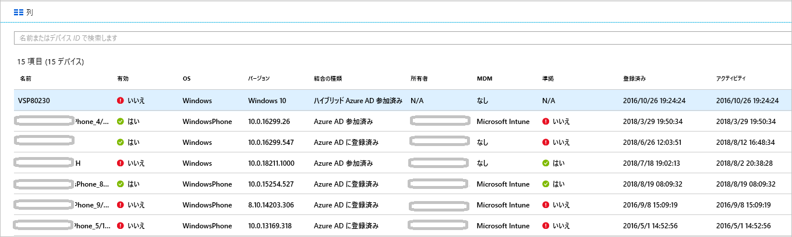

# <a name="how-to-manage-stale-devices-in-azure-ad"></a>方法:Azure AD で古いデバイスを管理する

ライフサイクルを完了するためには、不要になった時点で登録済みデバイスを登録解除するのが理想的です。 しかし、紛失、盗難、デバイスの破損、OS の再インストールなどの理由で、古いデバイスが環境に存在しているのが一般的です。 実際に管理が必要なデバイスの管理に IT 管理者がリソースを集中できるよう、古いデバイスを削除する方法が必要です。

この記事では、環境内の古いデバイスを効率的に管理する方法について説明します。
  

## <a name="what-is-a-stale-device"></a>古いデバイスとは?

古いデバイスとは、Azure AD に登録されているものの、一定の期間にわたってクラウド アプリへのアクセスに使用されていないデバイスです。 古いデバイスは、次の理由により、テナント内のデバイスとユーザーを管理およびサポートする能力に影響を及ぼします。 

- デバイスが重複していると、どのデバイスが現在アクティブであるかをヘルプデスクのスタッフが識別することが難しくなる可能性があります。
- デバイスの数が増えると、不要なデバイス ライトバックが発生し、AAD 接続同期の時間が長くなります。
- 一般的な衛生学として、またコンプライアンスを満たすために、クリーンな状態のデバイスが必要です。 

Azure AD 内の古いデバイスは、組織内のデバイスの一般的なライフサイクル ポリシーに干渉する可能性があります。

## <a name="detect-stale-devices"></a>古いデバイスの検出

一定期間にわたってクラウド アプリへのアクセスに使用されていない登録済みデバイス、というのが古いデバイスの定義であるため、古いデバイスの検出にはタイムスタンプ関連のプロパティが必要です。 Azure AD では、このプロパティは **ApproximateLastLogonTimestamp** または**アクティビティ タイムスタンプ**と呼ばれます。 現在の時間と**アクティビティ タイムスタンプ**の値の差が、アクティブなデバイスの基準として定義されている期間を超えている場合、デバイスは無効と見なされます。 この**アクティビティ タイムスタンプ**は現在パブリック プレビューです。

## <a name="how-is-the-value-of-the-activity-timestamp-managed"></a>アクティビティ タイムスタンプの値の管理のしくみは?  

アクティビティ タイムスタンプの評価は、デバイスの認証試行によって発動します。 Azure AD は、次の場合にアクティビティ タイムスタンプを評価します。

- [マネージド デバイス](../conditional-access/require-managed-devices.md)または[承認されたクライアント アプリ](../conditional-access/app-based-conditional-access.md)を要求する条件付きアクセス ポリシーがトリガーされている。
- Azure AD 参加済みまたはハイブリッド Azure AD 参加済みのどちらかである Windows 10 デバイスがネットワーク上でアクティブである。 
- Intune マネージド デバイスがサービスにチェックイン済みである。

アクティビティ タイムスタンプの既存の値と現在の値の差が 14 日を超えている場合、既存の値は新しい値に置き換えられます。

## <a name="how-do-i-get-the-activity-timestamp"></a>アクティビティ タイムスタンプを取得する方法は?

アクティビティ タイムスタンプの値を取得する方法には、次の 2 つがあります。

- Azure portal の[デバイス ページ](https://portal.azure.com/#blade/Microsoft_AAD_IAM/DevicesMenuBlade/Devices)の **[アクティビティ]** 列

    

- [Get-MsolDevice](https://docs.microsoft.com/powershell/module/msonline/get-msoldevice?view=azureadps-1.0) コマンドレット

    

## <a name="plan-the-cleanup-of-your-stale-devices"></a>古いデバイスのクリーンアップを計画する

環境内の古いデバイスを効率的にクリーンアップするには、関連するポリシーを定義する必要があります。 このポリシーは、古いデバイスに関連するすべての考慮事項を確実に把握するために役立ちます。 以下のセクションでは、一般的なポリシーの考慮事項の例を示します。 

### <a name="cleanup-account"></a>クリーンアップ アカウント

Azure AD でデバイスを更新するには、次のいずれかのロールが割り当てられているアカウントが必要です。

- グローバル管理者
- クラウド デバイス管理者
- Intune サービス管理者

クリーンアップ ポリシーで、必要なロールが割り当てられたアカウントを選択します。 

### <a name="timeframe"></a>期間

古いデバイスの指標である期間を定義します。 期間の値を定義するときは、アクティビティ タイムスタンプが更新される 14 日の期間を考慮に入れてください。 たとえば、古いデバイスの指標である 14 日よりも短いタイムスタンプを検討しないでください。 デバイスが古いように見えるが実際はそうではないシナリオが存在します。 たとえば、影響を受けるデバイスの所有者が休暇中または病欠中である可能性があります。  古いデバイスの期間を超えています。

### <a name="disable-devices"></a>デバイスの無効化

誤検出の場合に削除を元に戻すことができないため、古いと思われるデバイスをすぐに削除することはお勧めできません。 削除前に猶予期間を設け、その間はデバイスを無効にするのがベスト プラクティスです。 ポリシーで、削除前にデバイスを無効にする期間を定義します。

### <a name="mdm-controlled-devices"></a>MDM 制御デバイス

デバイスが Intune またはその他の MDM ソリューションの制御下にある場合、デバイスを無効化または削除する前に、管理システムでデバイスをインベントリから削除してください。

### <a name="system-managed-devices"></a>システム管理デバイス

システム管理デバイスは削除しないでください。 これらは一般に、オートパイロットなどのデバイスです。 一度削除すると、これらのデバイスは再プロビジョニングできません。 新しい `get-msoldevice` コマンドレットは、システム管理デバイスを既定で除外します。 

### <a name="hybrid-azure-ad-joined-devices"></a>ハイブリッド Azure AD 参加済みデバイス

ハイブリッド Azure AD 参加済みデバイスは、オンプレミスの古いデバイスの管理ポリシーに従います。 

Azure AD をクリーンアップするには:

- **Windows 10 デバイス** - オンプレミス AD で Windows 10 デバイスを無効化または削除し、Azure AD Connect によって、変更されたデバイス ステータスを Azure AD に同期します。
- **Windows 7/8** - Azure AD で Windows 7/8 デバイスを無効化または削除します。 Azure AD Connect を使用して Azure AD で Windows 7/8 デバイスを無効化または削除することはできません。

### <a name="azure-ad-joined-devices"></a>Azure AD 参加済みデバイス

Azure AD 内の Azure AD 参加済みデバイスを無効化または削除します。

### <a name="azure-ad-registered-devices"></a>Azure AD 登録済みデバイス

Azure AD 内の Azure AD 登録済みデバイスを無効化または削除します。

## <a name="clean-up-stale-devices-in-the-azure-portal"></a>Azure portal での古いデバイスのクリーンアップ  

Azure portal で古いデバイスをクリーンアップすることはできますが、PowerShell スクリプトを使用してこのプロセスを処理したほうが効率的です。 最新の PowerShell V1 モジュールを使い、タイムスタンプ フィルターを使用してオートパイロットなどのシステム管理デバイスを除外します。 現時点では、PowerShell V2 の使用は推奨されていません。

一般的なルーチンは次の手順で構成されます。

1. [Connect-MsolService](https://docs.microsoft.com/powershell/module/msonline/connect-msolservice?view=azureadps-1.0) コマンドレットを使用して Azure Active Directory に接続する
1. デバイスの一覧を取得する
1. [Disable-MsolDevice](https://docs.microsoft.com/powershell/module/msonline/disable-msoldevice?view=azureadps-1.0) コマンドレットを使用してデバイスを無効にします。 
1. デバイスが削除されるまでの猶予期間として設けた日数が経過するのを待ちます。
1. [Remove-MsolDevice](https://docs.microsoft.com/powershell/module/msonline/remove-msoldevice?view=azureadps-1.0) コマンドレットを使用してデバイスを削除します。

### <a name="get-the-list-of-devices"></a>デバイスの一覧を取得する

すべてのデバイスを取得し、返されたデータを CSV ファイルに保存するには:

```PowerShell
Get-MsolDevice -all | select-object -Property Enabled, DeviceId, DisplayName, DeviceTrustType, Approxi
mateLastLogonTimestamp | export-csv devicelist-summary.csv
```

ディレクトリ内のデバイスが多い場合、タイムスタンプ フィルターを使用して返されたデバイスの数を絞り込みます。 タイムスタンプが特定の日付よりも古いすべてのデバイスを取得し、返されたデータを CSV ファイルに保存するには: 

```PowerShell
$dt = [datetime]’2017/01/01’
Get-MsolDevice -all -LogonTimeBefore $dt | select-object -Property Enabled, DeviceId, DisplayName, DeviceTrustType, ApproximateLastLogonTimestamp | export-csv devicelist-olderthan-Jan-1-2017-summary.csv
```

## <a name="what-you-should-know"></a>知っておくべきこと

### <a name="why-is-the-timestamp-not-updated-more-frequently"></a>どうしてもっと頻繁にタイムスタンプが更新されないのですか?

タイムスタンプは、デバイスのライフサイクルのシナリオをサポートするために更新されます。 これは監査ではありません。 デバイスのより頻繁な更新には、サインイン監査ログを使用します。

### <a name="why-should-i-worry-about-my-bitlocker-keys"></a>BitLocker キーに気を付ける必要があるのはなぜですか?

構成されていると、Windows 10 デバイスの BitLocker キーは Azure AD 内のデバイス オブジェクトに格納されます。 古いデバイスを削除する場合、デバイスに保存されている BitLocker キーも削除します。 古いデバイスを削除する前に、クリーンアップ ポリシーがデバイスの実際のライフサイクルと整合しているかどうか判断してください。 

### <a name="why-should-i-worry-about-windows-autopilot-devices"></a>Windows Autopilot デバイスに気を付ける必要があるのはなぜですか?

Azure AD デバイスが Windows Autopilot オブジェクトに関連付けられている場合、デバイスが将来再利用される場合に、次の 3 つのシナリオが発生する可能性があります。
- ホワイト グローブを使用しない Windows Autopilot のユーザー主導型のデプロイでは、新しい Azure AD デバイスが作成されますが、ZTDID にタグ付けされることはありません。
- Windows Autopilot の自己デプロイ モードのデプロイでは、Azure AD デバイスの関連付けが見つからないため、これらのデプロイは失敗します  (これは、"なりすました" デバイスが資格情報なしで Azure AD への参加を試行しないようにするためのセキュリティ メカニズムです)。このエラーでは、ZTDID の不一致が示されます。
- Windows Autopilot のホワイト グローブ デプロイでは、Azure AD デバイスの関連付けが見つからないため、これらのデプロイは失敗します (バックグラウンドでは、ホワイト グローブ デプロイで同じ自己デプロイ モード プロセスが使用されるため、同じセキュリティ メカニズムが適用されます)。

### <a name="how-do-i-know-all-the-type-of-devices-joined"></a>すべての参加済みデバイスのタイプを知るにはどうすればよいですか?

さまざまなタイプの詳細については、[device management overview](overview.md)\(デバイス管理の概要\) を参照してください。

### <a name="what-happens-when-i-disable-a-device"></a>デバイスを無効にするとどうなりますか?

Azure AD への認証にデバイスが使用されているすべての認証は拒否されます。 一般的な例を次に示します。

- **ハイブリッド Azure AD 参加済みデバイス** - ユーザーはデバイスを使用してオンプレミス ドメインにサインインできます。 ただし、Office 365 などの Azure AD リソースにはアクセスできません。
- **Azure AD 参加済みデバイス** - ユーザーはデバイスを使用してサインインできません。 
- **モバイル デバイス** - ユーザーは Office 365 などの Azure AD リソースにアクセスできません。 

## <a name="next-steps"></a>次の手順

Azure Portal でデバイスを管理する方法の概要については、[Azure Portal によるデバイスの管理](device-management-azure-portal.md)に関するページを参照してください
