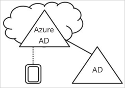
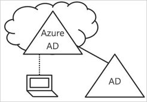
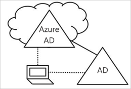

# Azure Active Directory のデバイス管理の概要

モバイル ファースト、クラウド ファーストの世界では、Azure Active Directory (Azure AD) を使用して、デバイス、アプリ、およびサービスにどこからでもシングル サインオンできます。 Bring Your Own Device (BYOD) を含むデバイスの急増によって、IT プロフェッショナルは、次の 2 つの対立する目標を達成することを迫られています。

- 場所や時間を問わず、常にエンド ユーザーの生産性を高められるようにすること
- 企業の資産を常に保護すること

ユーザーは、デバイスを通して企業の資産にアクセスしています。 IT 管理者は、企業の資産を保護するために、これらのデバイスを管理します。 管理することによって、ユーザーがセキュリティとコンプライアンスの基準と一致するデバイスからリソースにアクセスしていることを確信できます。 

デバイス管理は、[デバイスに基づく条件付きアクセス](../conditional-access/require-managed-devices.md)の基礎でもあります。 デバイスに基づく条件付きアクセスにより、環境内のリソースへのアクセスは、確実に、管理対象デバイスでのみ可能となります。   

このトピックでは、Azure Active Directory でのデバイス管理のしくみについて説明します。

## デバイスを Azure AD の管理下におく

デバイスを Azure AD の管理下におくには、次の 2 つのオプションがあります。

- 登録 
- 参加

デバイスを Azure AD に**登録**すると、デバイスの ID を管理できるようになります。 デバイスが登録されると、ユーザーが Azure AD にサインインしたときにデバイスを認証するために使用される ID が、Azure AD のデバイス登録によって指定されます。 この ID を使用して、デバイスを有効または無効にすることができます。

Microsoft Intune などのモバイル デバイス管理 (MDM) ソリューションと組み合わせて使用すると、Azure AD 内のデバイスの属性は、デバイスに関する情報が追加されて更新されます。 これにより、条件付きアクセス規則を作成できます。この規則に従い、デバイスからのアクセス時にセキュリティおよび法令遵守の基準を満たす必要があります。 Microsoft Intune へのデバイスの登録の詳細については、「管理するデバイスを Intune に登録する」をご覧ください。

デバイスを**参加**させるオプションは、デバイスを登録するオプションの拡張版です。 つまり、デバイスを登録するオプションが持っているすべての利点に加え、デバイスのローカル状態を変更することもできます。 ローカル状態を変更することで、ユーザーが個人アカウントではなく、職場または学校アカウントを使用してデバイスにサインインできるようになります。

## Azure AD 登録済みデバイス   

Azure AD 登録デバイス済みの目標は、**Bring Your Own Device (BYOD)** シナリオに対するサポートを提供することです。 このシナリオでは、ユーザーは個人所有のデバイスを使用して、組織の Azure Active Directory の管理下にあるリソースにアクセスできます。  

アクセスは、デバイスに入力されている職場または学校のアカウントに基づいて行われます。  
たとえば、Windows 10 では、パーソナル コンピューター、タブレット、または電話に、ユーザーの職場または学校アカウントを追加できます。  
ユーザーがデバイスに職場または学校アカウントを追加している場合、デバイスが Azure AD に登録され、必要に応じて、組織が構成したモバイル デバイス管理 (MDM) システムに登録されます。 組織のユーザーは、個人所有のデバイスに職場または学校アカウントを非常に簡単に追加できます。

- 初めて作業アプリケーションにアクセスするとき
- Windows 10 の場合は、**[設定]** メニューを使用して手動で 

Windows 10、iOS、Android、および macOS で Azure AD 登録済みデバイスを構成できます。

## Azure AD 参加済みデバイス

Azure AD 参加済みデバイスの目的は、次の操作を単純化することです。

- 職場所有のデバイスの Windows でのデプロイ 
- 任意の Windows デバイスからの組織のアプリとリソースへのアクセス
- 作業が所有するデバイスの、クラウド ベースの管理

Azure AD Join は、次の方法のいずれかを使用して展開できます： 
 - [Windows Auto pilot](https://docs.microsoft.com/windows/deployment/windows-autopilot/windows-10-autopilot)
 - [Bulk の展開](https://docs.microsoft.com/intune/windows-bulk-enroll)
 - [セルフ サービス エクスペリエンス](azuread-joined-devices-frx.md) 

**Azure AD Join**は、クラウド優先 (つまり、主にクラウド サービスを利用して、オンプレミスのインフラストラクチャの使用を削減することを目的とする) またはクラウド専用 (オンプレミスのインフラストラクチャがない)を望む企業のために意図されています。 Azure AD Join をデプロイできる組織の規模または種類に制限はありません。 Azure AD は、ハイブリッド環境 でも動作し、オンプレミス アプリやリソース Join へもアクセスできます。

Azure AD 参加済みデバイスを実装すると、次のメリットを得ることができます。

- Azure が管理している SaaS アプリやサービスへの**シングル サインオン (SSO)**。 ユーザーが職場のリソースにアクセスするときに、追加の認証プロンプトが表示されることはありません。 SSO 機能は、ドメイン ネットワークに接続されていない場合も有効です。

- 参加デバイス間でのユーザー設定の**企業に準拠しているローミング**。 ユーザーは、デバイスの設定を確認するときに Microsoft アカウント (Hotmail など) に接続する必要はありません。

- Azure AD アカウントを使用した**ビジネス向け Windows ストアへのアクセス**。 ユーザーは、組織によって事前選択されているアプリケーションのインベントリから選択できます。

- **Windows Hello** のサポート。

- コンプライアンス ポリシーを満たしているデバイスのみにアプリへのアクセスを許可する**アクセスの制限**。

- デバイスがオンプレミスのドメイン コントローラーにアクセスできる場合の**オンプレミス リソースへのシームレスなアクセス**。 

Azure AD への参加は、主にオンプレミスの Windows Server Active Directory インフラストラクチャを持っていない組織向けですが、次のようなシナリオで確実に使用できます。

- Azure AD および Intune などの MDM を使用してクラウド ベースのインフラストラクチャに移行しようと考えています。

- たとえばタブレットや電話などのモバイル デバイスを管理する必要があるが、オンプレミスのドメインへの参加を使用できない。

- ユーザーが主に必要としているのは、Office 365 や Azure AD に統合されているその他の SaaS アプリにアクセスすることである。

- ユーザーのグループを Active Directory ではなく Azure AD で管理したい。 これは、季節雇用される従業員、請負業者、受講者などに適用できます。

- リモートの支店の作業員に制限のあるオンプレミスのインフラに対する参加機能を提供したい。

Windows 10 デバイスで Azure AD 参加済みデバイスを構成できます。

## ハイブリッド Azure AD 参加済みデバイス

10 年以上にわたって、多くの組織は、オンプレミスの Active Directory へのドメインの参加を使用して、次の操作を実行できるようにしてきました。

- IT 部門が一元化された場所から職場所有のデバイスを管理する。

- ユーザーが Active Directory の職場または学校アカウントを使用して自分のデバイスにサインインする。 

通常、オンプレミスのフットプリントを持つ組織は、イメージング法を利用してデバイスをプロビジョニングし、多くの場合、**System Center Configuration Manager (SCCM)** または**グループ ポリシー(GP)** を使用してデバイスを管理します。

環境にオンプレミスの AD フットプリントがあるときに、Azure Active Directory が提供する機能も活用したい場合は、ハイブリッド Azure AD 参加済みデバイスを実装できます。 これらのデバイスは、オンプレミスの Active Directory と Azure Active Directory の両方に参加しているデバイスです。

以下に該当する場合は、ハイブリッド Azure AD 参加済みデバイスを使用する必要があります。

- Active Directory コンピューター認証に依存しているこれらのデバイスに展開される Win32 アプリがあります。

- デバイスの管理に、GP が必要です。

- 今後も社員のデバイスの構成にイメージング ソリューションを使用したい。

ハイブリッド Azure AD 参加済みデバイスは、Windows 10 デバイスと、Windows 8 や Windows 7 などのダウンレベルのデバイスで構成できます。

## まとめ

Azure AD のデバイス管理を使用して、次の操作を実行できます。 

- デバイスを Azure AD の管理下におくプロセスを簡略化する

- 組織のクラウドベースのリソースへの使いやすいアクセス方法をユーザーに提供する

おおざっぱにまとめると、次のようになります。

- Azure AD 登録済みデバイス:

    - 個人用デバイスの場合 

    - Azure AD にデバイスを手動で登録する

- Azure AD 参加済みデバイス: 

    - 組織が所有するデバイスの場合

    - オンプレミスの AD に参加して**いない**デバイスの場合

    - Azure AD にデバイスを手動で登録する

    - デバイスのローカル状態を変更する

- オンプレミスの AD に参加しているデバイスでは、ハイブリッド Azure AD 参加済みデバイスを使用する     

    - 組織が所有するデバイスの場合

    - オンプレミスの AD に参加してるデバイスの場合

    - Azure AD にデバイスを自動で登録する

    - デバイスのローカル状態を変更する

## 次の手順

- Azure Portal でデバイスを管理する方法の概要については、[Azure Portal によるデバイスの管理](device-management-azure-portal.md)に関するページを参照してください

- デバイスベースの条件付きアクセスについて詳しくは、「[Azure Active Directory 接続アプリケーションに対するデバイスベースの条件付きアクセス ポリシーを設定する方法](../conditional-access/require-managed-devices.md)」を参照してください。

- セットアップするには:
    - Azure Active Directory 登録済み Windows 10 デバイスの場合は、[Azure Active Directory 登録済み Windows 10 デバイスを構成する方法](../user-help/device-management-azuread-registered-devices-windows10-setup.md)に関するページを参照してください。
    - Azure Active Directory 参加済みデバイスの場合は、[Azure Active Directory 参加済みデバイスを構成する方法](../user-help/device-management-azuread-joined-devices-setup.md)に関するページを参照してください。
    - ハイブリッド Azure AD 参加デバイスの場合は、[ハイブリッド Azure Active Directory 参加の実装を計画する方法](hybrid-azuread-join-plan.md)に関するページを参照してください。

