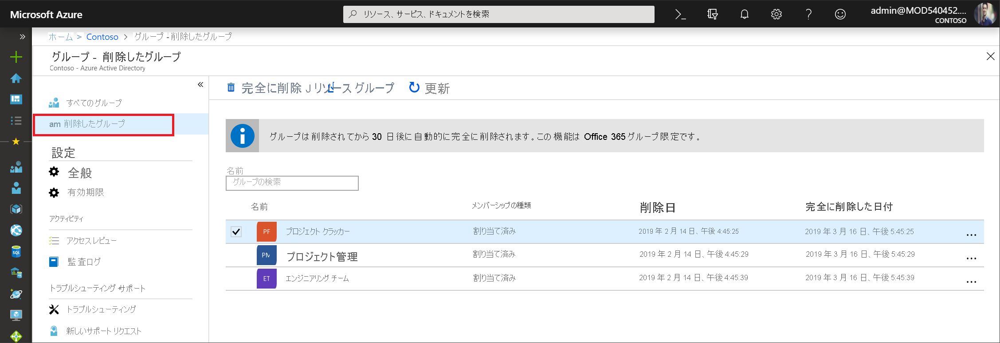

# <a name="restore-a-deleted-microsoft-365-group-in-azure-active-directory"></a>Azure Active Directory で削除された Microsoft 365 グループを復元する

Azure Active Directory (Azure AD) で Microsoft 365 グループを削除すると、削除されたグループは表示されなくなりますが、削除日から 30 日間は保持されます。 この動作は、必要に応じて、グループとその内容を復元できるようにするためです。 この機能は、Azure AD の Microsoft 365 グループに限定されます。 セキュリティ グループや配布グループでは使用できません。 30 日間のグループの復元期間はカスタマイズできないことに注意してください。

> [!NOTE]
> `Remove-MsolGroup`は使用しないでください。グループが完全に消去されます。 Microsoft 365 グループを削除する場合は、常に `Remove-AzureADMSGroup` を使用してください。

グループを復元するために必要なアクセス許可は、次のいずれかになります。

Role | アクセス許可
--------- | ---------
グローバル管理者、グループ管理者、パートナー レベル 2 のサポート、Intune 管理者 | 削除されたすべての Microsoft 365 グループを復元できます。
ユーザー管理者、パートナー レベル 1 のサポート | グローバル管理者ロールに割り当てられているグループを除き、削除されたすべての Microsoft 365 グループを復元できます。
User | ユーザーが所有する、削除されたすべての Microsoft 365 グループを復元できます。

## <a name="view-and-manage-the-deleted-microsoft-365-groups-that-are-available-to-restore"></a>復元可能な削除済み Microsoft 365 グループの表示と管理を行う

1. ユーザー管理者アカウントを使用して [Azure AD 管理センター](https://aad.portal.azure.com)にサインインします。

2. **[グループ]** を選択した後、 **[削除したグループ]** を選択して、復元可能な削除されたグループを表示します。

    

3. **[削除されたグループ]** ブレードで、以下を実行できます。

   - **[グループの復元]** を選択して、削除されたグループとその内容を復元します。
   - **[完全に削除]** を選択して、削除されたグループを完全に削除します。 グループを完全に削除するには、自分が管理者である必要があります。

## <a name="view-the-deleted-microsoft-365-groups-that-are-available-to-restore-using-powershell"></a>PowerShell を使用して復元可能な削除済み Microsoft 365 グループを表示する

次のコマンドレットを使用すると、削除されたグループを表示して、目的のグループがまだ完全には削除されていないことを確認できます。 これらのコマンドレットは、[Azure AD PowerShell モジュール](https://www.powershellgallery.com/packages/AzureAD/)に含まれています。 このモジュールの詳細については、「[Azure Active Directory PowerShell Version 2 (Azure Active Directory PowerShell バージョン 2)](/powershell/azure/active-directory/install-adv2)」をご覧ください。

1.  次のコマンドレットを実行して、Azure AD 組織内のまだ復元可能なすべての削除済み Microsoft 365 グループを表示します。
   

    ```powershell
    Get-AzureADMSDeletedGroup
    ```

2.  特定のグループの objectID がわかっている場合 (手順 1 のコマンドレットで objectID を取得できる場合) は、次のコマンドレットを実行して、削除された特定のグループがまだ完全には削除されていないことを確認できます。

    ```
    Get-AzureADMSDeletedGroup –Id <objectId>
    ```

## <a name="how-to-restore-your-deleted-microsoft-365-group-using-powershell"></a>削除された Microsoft 365 グループを Powershell を使用して復元する方法

グループがまだ復元可能であることを確認したら、次のいずれかの手順を実行して削除されたグループを復元します。 グループにドキュメント、SP サイト、または他の永続的なオブジェクトが含まれている場合、グループとその内容を完全に復元するまでに最大 24 時間かかることがあります。

1. 次のコマンドレットを実行して、グループとその内容を復元します。
 

   ```
    Restore-AzureADMSDeletedDirectoryObject –Id <objectId>
    ``` 

2. また、次のコマンドレットを実行して、削除されたグループを完全に削除することもできます。
    

    ```
    Remove-AzureADMSDeletedDirectoryObject –Id <objectId>
    ```

## <a name="how-do-you-know-this-worked"></a>グループが復元されたことを確認する方法

Microsoft 365 グループが正常に復元されたことを確認するには、`Get-AzureADGroup –ObjectId <objectId>` コマンドレットを実行してそのグループの情報を表示します。 復元要求が完了すると、次のようになります。

- Exchange の左側のナビゲーション バーにグループが表示されます。
- Planner にグループのプランが表示されます。
- SharePoint サイトとそのすべてのコンテンツを利用できるようになります。
- Exchange エンドポイントと、Microsoft 365 グループをサポートする他の Microsoft 365 ワークロードからグループにアクセスできます。

## <a name="next-steps"></a>次のステップ

次の記事は、Azure Active Directory グループに関する追加情報を提供します。

* [既存のグループの表示](../fundamentals/active-directory-groups-view-azure-portal.md)
* [グループの設定の管理](../fundamentals/active-directory-groups-settings-azure-portal.md)
* [グループのメンバーの管理](../fundamentals/active-directory-groups-members-azure-portal.md)
* [グループのメンバーシップの管理](../fundamentals/active-directory-groups-membership-azure-portal.md)
* [グループ内のユーザーの動的ルールの管理](groups-dynamic-membership.md)
