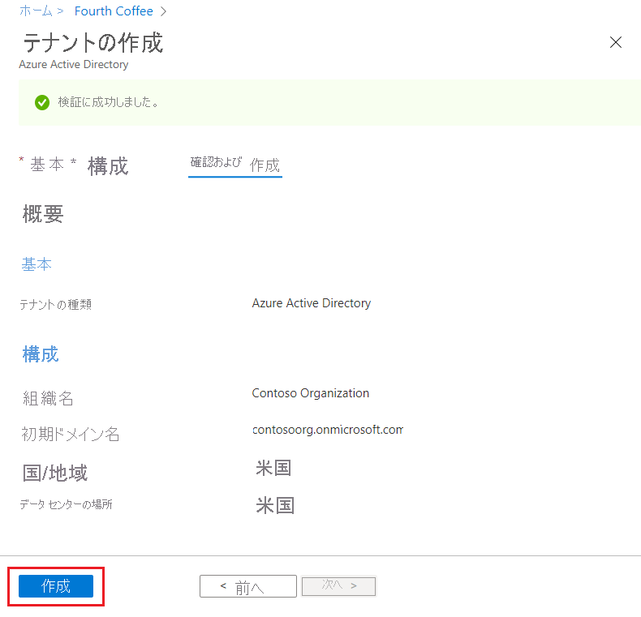

# クイック スタート:Azure Active Directory で新しいテナントを作成する
Azure Active Directory (Azure AD) ポータルを使用して、組織の新しいテナントの作成など、すべての管理タスクを実行できます。 

このクイック スタートでは、Azure portal と Azure Active Directory にアクセスする方法と、組織の基本的なテナントを作成する方法について説明します。

Azure サブスクリプションをお持ちでない場合は、開始する前に [無料アカウント](https://azure.microsoft.com/free/) を作成してください。

## 組織の新しいテナントを作成する
Azure portal にサインインすると、組織の新しいテナントを作成できます。 新しいテナントは組織を表し、社内外のユーザー向けに特定インスタンスの Microsoft クラウド サービスを管理するために役立ちます。

### 新しいテナントを作成するには

1. 組織の [Azure portal](https://portal.azure.com/) にサインインします。

1. Azure portal メニューから **[Azure Active Directory]** を選択します。  

    <kbd>![Azure Active Directory - [概要] ページ - テナントの作成](media/active-directory-access-create-new-tenant/azure-ad-portal.png)</kbd>  

1. **[Create a tenant]\(テナントの作成\)** を選択します。

1. [基本] タブで、作成するテナントの種類を選択します ( **[Azure Active Directory]** または **[Azure Active Directory (B2C)]** )。

1. **Next:Configuration\(次へ: 構成\)** を選択して 構成 タブに移動します。

    <kbd>![Azure Active Directory - [Create a tenant]\(テナントの作成\) ページ - [構成] タブ](media/active-directory-access-create-new-tenant/azure-ad-create-new-tenant.png)</kbd>

1.  [構成] タブで、次の情報を入力します。
    
    - **[組織名]** ボックスに「_Contoso Organization_」と入力します。

    - **[初期ドメイン名]** ボックスに「_Contosoorg_」と入力します。

    - **[国またはリージョン]** ボックスは _[米国]_ オプションのままにします。

1. **確認と作成** を選択します。 入力した情報を確認し、誤りがなければ **[作成]** を選択します。

    <kbd></kbd>

新しいテナントは、ドメイン contoso.onmicrosoft.com で作成されます。

## リソースをクリーンアップする
このアプリケーションを引き続き使用しない場合は、次の手順を使用してテナントを削除することができます。

- Azure portal で **[ディレクトリ + サブスクリプション]** フィルターを使用して、削除するディレクトリにサインインしていることを確認し、必要に応じてターゲット ディレクトリに切り替えます。
- **[Azure Active Directory]** を選択し、**[Contoso - 概要]** ページで **[ディレクトリの削除]** を選択します。

    テナントとその関連情報は削除されます。

    <kbd>![概要ページ。[ディレクトリの削除] ボタンが強調表示されている](media/active-directory-access-create-new-tenant/azure-ad-delete-new-tenant.png)</kbd>

## 次のステップ
- 追加のドメイン名を変更または追加する方法については、[Azure Active Directory にカスタム ドメイン名を追加する方法](add-custom-domain.md)に関するページを参照してください。

- ユーザーの追加については、[新しいユーザーの追加または削除](add-users-azure-active-directory.md)に関するページを参照してください。

- グループとメンバーの追加については、[基本的なグループの作成とメンバーの追加](active-directory-groups-create-azure-portal.md)に関するページを参照してください。

- 組織のアプリケーションとリソース アクセスの管理方法については、[Privileged Identity Management を使用したロールベースのアクセス](../../role-based-access-control/best-practices.md)と[条件付きのアクセス](../../role-based-access-control/conditional-access-azure-management.md)に関するページを参照してください。

- [基本的なライセンスの情報、用語、関連機能](active-directory-whatis.md)など、Azure AD について学習します。
