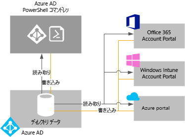

# Azure AD ディレクトリの管理

## Azure AD テナントとは
Azure Active Directory (Azure AD) におけるテナントとは、Azure や Office 365 などの Microsoft クラウド サービスに組織がサインアップしたときに、その組織専用に与えられる Azure AD ディレクトリのインスタンスです。 各 Azure AD ディレクトリは、他の Azure AD ディレクトリと区別され分離されています。 会社のオフィス ビルが組織に固有のセキュリティで保護された資産であるのと同様に、Azure AD ディレクトリも特定の組織だけが使用するセキュリティで保護された資産として設計されています。 Azure AD アーキテクチャは、顧客のデータや ID 情報が混合しないよう分離します。そのため、Azure AD ディレクトリのユーザーや管理者が、故意であれ過失であれ別のディレクトリのデータにアクセスすることはできません。

## Azure AD ディレクトリを取得する方法
Azure AD は、ほとんどの Microsoft クラウド サービスの背後にある、次のようなコア ディレクトリおよび ID 管理機能を提供します。

* Azure
* Microsoft Office 365
* Microsoft Dynamics CRM オンライン
* Microsoft Intune

これらの Microsoft クラウド サービスのいずれかにサインアップすると、Azure AD ディレクトリが提供されます。 必要に応じて、追加のディレクトリを作成できます。 たとえば、最初のディレクトリを運用ディレクトリとして保持し、テストまたはステージング用に別のディレクトリを作成できます。

### 新しい Azure サブスクリプションに付属する Azure AD ディレクトリを使用する

Microsoft サービスに 2 回目以降サインアップするときは、最初のサービスに使用した管理者アカウントを使うことをお勧めします。 Microsoft サービスへの初回サインアップ時に指定した情報を使って、組織の新しい Azure AD ディレクトリ インスタンスが作成されます。 他の Microsoft サービスに登録するとき、サインイン試行の認証に同じディレクトリを使用すれば、既定のディレクトリで自分が構成した既存のユーザー アカウント、ポリシー、設定、オンプレミス ディレクトリ統合を利用することができます。

たとえば、Microsoft Intune サブスクリプションにサインアップした後、オンプレミスの Active Directory と Azure AD のディレクトリとを同期させた場合、Office 365 など別の Microsoft サービスにサインアップして、Microsoft Intune で活用しているディレクトリ統合と同じ利便性を簡単に実現することができます。

オンプレミス ディレクトリと Azure AD の統合の詳細については、[Azure AD Connect を使ったディレクトリ統合](../connect/active-directory-aadconnect.md)に関するページを参照してください。

### 既存の Azure AD ディレクトリを新しい Azure サブスクリプションに関連付ける
新しい Azure サブスクリプションは、既存の Office 365 または Microsoft Intune サブスクリプションへのサインインを認証する同じディレクトリに関連付けることができます。 このシナリオの詳細については、「[Azure サブスクリプションの所有権を別のアカウントに譲渡する](../../billing/billing-subscription-transfer.md)」を参照してください。

### 組織として Microsoft クラウド サービスにサインアップして Azure AD ディレクトリを作成する
Microsoft クラウド サービスのサブスクリプションをまだ持っていない場合は、次のリンクのいずれかを使用してサインアップできます。 最初のサービスにサインアップすると、Azure AD ディレクトリが自動的に作成されます。

* [Microsoft Azure](https://account.azure.com/organization)
* [Office 365](http://products.office.com/business/compare-office-365-for-business-plans/)
* [Microsoft Intune](https://portal.office.com/Signup/Signup.aspx?OfferId=40BE278A-DFD1-470a-9EF7-9F2596EA7FF9&dl=INTUNE_A&ali=1#0%20)

### サブスクリプションの既定のディレクトリを変更する方法

1. 所有権を譲渡するサブスクリプションのアカウント管理者であるアカウントで [Azure アカウント センター](https://account.azure.com/Subscriptions)にサインインします。
2. サブスクリプションの所有者となるユーザーが、譲渡先のディレクトリに存在することを確認します。
3. **[サブスクリプションの譲渡]** をクリックします。
4. 譲渡先を指定します。 譲渡先には、承認用のリンクが記載された電子メールが自動的に送信されます。
5. 譲渡先のユーザーは、リンクをクリックして指示に従います (支払情報の入力など)。 受信者が継承すると、サブスクリプションが譲渡されます。 
6. サブスクリプションの所有権が問題なく譲渡されると、サブスクリプションの既定のディレクトリが、譲渡先のユーザーが属しているディレクトリに変更されます。

詳細については、「[別のアカウントに Azure サブスクリプションの所有権を譲渡する](../../billing/billing-subscription-transfer.md)」を参照してください

### Azure の既定のディレクトリを管理する
Azure にサインアップすると、ご利用のサブスクリプションに既定の Azure AD ディレクトリが関連付けられます。 Azure AD を使用するのにコストは一切かかりません。また、ディレクトリは無料のリソースです。 別途ライセンスを取得することによって、追加機能 (サインイン時に会社のブランドを表示する機能や、セルフサービスによるパスワード リセット機能など) を利用できる有料の Azure AD サービスが存在します。 既定の *.onmicrosoft.com ドメインではなく、ご利用の DNS 名を使用してカスタム ドメインを作成することもできます。

## ディレクトリ データを管理する方法
Microsoft クラウド サービス サブスクリプションの管理者は、[Azure AD 管理センター](https://aad.portal.azure.com)、Microsoft Intune アカウント ポータル、または [Office 365 管理センター](https://portal.office.com/)を使用して、組織のディレクトリ データを管理できます。 また、[Azure Active Directory PowerShell のコマンドレット](https://docs.microsoft.com/powershell/azure/active-directory)を使用することで、Azure AD に格納されているデータを管理することもできます。

これらのポータル (またはコマンドレット) から、次の操作が可能です。

* ユーザーとグループのアカウントを作成および管理する
* 組織のサブスクリプションの関連クラウド サービスを管理する
* Azure AD の ID サービスや認証サービスとのオンプレミス統合を設定する

Azure AD 管理センター、Office 365 管理センター、Microsoft Intune アカウント ポータル、Azure AD コマンドレットはすべて、組織のディレクトリに関連付けられている Azure AD の 1 つの共有インスタンスとの間で読み取りと書き込みを行います。 これらの各ツールは、ディレクトリ データを取り込む (または変更する) フロントエンド インターフェイスとして機能します。
これらのサービスのいずれかのコンテキストでサインインしているときに、いずれかのポータルまたはコマンドレットを使用して組織のデータを変更した場合、次回サインインしたときに、他のポータルでも変更が表示されます。 このデータは、登録している Microsoft クラウド サービス全体で共有されます。

たとえば、Office 365 管理センターを使用して、ユーザーがサインインできないようにブロックした場合、そのユーザーは組織が現在登録している他のどのサービスにもサインインできなくなります。 また、Microsoft Intune アカウント ポータルで同じユーザー アカウントを見ると、そのユーザーがブロックされていることがわかります。

## 複数のディレクトリを追加および管理する方法
[Azure AD ディレクトリは、Azure Portal で追加](https://portal.azure.com/#create/Microsoft.AzureActiveDirectory)できます。 必要な情報を入力し、**[作成]** を選択します。

各ディレクトリは、完全に独立したリソースとして管理できます。つまり、各ディレクトリは対等であり、フル機能を備え、管理対象の他のディレクトリから論理的に独立しています。ディレクトリ間に親子関係はありません。 このディレクトリ間の独立には、リソースの独立、管理上の独立、同期の独立があります。

* **リソースの独立**。 外部ユーザーの一部の例外を除き、あるディレクトリでリソースを作成または削除しても、別のディレクトリのリソースには影響しません。 あるディレクトリで "contoso.com" というカスタム ドメインを使用している場合、このドメインを他のディレクトリで使用することはできません。
* **管理上の独立**。  "Contoso" ディレクトリの管理者以外のユーザーが、"Test" というテスト ディレクトリを作成した場合、次のようになります。
  
  * "Test" の管理者が管理者特権を明示的に付与した場合を除き、"Contoso" ディレクトリの管理者には、"Test" ディレクトリに対する直接的な管理者特権はありません。 "Contoso" の管理者は、"Test" を作成したユーザー アカウントの制御により、"Test" ディレクトリへのアクセスを制御できます。
    
  * あるディレクトリでユーザーの管理者ロールを割り当てるか削除した場合、変更は、別のディレクトリでそのユーザーに割り当てられている可能性のある管理者ロールには影響しません。
* **同期の独立**。 Azure AD Connect ディレクトリ同期ツールの単一インスタンスからデータが同期されるように、各 Azure AD テナントを個別に構成できます。

他の Azure リソースとは異なり、ディレクトリは Azure サブスクリプションの子リソースではありません。 そのため、Azure サブスクリプションを取り消したり、期限切れを許可した場合でも、Azure AD PowerShell、Azure Graph API、または Office 365 管理センターなどの他のインターフェイスを使用して、ディレクトリ データに引き続きアクセスできます。 また、ディレクトリに別のサブスクリプションを関連付けることもできます。

## Azure AD ディレクトリを削除する準備の方法
グローバル管理者は、ポータルから Azure AD ディレクトリを削除できます。 ディレクトリを削除すると、そのディレクトリに含まれるリソースもすべて削除されます。 ディレクトリを削除する前に、そのディレクトリが不要であることを確認してください。

> [!NOTE]
> ユーザーが職場または学校アカウントを使用してサインインしている場合、そのユーザーは自分のホーム ディレクトリを削除することはできません。 たとえば、ユーザーが joe@contoso.onmicrosoft.com としてサインインしている場合、そのユーザーは既定のドメインが contoso.onmicrosoft.com であるディレクトリを削除することはできません。

Azure AD でディレクトリを削除するには、特定の条件を満たす必要があります。 これにより、ディレクトリの削除がユーザーやアプリケーションに悪影響を及ぼす (ユーザーが Office 365 にサインインできない、Azure のリソースにアクセスできないなど) リスクが軽減されます。 たとえば、サブスクリプションのディレクトリが誤って削除された場合、ユーザーはそのサブスクリプションの Azure リソースにアクセスできなくなります。

次の条件がチェックされます。

* ディレクトリ内のユーザーは、ディレクトリを削除するグローバル管理者に限られます。 ディレクトリを削除するには、他のすべてのユーザーを削除しておく必要があります。 ユーザーがオンプレミスから同期されている場合は、同期を無効にする必要があります。また、Azure Portal または Azure PowerShell のコマンドレットを使用して、クラウド ディレクトリでユーザーを削除する必要があります。 グループまたは連絡先 (Office 365 管理センターから追加された連絡先など) を削除する要件はありません。
* ディレクトリ内にアプリケーションが存在してはいけません。 ディレクトリを削除するには、すべてのアプリケーションを削除しておく必要があります。
* Multi-Factor Authentication プロバイダーをディレクトリにリンクすることはできません。
* ディレクトリに関連付けられている、Microsoft Azure、Office 365、Azure AD Premium などの Microsoft Online Services のサブスクリプションが存在してはいけません。 たとえば、Azure で既定のディレクトリが作成されている場合、Azure サブスクリプションが認証にこのディレクトリを引き続き使用していれば、このディレクトリを削除することはできません。 同様に、別のユーザーがディレクトリにサブスクリプションを関連付けている場合、そのディレクトリを削除することはできません。 

## 次の手順
* [Azure AD フォーラム](https://social.msdn.microsoft.com/forums/azure/en-US/home?forum=windowsazuread)
* [Azure Multi-Factor Authentication フォーラム](https://social.msdn.microsoft.com/Forums/azure/en-US/home?forum=windowsazureactiveauthentication)
* [Azure の StackOverflow に関する質問](https://stackoverflow.com/questions/tagged/azure-active-directory)
* [Azure Active Directory PowerShell](https://docs.microsoft.com/powershell/azure/active-directory)
* [Azure AD での管理者ロールの割り当て](../users-groups-roles/directory-assign-admin-roles.md)
