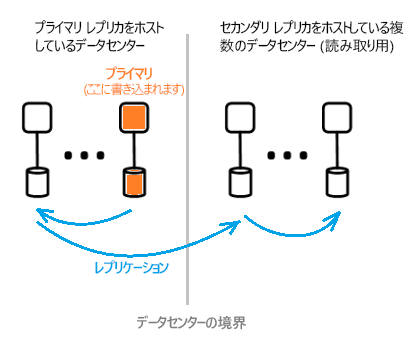

# Azure Active Directory のアーキテクチャの概要
Azure Active Directory (Azure AD) を使用すると、Azure のサービスやリソースへのアクセスをそのユーザーのために安全に管理することができます。 Azure AD には、必要な ID 管理機能がすべて備わっています。 Azure AD の機能については、「[Azure Active Directory とは](active-directory-whatis.md)」を参照してください。

Azure AD で、ユーザーとグループを作成して管理できるほか、アクセス許可によって企業リソースに対するアクセスを許可したり拒否したりすることができます。 ID 管理については、「[Azure ID 管理の基礎](active-directory-whatis.md)」を参照してください。

## Azure AD のアーキテクチャ
Azure AD の地理的に分散されたアーキテクチャでは、広範な監視機能、自動再ルーティング機能、フェールオーバー、復旧機能を兼ね備えており、会社全体の可用性とパフォーマンスがお客様に提供されます。

この記事では、次のアーキテクチャ要素について取り上げます。
 *  サービス アーキテクチャの設計
 *  スケーラビリティ
 *  継続的可用性
 *  データ センター

### サービス アーキテクチャの設計
一般に、アクセスと使用が容易でデータが豊富なシステムは、独立したビルディング ブロックまたはスケール ユニットを使用して構築できます。 Azure AD データ層では、スケール ユニットは "*パーティション*" と呼ばれます。 

データ層には、読み取り/書き込み機能を備えたさまざまなフロントエンド サービスが存在します。 次の図は、単一ディレクトリ パーティションの各構成要素が、地理的に分散されたデータセンターを通じて提供されるようすを示しています。 

  

Azure AD アーキテクチャの構成要素には、プライマリ レプリカとセカンダリ レプリカが含まれます。

**プライマリ レプリカ**

パーティションに対するすべての "*書き込み*" は、そこに属している "*プライマリ レプリカ*" に対して行われます。 すべての書き込み操作は、呼び出し元に操作の成功が返される前に、別のデータセンターにあるセカンダリ レプリカに直ちにレプリケートされます。こうして書き込みの持続性に地理的な冗長性が確保されます。

**セカンダリ レプリカ**

ディレクトリの "*読み取り*" はすべて、物理的に異なる地域のデータセンターに置かれた "*セカンダリ レプリカ*" に対して行われます。 セカンダリ レプリカは多数存在し、データは非同期的にレプリケートされます。 ディレクトリの読み取り (認証要求など) の結果は、お客様に近いデータセンターから返されます。 読み取りのスケーラビリティは、セカンダリ レプリカによって支えられています。

### 拡張性

スケーラビリティとは、増大するパフォーマンスの需要を満たすサービスの拡張性の高さです。 書き込みのスケーラビリティは、データをパーティション分割することによって得られます。 読み取りのスケーラビリティは、1 つのパーティションから、世界中に分散された複数のセカンダリ レプリカにデータをレプリケートすることによって得られます。

ディレクトリ アプリケーションからの要求は、物理的に最も近いデータセンターにルーティングされます。 読み取り/書き込みの整合性を保つために、書き込みはプライマリ レプリカに対して透過的にリダイレクトされます。 通常、ディレクトリはほとんどの時間を読み取り要求の処理に費やしているので、セカンダリ レプリカは、パーティションのスケーラビリティ向上に大きく貢献しているといえます。

ディレクトリ アプリケーションは、最も近いデータセンターに接続します。 この接続によってパフォーマンスが向上し、ひいてはスケールアウトが可能となります。 ディレクトリ パーティションには多数のセカンダリ レプリカを置くことができるため、ディレクトリ クライアントにできるだけ近い場所に、セカンダリ レプリカを配置することが可能です。 アクティブなプライマリ レプリカを直接対象にして動作するのは、書き込み処理を主に行う内部のディレクトリ サービス コンポーネントだけです。

### 継続的可用性

中断することなく動作し続けることができるシステムの能力は、可用性 (つまり稼働時間) によって示されます。 Azure AD の高可用性の鍵となっているのは、地理的に分散された複数のデータセンター間でトラフィックをすばやく切り替えることができる点です。 それぞれのデータセンターが独立しているため、相関性のない障害モードを有効にできます。 この高可用性の設計により、Azure AD では、メンテナンス アクティビティのためのダウンタイムは必要ありません。

Azure AD のパーティション設計はエンタープライズ AD の設計と比べて単純化されており、慎重に調整された確定的なプライマリ レプリカ フェールオーバー プロセスを含むシングル マスター設計を使用しています。

**フォールト トレランス**

ハードウェアやネットワーク、ソフトウェアの障害に耐えることができれば、システムの可用性は向上します。 ディレクトリの各パーティションには、高可用性のマスター レプリカが存在します。プライマリ レプリカです。 プライマリ レプリカで実行されるのは、パーティションへの書き込みだけです。 このレプリカは常時厳しく監視されており、障害が検出されると、書き込み先は直ちに (新たにプライマリとなる) 別のレプリカに切り替えられます。 フェールオーバー中は、書き込みの可用性が失われる場合があります (通常 1 ～ 2 分)。 この間、読み取りの可用性は影響を受けません。

読み取り操作 (書き込みよりも桁違いに多い) は必ずセカンダリ レプリカに対して行われます。 セカンダリ レプリカはすべて等価であるため、特定のパーティションのレプリカが失われても、(通常は同じデータセンター内の) 別のレプリカに読み取りを誘導することで簡単に対処することができます。

**データの持続性**

書き込みは、少なくとも 2 つのデータセンターに永続的にコミットされてから肯定応答が返されます。 具体的には、まずプライマリへの書き込みがコミットされ、その後すぐに、少なくとも 1 つの別のデータセンターにその書き込みがレプリケートされます。 この書き込みアクションにより、プライマリのホストとなるデータセンターが壊滅的なダメージを受けたとしても、データの損失は決して生じません。

Azure AD では、フェールオーバーでデータが失われないように、ゼロ [RTO (目標復旧時間)](https://en.wikipedia.org/wiki/Recovery_time_objective) が維持されています。 次のトピックがあります。
-  トークンの発行とディレクトリの読み取り
-  ディレクトリの書き込みに許可される RTO はわずか約 5 分

### データ センター

Azure AD のレプリカは、世界中にあるデータセンターに保存されます。 詳細については、「[Azure グローバル インフラストラクチャ](https://azure.microsoft.com/global-infrastructure/)」を参照してください。

Azure AD は、次の特性を備えたデータセンターで横断的に動作します。

 * ゲートウェイ サービスの内側に各種の AD サービス (Authentication サービス、Graph サービスなど) が存在します。 ゲートウェイは、これらのサービスの負荷分散を管理します。 トランザクショナルな正常性プローブを使って異常なサーバーを検出した場合は、自動的にフェールオーバーを行います。 トラフィックは、これらの正常性プローブに基づいて正常なデータセンターに動的にルーティングされます。
 * Azure AD ディレクトリには、"*読み取り*" 用のセカンダリ レプリカとそれに対応するフロントエンド サービスが複数のデータセンターにアクティブ/アクティブ構成で存在します。 万一データセンター全体の障害が発生した場合、トラフィックは別のデータセンターに自動的にルーティングされます。
 *  Azure AD ディレクトリは、計画フェールオーバー (新しいプライマリを以前のプライマリと同期する) 手順または緊急フェールオーバー手順で、"*書き込み*" 用のプライマリ (マスター) レプリカをデータセンター間でフェールオーバーします。 データの持続性は、すべてのコミットを少なくとも 2 つのデータセンターにレプリケートすることで確保されます。

**データ整合性**

Azure AD ディレクトリには、結果整合性モデルが採用されています。 非同期的にレプリケートされる分散システムの代表的な問題として、"特定の" レプリカから返されるデータが最新でない可能性があることが挙げられます。 

Azure AD は、セカンダリ レプリカに対する書き込みをプライマリ レプリカにルーティングし、同期的にセカンダリ レプリカにプルバックすることで、セカンダリ レプリカを動作対象とするアプリケーションの読み取り/書き込みの整合性を確保しています。

Azure AD の Graph API を使ったアプリケーションの書き込みには、ディレクトリ レプリカに対するアフィニティを維持することによって読み取り/書き込みの整合性を保つ手法が使用されています。 Azure AD Graph サービスで維持される論理セッションには、読み取り用のセカンダリ レプリカに対するアフィニティがあります。アフィニティは、グラフ サービスによって分散キャッシュを使用してセカンダリ レプリカ データセンターにキャッシュされる、"レプリカ トークン" にキャプチャされます。 以後、同じ論理セッションで行われる操作には、このトークンが使用されます。 同じ論理セッションを引き続き使用するには、後続の要求を同じ Azure AD データセンターにルーティングする必要があります。 ディレクトリ クライアント要求が複数の Azure AD データセンターにルーティングされている場合、論理セッションを続行することはできません。このような場合は、クライアントに独立した読み取り/書き込みの一貫性のある複数の論理セッションがあります。

 >[!NOTE]
 >書き込みは直ちに、論理セッションの読み取りが実行されたセカンダリ レプリカにレプリケートされます。
 >

**バックアップの保護**

Azure AD ディレクトリではユーザーとテナントに関して、利用者の過失で削除された場合でも復元しやすいよう、物理的な削除ではなく論理削除が導入されています。 テナントの管理者は、誤ってユーザーを削除してしまった場合でも、簡単に操作を取り消して、削除したユーザーを復元することができます。 

Azure AD では、すべてのデータが毎日バックアップされるので、万一論理的な削除や破損が生じた場合でもデータを確実に復元することができます。 データ層には、エラー訂正コードが採用されています。誤りがないかチェックし、特定のタイプのディスク エラーであれば自動的に修正することが可能です。

**メトリックと監視**

高可用性サービスを実行するためには、ワールドクラスのメトリックと監視機能が必要です。 Azure AD は、サービスの正常性に関する重要なメトリックとそのサービスごとの合格基準を絶えず分析して報告します。 日頃からメトリックの開発と微調整が行われ、各シナリオや各 Azure AD サービス内、またはすべてのサービスを横断的に監視して注意が喚起されています。

正常に機能していない Azure AD サービスがあれば直ちに措置が講じられ、可及的速やかに機能が復元されます。 Azure AD が追跡する最も重要なメトリックは、カスタマー サイトやライブ サイトの問題をいかに早く検出して軽減できるかです。 Microsoft では、問題の検出にかかる時間 (Time To Detect: TTD) を短縮するための監視と警告、そして問題の軽減にかかる時間 (Time To Mitigate: TTM) を短縮するための業務即応性に対して重点的に投資を行っています。TTD 目標は 5 分未満、TTM 目標は 30 分未満です。

**安全なオペレーション**

すべてのオペレーションに Multi-Factor Authentication (MFA) などの運用管理と監査証跡が使用されています。 また運用タスクに必要なアクセス権は、Just-In-Time 型の権限昇格システムによって随時オンデマンドで一時的に付与されます。 詳細については、「[信頼されたクラウド](https://azure.microsoft.com/support/trust-center)」を参照してください。

## 次の手順
[Azure Active Directory 開発者ガイド](https://docs.microsoft.com/azure/active-directory/develop/active-directory-developers-guide)

