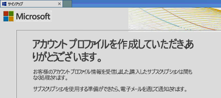
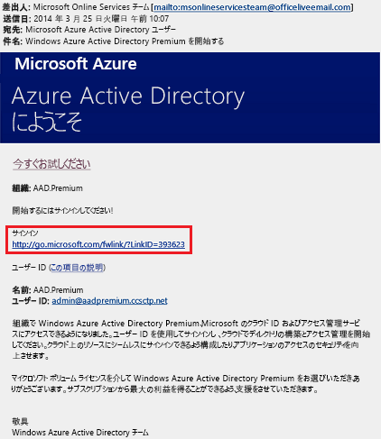

# クイックスタート: Azure Active Directory Premium へのサインアップ
Azure Active Directory (Azure AD) Premium を使用するためには、ライセンスを購入のうえご利用の Azure サブスクリプションに関連付けてください。 新しい Azure サブスクリプションを作成する場合は、以降のセクションの説明に従ってライセンス プランと Azure AD サービス アクセスをアクティブ化する必要もあります。 

## Active Directory Premium へのサインアップ
Active Directory Premium にはいくつかの方法でサインアップできます。 
* Azure サブスクリプションまたは Office 365 サブスクリプションを使用する
* Enterprise Mobility + Security ライセンス プランを使用する
* マイクロソフト ボリューム ライセンス プランを使用する

### Azure または Office 365 
Azure または Office 365 のサブスクライバーである場合、Azure Active Directory Premium をオンラインでご購入いただけます。 

詳細な手順については、「[How to Purchase Azure Active Directory Premium - Existing Customers (Azure Active Directory Premium を購入する方法 - 既存のお客様)](https://channel9.msdn.com/Series/Azure-Active-Directory-Videos-Demos/How-to-Purchase-Azure-Active-Directory-Premium-Existing-Customer)」または「[How to Purchase Azure Active Directory Premium - New Customers (Azure Active Directory Premium を購入する方法 - 新規のお客様)](https://channel9.msdn.com/Series/Azure-Active-Directory-Videos-Demos/How-to-Purchase-Azure-Active-Directory-Premium-New-Customers)」をご覧ください。  

### Enterprise Mobility + Security
Enterprise Mobility + Security (EMS) は、Azure Active Directory Premium、Azure Information Protection、および Microsoft Intune のサービスを 1 つのライセンス プランでまとめて使用できる、組織にとってコスト効果の高い方法です。 EMS の詳細については、[Enterprise Mobility + Security の Web サイト](https://www.microsoft.com/cloud-platform/enterprise-mobility-security)を参照してください。また、購入できる EMS ライセンスの種類の詳細については、「[Enterprise Mobility + Security 料金](https://www.microsoft.com/cloud-platform/enterprise-mobility-security-pricing)」ページを参照してください。  

EMS ライセンスでは、次のいずれかのライセンス オプションを使って Azure AD の使用を開始できます。

- 無料の [Enterprise Mobility + Security E5 試用版サブスクリプション](https://signup.microsoft.com/Signup?OfferId=87dd2714-d452-48a0-a809-d2f58c4f68b7&ali=1)で EMS を試用する
- [Enterprise Mobility + Security E5 ライセンス](https://signup.microsoft.com/Signup?OfferId=e6de2192-536a-4dc3-afdc-9e2602b6c790&ali=1)を購入する
- [Enterprise Mobility + Security E3 ライセンス](https://signup.microsoft.com/Signup?OfferId=4BBA281F-95E8-4136-8B0F-037D6062F54C&ali=1)を購入する

### マイクロソフト ボリューム ライセンス
Azure Active Directory Premium は、[Microsoft Enterprise Agreement](https://www.microsoft.com/en-us/licensing/licensing-programs/enterprise.aspx) (250 個以上のライセンス) または [Open Volume License](https://www.microsoft.com/en-us/licensing/licensing-programs/open-license.aspx) (5 ～ 250 個のライセンス) プログラムを通じてご購入いただけます。

ボリューム ライセンス購入オプションの詳細については、「[ボリューム ライセンスでのライセンスの購入方法](https://www.microsoft.com/en-us/licensing/how-to-buy/how-to-buy.aspx)」ページを参照してください。

> [!NOTE]
> Azure Active Directory のワールドワイド インスタンスを使用している中国のお客様は、Azure Active Directory Premium および Basic エディションを使用できます。 中国の 21Vianet が運営する Microsoft Azure サービスでは、Azure Active Directory Premium および Basic エディションは現在サポートされていません。 詳細については、 [Azure Active Directory フォーラム](https://feedback.azure.com/forums/169401-azure-active-directory/)からお問い合わせください。

前の手順で使用したものと同じ Azure サブスクリプションに関して、過去に Azure AD ライセンスを購入してアクティブ化したことがある場合は、そのライセンスが同じディレクトリで自動的にアクティブ化されます。 それ以外の場合は、以降この記事に記載されている手順に従ってください。

## ライセンス プランをアクティブ化する
Microsoft から購入した初めての Azure AD ライセンス プランである場合、 購入が完了したときに確認のメールが生成されて送信されます。 最初のライセンス プランをアクティベートするにはそのメールが必要になります。

**ライセンス プランをアクティブ化するには、次の手順のいずれかを行います。**

1. アクティブ化を開始するには、**[サインイン]** または **[サインアップ]** をクリックします。
   
    ![[サインイン]](media/active-directory-get-started-premium/MOLSEmail.png)

    - 既存のテナントがある場合は、 **[サインイン]** をクリックし、既存の管理者アカウントでサインインします。 ライセンスをアクティブ化する必要があるテナントのグローバル管理者の資格情報でサインインしてください。

    - 自分のライセンス プランで使用する新しい Azure AD テナントを作成する場合は、**[サインアップ]** をクリックして、**[アカウント プロファイルの作成]** ダイアログを開きます。

        ![[アカウント プロファイルの作成]](media/active-directory-get-started-premium/MOLSAccountProfile.png)

完了すると、テナントのライセンス プランのアクティブ化の確定として次のダイアログが表示されます。

## Azure Active Directory のアクセスをアクティブ化する
新しい Azure AD Premium ライセンスを既存のサブスクリプションに追加する場合は、あらかじめ Azure AD アクセスがアクティブ化されている必要があります。 それ以外の場合は、**ウェルカム メール**を受信した後で Azure AD アクセスをアクティブ化する必要があります。  

購入したライセンスがディレクトリにプロビジョニングされると、**ウェルカム メール**が届きます。 そのメールで、Azure Active Directory Premium または Enterprise Mobility + Security のライセンスと機能の管理を開始できることが確認されます。 

> [!TIP]
> ライセンス プロビジョニング プロセスの完了時に自動的に送信されるウェルカム メールを使って Azure AD ディレクトリ アクセスをアクティブ化するまでは、新しいテナントの Azure AD にはアクセスできません。 

**Azure AD へのアクセスをアクティブ化するには、次の手順を行います。**

1. **ウェルカム メール**の **[サインイン]** をクリックします。 
   
    
2. 正常にサインインしたら、モバイル デバイスを使って第 2 要素認証も行う必要があります。
   
    

アクティブ化にかかる時間はほんの数分であり、その後、Azure AD を管理するためのアクセス権が付与されます。 

## 次の手順
このクイック スタートでは、Azure AD Premium にサインアップして、Azure Active Directory アクセスをアクティブ化する方法について説明しました。 

既に Azure サブスクリプションをお持ちの場合は、次のリンクを使って Azure Portal から試用版を試すか、Azure AD Premium ライセンスをご購入いただけます。

> [!div class="nextstepaction"]
> [Azure AD Premium ライセンスのアクティブ化](https://aad.portal.azure.com/#blade/Microsoft_AAD_IAM/TryBuyProductBlade)
