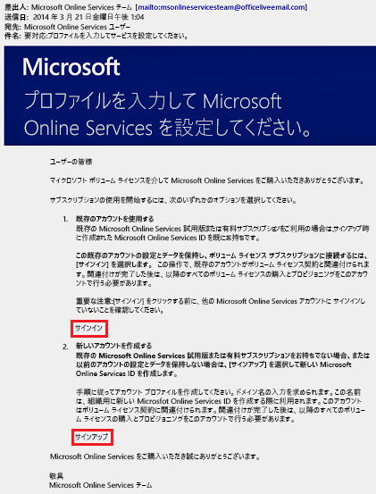

# Azure Active Directory Premium エディションにサインアップする
Azure Active Directory (Azure AD) Premium エディションを購入して、お使いの Azure サブスクリプションと関連付けることができます。 新しい Azure サブスクリプションを作成する必要がある場合は、ライセンス プランと Azure AD サービス アクセスをアクティブにする必要もあります。

> [!NOTE]
>Azure Active Directory のワールドワイド インスタンスを使用している中国のお客様は、Azure AD Premium および Basic エディションを使用できます。 中国の 21Vianet が運営する Azure サービスでは、Azure AD Premium エディションと Basic エディションは現在サポートされていません。 詳細については、[Azure Active Directory フォーラム](https://feedback.azure.com/forums/169401-azure-active-directory/)を利用してお問い合わせください。

Active Directory Premium 1 または Premium 2 にサインアップする前に、まず、使用する既存のサブスクリプションまたはプランを決定する必要があります。

- 既存の Azure または Office 365 サブスクリプションを利用する

- Enterprise Mobility + Security ライセンス プランを利用する

- マイクロソフト ボリューム ライセンス プランを利用する

以前に購入してアクティブ化した Azure AD ライセンスで、Azure サブスクリプションを使ってサインアップし、同じディレクトリのライセンスを自動的にアクティブ化します。 このように動作しない場合、引き続きお使いのライセンス プランと Azure AD アクセスをアクティブ化する必要があります。 ライセンス プランのアクティブ化の詳細については、「[新しいライセンス プランをアクティブ化する](#activate-your-new-license-plan)」を参照してください。 Azure AD アクセスのアクティブ化の詳細については、「[Azure AD アクセスをアクティブ化する](#activate-your-azure-ad-access)」を参照してください。 

## 既存の Azure または Office 365 サブスクリプションを使用してサインアップする
Azure または Office 365 のサブスクライバーである場合、Azure Active Directory Premium Edition をオンラインでご購入いただけます。 詳細な手順については、「[How to Purchase Azure Active Directory Premium - Existing Customers (Azure Active Directory Premium を購入する方法 - 既存のお客様)](https://channel9.msdn.com/Series/Azure-Active-Directory-Videos-Demos/How-to-Purchase-Azure-Active-Directory-Premium-Existing-Customer)」または「[How to Purchase Azure Active Directory Premium - New Customers (Azure Active Directory Premium を購入する方法 - 新規のお客様)](https://channel9.msdn.com/Series/Azure-Active-Directory-Videos-Demos/How-to-Purchase-Azure-Active-Directory-Premium-New-Customers)」をご覧ください。

## Enterprise Mobility + Security ライセンス プランを使用してサインアップする
Enterprise Mobility + Security は、Azure AD Premium、Azure Information Protection、および Microsoft Intune で構成されるスイートです。 EMS ライセンスを既にお持ちの場合は、次のいずれかのライセンス オプションを使って Azure AD の使用を開始できます。

EMS の詳細については、[Enterprise Mobility + Security の Web サイト](https://www.microsoft.com/cloud-platform/enterprise-mobility-security)をご覧ください。

- 無料の [Enterprise Mobility + Security E5 試用版サブスクリプション](https://signup.microsoft.com/Signup?OfferId=87dd2714-d452-48a0-a809-d2f58c4f68b7&ali=1)で EMS を試用する

- [Enterprise Mobility + Security E5 ライセンス](https://signup.microsoft.com/Signup?OfferId=e6de2192-536a-4dc3-afdc-9e2602b6c790&ali=1)を購入する

- [Enterprise Mobility + Security E3 ライセンス](https://signup.microsoft.com/Signup?OfferId=4BBA281F-95E8-4136-8B0F-037D6062F54C&ali=1)を購入する

## マイクロソフト ボリューム ライセンス プランを使用してサインアップする
マイクロソフト ボリューム ライセンス プランを利用して、取得したいライセンス数に基づいて、次の 2 つのプログラムのどちらかを使って Azure AD Premium にサインアップできます。

- **ライセンス数が 250 以上の場合。** [Microsoft Enterprise Agreement](https://www.microsoft.com/en-us/licensing/licensing-programs/enterprise.aspx)

- **ライセンス数が 5～ 250 の場合。** [オープン ボリューム ライセンス](https://www.microsoft.com/en-us/licensing/licensing-programs/open-license.aspx)

ボリューム ライセンス購入オプションの詳細については、「[How to purchase through Volume Licensing](https://www.microsoft.com/en-us/licensing/how-to-buy/how-to-buy.aspx)」(ボリューム ライセンスでの購入方法) を参照してください。

## 新しいライセンス プランをアクティブ化する
新しい Azure AD ライセンス プランを使用してサインアップした場合は、購入後に送信された確認メールを使用して、所属する組織に対してそのプランをアクティブ化する必要があります。

### ライセンス プランをアクティブ化するには、次の手順を実行します。
- サインアップした後に Microsoft から受信した確認の電子メールを開き、 **[サインイン]** または **[サインアップ]** のどちらかをクリックします。
   
    

    - **[サインイン]** 。 既存のテナントがある場合は、このリンクをクリックし、既存の管理者アカウントを使ってサインインします。 ライセンスがアクティブ化されているテナント上で、グローバル管理者になっている必要があります。

    - **[サインアップ]** 。 **[アカウント プロファイルの作成]** ページを開いて、自分のライセンス プラン用に新しい Azure AD テナントを作成する場合は、このリンクを選択します。

        ![サンプル情報を含む [アカウント プロファイルの作成] ページ](media/active-directory-get-started-premium/MOLSAccountProfile.png)

完了したら、テナントに対してライセンス プランをアクティブ化したことへの謝意を示した確認ボックスが表示されます。

## Azure AD アクセスをアクティブ化する
新しい Azure AD Premium ライセンスを既存のサブスクリプションに追加している場合は、あらかじめ Azure AD アクセスがアクティブ化されている必要があります。 それ以外の場合は、**ウェルカム メール**を受信した後で Azure AD アクセスをアクティブ化する必要があります。  

購入済みのライセンスがディレクトリでプロビジョニングされた後、**ウェルカム メール**を受信します。 このメールで、Azure AD Premium または Enterprise Mobility + Security のライセンスと機能の管理を開始できることを確認します。 

> [!TIP]
> ウェルカム メールから Azure AD ディレクトリをアクティブ化するまで、新しいテナントの Azure AD にはアクセスできません。

### Azure AD アクセスをアクティブ化するには、次の手順を実行します。

1. **[ウェルカム メール]** を開いて、 **[サインイン]** をクリックします。
   
    

2. 正常にサインインした後は、モバイル デバイスを使用して 2 段階認証へ進みます。
   
    

通常、アクティブ化のプロセスにかかる時間は数分のみで、その後は、お使いの Azure AD テナントを使用できるようになります。 

## 次の手順
Azure AD Premium を利用できるようになったので、[ドメインのカスタマイズ](add-custom-domain.md)、[企業ブランド](customize-branding.md)の追加、[テナントの作成](active-directory-access-create-new-tenant.md)、および[グループ](active-directory-groups-create-azure-portal.md)と[ユーザー](add-users-azure-active-directory.md)の追加が可能です。
