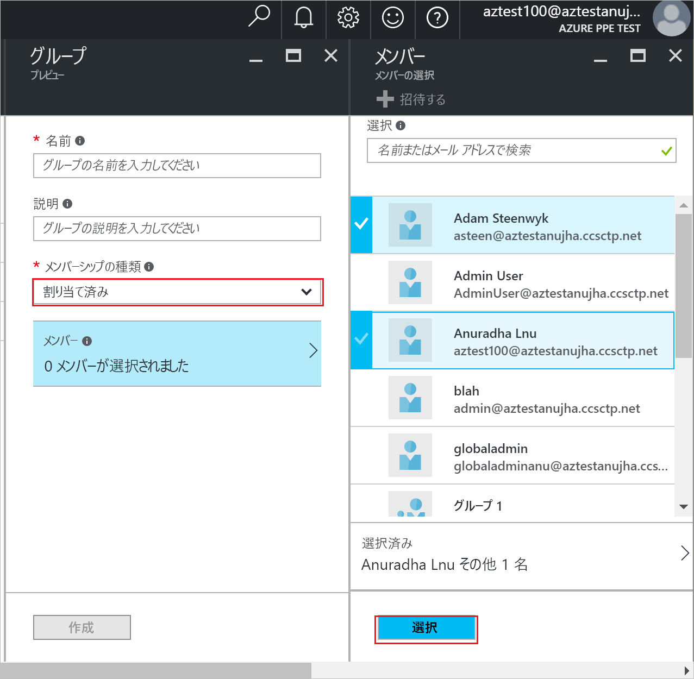
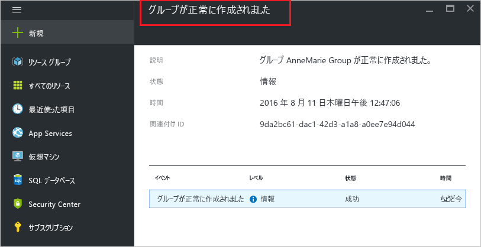

# Azure Active Directory でグループを作成し、メンバーを追加する
> [!div class="op_single_selector"]
> * [Azure Portal](active-directory-groups-create-azure-portal.md)
> * [PowerShell](../users-groups-roles/groups-settings-v2-cmdlets.md)

この記事では、Azure Active Directory で新しいグループを作成して設定する方法について説明します。 グループを使用して管理タスクを実行します。たとえば、複数のユーザーやデバイスにライセンスまたはアクセス許可を一度に割り当てることができます。

## どのようにしてグループを作成しますか?
1. ディレクトリの全体管理者であるアカウントで [Azure Portal](https://portal.azure.com) にサインインします。
2. **[すべてのサービス]** を選択し、テキスト ボックスに「**ユーザーとグループ**」と入力して、**Enter** キーを押します。

   
3. **[ユーザーとグループ]** ブレードで、**[すべてのグループ]** を選択します。

   
4. **[Users and groups - All groups (ユーザーとグループ - すべてのグループ)]** ブレードで、**[追加]** をクリックします。

   ![[追加] をクリックする](./media/active-directory-groups-create-azure-portal/add-group-command.png)
5. **[グループ]** ブレードで、グループの名前と説明を追加します。
6. グループに追加するメンバーを選択するには、**[メンバーシップの種類]** ボックスで **[割り当て済み]** を選択し、**[メンバー]** を選択します。 グループのメンバーシップを動的に管理する方法の詳細については、 [属性を使用したグループ メンバーシップの高度なルールの作成](../users-groups-roles/groups-dynamic-membership.md)を参照してください。

   
7. **[メンバー]** ブレードで、グループに追加する 1 人以上のユーザーまたは 1 つ以上のデバイスを選択し、ブレードの下部にある **[選択]** をクリックしてグループに追加します。 **[ユーザー]** ボックスでは、入力内容とユーザー名またはデバイス名の一部との一致に基づいて表示がフィルター処理されます。 このボックスではワイルドカード文字は使用できません。
8. グループへのメンバーの追加が完了したら、**[グループ]** ブレードの **[作成]** をクリックします。    

   

## 次の手順
次の記事は、Azure Active Directory に関する追加情報を示します。

* [既存のグループの表示](active-directory-groups-view-azure-portal.md)
* [グループの設定の管理](active-directory-groups-settings-azure-portal.md)
* [グループのメンバーの管理](active-directory-groups-members-azure-portal.md)
* [グループのメンバーシップの管理](active-directory-groups-membership-azure-portal.md)
* [グループ内のユーザーの動的ルールの管理](../users-groups-roles/groups-dynamic-membership.md)
