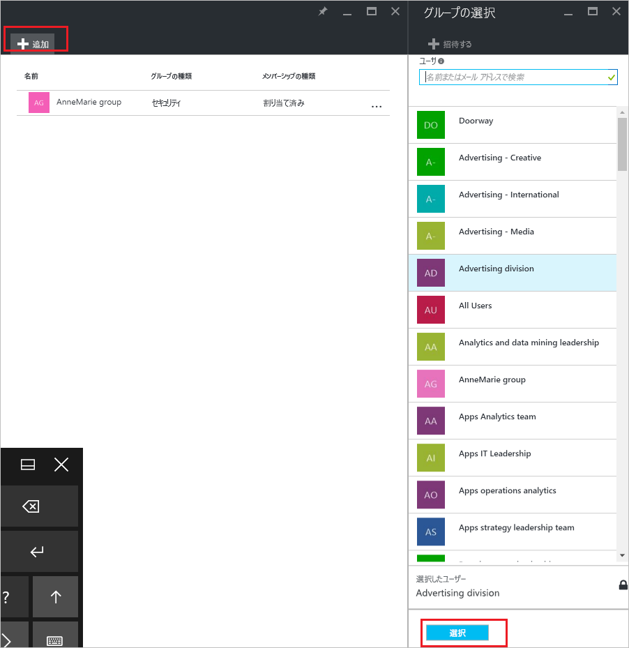

# Azure Active Directory を使用して別のグループからグループを追加または削除する
この記事は、Azure Active Directory を使用して別のグループからグループを追加および削除するのに役立ちます。

>[!Note]
>親グループを削除しようとする場合は、[グループとそのメンバーを更新または削除する方法](active-directory-groups-delete-group.md)に関するページをご覧ください。

## グループを別のグループに追加する
既存のセキュリティ グループを別の既存のセキュリティ グループに追加して (入れ子になったグループとも呼ばれます)、メンバー グループ (サブグループ) と親グループを作成します。 メンバー グループには親グループの属性とプロパティが継承され、構成時間を節約できます。

>[!Important]
>以下は現在サポートされていません。<ul><li>オンプレミスの Active Directory と同期されたグループへのグループの追加。</li><li>Office 365 グループへのセキュリティ グループの追加。</li><li>セキュリティ グループまたは他の Office 365 グループへの Office 365 グループの追加。</li><li>入れ子になったグループへのアプリの割り当て。</li><li>入れ子になったグループへのライセンスの適用。</li></ul>

### 別のグループのメンバーとしてグループを追加するには

1. ディレクトリのグローバル管理者アカウントを使用して [Azure portal](https://portal.azure.com) にサインインします。

2. **[Azure Active Directory]** を選択し、 **[グループ]** を選択します。

3. **[グループ - すべてのグループ]** ページで、別のグループのメンバーになるグループを検索して選択します。 この演習では、 **[MDM policy - West]\(MDM ポリシー - 西部\)** グループを使用します。

    >[!Note]
    >グループはメンバーとして、一度に 1 つのグループにのみ追加できます。 さらに、 **[グループの選択]** ボックスでは、入力内容とユーザー名またはデバイス名の一部との一致に基づいて表示がフィルター処理されます。 ただし、ワイルドカード文字はサポートされません。

    ![[MDM policy - West]\(MDM ポリシー - 西部\) グループが選択された [グループ - すべてのグループ] ページ](media/active-directory-groups-membership-azure-portal/group-all-groups-screen.png)

4. **[MDM policy - West - Group memberships]\(MDM ポリシー - 西部 - グループ メンバーシップ\)** ページで、 **[グループ メンバーシップ]** 、 **[追加]** の順に選択し、ご自分のグループをメンバーにする対象グループを検索して、 **[選択]** を選びます。 この演習では、 **[MDM policy - All org]\(MDM ポリシー - すべての組織\)** グループを使用します。

    現在、 **[MDM policy - West]\(MDM ポリシー - 西部\)** グループは、[MDM policy - All org]\(MDM ポリシー - すべての組織\) グループのプロパティと構成をすべて継承して、 **[MDM policy - All org]\(MDM ポリシー - すべての組織\)** グループのメンバーになっています。

    

5. **[MDM policy - West - Group memberships]\(MDM ポリシー - 西部 - グループ メンバーシップ\)** ページを表示して、グループとメンバー リレーションを確認します。

    ![親グループを表示している [MDM policy - West - Group memberships]\(MDM ポリシー - 西部 - グループ メンバーシップ\) ページ](media/active-directory-groups-membership-azure-portal/group-membership-blade.png)

6. グループとメンバー リレーションシップのより詳細な表示については、グループ名 ( **[MDM policy - All org]\(MDM ポリシー - すべての組織\)** ) を選択して、 **[MDM policy - West]\(MDM ポリシー - 西部\)** ページの詳細を確認します。

    ![メンバーとグループの両方の詳細を表示している [グループ メンバーシップ] ページ](media/active-directory-groups-membership-azure-portal/group-membership-review.png)

## 別のグループからグループを削除する
別のセキュリティ グループから既存のセキュリティ グループを削除できます。 しかし、グループを削除すると、メンバーに継承されていた属性とプロパティもすべて削除されます。

### 別のグループからメンバー グループを削除するには
1. **[グループ - すべてのグループ]** ページで、別のグループのメンバーとして削除されるグループを検索して選択します。 この演習では、もう一度 **[MDM ポリシー - 西部]** グループを使用します。

2. **[MDM policy - West]\(MDM ポリシー - 西部\)** 概要ページで、 **[グループ メンバーシップ]** を選択します。

    ![[MDM policy - West]\(MDM ポリシー - 西部\) 概要ページ](media/active-directory-groups-membership-azure-portal/group-membership-overview.png)

3. **[MDM policy - West - Group memberships]\(MDM ポリシー - 西部 - グループ メンバーシップ\)** ページから **[MDM policy - All org]\(MDM ポリシー - すべての組織\)** グループを選択して、 **[MDM policy - West]\(MDM ポリシー - 西部\)** ページの詳細から **[削除]** を選択します。

    ![メンバーとグループの両方の詳細を表示している [グループ メンバーシップ] ページ](media/active-directory-groups-membership-azure-portal/group-membership-remove.png)

## 追加情報
次の記事は、Azure Active Directory に関する追加情報を示します。

- [グループとメンバーを表示する](active-directory-groups-view-azure-portal.md)

- [基本的なグループを作成し、メンバーを追加する](active-directory-groups-create-azure-portal.md)

- [グループからメンバーを追加または削除する](active-directory-groups-members-azure-portal.md)

- [グループの設定を編集する](active-directory-groups-settings-azure-portal.md)

- [SaaS アプリケーションへのアクセスをグループで管理する](../users-groups-roles/groups-saasapps.md)

- [Azure Active Directory のライセンス管理にグループを使用する際のシナリオ、制限、および既知の問題](../users-groups-roles/licensing-group-advanced.md#limitations-and-known-issues)
