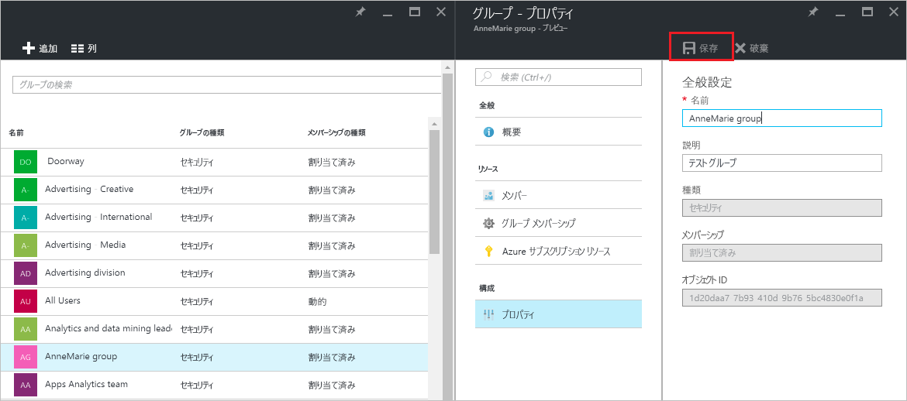

# Azure Active Directory でグループの設定を管理する
この記事では、Azure Active Directory (Azure AD) でグループの設定を管理する方法について説明します。

## 設定を探して変更する方法
1. ディレクトリのグローバル管理者のアカウントで [Azure AD 管理センター](https://aad.portal.azure.com)にサインインします。
2. **[すべてのサービス]** を選択し、テキスト ボックスに「**ユーザーとグループ**」と入力して、**Enter** キーを押します。

   ![[ユーザーとグループ] ブレードを開く](./media/active-directory-groups-settings-azure-portal/search-user-management.png)
3. **[ユーザーとグループ]** ブレードで、**[すべてのグループ]** を選択します。

   ![[すべてのグループ] ブレードを開く](./media/active-directory-groups-settings-azure-portal/view-groups-blade.png)
4. **[ユーザーとグループ - すべてのグループ]** ブレードで、グループを選択します。
5. **[グループ - *グループ名*]** ブレードで、**[プロパティ]** を選択します。

   ![[プロパティ] ブレードを開く](./media/active-directory-groups-settings-azure-portal/select-group-properties.png)
6. グループのプロパティの変更が完了したら、 **[保存]** をクリックします。    

   

## 次の手順
次の記事は、Azure Active Directory に関する追加情報を示します。

* [既存のグループの表示](active-directory-groups-view-azure-portal.md)
* [新しいグループの作成とメンバーの追加](active-directory-groups-create-azure-portal.md)
* [グループのメンバーの管理](active-directory-groups-members-azure-portal.md)
* [グループのメンバーシップの管理](active-directory-groups-membership-azure-portal.md)
* [グループ内のユーザーの動的ルールの管理](../users-groups-roles/groups-dynamic-membership.md)
