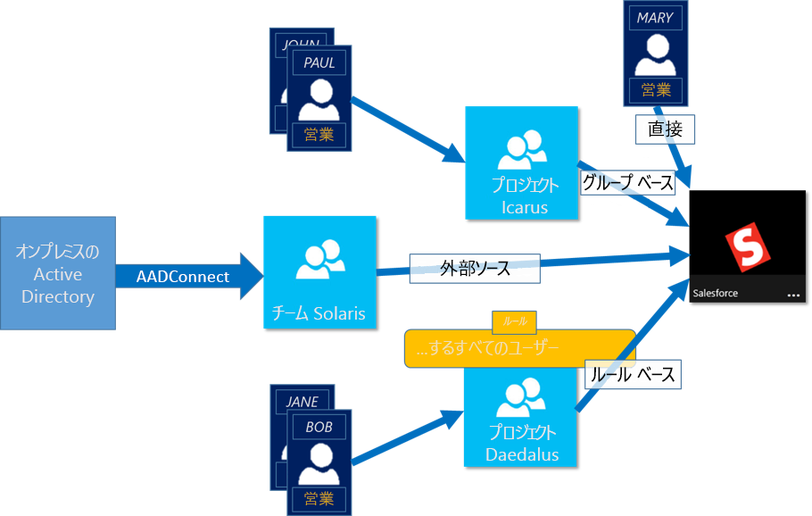
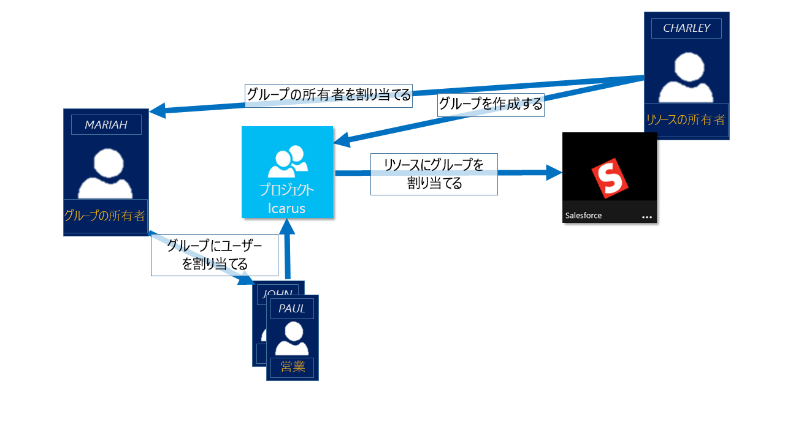

# Azure Active Directory のグループによるリソースへのアクセス管理
Azure Active Directory (Azure AD) は、包括的な ID およびアクセス管理ソリューションであり、信頼性の高い機能セットを備えています。この機能セットにより、Office 365 のような Microsoft オンライン サービスや Microsoft 以外の数多くの SaaS アプリケーションを含む、クラウドおよびオンプレミスのアプリケーションやリソースに対するアクセスが管理できます。 この記事では概要を説明しています。Azure AD グループをすぐに使い始めたい場合は、「[Azure AD のセキュリティ グループの管理](active-directory-groups-create-azure-portal.md)」の手順に従ってください。 Azure Active ディレクトリ内のグループを PowerShell で管理する方法の詳細については、「[グループ管理用の Azure Active Directory のコマンドレット](../users-groups-roles/groups-settings-v2-cmdlets.md)」をご覧ください。

> [!NOTE]
> Azure Active Directory を使用するには、Azure のアカウントが必要です。 アカウントを持っていない場合は、 [無料の Azure アカウントにサインアップ](https://azure.microsoft.com/pricing/free-trial/)できます。
>
>

Azure AD の主な機能の 1 つが、リソースへのアクセスを管理する機能です。 こういったリソースは、ディレクトリ内のロールによってオブジェクトを管理するアクセス許可のケースのように、ディレクトリに含まれる場合と、SaaS アプリケーション、Azure サービス、SharePoint サイト、オンプレミスのリソースなどのように、ディレクトリの外部のリソースという場合があります。 ユーザーにリソースへのアクセス権を割り当てる方法は 4 つあります。

1. 直接割り当て

    リソースの所有者によって、ユーザーをそのリソースに直接割り当てることができます。
2. グループ メンバーシップ

    リソースの所有者によって、グループをリソースに割り当てることができます。これにより、そのグループのメンバーにリソースへのアクセス権が付与されます。 グループのメンバーシップは、グループの所有者が管理できるようになります。 実質的には、リソースの所有者が、ユーザーをリソースに割り当てる権限をグループの所有者に委任することになります。
3. ルール ベース

    リソースの所有者は、ルールを使用して、リソースへのアクセス権をどのユーザーに割り当てるのかを示すことができます。 ルールの結果は、特定のユーザーに対してルール内で使用される属性とその値によって異なります。これにより、リソースの所有者は、ルール内で使用される属性の信頼できるソースに、リソースへのアクセスを管理する権限を効率的に委任することができます。 ただし、ルール自体の管理と、どの属性および値によってリソースへのアクセス権を提供するのかという判断は、リソースの所有者が行います。
4. 外部の権限者

    リソースへのアクセス権を外部ソースから派生させます。外部ソースとは、たとえばオンプレミスのディレクトリのような信頼できるソースや WorkDay のような SaaS アプリから同期されたグループのことです。 リソース所有者はリソースへのアクセス権を提供するようにグループを割り当て、外部ソースはグループのメンバーを管理します。

   

## アクセス管理について説明したビデオを見る
詳細を説明した短いビデオをご覧ください。

**Azure AD: グループの動的なメンバーシップの概要に関するページ**

> [!VIDEO https://channel9.msdn.com/Series/Azure-Active-Directory-Videos-Demos/Azure-AD--Introduction-to-Dynamic-Memberships-for-Groups/player]
>
>

## Azure Active Directory でのアクセス管理のしくみ
Azure AD のアクセス管理ソリューションの核となる機能は、セキュリティ グループです。 セキュリティ グループを使用してリソースへのアクセスを管理するというのはよく知られたパラダイムです。これにより、柔軟かつ理解しやすい方法で、対象となるユーザーのグループにリソースへのアクセス権を提供することが可能になります。 リソース所有者 (またはディレクトリの管理者) は、所有するリソースへの特定のアクセス権を提供するようにグループを割り当てることができます。 グループのメンバーにはアクセス権が提供され、リソースの所有者は、部門のマネージャーやヘルプ デスクの管理者などの他のユーザーに、グループのメンバー リストを管理する権限を委任することができます。

グループの所有者は、そのグループをセルフ サービス要求のために使用可能にすることもできます。 そうすることで、エンド ユーザーがグループを検索して参加要求を行い、そのグループによって管理されているリソースへのアクセス許可を効率的に申請できます。 グループの所有者は、参加要求を自動的に承認するか、またはグループの所有者による承認を要求するようにグループを設定できます。 ユーザーがグループへの参加要求を行うと、その参加要求はグループの所有者に転送されます。 所有者のいずれかが要求を承認した場合、それが要求元のユーザーに通知され、ユーザーがグループに参加します。 所有者のいずれかが要求を拒否した場合、それが要求元のユーザーに通知されますが、ユーザーはグループに参加できません。

## アクセス管理の開始
使い始める準備はできていますか。 Azure AD グループを使用して実行できる基本的な作業を試してみる必要があります。 これらの機能を使用して、組織内のさまざまなユーザーのグループに、さまざまなリソースへの特別なアクセスを提供します。 最初の基本的な手順の一覧を以下に示します。

* [単純なルールを作成してグループの動的メンバーシップを構成する](active-directory-groups-create-azure-portal.md)
* [SaaS アプリケーションへのアクセスをグループで管理する](../users-groups-roles/groups-saasapps.md)
* [グループをエンド ユーザーのセルフ サービスに使用できるようにする](../users-groups-roles/groups-self-service-management.md)
* [Azure AD Connect を使用した Azure へのオンプレミス グループの同期](../connect/active-directory-aadconnect.md)
* [グループの所有者の管理](active-directory-accessmanagement-managing-group-owners.md)

## 次の手順
アクセス管理の基本については理解したので、ここでは Azure Active Directory でアプリケーションとリソースへのアクセス管理に使用できる、その他の高度な機能をいくつか紹介します。

* [属性を使用した高度なルールの作成](../users-groups-roles/groups-dynamic-membership.md)
* [Azure AD のセキュリティ グループの管理](active-directory-groups-create-azure-portal.md)
* [グループ用の Graph API リファレンス](https://msdn.microsoft.com/Library/Azure/Ad/Graph/api/groups-operations#GroupFunctions)
* [グループの設定を構成するための Azure Active Directory コマンドレット](../users-groups-roles/groups-settings-cmdlets.md)
